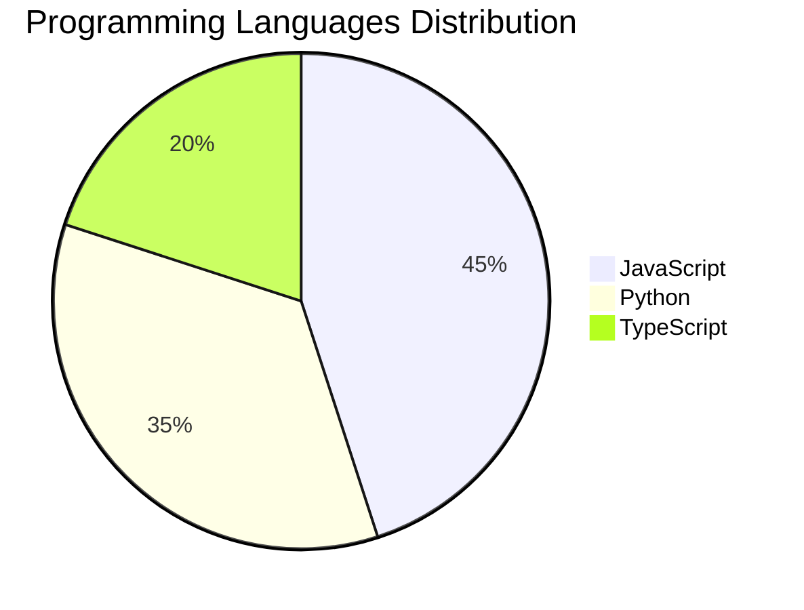

# DevTech Auto News - Enhanced Edition

## 🎯 Overview

This enhanced version of DevTech Auto News provides a comprehensive news aggregation system with:

- **Multiple Data Sources**: Dev.to, HackerNews, GitHub Trending
- **Smart Categorization**: 10+ categories including AI, JavaScript, Python, Cloud, DevOps
- **Visual Enhancement**: Cover images, charts, and diagrams
- **Interview Questions**: Curated coding questions for multiple languages
- **Advanced Statistics**: Language trends, source distribution, tag analytics
- **Efficient Pagination**: Fetches 50+ articles with deduplication

## 🏗️ Architecture

### File Structure

```
devtech-enhanced/
├── .github/
│   └── workflows/
│       └── enhanced-auto-news.yml    # GitHub Actions workflow
├── src/
│   ├── index.js                      # Main orchestrator
│   ├── formatNews.js                 # News formatting with images
│   ├── updateReadme.js               # README generation with stats
│   ├── stats.js                      # Statistics and chart generation
│   └── interviewQuestions.js         # Interview question bank
├── data/
│   ├── news_log.md                   # Complete article archive
│   ├── stats.json                    # Statistics data
│   ├── categorized.json              # Articles by category
│   └── interview_questions.json      # Question bank
├── package.json
└── README.md                         # Auto-generated homepage
```

## 📊 Features

### 1. Multi-Source Aggregation

**Dev.to API**
- Fetches 60 articles (2 pages × 30 per page)
- Extracts cover images, tags, descriptions
- Includes author information

**HackerNews API**
- Queries for AI, JavaScript, Python topics
- Gets top 10 articles per topic
- Includes discussion links

**GitHub Trending API**
- Tracks trending repos for JavaScript, Python, Go
- Shows star counts
- Links to repositories

### 2. Smart Categorization

Articles are automatically categorized using keyword matching:

- **AI**: artificial intelligence, machine learning, neural networks, GPT, LLM
- **JavaScript**: JS, TypeScript, Node, React, Vue, Angular
- **Python**: Django, Flask, pandas, NumPy
- **DevOps**: Docker, Kubernetes, CI/CD, Jenkins
- **Cloud**: AWS, Azure, GCP, serverless
- **Mobile**: iOS, Android, Flutter, React Native
- **Database**: SQL, NoSQL, MongoDB, PostgreSQL
- **Security**: Cybersecurity, encryption, authentication
- **Tools**: Productivity tools, VS Code, Git
- **WebDev**: Frontend, backend, full-stack development

### 3. Visual Enhancements

**Cover Images**
- Extracts and displays article cover images
- Creates image gallery in README
- Responsive table layout (3 columns)

**Charts & Diagrams**
- ASCII bar charts for language distribution
- Mermaid pie charts for visual statistics
- Progress bars for category breakdown
- Badge system for trending tags

### 4. Interview Questions

Comprehensive question bank covering:

- **JavaScript**: Closures, event loop, promises, async/await
- **Python**: Decorators, generators, GIL, context managers
- **React**: Hooks, Virtual DOM, performance optimization
- **Node.js**: Event loop, middleware, async patterns
- **Java**: OOP, memory model, streams
- **Databases**: SQL vs NoSQL, indexing, normalization
- **System Design**: URL shortener, rate limiter, cache
- **DSA**: Linked lists, strings, LRU cache, algorithms

Each question includes:
- Difficulty level (Easy/Medium/Hard)
- Related topics
- Hint for solving

### 5. Statistics Dashboard

**Language Trends**
```
JavaScript      ████████████████████ 45 (32.1%)
Python          ███████████████ 35 (25.0%)
TypeScript      ██████████ 20 (14.3%)
Go              ██████ 12 (8.6%)
```

**Mermaid Diagrams**


**Category Breakdown**
- Visual progress bars
- Percentage calculations
- Article counts per category

## 🚀 Setup Instructions

### Prerequisites

- Node.js 18+
- npm or yarn
- GitHub account (for Actions)

### Local Installation

```bash
# Clone repository
git clone https://github.com/YOUR_USERNAME/github-activity-bot.git
cd github-activity-bot

# Install dependencies
npm install

# Run manually
npm start

# Test mode (dry run)
npm run test
```

### GitHub Actions Setup

1. **Enable GitHub Actions** in your repository settings

2. **Configure Workflow**
   - File: `.github/workflows/enhanced-auto-news.yml`
   - Runs every 15 minutes automatically
   - Can also be triggered manually

3. **Set Permissions**
   - Go to Settings → Actions → General
   - Under "Workflow permissions", select "Read and write permissions"

4. **Monitor Runs**
   - Visit Actions tab to see workflow runs
   - Check logs for any errors

## 🎨 Customization

### Adding New Sources

Edit `src/index.js`:

```javascript
// Add new fetch function
async function fetchNewSource() {
  const res = await fetch("YOUR_API_URL");
  const data = await res.json();
  // Format data...
  return articles;
}

// Add to Promise.all
const newSource = await fetchNewSource();
const allArticles = [...existing, ...newSource];
```

### Adding Categories

Edit `src/index.js`:

```javascript
const CATEGORIES = {
  // ... existing
  NewCategory: ["keyword1", "keyword2", "keyword3"]
};
```

### Modifying Interview Questions

Edit `src/interviewQuestions.js`:

```javascript
function generateNewLanguageQuestions() {
  return [
    {
      question: "Your question here?",
      difficulty: "Medium",
      topics: ["topic1", "topic2"],
      answer_hint: "Hint here"
    }
  ];
}
```

### Changing Update Frequency

Edit `.github/workflows/enhanced-auto-news.yml`:

```yaml
on:
  schedule:
    # Change cron expression
    - cron: '0 */2 * * *'  # Every 2 hours
    # Or daily: '0 9 * * *'  # 9 AM daily
```

## 📈 Data Management

### Log File Size

The `data/news_log.md` file grows with each update. Consider:

- Archiving old entries monthly
- Keeping only recent 30 days
- Using separate archive files

### JSON Storage

Statistics are saved as JSON for:
- Easy parsing and analysis
- Integration with other tools
- Historical tracking

## 🐛 Troubleshooting

### Common Issues

**1. No Changes Committed**
- Check if articles are being fetched
- Verify API endpoints are accessible
- Look for rate limiting errors

**2. Images Not Displaying**
- Some articles may not have cover images
- Check image URLs in logs
- Verify image sources allow hotlinking

**3. Duplicate Articles**
- Deduplication uses URL matching
- Some sources may use different URLs for same content
- Consider adding title-based deduplication

**4. GitHub Actions Failing**
- Check workflow logs in Actions tab
- Verify permissions are set correctly
- Ensure dependencies install properly

## 🔧 Advanced Features

### Rate Limiting

To avoid API rate limits:
- Implement exponential backoff
- Cache responses temporarily
- Stagger requests across sources

### Performance Optimization

- Use concurrent requests with `Promise.all`
- Implement request caching
- Minimize file I/O operations

### Enhanced Analytics

- Track trending topics over time
- Generate weekly/monthly reports
- Create historical trend charts

## 📝 Contributing

Contributions are welcome! Areas for improvement:

1. **More Sources**: Reddit, Twitter, Medium, etc.
2. **Better Categorization**: ML-based classification
3. **Enhanced Visuals**: More charts and graphs
4. **Question Bank**: More interview questions
5. **Internationalization**: Multi-language support

## 📄 License

MIT License - Use freely with attribution

## 🙏 Credits

- Dev.to API
- HackerNews API (Algolia)
- GitHub API
- Node-fetch library

---