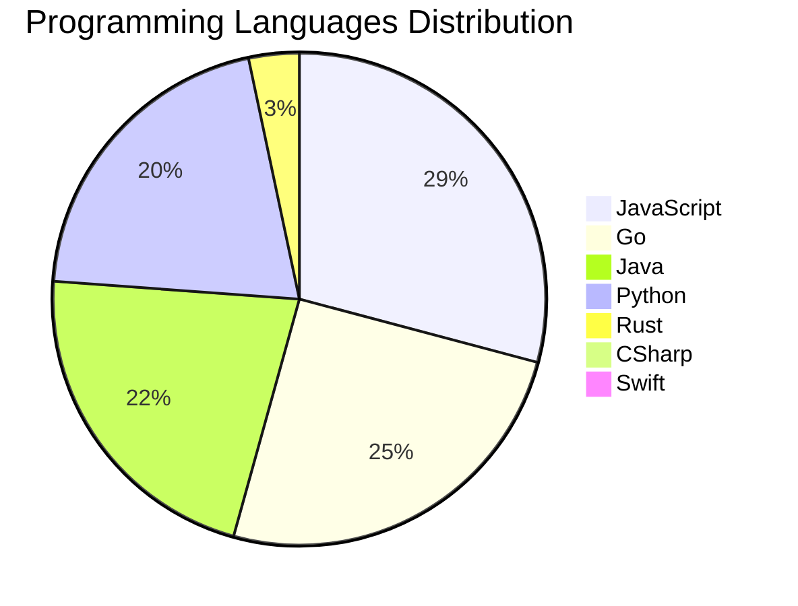

<div align="center">

# 📰 DevTech Auto News

**Your always-fresh digest of developer & AI tech news — curated automatically, around the clock.**


Aggregating [Dev.to](https://dev.to) · [Hacker News](https://news.ycombinator.com) · [GitHub Trending](https://github.com/trending) · [Lobste.rs](https://lobste.rs) · [Stack Overflow](https://stackoverflow.com) · [TechCrunch](https://techcrunch.com) · [freeCodeCamp](https://www.freecodecamp.org/news) — refreshed by GitHub Actions around the clock.

**[📰 Headlines](#-latest-headlines) · [💡 Interview Prep](#-interview-question-of-the-hour) · [📊 Statistics](#-statistics) · [⚙️ How It Works](#%EF%B8%8F-how-it-works)**

</div>

---

## 📰 Latest Headlines

> 🕐 Edition of **2026-08-13 20:00 CAT** — refreshed automatically, all day, every day.

### ✨ Featured Stories

<table>
<tr>
  <td align="center" width="33%">
    <a href="https://dev.to/devteam/hey-all-im-jem-the-dev-community-program-coordinator-2g2">
      
      <br/>
      <b>Hey all! I’m Jem, the DEV Community Program Coordi...</b>
    </a>
    <br/>
    <sub>Dev.to</sub>
  </td>
  <td align="center" width="33%">
    <a href="https://dev.to/francistrdev/i-joined-devto-because-fl0">
      
      <br/>
      <b>I Joined dev.to because...</b>
    </a>
    <br/>
    <sub>Dev.to</sub>
  </td>
  <td align="center" width="33%">
    <a href="https://dev.to/gde/do-i-still-need-a-monkey-patch-for-gemini-live-4c3e">
      
      <br/>
      <b>Do I Still Need a Monkey Patch for Gemini Live?</b>
    </a>
    <br/>
    <sub>Dev.to</sub>
  </td>
</tr>
<tr>
  <td align="center" width="33%">
    <a href="https://dev.to/gde/riverpod-to-blocsignal-incremental-migration-and-zero-codegen-signals-for-flutter-1gdp">
      
      <br/>
      <b>Riverpod to BlocSignal: Incremental Migration and ...</b>
    </a>
    <br/>
    <sub>Dev.to</sub>
  </td>
  <td align="center" width="33%">
    <a href="https://dev.to/ale3oula/how-many-introductions-away-are-you-from-pedro-pascal-a-practical-introduction-to-graph-search-5bfg">
      
      <br/>
      <b>How Many Introductions Away Are You From Pedro Pas...</b>
    </a>
    <br/>
    <sub>Dev.to</sub>
  </td>
  <td align="center" width="33%">
    <a href="https://dev.to/georgekobaidze/backend-engineer-me-ships-a-browser-game-with-one-unintentional-system-requirement-my-monitor-1ojd">
      
      <br/>
      <b>Backend Engineer (Me) Ships a Browser Game With On...</b>
    </a>
    <br/>
    <sub>Dev.to</sub>
  </td>
</tr>
</table>


### 🗞️ Top Stories

| # | Headline | Source |
|---|----------|--------|
| 1 | [Hey all! I’m Jem, the DEV Community Program Coordinator](https://dev.to/devteam/hey-all-im-jem-the-dev-community-program-coordinator-2g2) | Dev.to |
| 2 | [I Joined dev.to because...](https://dev.to/francistrdev/i-joined-devto-because-fl0) | Dev.to |
| 3 | [Do I Still Need a Monkey Patch for Gemini Live?](https://dev.to/gde/do-i-still-need-a-monkey-patch-for-gemini-live-4c3e) | Dev.to |
| 4 | [Riverpod to BlocSignal: Incremental Migration and Zero-Codegen Signals for Flutter](https://dev.to/gde/riverpod-to-blocsignal-incremental-migration-and-zero-codegen-signals-for-flutter-1gdp) | Dev.to |
| 5 | [How Many Introductions Away Are You From Pedro Pascal? A Practical Introduction to Graph Search](https://dev.to/ale3oula/how-many-introductions-away-are-you-from-pedro-pascal-a-practical-introduction-to-graph-search-5bfg) | Dev.to |
| 6 | [Backend Engineer (Me) Ships a Browser Game With One Unintentional System Requirement: My Monitor](https://dev.to/georgekobaidze/backend-engineer-me-ships-a-browser-game-with-one-unintentional-system-requirement-my-monitor-1ojd) | Dev.to |
| 7 | [MCP Configuration for Looker with Codex](https://dev.to/gde/mcp-configuration-for-looker-with-codex-30e1) | Dev.to |
| 8 | [Managed Inference on Google Cloud: Pairing the Gemini Enterprise Agent Platform with Cloud Run](https://dev.to/gdg/managed-inference-on-google-cloud-pairing-the-gemini-enterprise-agent-platform-with-cloud-run-246j) | Dev.to |
| 9 | [Vibecoding EventMatch, built with Antigravity, ADK, and Gemini](https://dev.to/gde/vibecoding-eventmatch-built-with-antigravity-adk-and-gemini-2gc7) | Dev.to |
| 10 | [Bug Smash: restoring dropped Gemini chat config in Sentry's JavaScript SDK](https://dev.to/zkasuran/bug-smash-restoring-dropped-gemini-chat-config-in-sentrys-javascript-sdk-2n9a) | Dev.to |
| 11 | [Latency vs. Tokens: What I Learned Optimizing an Agent with Gemma (and What Didn't Work)](https://dev.to/gde/latency-vs-tokens-what-i-learned-optimizing-an-agent-with-gemma-and-what-didnt-work-445g) | Dev.to |
| 12 | [The Accidental DDOS: How a Single React Bracket Triggered 100,000 API Requests and Melted Our Database](https://dev.to/pooja_bhavani/the-accidental-ddos-how-a-single-react-bracket-triggered-100000-api-requests-and-melted-our-36li) | Dev.to |
| 13 | [Jem has quietly been working behind-the-scenes here at DEV for YEARS, and I'm so happy that they are finally introducing themselves to everyone!!](https://dev.to/jess/jem-has-quietly-been-working-behind-the-scenes-here-at-dev-for-years-and-im-so-happy-that-they-129e) | Dev.to |
| 14 | [Serving Gemma 4 2B on a Single TPU v5e Chip with MCP and Antigravity CLI](https://dev.to/gde/serving-gemma-4-2b-on-a-single-tpu-v5e-chip-with-mcp-and-antigravity-cli-33l8) | Dev.to |
| 15 | [Welcome Thread - v388](https://dev.to/devteam/welcome-thread-v388-29kd) | Dev.to |
| 16 | [Top 7 Featured DEV Posts of the Week](https://dev.to/devteam/top-7-featured-dev-posts-of-the-week-1id7) | Dev.to |
| 17 | [Amazon Bedrock Agents Orchestrating Google ADK over A2A](https://dev.to/gde/amazon-bedrock-agents-orchestrating-google-adk-over-a2a-5c2b) | Dev.to |
| 18 | [I Built a ₹15 Landing Page About Mumbai's Soul Food](https://dev.to/sarvar_04/i-built-a-15-landing-page-about-mumbais-soul-food-1l78) | Dev.to |
| 19 | [Preventing Quota Crashes via Antigravity CLI Agent Hooks](https://dev.to/gde/preventing-quota-crashes-via-antigravity-cli-agent-hooks-24hd) | Dev.to |
| 20 | [My CSS Art Made Some Foodie Friends 🍙🧋🥟🍲](https://dev.to/lanthanum89/my-css-art-made-some-foodie-friends-4adk) | Dev.to |

<sub>Last fetched: Thu, 13 Aug 2026 20:15:09 CAT</sub>


---

## 💡 Interview Question of the Hour

> Sharpen your skills — new questions selected on every update. Try answering before opening the hint!

**1. `Python` — Implement a context manager using __enter__ and __exit__**

&nbsp;&nbsp;&nbsp;&nbsp;🎯 Hard · 🏷 context managers, resource management

<details>
<summary>&nbsp;&nbsp;&nbsp;&nbsp;💡 Show hint</summary>

> with statement, setup/teardown, exception handling

</details>

**2. `SystemDesign` — How would you design a rate limiter?**

&nbsp;&nbsp;&nbsp;&nbsp;🎯 Medium · 🏷 system design, algorithms

<details>
<summary>&nbsp;&nbsp;&nbsp;&nbsp;💡 Show hint</summary>

> Token bucket, sliding window, distributed systems

</details>

**3. `Java` — What is the difference between abstract class and interface?**

&nbsp;&nbsp;&nbsp;&nbsp;🎯 Easy · 🏷 OOP, design

<details>
<summary>&nbsp;&nbsp;&nbsp;&nbsp;💡 Show hint</summary>

> Multiple inheritance, method implementation, use cases

</details>


---

## 📊 Statistics

#### 🗂 Articles by Category

| Category | Articles | Share | |
|----------|---------:|------:|---|
| **AI** | 70 | 38.0% | `████████████████████` |
| **JavaScript** | 44 | 23.9% | `█████████████░░░░░░░` |
| **Tools** | 40 | 21.7% | `███████████░░░░░░░░░` |
| **Python** | 31 | 16.8% | `█████████░░░░░░░░░░░` |
| **Security** | 18 | 9.8% | `█████░░░░░░░░░░░░░░░` |
| **WebDev** | 17 | 9.2% | `█████░░░░░░░░░░░░░░░` |
| **DevOps** | 16 | 8.7% | `█████░░░░░░░░░░░░░░░` |
| **Cloud** | 16 | 8.7% | `█████░░░░░░░░░░░░░░░` |
| **Database** | 7 | 3.8% | `██░░░░░░░░░░░░░░░░░░` |
| **Mobile** | 6 | 3.3% | `██░░░░░░░░░░░░░░░░░░` |

<sub>Articles can match more than one category, so shares may sum to over 100%.</sub>


#### 📡 Articles by Source

| Source | Articles |
|--------|---------:|
| Dev.to | 60 |
| HackerNews | 49 |
| GitHub | 25 |
| Lobste.rs | 10 |
| StackOverflow | 20 |
| TechCrunch | 10 |
| freeCodeCamp | 10 |


#### 💻 Programming Language Trends

```
JavaScript      ██████████████████████████████ 28.8%
Go              ██████████████████████████ 24.8%
Java            ███████████████████████ 21.6%
Python          █████████████████████ 20.3%
Rust            ███ 3.3%
CSharp          █ 0.7%
Swift           █ 0.7%

```




#### 🏷 Trending Topics

            


---

## ⚙️ How It Works

This repository is a fully automated news pipeline. On every run, GitHub Actions:

1. **Fetches** the latest articles from seven sources: Dev.to, Hacker News, GitHub Trending, Lobste.rs, Stack Overflow, TechCrunch, and freeCodeCamp
2. **Deduplicates and categorizes** them across 10+ topics using keyword matching
3. **Extracts cover images** and computes language & category statistics
4. **Rebuilds this README** and appends everything to the [full archive](./data/news_log.md)
5. **Commits and pushes** the result — no human intervention needed

<details>
<summary><b>🚀 Run it yourself</b></summary>

```bash
git clone https://github.com/Derrick-MUGISHA/github-activity-bot.git
cd github-activity-bot
npm install
npm start
```

Fork the repo, enable GitHub Actions, and you have your own self-updating news feed.

</details>

<details>
<summary><b>📚 Data & resources</b></summary>

- [Full news archive](./data/news_log.md) — complete history of every fetched article
- [Statistics](./data/stats.json) — raw stats data (JSON)
- [Categorized articles](./data/categorized.json) — articles grouped by topic
- [Interview question bank](./data/interview_questions.json) — the full question set

</details>

---

## 🤝 Contributing

Ideas for new sources, categories, or interview questions are welcome — [open an issue](https://github.com/Derrick-MUGISHA/github-activity-bot/issues/new) or submit a pull request.

## 📄 License

Released under the [MIT License](https://opensource.org/licenses/MIT) — free to use, fork, and modify.

---

<div align="center">
  <sub>🤖 Last automated update: <b>Thu, 13 Aug 2026 18:15:09 GMT</b></sub><br/>
  <sub>Powered by GitHub Actions · Built with ❤️ by <a href="https://github.com/Derrick-MUGISHA">Derrick MUGISHA</a></sub>
</div>
