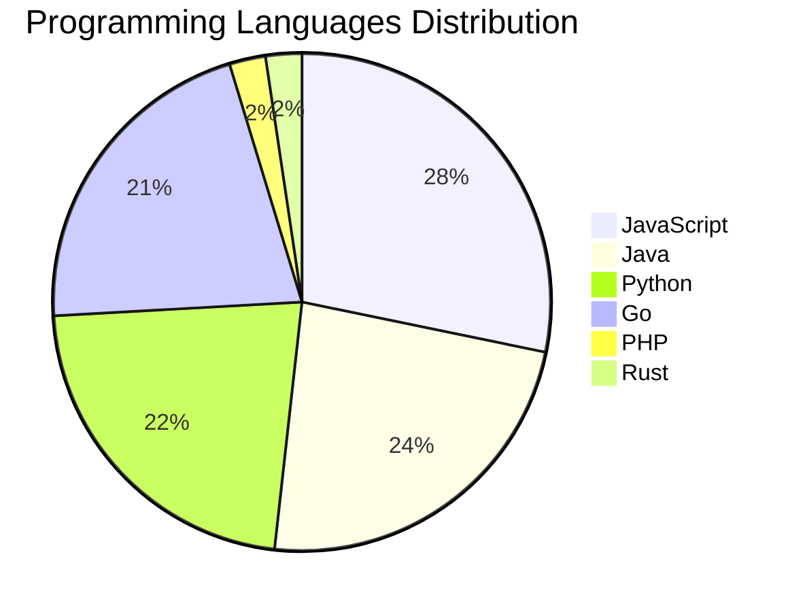

# 🚀 DevTech Auto News - Enhanced Edition


**DevTech Auto News Enhanced** is an advanced automated bot that aggregates trending topics in **AI**, **Web Development**, **Mobile**, **Cloud**, **DevOps**, and more from multiple sources including:

- 📰 [Dev.to](https://dev.to) - Developer community articles
- 🔥 [HackerNews](https://news.ycombinator.com) - Tech news discussions  
- 💻 [GitHub Trending](https://github.com/trending) - Trending repositories
- 🎯 Curated Interview Questions from multiple languages

## ✨ Features

✅ **Multi-Source Aggregation**: Combines articles from Dev.to, HackerNews, and GitHub  
✅ **Smart Categorization**: Automatically categorizes content into 10+ topics  
✅ **Image Support**: Displays cover images for visual appeal  
✅ **Pagination**: Fetches 50+ articles per update with deduplication  
✅ **Language Statistics**: Tracks programming language trends with charts  
✅ **Interview Questions**: Daily coding interview questions in multiple languages  
✅ **GitHub Actions**: Runs every 15 minutes automatically  

---

## 📊 Statistics Dashboard

### 📊 Articles by Category

**AI**: 🟦🟦🟦🟦🟦🟦🟦🟦🟦🟦🟦🟦🟦🟦🟦🟦🟦🟦🟦🟦 50 (47.6%)

**Tools**: 🟦🟦🟦🟦🟦🟦🟦🟦🟦🟦🟦🟦 30 (28.6%)

**JavaScript**: 🟦🟦🟦🟦🟦🟦🟦🟦🟦🟦 24 (22.9%)

**Python**: 🟦🟦🟦🟦🟦🟦🟦🟦 19 (18.1%)

**WebDev**: 🟦🟦🟦 7 (6.7%)

**DevOps**: 🟦🟦 5 (4.8%)

**Cloud**: 🟦🟦 5 (4.8%)

**Security**: 🟦🟦 5 (4.8%)

**Database**: 🟦 3 (2.9%)

**Mobile**:  1 (1.0%)


### 📡 Sources

- **Dev.to**: 60 articles
- **HackerNews**: 30 articles
- **GitHub**: 15 articles


### 💻 Programming Language Trends

```
JavaScript      ██████████████████████████████ 28.2 (28.2%)
Java            █████████████████████████ 23.5 (23.5%)
Python          ████████████████████████ 22.4 (22.4%)
Go              ███████████████████████ 21.2 (21.2%)
PHP             ███ 2.4 (2.4%)
Rust            ███ 2.4 (2.4%)

```




### 🏷️ Trending Tags

               


---

## 🛠️ How It Works

1. **Multi-Source Fetch**: Pulls from Dev.to (2 pages), HackerNews (3 topics), GitHub (3 languages)
2. **Smart Filter**: Uses keyword matching across 10+ categories  
3. **Deduplication**: Removes duplicate URLs  
4. **Image Extraction**: Captures cover images when available  
5. **Statistics**: Generates language trends and category breakdowns  
6. **Update Files**: Regenerates README and appends to comprehensive log  

---

## 📦 Installation & Usage

```bash
# Clone the repository
git clone https://github.com/Derrick-MUGISHA/github-activity-bot.git
cd github-activity-bot

# Install dependencies  
npm install

# Run manually
npm start

# Test mode
npm run test
```

---


# 🚀 DevTech Auto News - Enhanced Edition

## 📅 Latest Updates (2026-03-03 18:00 CAT)


### 🖼️ Featured Articles

<table>
<tr>
  <td align="center" width="33%">
    <a href="https://dev.to/missamarakay/what-should-i-do-and-learn-in-2026-4enc">
      
      <br/>
      <b>What should I do and learn in 2026?</b>
    </a>
    <br/>
    <sub>Dev.to</sub>
  </td>
  <td align="center" width="33%">
    <a href="https://dev.to/googleai/gemini-31-flash-lite-developer-guide-and-use-cases-1hh">
      
      <br/>
      <b>Gemini 3.1 Flash-Lite: Developer guide and use cas...</b>
    </a>
    <br/>
    <sub>Dev.to</sub>
  </td>
  <td align="center" width="33%">
    <a href="https://dev.to/wilhelm_tell/i-plugged-gemini-into-my-10000-line-rental-platform-heres-what-happened-2epi">
      
      <br/>
      <b>I Plugged Gemini Into My 10,000-Line Rental Platfo...</b>
    </a>
    <br/>
    <sub>Dev.to</sub>
  </td>
</tr>
<tr>
  <td align="center" width="33%">
    <a href="https://dev.to/astrodeeptej/fusing-nasa-data-with-ai-how-i-built-cosmodex-and-won-the-mlh-data-hackfest-5fmm">
      
      <br/>
      <b>Fusing NASA Data with AI: How I Built CosmoDex and...</b>
    </a>
    <br/>
    <sub>Dev.to</sub>
  </td>
  <td align="center" width="33%">
    <a href="https://dev.to/whitep4nth3r/how-to-make-your-first-contribution-to-an-open-source-project-5e50">
      
      <br/>
      <b>How to make your first contribution to an open sou...</b>
    </a>
    <br/>
    <sub>Dev.to</sub>
  </td>
  <td align="center" width="33%">
    <a href="https://dev.to/ben/we-had-a-big-team-offsite-and-i-forgot-meme-monday-yesterday-but-here-is-another-post-20j3">
      
      <br/>
      <b>We had a big team offsite and I forgot meme monday...</b>
    </a>
    <br/>
    <sub>Dev.to</sub>
  </td>
</tr>
</table>


### 📰 Top Headlines

- [What should I do and learn in 2026?](https://dev.to/missamarakay/what-should-i-do-and-learn-in-2026-4enc) _[Dev.to]_
- [Gemini 3.1 Flash-Lite: Developer guide and use cases](https://dev.to/googleai/gemini-31-flash-lite-developer-guide-and-use-cases-1hh) _[Dev.to]_
- [I Plugged Gemini Into My 10,000-Line Rental Platform. Here's What Happened.](https://dev.to/wilhelm_tell/i-plugged-gemini-into-my-10000-line-rental-platform-heres-what-happened-2epi) _[Dev.to]_
- [Fusing NASA Data with AI: How I Built CosmoDex and Won the MLH Data Hackfest!](https://dev.to/astrodeeptej/fusing-nasa-data-with-ai-how-i-built-cosmodex-and-won-the-mlh-data-hackfest-5fmm) _[Dev.to]_
- [How to make your first contribution to an open source project](https://dev.to/whitep4nth3r/how-to-make-your-first-contribution-to-an-open-source-project-5e50) _[Dev.to]_
- [We had a big team offsite and I forgot meme monday yesterday 😭

But here is another post](https://dev.to/ben/we-had-a-big-team-offsite-and-i-forgot-meme-monday-yesterday-but-here-is-another-post-20j3) _[Dev.to]_
- [Oooh very interesting](https://dev.to/ben/oooh-very-interesting-ohk) _[Dev.to]_
- [Meme Monday](https://dev.to/raddevus/meme-monday-5d21) _[Dev.to]_
- [How to Switch from ChatGPT to Claude Without Losing Context](https://dev.to/alifar/how-to-switch-from-chatgpt-to-claude-without-losing-context-374d) _[Dev.to]_
- [Meet BlokJS - 9 KB, No Build Step, Standalone, Full FE Framework](https://dev.to/maleta/meet-blokjs-9-kb-no-build-step-standalone-full-fe-framework-3gfg) _[Dev.to]_
- [Flexible Border Element](https://dev.to/lisacee/flexible-border-element-m6e) _[Dev.to]_
- [DevStretch: The Antiburnout Protocol for Devs Who Forgot They Have Bodies](https://dev.to/highflyer910/devstretch-the-antiburnout-protocol-for-devs-who-forgot-they-have-bodies-3am) _[Dev.to]_
- [Why I stopped overthinking the Livewire vs. Inertia debate (and how to pick one)](https://dev.to/hamizulfaiz/why-i-stopped-overthinking-the-livewire-vs-inertia-debate-and-how-to-pick-one-5h67) _[Dev.to]_
- [How Do You Actually Know If AI Is Working On Your Team?](https://dev.to/dionysos/how-do-you-actually-know-if-ai-is-working-on-your-team-2b02) _[Dev.to]_
- [Coding Agents Are Actually Good at This One Thing](https://dev.to/mattstratton/coding-agents-are-actually-good-at-this-one-thing-5dej) _[Dev.to]_
- [Stop Running Prettier Through ESLint — Here's Why Standalone Is Better](https://dev.to/vadim/stop-running-prettier-through-eslint-heres-why-standalone-is-better-78a) _[Dev.to]_
- [Mastering JavaScript Arrays: A Beginner's Guide to Organize Data Like a Pro](https://dev.to/ritam369/mastering-javascript-arrays-a-beginners-guide-to-organize-data-like-a-pro-2dk0) _[Dev.to]_
- [Amanzi - Know Your Water](https://dev.to/skomfi/amanzi-know-your-water-47p3) _[Dev.to]_
- [Scaling AI Memory: How I Tamed a 120k-Token Prompt with Deterministic GraphRAG](https://dev.to/juandastic/scaling-ai-memory-how-i-tamed-a-120k-token-prompt-with-deterministic-graphrag-4f85) _[Dev.to]_
- [How GPU-Powered Coding Agents Can Assist in Development of GPU-Accelerated Software](https://dev.to/toolboc/how-gpu-powered-coding-agents-can-assist-in-development-of-gpu-accelerated-software-4fhk) _[Dev.to]_

_Last automated update: Tue, 03 Mar 2026 18:28:29 CAT_


## 💡 Daily Interview Questions

_Sharpen your skills with these curated questions_

### 1. SystemDesign: Design a distributed cache system

**Difficulty**: Hard | **Topics**: distributed systems, caching

<details>
<summary>💡 Hint</summary>

Consistency, partitioning, replication, eviction policies

</details>

### 2. SystemDesign: Design Twitter's timeline feature

**Difficulty**: Hard | **Topics**: system design, scalability

<details>
<summary>💡 Hint</summary>

Fan-out, caching, ranking, real-time updates

</details>

### 3. Database: What is the difference between SQL and NoSQL databases?

**Difficulty**: Easy | **Topics**: databases, design

<details>
<summary>💡 Hint</summary>

Schema, scalability, ACID vs BASE

</details>


---

## 📚 Resources

- [Full News Archive](./data/news_log.md) - Complete history of all fetched articles
- [Statistics JSON](./data/stats.json) - Raw statistics data
- [Categorized Data](./data/categorized.json) - Articles organized by category
- [Interview Questions](./data/interview_questions.json) - Complete question bank

---

## 🤝 Contributing

Want to add more sources, categories, or interview questions? Feel free to:

1. Fork this repository
2. Add your improvements
3. Submit a pull request

---

## 📄 License

MIT License - Feel free to use and modify!

---

<p align="center">
  <b>Last automated update: Tue, 03 Mar 2026 16:28:29 GMT</b><br/>
  <sub>Powered by GitHub Actions | Made with ❤️ for developers</sub>
</p>

---

## 🔗 Quick Links

- [View Workflow](https://github.com/Derrick-MUGISHA/github-activity-bot/actions)
- [Report Issue](https://github.com/Derrick-MUGISHA/github-activity-bot/issues)
- [Suggest Feature](https://github.com/Derrick-MUGISHA/github-activity-bot/issues/new)
