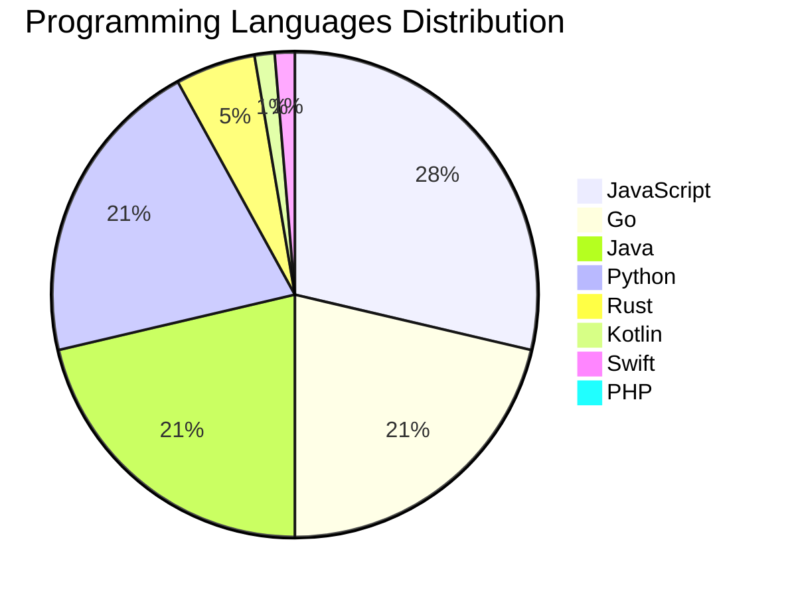

<div align="center">

# 📰 DevTech Auto News

**Your always-fresh digest of developer & AI tech news — curated automatically, around the clock.**


Aggregating [Dev.to](https://dev.to) · [Hacker News](https://news.ycombinator.com) · [GitHub Trending](https://github.com/trending) · [Lobste.rs](https://lobste.rs) · [Stack Overflow](https://stackoverflow.com) · [TechCrunch](https://techcrunch.com) · [freeCodeCamp](https://www.freecodecamp.org/news) — refreshed by GitHub Actions around the clock.

**[📰 Headlines](#-latest-headlines) · [💡 Interview Prep](#-interview-question-of-the-hour) · [📊 Statistics](#-statistics) · [⚙️ How It Works](#%EF%B8%8F-how-it-works)**

</div>

---

## 📰 Latest Headlines

> 🕐 Edition of **2026-08-25 15:00 CAT** — refreshed automatically, all day, every day.

### ✨ Featured Stories

<table>
<tr>
  <td align="center" width="33%">
    <a href="https://dev.to/ben/meme-monday-385f">
      
      <br/>
      <b>Meme Monday</b>
    </a>
    <br/>
    <sub>Dev.to</sub>
  </td>
  <td align="center" width="33%">
    <a href="https://blog.mlh.com/the-data-is-in-ai-is-how-developers-learn-now-28p4">
      
      <br/>
      <b>The data is in: AI is how developers learn now</b>
    </a>
    <br/>
    <sub>Dev.to</sub>
  </td>
  <td align="center" width="33%">
    <a href="https://dev.to/googleai/tech-webinar-how-to-control-costs-measure-roi-for-claude-code-on-gcp-91-12pm-pt-1m3b">
      
      <br/>
      <b>Tech webinar: How to control costs & measure ROI f...</b>
    </a>
    <br/>
    <sub>Dev.to</sub>
  </td>
</tr>
<tr>
  <td align="center" width="33%">
    <a href="https://dev.to/backboardio/coding-agents-got-boring-the-moment-we-built-a-really-good-one-1mc4">
      
      <br/>
      <b>Coding agents got boring the moment we built a rea...</b>
    </a>
    <br/>
    <sub>Dev.to</sub>
  </td>
  <td align="center" width="33%">
    <a href="https://dev.to/gde/mix-and-match-one-agent-three-clouds-one-protocol-4e5l">
      
      <br/>
      <b>Mix and Match: One Agent, Three Clouds, One Protoc...</b>
    </a>
    <br/>
    <sub>Dev.to</sub>
  </td>
  <td align="center" width="33%">
    <a href="https://dev.to/ale3oula/html-is-getting-cool-again-meet-the-invoker-commands-api-1367">
      
      <br/>
      <b>HTML is getting cool again: Meet the Invoker Comma...</b>
    </a>
    <br/>
    <sub>Dev.to</sub>
  </td>
</tr>
</table>


### 🗞️ Top Stories

| # | Headline | Source |
|---|----------|--------|
| 1 | [Meme Monday](https://dev.to/ben/meme-monday-385f) | Dev.to |
| 2 | [The data is in: AI is how developers learn now](https://blog.mlh.com/the-data-is-in-ai-is-how-developers-learn-now-28p4) | Dev.to |
| 3 | [Tech webinar: How to control costs & measure ROI for Claude Code on GCP - 9/1 12pm PT.](https://dev.to/googleai/tech-webinar-how-to-control-costs-measure-roi-for-claude-code-on-gcp-91-12pm-pt-1m3b) | Dev.to |
| 4 | [Coding agents got boring the moment we built a really good one.](https://dev.to/backboardio/coding-agents-got-boring-the-moment-we-built-a-really-good-one-1mc4) | Dev.to |
| 5 | [Mix and Match: One Agent, Three Clouds, One Protocol](https://dev.to/gde/mix-and-match-one-agent-three-clouds-one-protocol-4e5l) | Dev.to |
| 6 | [HTML is getting cool again: Meet the Invoker Commands API](https://dev.to/ale3oula/html-is-getting-cool-again-meet-the-invoker-commands-api-1367) | Dev.to |
| 7 | [Mix and Match: Serving an ADK Agent to AWS and Azure](https://dev.to/gde/mix-and-match-serving-an-adk-agent-to-aws-and-azure-161f) | Dev.to |
| 8 | [Greatness Is Forged by Limitation](https://dev.to/adamthedeveloper/greatness-is-forged-by-limitation-e20) | Dev.to |
| 9 | [Git Gud!](https://dev.to/francistrdev/git-gud-4e6g) | Dev.to |
| 10 | [Hey all! I’m Jem, the DEV Community Program Coordinator](https://dev.to/devteam/hey-all-im-jem-the-dev-community-program-coordinator-2g2) | Dev.to |
| 11 | [My First Engineering Job Is Teaching Me Something I Didn't Expect](https://dev.to/itsugo/my-first-engineering-job-is-teaching-me-something-i-didnt-expect-l96) | Dev.to |
| 12 | [I Joined dev.to because...](https://dev.to/francistrdev/i-joined-devto-because-fl0) | Dev.to |
| 13 | [Ichiraku Ramen — A Cozy Japanese Restaurant Landing Page 🍜🌸](https://dev.to/gamya_m/ichiraku-ramen-a-cozy-japanese-restaurant-landing-page-3pb8) | Dev.to |
| 14 | [What was your win this week??](https://dev.to/devteam/what-was-your-win-this-week-23ob) | Dev.to |
| 15 | [Backend Engineer (Me) Ships a Browser Game With One Unintentional System Requirement: My Monitor](https://dev.to/georgekobaidze/backend-engineer-me-ships-a-browser-game-with-one-unintentional-system-requirement-my-monitor-1ojd) | Dev.to |
| 16 | [Bridging the AI Cutoff: Teaching Coding Agents Every Dart Feature from 1.0 to 3.14](https://dev.to/gde/bridging-the-ai-cutoff-teaching-coding-agents-every-dart-feature-from-10-to-314-3752) | Dev.to |
| 17 | [When to Use Bloc vs. Cubit vs. Signal: An Architectural Decision Guide](https://dev.to/gde/when-to-use-bloc-vs-cubit-vs-signal-an-architectural-decision-guide-2911) | Dev.to |
| 18 | [I Stopped Trusting AI Agents With Tools. So I Built a Gatekeeper.](https://dev.to/debashish_ghosal/i-stopped-trusting-ai-agents-with-tools-so-i-built-a-gatekeeper-26fb) | Dev.to |
| 19 | [I Write Less Code Than I Used To. That May Be the Point.](https://dev.to/marcosomma/i-write-less-code-than-i-used-to-that-may-be-the-point-3kk) | Dev.to |
| 20 | [Building a viral Imax ticketing app that never crashes](https://dev.to/googleai/building-a-viral-imax-ticketing-app-that-never-crashes-4d58) | Dev.to |

<sub>Last fetched: Tue, 25 Aug 2026 15:07:50 CAT</sub>


---

## 💡 Interview Question of the Hour

> Sharpen your skills — new questions selected on every update. Try answering before opening the hint!

**1. `JavaScript` — What is the event loop and how does it work?**

&nbsp;&nbsp;&nbsp;&nbsp;🎯 Hard · 🏷 async, runtime

<details>
<summary>&nbsp;&nbsp;&nbsp;&nbsp;💡 Show hint</summary>

> Call stack, callback queue, microtask queue

</details>

**2. `Database` — Design a database schema for a social media platform**

&nbsp;&nbsp;&nbsp;&nbsp;🎯 Hard · 🏷 design, scalability

<details>
<summary>&nbsp;&nbsp;&nbsp;&nbsp;💡 Show hint</summary>

> Users, posts, relationships, indexes, partitioning

</details>

**3. `Java` — What is the difference between abstract class and interface?**

&nbsp;&nbsp;&nbsp;&nbsp;🎯 Easy · 🏷 OOP, design

<details>
<summary>&nbsp;&nbsp;&nbsp;&nbsp;💡 Show hint</summary>

> Multiple inheritance, method implementation, use cases

</details>


---

## 📊 Statistics

#### 🗂 Articles by Category

| Category | Articles | Share | |
|----------|---------:|------:|---|
| **AI** | 78 | 42.4% | `████████████████████` |
| **JavaScript** | 43 | 23.4% | `███████████░░░░░░░░░` |
| **Tools** | 40 | 21.7% | `██████████░░░░░░░░░░` |
| **Python** | 31 | 16.8% | `████████░░░░░░░░░░░░` |
| **Security** | 19 | 10.3% | `█████░░░░░░░░░░░░░░░` |
| **DevOps** | 14 | 7.6% | `████░░░░░░░░░░░░░░░░` |
| **WebDev** | 12 | 6.5% | `███░░░░░░░░░░░░░░░░░` |
| **Mobile** | 12 | 6.5% | `███░░░░░░░░░░░░░░░░░` |
| **Cloud** | 10 | 5.4% | `███░░░░░░░░░░░░░░░░░` |
| **Database** | 6 | 3.3% | `██░░░░░░░░░░░░░░░░░░` |

<sub>Articles can match more than one category, so shares may sum to over 100%.</sub>


#### 📡 Articles by Source

| Source | Articles |
|--------|---------:|
| Dev.to | 60 |
| HackerNews | 49 |
| GitHub | 25 |
| Lobste.rs | 10 |
| StackOverflow | 20 |
| TechCrunch | 10 |
| freeCodeCamp | 10 |


#### 💻 Programming Language Trends

```
JavaScript      ██████████████████████████████ 28.5%
Go              ██████████████████████ 21.2%
Java            ██████████████████████ 21.2%
Python          ██████████████████████ 20.5%
Rust            ██████ 5.3%
Kotlin          █ 1.3%
Swift           █ 1.3%
PHP             █ 0.7%

```




#### 🏷 Trending Topics

            


---

## ⚙️ How It Works

This repository is a fully automated news pipeline. On every run, GitHub Actions:

1. **Fetches** the latest articles from seven sources: Dev.to, Hacker News, GitHub Trending, Lobste.rs, Stack Overflow, TechCrunch, and freeCodeCamp
2. **Deduplicates and categorizes** them across 10+ topics using keyword matching
3. **Extracts cover images** and computes language & category statistics
4. **Rebuilds this README** and appends everything to the [full archive](./data/news_log.md)
5. **Commits and pushes** the result — no human intervention needed

<details>
<summary><b>🚀 Run it yourself</b></summary>

```bash
git clone https://github.com/Derrick-MUGISHA/github-activity-bot.git
cd github-activity-bot
npm install
npm start
```

Fork the repo, enable GitHub Actions, and you have your own self-updating news feed.

</details>

<details>
<summary><b>📚 Data & resources</b></summary>

- [Full news archive](./data/news_log.md) — complete history of every fetched article
- [Statistics](./data/stats.json) — raw stats data (JSON)
- [Categorized articles](./data/categorized.json) — articles grouped by topic
- [Interview question bank](./data/interview_questions.json) — the full question set

</details>

---

## 🤝 Contributing

Ideas for new sources, categories, or interview questions are welcome — [open an issue](https://github.com/Derrick-MUGISHA/github-activity-bot/issues/new) or submit a pull request.

## 📄 License

Released under the [MIT License](https://opensource.org/licenses/MIT) — free to use, fork, and modify.

---

<div align="center">
  <sub>🤖 Last automated update: <b>Tue, 25 Aug 2026 13:07:50 GMT</b></sub><br/>
  <sub>Powered by GitHub Actions · Built with ❤️ by <a href="https://github.com/Derrick-MUGISHA">Derrick MUGISHA</a></sub>
</div>
