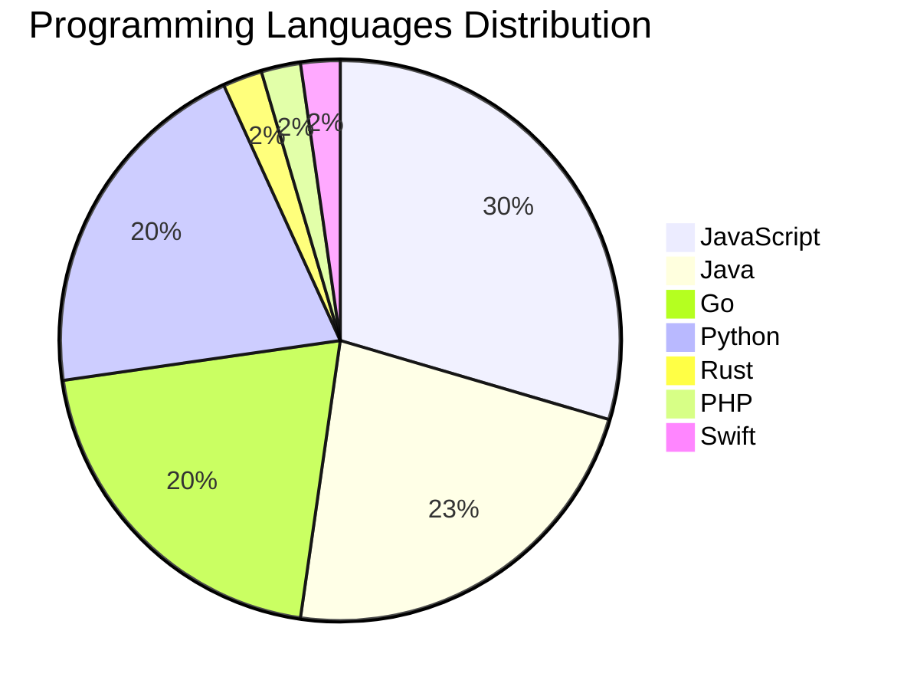

# 🚀 DevTech Auto News - Enhanced Edition


**DevTech Auto News Enhanced** is an advanced automated bot that aggregates trending topics in **AI**, **Web Development**, **Mobile**, **Cloud**, **DevOps**, and more from multiple sources including:

- 📰 [Dev.to](https://dev.to) - Developer community articles
- 🔥 [HackerNews](https://news.ycombinator.com) - Tech news discussions  
- 💻 [GitHub Trending](https://github.com/trending) - Trending repositories
- 🎯 Curated Interview Questions from multiple languages

## ✨ Features

✅ **Multi-Source Aggregation**: Combines articles from Dev.to, HackerNews, and GitHub  
✅ **Smart Categorization**: Automatically categorizes content into 10+ topics  
✅ **Image Support**: Displays cover images for visual appeal  
✅ **Pagination**: Fetches 50+ articles per update with deduplication  
✅ **Language Statistics**: Tracks programming language trends with charts  
✅ **Interview Questions**: Daily coding interview questions in multiple languages  
✅ **GitHub Actions**: Runs every 15 minutes automatically  

---

## 📊 Statistics Dashboard

### 📊 Articles by Category

**AI**: 🟦🟦🟦🟦🟦🟦🟦🟦🟦🟦🟦🟦🟦🟦🟦🟦🟦🟦🟦🟦 41 (39.0%)

**Tools**: 🟦🟦🟦🟦🟦🟦🟦🟦🟦🟦🟦🟦🟦 27 (25.7%)

**JavaScript**: 🟦🟦🟦🟦🟦🟦🟦🟦🟦🟦🟦🟦🟦 26 (24.8%)

**Python**: 🟦🟦🟦🟦🟦🟦🟦🟦🟦 18 (17.1%)

**WebDev**: 🟦🟦🟦🟦 9 (8.6%)

**DevOps**: 🟦🟦 5 (4.8%)

**Security**: 🟦🟦 5 (4.8%)

**Cloud**: 🟦🟦 4 (3.8%)

**Database**: 🟦 3 (2.9%)

**Mobile**: 🟦 2 (1.9%)


### 📡 Sources

- **Dev.to**: 60 articles
- **HackerNews**: 30 articles
- **GitHub**: 15 articles


### 💻 Programming Language Trends

```
JavaScript      ██████████████████████████████ 29.5 (29.5%)
Java            ███████████████████████ 22.7 (22.7%)
Go              █████████████████████ 20.5 (20.5%)
Python          █████████████████████ 20.5 (20.5%)
Rust            ██ 2.3 (2.3%)
PHP             ██ 2.3 (2.3%)
Swift           ██ 2.3 (2.3%)

```




### 🏷️ Trending Tags

               


---

## 🛠️ How It Works

1. **Multi-Source Fetch**: Pulls from Dev.to (2 pages), HackerNews (3 topics), GitHub (3 languages)
2. **Smart Filter**: Uses keyword matching across 10+ categories  
3. **Deduplication**: Removes duplicate URLs  
4. **Image Extraction**: Captures cover images when available  
5. **Statistics**: Generates language trends and category breakdowns  
6. **Update Files**: Regenerates README and appends to comprehensive log  

---

## 📦 Installation & Usage

```bash
# Clone the repository
git clone https://github.com/Derrick-MUGISHA/github-activity-bot.git
cd github-activity-bot

# Install dependencies  
npm install

# Run manually
npm start

# Test mode
npm run test
```

---


# 🚀 DevTech Auto News - Enhanced Edition

## 📅 Latest Updates (2026-02-14 12:00 CAT)


### 🖼️ Featured Articles

<table>
<tr>
  <td align="center" width="33%">
    <a href="https://dev.to/devteam/what-was-your-win-this-week-a3a">
      
      <br/>
      <b>What was your win this week??</b>
    </a>
    <br/>
    <sub>Dev.to</sub>
  </td>
  <td align="center" width="33%">
    <a href="https://dev.to/richardpascoe/remember-your-first-computer-book-4fml">
      
      <br/>
      <b>Remember Your First Computer Book?</b>
    </a>
    <br/>
    <sub>Dev.to</sub>
  </td>
  <td align="center" width="33%">
    <a href="https://dev.to/devteam/what-else-do-you-want-to-know-about-gemini-cli-457h">
      
      <br/>
      <b>What else do you want to know about Gemini CLI?</b>
    </a>
    <br/>
    <sub>Dev.to</sub>
  </td>
</tr>
<tr>
  <td align="center" width="33%">
    <a href="https://dev.to/deivid11/command-center-for-ai-coding-agents-claude-code-codex-3d5g">
      
      <br/>
      <b>Command Center for AI Coding Agents (Claude Code +...</b>
    </a>
    <br/>
    <sub>Dev.to</sub>
  </td>
  <td align="center" width="33%">
    <a href="https://dev.to/richardpascoe/stack-overflow-time-for-a-change-c2p">
      
      <br/>
      <b>Stack Overflow: Time for a Change?</b>
    </a>
    <br/>
    <sub>Dev.to</sub>
  </td>
  <td align="center" width="33%">
    <a href="https://dev.to/richardpascoe/html-accessibility-review-3md8">
      
      <br/>
      <b>HTML Accessibility Review</b>
    </a>
    <br/>
    <sub>Dev.to</sub>
  </td>
</tr>
</table>


### 📰 Top Headlines

- [What was your win this week??](https://dev.to/devteam/what-was-your-win-this-week-a3a) _[Dev.to]_
- [Remember Your First Computer Book?](https://dev.to/richardpascoe/remember-your-first-computer-book-4fml) _[Dev.to]_
- [What else do you want to know about Gemini CLI?](https://dev.to/devteam/what-else-do-you-want-to-know-about-gemini-cli-457h) _[Dev.to]_
- [Command Center for AI Coding Agents (Claude Code + Codex)](https://dev.to/deivid11/command-center-for-ai-coding-agents-claude-code-codex-3d5g) _[Dev.to]_
- [Stack Overflow: Time for a Change?](https://dev.to/richardpascoe/stack-overflow-time-for-a-change-c2p) _[Dev.to]_
- [HTML Accessibility Review](https://dev.to/richardpascoe/html-accessibility-review-3md8) _[Dev.to]_
- [Symfony AI: A Rocket, a School Bus, or Something In Between?](https://dev.to/jeandevbr/symfony-ai-a-rocket-a-school-bus-or-something-in-between-31nn) _[Dev.to]_
- [How Seriously Should We Take State of JS and Other Developer Surveys?](https://dev.to/sylwia-lask/how-seriously-should-we-take-state-of-js-and-other-developer-surveys-9ce) _[Dev.to]_
- [Design a Movie Review Page](https://dev.to/richardpascoe/design-a-movie-review-page-36bl) _[Dev.to]_
- [Google Analytics, SaaS, or self-hosted? How I chose my analytics stack](https://dev.to/sebhoek/google-analytics-saas-or-self-hosted-how-i-chose-my-analytics-stack-271g) _[Dev.to]_
- [Metal Birds Watch: Copilot CLI Helped Me Watch Planes Without Looking Up](https://dev.to/georgekobaidze/metal-birds-watch-copilot-cli-helped-me-watch-planes-without-looking-up-4ha0) _[Dev.to]_
- [I replaced Stripe's dunning emails with SMS — here's the architecture and why it recovers 2x more revenue](https://dev.to/aledb/i-replaced-stripes-dunning-emails-with-sms-heres-the-architecture-and-why-it-recovers-2x-more-5ei3) _[Dev.to]_
- [ASCII Whisper: Local P2P Chat with Sound FX and Battleship](https://dev.to/annavi11arrea1/ascii-whisper-local-p2p-chat-with-sound-fx-and-battleship-18c7) _[Dev.to]_
- [One Month at a Startup: What Stayed With Me After I Left](https://dev.to/itsugo/one-month-at-a-startup-what-stayed-with-me-after-i-left-42an) _[Dev.to]_
- [Top 7 Featured DEV Posts of the Week](https://dev.to/devteam/top-7-featured-dev-posts-of-the-week-43cc) _[Dev.to]_
- [Checking Django Settings](https://dev.to/adamghill/checking-django-settings-12g4) _[Dev.to]_
- [Built a Vibe Coded App where you can Style any Image you like! :D](https://dev.to/francistrdev/built-a-vibe-coded-app-where-you-can-style-any-image-you-like-d-288p) _[Dev.to]_
- [Building a Simple Blog with Supabase (Posts & Comments)](https://dev.to/bosz/building-a-simple-blog-with-supabase-posts-comments-4384) _[Dev.to]_
- [OSDev Bare Bones with Rust - Cross-Compilation and Freestanding](https://dev.to/douglasmakey/osdev-bare-bones-with-rust-cross-compilation-and-freestanding-598b) _[Dev.to]_
- [How a Malicious Google Skill on ClawHub Tricks Users Into Installing Malware](https://dev.to/snyk/how-a-malicious-google-skill-on-clawhub-tricks-users-into-installing-malware-2298) _[Dev.to]_

_Last automated update: Sat, 14 Feb 2026 12:34:48 CAT_


## 💡 Daily Interview Questions

_Sharpen your skills with these curated questions_

### 1. Python: What is the difference between list and tuple in Python?

**Difficulty**: Easy | **Topics**: data structures, mutability

<details>
<summary>💡 Hint</summary>

Mutability, performance, use cases

</details>

### 2. JavaScript: Explain event delegation and why it's useful

**Difficulty**: Medium | **Topics**: events, DOM

<details>
<summary>💡 Hint</summary>

Event bubbling, single listener for multiple elements

</details>

### 3. SystemDesign: Design a distributed cache system

**Difficulty**: Hard | **Topics**: distributed systems, caching

<details>
<summary>💡 Hint</summary>

Consistency, partitioning, replication, eviction policies

</details>


---

## 📚 Resources

- [Full News Archive](./data/news_log.md) - Complete history of all fetched articles
- [Statistics JSON](./data/stats.json) - Raw statistics data
- [Categorized Data](./data/categorized.json) - Articles organized by category
- [Interview Questions](./data/interview_questions.json) - Complete question bank

---

## 🤝 Contributing

Want to add more sources, categories, or interview questions? Feel free to:

1. Fork this repository
2. Add your improvements
3. Submit a pull request

---

## 📄 License

MIT License - Feel free to use and modify!

---

<p align="center">
  <b>Last automated update: Sat, 14 Feb 2026 10:34:48 GMT</b><br/>
  <sub>Powered by GitHub Actions | Made with ❤️ for developers</sub>
</p>

---

## 🔗 Quick Links

- [View Workflow](https://github.com/Derrick-MUGISHA/github-activity-bot/actions)
- [Report Issue](https://github.com/Derrick-MUGISHA/github-activity-bot/issues)
- [Suggest Feature](https://github.com/Derrick-MUGISHA/github-activity-bot/issues/new)
