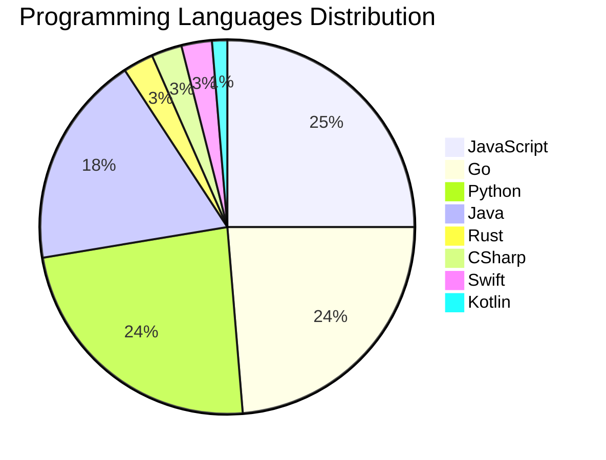

# 🚀 DevTech Auto News - Enhanced Edition


**DevTech Auto News Enhanced** is an advanced automated bot that aggregates trending topics in **AI**, **Web Development**, **Mobile**, **Cloud**, **DevOps**, and more from multiple sources including:

- 📰 [Dev.to](https://dev.to) - Developer community articles
- 🔥 [HackerNews](https://news.ycombinator.com) - Tech news discussions  
- 💻 [GitHub Trending](https://github.com/trending) - Trending repositories
- 🎯 Curated Interview Questions from multiple languages

## ✨ Features

✅ **Multi-Source Aggregation**: Combines articles from Dev.to, HackerNews, and GitHub  
✅ **Smart Categorization**: Automatically categorizes content into 10+ topics  
✅ **Image Support**: Displays cover images for visual appeal  
✅ **Pagination**: Fetches 50+ articles per update with deduplication  
✅ **Language Statistics**: Tracks programming language trends with charts  
✅ **Interview Questions**: Daily coding interview questions in multiple languages  
✅ **GitHub Actions**: Runs every 15 minutes automatically  

---

## 📊 Statistics Dashboard

### 📊 Articles by Category

**AI**: 🟦🟦🟦🟦🟦🟦🟦🟦🟦🟦🟦🟦🟦🟦🟦🟦🟦🟦🟦🟦 45 (45.0%)

**Tools**: 🟦🟦🟦🟦🟦🟦🟦🟦🟦🟦 23 (23.0%)

**JavaScript**: 🟦🟦🟦🟦🟦🟦🟦🟦 19 (19.0%)

**Python**: 🟦🟦🟦🟦🟦🟦🟦🟦 18 (18.0%)

**WebDev**: 🟦🟦🟦🟦 9 (9.0%)

**DevOps**: 🟦🟦🟦 6 (6.0%)

**Database**: 🟦🟦 4 (4.0%)

**Security**: 🟦🟦 4 (4.0%)

**Mobile**: 🟦 3 (3.0%)

**Cloud**: 🟦 2 (2.0%)


### 📡 Sources

- **Dev.to**: 60 articles
- **HackerNews**: 30 articles
- **GitHub**: 10 articles


### 💻 Programming Language Trends

```
JavaScript      ██████████████████████████████ 25.0 (25.0%)
Go              ████████████████████████████ 23.7 (23.7%)
Python          ████████████████████████████ 23.7 (23.7%)
Java            ██████████████████████ 18.4 (18.4%)
Rust            ███ 2.6 (2.6%)
CSharp          ███ 2.6 (2.6%)
Swift           ███ 2.6 (2.6%)
Kotlin          ██ 1.3 (1.3%)

```




### 🏷️ Trending Tags

               


---

## 🛠️ How It Works

1. **Multi-Source Fetch**: Pulls from Dev.to (2 pages), HackerNews (3 topics), GitHub (3 languages)
2. **Smart Filter**: Uses keyword matching across 10+ categories  
3. **Deduplication**: Removes duplicate URLs  
4. **Image Extraction**: Captures cover images when available  
5. **Statistics**: Generates language trends and category breakdowns  
6. **Update Files**: Regenerates README and appends to comprehensive log  

---

## 📦 Installation & Usage

```bash
# Clone the repository
git clone https://github.com/Derrick-MUGISHA/github-activity-bot.git
cd github-activity-bot

# Install dependencies  
npm install

# Run manually
npm start

# Test mode
npm run test
```

---


# 🚀 DevTech Auto News - Enhanced Edition

## 📅 Latest Updates (2026-03-11 18:00 CAT)


### 🖼️ Featured Articles

<table>
<tr>
  <td align="center" width="33%">
    <a href="https://dev.to/devteam/top-7-featured-dev-posts-of-the-week-1889">
      
      <br/>
      <b>Top 7 Featured DEV Posts of the Week</b>
    </a>
    <br/>
    <sub>Dev.to</sub>
  </td>
  <td align="center" width="33%">
    <a href="https://dev.to/dumebii/gemini-25-flash-vs-claude-37-sonnet-4-production-constraints-that-made-the-decision-for-me-bib">
      
      <br/>
      <b>Gemini 2.5 Flash vs Claude 3.7 Sonnet: 4 Productio...</b>
    </a>
    <br/>
    <sub>Dev.to</sub>
  </td>
  <td align="center" width="33%">
    <a href="https://dev.to/_vjk/i-made-claude-code-think-before-it-codes-heres-the-prompt-bf">
      
      <br/>
      <b>I Made Claude Code Think Before It Codes. Here's t...</b>
    </a>
    <br/>
    <sub>Dev.to</sub>
  </td>
</tr>
<tr>
  <td align="center" width="33%">
    <a href="https://dev.to/krakenhavoc/tls-certificates-are-about-to-expire-way-more-often-heres-how-im-handling-it-40p6">
      
      <br/>
      <b>TLS Certificates Are About to Expire Way More Ofte...</b>
    </a>
    <br/>
    <sub>Dev.to</sub>
  </td>
  <td align="center" width="33%">
    <a href="https://dev.to/jlarky/running-a-local-sandboxed-macos-desktop-using-vnc-and-a-restricted-user-38dk">
      
      <br/>
      <b>Running a Local Sandboxed macOS Desktop Using VNC ...</b>
    </a>
    <br/>
    <sub>Dev.to</sub>
  </td>
  <td align="center" width="33%">
    <a href="https://dev.to/francistrdev/can-you-truly-know-that-you-are-in-the-right-path-4745">
      
      <br/>
      <b>Can you Truly Know that you are in the Right Path?</b>
    </a>
    <br/>
    <sub>Dev.to</sub>
  </td>
</tr>
</table>


### 📰 Top Headlines

- [Top 7 Featured DEV Posts of the Week](https://dev.to/devteam/top-7-featured-dev-posts-of-the-week-1889) _[Dev.to]_
- [Gemini 2.5 Flash vs Claude 3.7 Sonnet: 4 Production Constraints That Made the Decision for Me](https://dev.to/dumebii/gemini-25-flash-vs-claude-37-sonnet-4-production-constraints-that-made-the-decision-for-me-bib) _[Dev.to]_
- [I Made Claude Code Think Before It Codes. Here's the Prompt.](https://dev.to/_vjk/i-made-claude-code-think-before-it-codes-heres-the-prompt-bf) _[Dev.to]_
- [TLS Certificates Are About to Expire Way More Often. Here's How I'm Handling It.](https://dev.to/krakenhavoc/tls-certificates-are-about-to-expire-way-more-often-heres-how-im-handling-it-40p6) _[Dev.to]_
- [Running a Local Sandboxed macOS Desktop Using VNC and a Restricted User](https://dev.to/jlarky/running-a-local-sandboxed-macos-desktop-using-vnc-and-a-restricted-user-38dk) _[Dev.to]_
- [Can you Truly Know that you are in the Right Path?](https://dev.to/francistrdev/can-you-truly-know-that-you-are-in-the-right-path-4745) _[Dev.to]_
- [Revamped RSS Feed Imports](https://dev.to/devteam/revamped-rss-feed-imports-3j1e) _[Dev.to]_
- [The Enablers Who Helped Me Code Forward](https://dev.to/ujja/the-enablers-who-helped-me-code-forward-cai) _[Dev.to]_
- [DumbQuestion.ai - Self-Awareness, Prompt Injection, Search Intent... and darkness](https://dev.to/jagostoni/dumbquestionai-self-awareness-prompt-injection-search-intent-and-darkness-3pd) _[Dev.to]_
- [Gemini Embedding 2: Our first natively multimodal embedding model](https://dev.to/googleai/gemini-embedding-2-our-first-natively-multimodal-embedding-model-4apn) _[Dev.to]_
- [Let Dependabot Merge Its Own PRs](https://dev.to/nickytonline/let-dependabot-merge-its-own-prs-27pc) _[Dev.to]_
- [Ship Less, Measure More](https://dev.to/snowman647/ship-less-measure-more-58m4) _[Dev.to]_
- [Decisions, Decisions -- Thoughts on making architectural decisions](https://dev.to/alexandermchan/decisions-decisions-thoughts-on-making-architectural-decisions-2bol) _[Dev.to]_
- [I Deleted Pinecone, Redis, and 400 Lines of Python. My RAG Pipeline Still Works.](https://dev.to/zeybek/i-deleted-pinecone-redis-and-400-lines-of-python-my-rag-pipeline-still-works-5dh3) _[Dev.to]_
- [Join the 2026 WeCoded Challenge and Celebrate Underrepresented Voices in Tech Through Writing & Frontend Art 🎨!](https://dev.to/devteam/join-the-2026-wecoded-challenge-and-celebrate-underrepresented-voices-in-tech-through-writing--4828) _[Dev.to]_
- [Why Shift+Enter doesn't work in Claude Code (and how to fix it)](https://dev.to/richardbray/why-shiftenter-doesnt-work-in-claude-code-and-how-to-fix-it-10f7) _[Dev.to]_
- [Your Agent Is a Small, Low-Stakes HAL](https://dev.to/romanonthego/your-agent-is-a-small-low-stakes-hal-59j8) _[Dev.to]_
- [The Silent Behavioral Shift: Why GPT-5.4 Exposes the UI's Fragile Dependence on Backend Semantics](https://dev.to/sovereignrevenueguard/the-silent-behavioral-shift-why-gpt-54-exposes-the-uis-fragile-dependence-on-backend-semantics-1lkl) _[Dev.to]_
- [Building a Text-to-Speech Engine in Pure C](https://dev.to/gabrielemastrapasqua/building-a-text-to-speech-engine-in-pure-c-59h4) _[Dev.to]_
- [From NEET Aspirant to Writing Code: A Journey I Never Planned](https://dev.to/preeti_yadav/from-neet-aspirant-to-writing-code-a-journey-i-never-planned-l59) _[Dev.to]_

_Last automated update: Wed, 11 Mar 2026 18:01:55 CAT_


## 💡 Daily Interview Questions

_Sharpen your skills with these curated questions_

### 1. Python: What is the difference between list and tuple in Python?

**Difficulty**: Easy | **Topics**: data structures, mutability

<details>
<summary>💡 Hint</summary>

Mutability, performance, use cases

</details>

### 2. Database: What is database normalization and denormalization?

**Difficulty**: Medium | **Topics**: design, optimization

<details>
<summary>💡 Hint</summary>

Normal forms, redundancy, performance trade-offs

</details>

### 3. Database: Design a database schema for a social media platform

**Difficulty**: Hard | **Topics**: design, scalability

<details>
<summary>💡 Hint</summary>

Users, posts, relationships, indexes, partitioning

</details>


---

## 📚 Resources

- [Full News Archive](./data/news_log.md) - Complete history of all fetched articles
- [Statistics JSON](./data/stats.json) - Raw statistics data
- [Categorized Data](./data/categorized.json) - Articles organized by category
- [Interview Questions](./data/interview_questions.json) - Complete question bank

---

## 🤝 Contributing

Want to add more sources, categories, or interview questions? Feel free to:

1. Fork this repository
2. Add your improvements
3. Submit a pull request

---

## 📄 License

MIT License - Feel free to use and modify!

---

<p align="center">
  <b>Last automated update: Wed, 11 Mar 2026 16:01:55 GMT</b><br/>
  <sub>Powered by GitHub Actions | Made with ❤️ for developers</sub>
</p>

---

## 🔗 Quick Links

- [View Workflow](https://github.com/Derrick-MUGISHA/github-activity-bot/actions)
- [Report Issue](https://github.com/Derrick-MUGISHA/github-activity-bot/issues)
- [Suggest Feature](https://github.com/Derrick-MUGISHA/github-activity-bot/issues/new)
