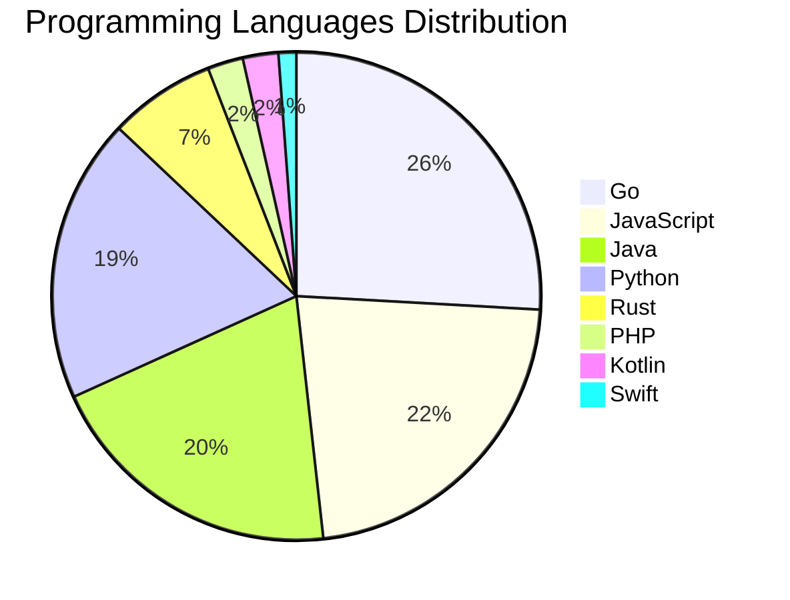

# 🚀 DevTech Auto News - Enhanced Edition


**DevTech Auto News Enhanced** is an advanced automated bot that aggregates trending topics in **AI**, **Web Development**, **Mobile**, **Cloud**, **DevOps**, and more from multiple sources including:

- 📰 [Dev.to](https://dev.to) - Developer community articles
- 🔥 [HackerNews](https://news.ycombinator.com) - Tech news discussions  
- 💻 [GitHub Trending](https://github.com/trending) - Trending repositories
- 🎯 Curated Interview Questions from multiple languages

## ✨ Features

✅ **Multi-Source Aggregation**: Combines articles from Dev.to, HackerNews, and GitHub  
✅ **Smart Categorization**: Automatically categorizes content into 10+ topics  
✅ **Image Support**: Displays cover images for visual appeal  
✅ **Pagination**: Fetches 50+ articles per update with deduplication  
✅ **Language Statistics**: Tracks programming language trends with charts  
✅ **Interview Questions**: Daily coding interview questions in multiple languages  
✅ **GitHub Actions**: Runs every 15 minutes automatically  

---

## 📊 Statistics Dashboard

### 📊 Articles by Category

**AI**: 🟦🟦🟦🟦🟦🟦🟦🟦🟦🟦🟦🟦🟦🟦🟦🟦🟦🟦🟦🟦 42 (40.0%)

**Tools**: 🟦🟦🟦🟦🟦🟦🟦🟦🟦🟦🟦🟦 25 (23.8%)

**JavaScript**: 🟦🟦🟦🟦🟦🟦🟦🟦🟦 19 (18.1%)

**Python**: 🟦🟦🟦🟦🟦🟦🟦🟦 16 (15.2%)

**Cloud**: 🟦🟦🟦🟦 9 (8.6%)

**DevOps**: 🟦🟦 5 (4.8%)

**WebDev**: 🟦 3 (2.9%)

**Mobile**: 🟦 3 (2.9%)

**Database**: 🟦 2 (1.9%)

**Security**: 🟦 2 (1.9%)


### 📡 Sources

- **Dev.to**: 60 articles
- **HackerNews**: 30 articles
- **GitHub**: 15 articles


### 💻 Programming Language Trends

```
Go              ██████████████████████████████ 25.9 (25.9%)
JavaScript      ██████████████████████████ 22.4 (22.4%)
Java            ███████████████████████ 20.0 (20.0%)
Python          ██████████████████████ 18.8 (18.8%)
Rust            ████████ 7.1 (7.1%)
PHP             ███ 2.4 (2.4%)
Kotlin          ███ 2.4 (2.4%)
Swift           █ 1.2 (1.2%)

```




### 🏷️ Trending Tags

               


---

## 🛠️ How It Works

1. **Multi-Source Fetch**: Pulls from Dev.to (2 pages), HackerNews (3 topics), GitHub (3 languages)
2. **Smart Filter**: Uses keyword matching across 10+ categories  
3. **Deduplication**: Removes duplicate URLs  
4. **Image Extraction**: Captures cover images when available  
5. **Statistics**: Generates language trends and category breakdowns  
6. **Update Files**: Regenerates README and appends to comprehensive log  

---

## 📦 Installation & Usage

```bash
# Clone the repository
git clone https://github.com/Derrick-MUGISHA/github-activity-bot.git
cd github-activity-bot

# Install dependencies  
npm install

# Run manually
npm start

# Test mode
npm run test
```

---


# 🚀 DevTech Auto News - Enhanced Edition

## 📅 Latest Updates (2026-05-21 23:00 CAT)


### 🖼️ Featured Articles

<table>
<tr>
  <td align="center" width="33%">
    <a href="https://dev.to/devteam/join-the-github-finish-up-a-thon-challenge-3000-prize-pool-f41">
      
      <br/>
      <b>Join the GitHub Finish-Up-A-Thon Challenge: $3,000...</b>
    </a>
    <br/>
    <sub>Dev.to</sub>
  </td>
  <td align="center" width="33%">
    <a href="https://dev.to/annaspies/from-years-to-hours-joe">
      
      <br/>
      <b>From Years to Hours</b>
    </a>
    <br/>
    <sub>Dev.to</sub>
  </td>
  <td align="center" width="33%">
    <a href="https://dev.to/andyhaskell/accessibility-this-looks-like-a-job-for-a-developer-advocate-2a12">
      
      <br/>
      <b>Accessibility - This looks like a job for a develo...</b>
    </a>
    <br/>
    <sub>Dev.to</sub>
  </td>
</tr>
<tr>
  <td align="center" width="33%">
    <a href="https://dev.to/mlh/inside-100daysofsolana-a-guided-path-into-web3-5hk0">
      
      <br/>
      <b>Inside #100DaysofSolana: A Guided Path into Web3</b>
    </a>
    <br/>
    <sub>Dev.to</sub>
  </td>
  <td align="center" width="33%">
    <a href="https://dev.to/yechielk/shipping-your-machine-building-a-container-in-60-lines-of-code-part-1-14ma">
      
      <br/>
      <b>Shipping Your Machine: Building a Container in 50 ...</b>
    </a>
    <br/>
    <sub>Dev.to</sub>
  </td>
  <td align="center" width="33%">
    <a href="https://dev.to/gde/the-1000-operating-system-rearchitecting-the-dev-team-inside-antigravity-20-1j14">
      
      <br/>
      <b>The $1000 Operating System: Rearchitecting the Dev...</b>
    </a>
    <br/>
    <sub>Dev.to</sub>
  </td>
</tr>
</table>


### 📰 Top Headlines

- [Join the GitHub Finish-Up-A-Thon Challenge: $3,000 Prize Pool!](https://dev.to/devteam/join-the-github-finish-up-a-thon-challenge-3000-prize-pool-f41) _[Dev.to]_
- [From Years to Hours](https://dev.to/annaspies/from-years-to-hours-joe) _[Dev.to]_
- [Accessibility - This looks like a job for a developer advocate!](https://dev.to/andyhaskell/accessibility-this-looks-like-a-job-for-a-developer-advocate-2a12) _[Dev.to]_
- [Inside #100DaysofSolana: A Guided Path into Web3](https://dev.to/mlh/inside-100daysofsolana-a-guided-path-into-web3-5hk0) _[Dev.to]_
- [Shipping Your Machine: Building a Container in 50 Lines of Code (Part 1)](https://dev.to/yechielk/shipping-your-machine-building-a-container-in-60-lines-of-code-part-1-14ma) _[Dev.to]_
- [The $1000 Operating System: Rearchitecting the Dev Team Inside Antigravity 2.0](https://dev.to/gde/the-1000-operating-system-rearchitecting-the-dev-team-inside-antigravity-20-1j14) _[Dev.to]_
- [From Code to Cloud: 3 Labs for Deploying Your AI Agent](https://dev.to/googleai/from-code-to-cloud-3-labs-for-deploying-your-ai-agent-4dcn) _[Dev.to]_
- [jnigen and swiftgen in 2026 - some lessons learned](https://dev.to/orestesgaolin/jnigen-and-swiftgen-in-2026-some-lessons-learned-16ni) _[Dev.to]_
- [Great Little Software: Rackula](https://dev.to/valeriavg/great-little-software-rackula-1pa1) _[Dev.to]_
- [Building a Production Company Website on AWS — Project Overview](https://dev.to/josh_blair/building-a-production-company-website-on-aws-project-overview-2dhm) _[Dev.to]_
- [Found a Coordinated GitHub Follow Botnet Hiding in My Followers?](https://dev.to/gnomeman4201/i-found-a-coordinated-github-follow-botnet-hiding-in-my-followers-kgl) _[Dev.to]_
- [Dual Parameter Thermal FEA Design Optimization with FEATool Multiphysics](https://dev.to/precise-simulation/dual-parameter-thermal-fea-design-optimization-with-featool-multiphysics-m67) _[Dev.to]_
- [Building a Rust A2A Agent](https://dev.to/gde/building-a-rust-a2a-agent-4626) _[Dev.to]_
- [Google I/O 2026: From Consumer to Builder](https://dev.to/michellebuchiokonicha/google-io-2026-from-consumer-to-builder-dom) _[Dev.to]_
- [Getting Started with Antigravity CLI](https://dev.to/gde/getting-started-with-antigravity-cli-183g) _[Dev.to]_
- [Google I/O 2026 - Day 1 - Live from the Front Row](https://dev.to/gde/google-io-2026-day-1-live-from-the-front-row-52ji) _[Dev.to]_
- [Some Notes on OMO Orchestrator Claude Alternatives](https://dev.to/tythos/some-notes-on-omo-orchestrator-claude-alternatives-1a7c) _[Dev.to]_
- [Building a Local-First Hotel Receptionist with Gemma 4, GGUF, and llama.cpp](https://dev.to/chuanman2707/building-a-local-first-hotel-receptionist-with-gemma-4-gguf-and-llamacpp-51a4) _[Dev.to]_
- [Genkit Middleware: Intercept, Extend and Harden your Gen AI Pipelines](https://dev.to/gde/genkit-middleware-intercept-extend-and-harden-your-gen-ai-pipelines-4k03) _[Dev.to]_
- [I decided to build a Kubernetes alternative. Yes, I know I'm crazy](https://dev.to/denerfernandes/i-decided-to-build-a-kubernetes-alternative-yes-i-know-im-crazy-21b5) _[Dev.to]_

_Last automated update: Thu, 21 May 2026 23:09:55 CAT_


## 💡 Daily Interview Questions

_Sharpen your skills with these curated questions_

### 1. JavaScript: What is the difference between `let`, `const`, and `var`?

**Difficulty**: Easy | **Topics**: variables, scope

<details>
<summary>💡 Hint</summary>

Scope, hoisting, and reassignment capabilities

</details>

### 2. SystemDesign: How would you design a rate limiter?

**Difficulty**: Medium | **Topics**: system design, algorithms

<details>
<summary>💡 Hint</summary>

Token bucket, sliding window, distributed systems

</details>

### 3. Python: What is the difference between list and tuple in Python?

**Difficulty**: Easy | **Topics**: data structures, mutability

<details>
<summary>💡 Hint</summary>

Mutability, performance, use cases

</details>


---

## 📚 Resources

- [Full News Archive](./data/news_log.md) - Complete history of all fetched articles
- [Statistics JSON](./data/stats.json) - Raw statistics data
- [Categorized Data](./data/categorized.json) - Articles organized by category
- [Interview Questions](./data/interview_questions.json) - Complete question bank

---

## 🤝 Contributing

Want to add more sources, categories, or interview questions? Feel free to:

1. Fork this repository
2. Add your improvements
3. Submit a pull request

---

## 📄 License

MIT License - Feel free to use and modify!

---

<p align="center">
  <b>Last automated update: Thu, 21 May 2026 21:09:55 GMT</b><br/>
  <sub>Powered by GitHub Actions | Made with ❤️ for developers</sub>
</p>

---

## 🔗 Quick Links

- [View Workflow](https://github.com/Derrick-MUGISHA/github-activity-bot/actions)
- [Report Issue](https://github.com/Derrick-MUGISHA/github-activity-bot/issues)
- [Suggest Feature](https://github.com/Derrick-MUGISHA/github-activity-bot/issues/new)
