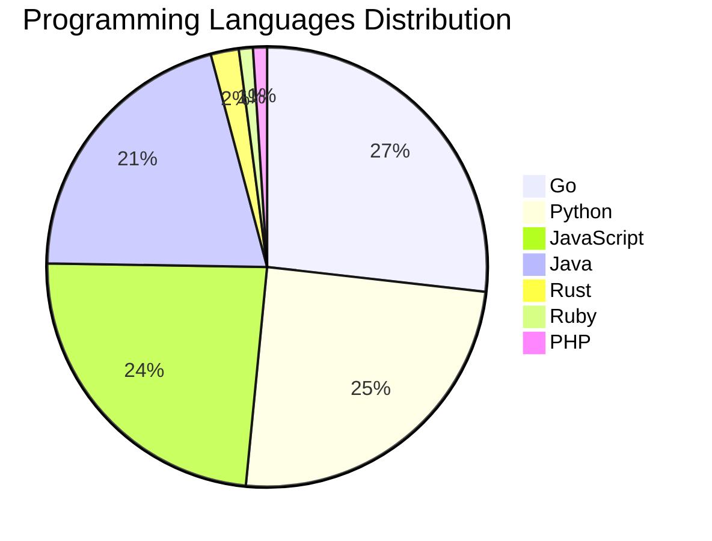

# 🚀 DevTech Auto News - Enhanced Edition


**DevTech Auto News Enhanced** is an advanced automated bot that aggregates trending topics in **AI**, **Web Development**, **Mobile**, **Cloud**, **DevOps**, and more from multiple sources including:

- 📰 [Dev.to](https://dev.to) - Developer community articles
- 🔥 [HackerNews](https://news.ycombinator.com) - Tech news discussions  
- 💻 [GitHub Trending](https://github.com/trending) - Trending repositories
- 🎯 Curated Interview Questions from multiple languages

## ✨ Features

✅ **Multi-Source Aggregation**: Combines articles from Dev.to, HackerNews, and GitHub  
✅ **Smart Categorization**: Automatically categorizes content into 10+ topics  
✅ **Image Support**: Displays cover images for visual appeal  
✅ **Pagination**: Fetches 50+ articles per update with deduplication  
✅ **Language Statistics**: Tracks programming language trends with charts  
✅ **Interview Questions**: Daily coding interview questions in multiple languages  
✅ **GitHub Actions**: Runs every 15 minutes automatically  

---

## 📊 Statistics Dashboard

### 📊 Articles by Category

**AI**: 🟦🟦🟦🟦🟦🟦🟦🟦🟦🟦🟦🟦🟦🟦🟦🟦🟦🟦🟦🟦 55 (52.4%)

**Python**: 🟦🟦🟦🟦🟦🟦🟦🟦🟦 24 (22.9%)

**JavaScript**: 🟦🟦🟦🟦🟦🟦🟦🟦 23 (21.9%)

**Tools**: 🟦🟦🟦🟦🟦🟦🟦🟦 21 (20.0%)

**Cloud**: 🟦🟦🟦🟦🟦 13 (12.4%)

**Security**: 🟦🟦🟦 9 (8.6%)

**DevOps**: 🟦 2 (1.9%)

**Database**: 🟦 2 (1.9%)

**WebDev**:  1 (1.0%)


### 📡 Sources

- **Dev.to**: 60 articles
- **HackerNews**: 30 articles
- **GitHub**: 15 articles


### 💻 Programming Language Trends

```
Go              ██████████████████████████████ 26.8 (26.8%)
Python          ████████████████████████████ 24.7 (24.7%)
JavaScript      ███████████████████████████ 23.7 (23.7%)
Java            ███████████████████████ 20.6 (20.6%)
Rust            ██ 2.1 (2.1%)
Ruby            █ 1.0 (1.0%)
PHP             █ 1.0 (1.0%)

```




### 🏷️ Trending Tags

               


---

## 🛠️ How It Works

1. **Multi-Source Fetch**: Pulls from Dev.to (2 pages), HackerNews (3 topics), GitHub (3 languages)
2. **Smart Filter**: Uses keyword matching across 10+ categories  
3. **Deduplication**: Removes duplicate URLs  
4. **Image Extraction**: Captures cover images when available  
5. **Statistics**: Generates language trends and category breakdowns  
6. **Update Files**: Regenerates README and appends to comprehensive log  

---

## 📦 Installation & Usage

```bash
# Clone the repository
git clone https://github.com/Derrick-MUGISHA/github-activity-bot.git
cd github-activity-bot

# Install dependencies  
npm install

# Run manually
npm start

# Test mode
npm run test
```

---


# 🚀 DevTech Auto News - Enhanced Edition

## 📅 Latest Updates (2026-04-13 9:00 CAT)


### 🖼️ Featured Articles

<table>
<tr>
  <td align="center" width="33%">
    <a href="https://dev.to/sylwia-lask/youre-a-real-software-developer-only-if-2mo8">
      
      <br/>
      <b>You’re a Real Software Developer Only If…</b>
    </a>
    <br/>
    <sub>Dev.to</sub>
  </td>
  <td align="center" width="33%">
    <a href="https://dev.to/georgekobaidze/the-final-1-of-every-github-project-sealing-it-properly-2app">
      
      <br/>
      <b>The Final 1% of Every GitHub Project: Sealing It P...</b>
    </a>
    <br/>
    <sub>Dev.to</sub>
  </td>
  <td align="center" width="33%">
    <a href="https://dev.to/gde/building-a-multimodal-agent-with-the-adk-amazon-ecs-express-and-gemini-flash-live-31-15ek">
      
      <br/>
      <b>Building a Multimodal Agent with the ADK, Amazon E...</b>
    </a>
    <br/>
    <sub>Dev.to</sub>
  </td>
</tr>
<tr>
  <td align="center" width="33%">
    <a href="https://dev.to/gde/building-a-multimodal-agent-with-the-adk-amazon-lightsail-and-gemini-flash-live-31-4p6j">
      
      <br/>
      <b>Building a Multimodal Agent with the ADK, Amazon L...</b>
    </a>
    <br/>
    <sub>Dev.to</sub>
  </td>
  <td align="center" width="33%">
    <a href="https://dev.to/gde/building-a-multimodal-cross-cloud-live-agent-with-adk-azure-fabric-and-gemini-cli-3k4a">
      
      <br/>
      <b>Building a Multimodal Cross Cloud Live Agent with ...</b>
    </a>
    <br/>
    <sub>Dev.to</sub>
  </td>
  <td align="center" width="33%">
    <a href="https://dev.to/distalx/why-im-afraid-to-ship-code-i-havent-read-53ha">
      
      <br/>
      <b>Why I’m Afraid to Ship Code I Haven’t Read</b>
    </a>
    <br/>
    <sub>Dev.to</sub>
  </td>
</tr>
</table>


### 📰 Top Headlines

- [You’re a Real Software Developer Only If…](https://dev.to/sylwia-lask/youre-a-real-software-developer-only-if-2mo8) _[Dev.to]_
- [The Final 1% of Every GitHub Project: Sealing It Properly](https://dev.to/georgekobaidze/the-final-1-of-every-github-project-sealing-it-properly-2app) _[Dev.to]_
- [Building a Multimodal Agent with the ADK, Amazon ECS Express, and Gemini Flash Live 3.1](https://dev.to/gde/building-a-multimodal-agent-with-the-adk-amazon-ecs-express-and-gemini-flash-live-31-15ek) _[Dev.to]_
- [Building a Multimodal Agent with the ADK, Amazon Lightsail, and Gemini Flash Live 3.1](https://dev.to/gde/building-a-multimodal-agent-with-the-adk-amazon-lightsail-and-gemini-flash-live-31-4p6j) _[Dev.to]_
- [Building a Multimodal Cross Cloud Live Agent with ADK, Azure Fabric, and Gemini CLI](https://dev.to/gde/building-a-multimodal-cross-cloud-live-agent-with-adk-azure-fabric-and-gemini-cli-3k4a) _[Dev.to]_
- [Why I’m Afraid to Ship Code I Haven’t Read](https://dev.to/distalx/why-im-afraid-to-ship-code-i-havent-read-53ha) _[Dev.to]_
- [Cross Cloud Multi Agent Comic Builder with ADK, Amazon ECS Express, and Gemini CLI](https://dev.to/gde/cross-cloud-multi-agent-comic-builder-with-adk-amazon-ecs-express-and-gemini-cli-41me) _[Dev.to]_
- [Cross Cloud Multi Agent Comic Builder with ADK, Amazon EKS, and Gemini CLI](https://dev.to/gde/cross-cloud-multi-agent-comic-builder-with-adk-amazon-eks-and-gemini-cli-4o10) _[Dev.to]_
- [A Go + React monorepo starter with auth and multi-tenancy](https://dev.to/calebeaires/a-go-react-monorepo-starter-with-auth-and-multi-tenancy-57f7) _[Dev.to]_
- [Building a Multimodal Cross Cloud Live Agent with ADK, Azure AKS, and Gemini CLI](https://dev.to/gde/building-a-multimodal-cross-cloud-live-agent-with-adk-azure-aks-and-gemini-cli-5g9j) _[Dev.to]_
- [Mastering Error Handling in Go](https://dev.to/adi73/mastering-error-handling-in-go-400g) _[Dev.to]_
- [EU Compliance, Programmable: The API That Turns 19 EU Regulations Into JSON](https://dev.to/sofianehamlaoui/eu-compliance-programmable-the-api-that-turns-19-eu-regulations-into-json-21m) _[Dev.to]_
- [What was your win this week??](https://dev.to/devteam/what-was-your-win-this-week-3df3) _[Dev.to]_
- [Top 7 Featured DEV Posts of the Week](https://dev.to/devteam/top-7-featured-dev-posts-of-the-week-4idc) _[Dev.to]_
- [Fine-Tuning Gemma 3 with Cloud Run Jobs: Serverless GPUs (NVIDIA RTX 6000 Pro) for pet breed classification 🐈🐕](https://dev.to/googleai/fine-tuning-gemma-3-with-cloud-run-jobs-serverless-gpus-nvidia-rtx-6000-pro-for-pet-breed-248b) _[Dev.to]_
- [I'm a bit lost.](https://dev.to/hubedav/im-a-bit-lost-2dko) _[Dev.to]_
- [Deploying ADK Agents on Azure Kubernates Service (AKS)](https://dev.to/gde/deploying-adk-agents-on-azure-kubernates-service-aks-1lpf) _[Dev.to]_
- [I Keep Telling Claude the Same Things. So He Started Writing Them Down Himself.](https://dev.to/eli_coding/i-keep-telling-claude-the-same-things-so-he-started-writing-them-down-himself-1i9) _[Dev.to]_
- [I Analyzed AI Coding Mistakes and Built an ESLint Plugin to Catch Them](https://dev.to/pertrai1/i-analyzed-500-ai-coding-mistakes-and-built-an-eslint-plugin-to-catch-them-jme) _[Dev.to]_
- [Unlocking Casual Fun: AI-Powered 'Vibe Coding' for Quick, Niche Apps](https://dev.to/maria_from_mlh/unlocking-casual-fun-ai-powered-vibe-coding-for-quick-niche-apps-ml5) _[Dev.to]_

_Last automated update: Mon, 13 Apr 2026 09:25:44 CAT_


## 💡 Daily Interview Questions

_Sharpen your skills with these curated questions_

### 1. JavaScript: What is the event loop and how does it work?

**Difficulty**: Hard | **Topics**: async, runtime

<details>
<summary>💡 Hint</summary>

Call stack, callback queue, microtask queue

</details>

### 2. NodeJS: Implement rate limiting for an API

**Difficulty**: Hard | **Topics**: security, middleware

<details>
<summary>💡 Hint</summary>

Token bucket, sliding window, Redis

</details>

### 3. SystemDesign: Design Twitter's timeline feature

**Difficulty**: Hard | **Topics**: system design, scalability

<details>
<summary>💡 Hint</summary>

Fan-out, caching, ranking, real-time updates

</details>


---

## 📚 Resources

- [Full News Archive](./data/news_log.md) - Complete history of all fetched articles
- [Statistics JSON](./data/stats.json) - Raw statistics data
- [Categorized Data](./data/categorized.json) - Articles organized by category
- [Interview Questions](./data/interview_questions.json) - Complete question bank

---

## 🤝 Contributing

Want to add more sources, categories, or interview questions? Feel free to:

1. Fork this repository
2. Add your improvements
3. Submit a pull request

---

## 📄 License

MIT License - Feel free to use and modify!

---

<p align="center">
  <b>Last automated update: Mon, 13 Apr 2026 07:25:44 GMT</b><br/>
  <sub>Powered by GitHub Actions | Made with ❤️ for developers</sub>
</p>

---

## 🔗 Quick Links

- [View Workflow](https://github.com/Derrick-MUGISHA/github-activity-bot/actions)
- [Report Issue](https://github.com/Derrick-MUGISHA/github-activity-bot/issues)
- [Suggest Feature](https://github.com/Derrick-MUGISHA/github-activity-bot/issues/new)
