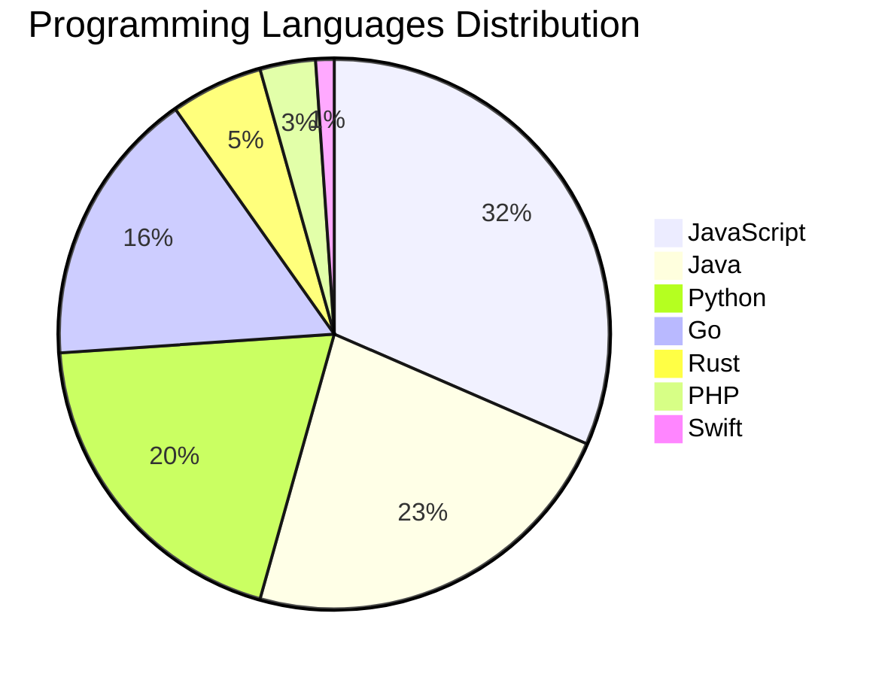

# 🚀 DevTech Auto News - Enhanced Edition


**DevTech Auto News Enhanced** is an advanced automated bot that aggregates trending topics in **AI**, **Web Development**, **Mobile**, **Cloud**, **DevOps**, and more from multiple sources including:

- 📰 [Dev.to](https://dev.to) - Developer community articles
- 🔥 [HackerNews](https://news.ycombinator.com) - Tech news discussions  
- 💻 [GitHub Trending](https://github.com/trending) - Trending repositories
- 🎯 Curated Interview Questions from multiple languages

## ✨ Features

✅ **Multi-Source Aggregation**: Combines articles from Dev.to, HackerNews, and GitHub  
✅ **Smart Categorization**: Automatically categorizes content into 10+ topics  
✅ **Image Support**: Displays cover images for visual appeal  
✅ **Pagination**: Fetches 50+ articles per update with deduplication  
✅ **Language Statistics**: Tracks programming language trends with charts  
✅ **Interview Questions**: Daily coding interview questions in multiple languages  
✅ **GitHub Actions**: Runs every 15 minutes automatically  

---

## 📊 Statistics Dashboard

### 📊 Articles by Category

**AI**: 🟦🟦🟦🟦🟦🟦🟦🟦🟦🟦🟦🟦🟦🟦🟦🟦🟦🟦🟦🟦 41 (39.0%)

**JavaScript**: 🟦🟦🟦🟦🟦🟦🟦🟦🟦🟦🟦🟦🟦🟦 29 (27.6%)

**Tools**: 🟦🟦🟦🟦🟦🟦🟦🟦🟦🟦🟦🟦🟦🟦 28 (26.7%)

**Python**: 🟦🟦🟦🟦🟦🟦🟦🟦🟦 18 (17.1%)

**Cloud**: 🟦🟦🟦 7 (6.7%)

**Security**: 🟦🟦🟦 6 (5.7%)

**DevOps**: 🟦🟦 5 (4.8%)

**WebDev**: 🟦🟦 4 (3.8%)

**Database**: 🟦🟦 4 (3.8%)

**Mobile**:  1 (1.0%)


### 📡 Sources

- **Dev.to**: 60 articles
- **HackerNews**: 30 articles
- **GitHub**: 15 articles


### 💻 Programming Language Trends

```
JavaScript      ██████████████████████████████ 31.5 (31.5%)
Java            ██████████████████████ 22.8 (22.8%)
Python          ███████████████████ 19.6 (19.6%)
Go              ████████████████ 16.3 (16.3%)
Rust            █████ 5.4 (5.4%)
PHP             ███ 3.3 (3.3%)
Swift           █ 1.1 (1.1%)

```




### 🏷️ Trending Tags

               


---

## 🛠️ How It Works

1. **Multi-Source Fetch**: Pulls from Dev.to (2 pages), HackerNews (3 topics), GitHub (3 languages)
2. **Smart Filter**: Uses keyword matching across 10+ categories  
3. **Deduplication**: Removes duplicate URLs  
4. **Image Extraction**: Captures cover images when available  
5. **Statistics**: Generates language trends and category breakdowns  
6. **Update Files**: Regenerates README and appends to comprehensive log  

---

## 📦 Installation & Usage

```bash
# Clone the repository
git clone https://github.com/Derrick-MUGISHA/github-activity-bot.git
cd github-activity-bot

# Install dependencies  
npm install

# Run manually
npm start

# Test mode
npm run test
```

---


# 🚀 DevTech Auto News - Enhanced Edition

## 📅 Latest Updates (2026-02-20 21:00 CAT)


### 🖼️ Featured Articles

<table>
<tr>
  <td align="center" width="33%">
    <a href="https://dev.to/devteam/congrats-to-the-new-year-new-you-portfolio-challenge-winners-and-runner-ups-1l9h">
      
      <br/>
      <b>Congrats to the "New Year, New You" Portfolio Chal...</b>
    </a>
    <br/>
    <sub>Dev.to</sub>
  </td>
  <td align="center" width="33%">
    <a href="https://dev.to/francistrdev/why-did-you-become-a-developer-57ea">
      
      <br/>
      <b>Why did you become a Developer?</b>
    </a>
    <br/>
    <sub>Dev.to</sub>
  </td>
  <td align="center" width="33%">
    <a href="https://dev.to/devteam/a-new-chapter-dev-is-joining-forces-with-major-league-hacking-mlh-3kfd">
      
      <br/>
      <b>A New Chapter: DEV is Joining Forces with Major Le...</b>
    </a>
    <br/>
    <sub>Dev.to</sub>
  </td>
</tr>
<tr>
  <td align="center" width="33%">
    <a href="https://dev.to/maame-codes/suffering-from-bugs-how-i-almost-deleted-my-entire-project-1eef">
      
      <br/>
      <b>Suffering from BUGS: How I Almost Deleted My Entir...</b>
    </a>
    <br/>
    <sub>Dev.to</sub>
  </td>
  <td align="center" width="33%">
    <a href="https://dev.to/mellen/what-does-mlh-stand-for-2cbg">
      
      <br/>
      <b>What does MLH stand for?</b>
    </a>
    <br/>
    <sub>Dev.to</sub>
  </td>
  <td align="center" width="33%">
    <a href="https://dev.to/devteam/what-was-your-win-this-week-5a3g">
      
      <br/>
      <b>What was your win this week?</b>
    </a>
    <br/>
    <sub>Dev.to</sub>
  </td>
</tr>
</table>


### 📰 Top Headlines

- [Congrats to the "New Year, New You" Portfolio Challenge Winners and Runner-Ups!](https://dev.to/devteam/congrats-to-the-new-year-new-you-portfolio-challenge-winners-and-runner-ups-1l9h) _[Dev.to]_
- [Why did you become a Developer?](https://dev.to/francistrdev/why-did-you-become-a-developer-57ea) _[Dev.to]_
- [A New Chapter: DEV is Joining Forces with Major League Hacking (MLH)](https://dev.to/devteam/a-new-chapter-dev-is-joining-forces-with-major-league-hacking-mlh-3kfd) _[Dev.to]_
- [Suffering from BUGS: How I Almost Deleted My Entire Project](https://dev.to/maame-codes/suffering-from-bugs-how-i-almost-deleted-my-entire-project-1eef) _[Dev.to]_
- [What does MLH stand for?](https://dev.to/mellen/what-does-mlh-stand-for-2cbg) _[Dev.to]_
- [What was your win this week?](https://dev.to/devteam/what-was-your-win-this-week-5a3g) _[Dev.to]_
- [The Future of Software Has a Lot More Builders. They’re Going to Need a Home.](https://dev.to/mlh/the-future-of-software-has-a-lot-more-builders-theyre-going-to-need-a-home-1k65) _[Dev.to]_
- [The Meter Was Always Running](https://dev.to/dannwaneri/the-meter-was-always-running-44c4) _[Dev.to]_
- [The hosting setup nobody talks about anymore](https://dev.to/aws/the-hosting-setup-nobody-talks-about-anymore-2528) _[Dev.to]_
- [Your Secrets Aren’t Safe: How the .git Directory Can Leak Data via AI Tools](https://dev.to/yoheiseki/your-secrets-arent-safe-how-the-git-directory-can-leak-data-via-ai-tools-4ioo) _[Dev.to]_
- [The most valuable skill in 2026 isn't writing code. It is deleting it.](https://dev.to/the_nortern_dev/the-most-valuable-skill-in-2026-isnt-writing-code-it-is-deleting-it-53j1) _[Dev.to]_
- [Securing Your App with Access and Refresh Tokens: A Practical Guide](https://dev.to/chukwu3meka/securing-your-app-with-access-and-refresh-tokens-a-practical-guide-28a1) _[Dev.to]_
- [If Writing still Matters, How to Do it Right and Avoid AI Suspicion?](https://dev.to/ingosteinke/if-writing-still-matters-how-to-do-it-right-and-avoid-ai-suspicion-2nac) _[Dev.to]_
- [Stacking Multiple Dialogs in React Without Hooks or Effects](https://dev.to/9thquadrant/stacking-multiple-dialogs-in-react-without-hooks-or-effects-4enj) _[Dev.to]_
- [Inside OpenClaw: How a Persistent AI Agent Actually Works](https://dev.to/entelligenceai/inside-openclaw-how-a-persistent-ai-agent-actually-works-1mnk) _[Dev.to]_
- [How to Run Podman Quadlets on Raspberry Pi](https://dev.to/project42/how-to-run-podman-quadlets-on-raspberry-pi-3nc1) _[Dev.to]_
- [The Ghost in the Training Set](https://dev.to/abahgat/the-ghost-in-the-training-set-496n) _[Dev.to]_
- [Introducing Our Next DEV Education Track: "Build Multi-Agent Systems with ADK"](https://dev.to/devteam/introducing-our-next-dev-education-track-build-multi-agent-systems-with-adk-4bg8) _[Dev.to]_
- [Gemini 3.1 Pro: A smarter model for your most complex tasks](https://dev.to/googleai/gemini-31-pro-a-smarter-model-for-your-most-complex-tasks-53h2) _[Dev.to]_
- [Ran out of Cursor tokens and switched to GitHub Copilot: Side-by-Side](https://dev.to/maximsaplin/ran-out-of-cursor-tokens-and-switched-to-github-copilot-side-by-side-2n5p) _[Dev.to]_

_Last automated update: Fri, 20 Feb 2026 21:52:05 CAT_


## 💡 Daily Interview Questions

_Sharpen your skills with these curated questions_

### 1. Python: Implement a context manager using __enter__ and __exit__

**Difficulty**: Hard | **Topics**: context managers, resource management

<details>
<summary>💡 Hint</summary>

with statement, setup/teardown, exception handling

</details>

### 2. NodeJS: Implement rate limiting for an API

**Difficulty**: Hard | **Topics**: security, middleware

<details>
<summary>💡 Hint</summary>

Token bucket, sliding window, Redis

</details>

### 3. React: Implement a custom hook for fetching data

**Difficulty**: Medium | **Topics**: hooks, async

<details>
<summary>💡 Hint</summary>

useState, useEffect, loading states, error handling

</details>


---

## 📚 Resources

- [Full News Archive](./data/news_log.md) - Complete history of all fetched articles
- [Statistics JSON](./data/stats.json) - Raw statistics data
- [Categorized Data](./data/categorized.json) - Articles organized by category
- [Interview Questions](./data/interview_questions.json) - Complete question bank

---

## 🤝 Contributing

Want to add more sources, categories, or interview questions? Feel free to:

1. Fork this repository
2. Add your improvements
3. Submit a pull request

---

## 📄 License

MIT License - Feel free to use and modify!

---

<p align="center">
  <b>Last automated update: Fri, 20 Feb 2026 19:52:05 GMT</b><br/>
  <sub>Powered by GitHub Actions | Made with ❤️ for developers</sub>
</p>

---

## 🔗 Quick Links

- [View Workflow](https://github.com/Derrick-MUGISHA/github-activity-bot/actions)
- [Report Issue](https://github.com/Derrick-MUGISHA/github-activity-bot/issues)
- [Suggest Feature](https://github.com/Derrick-MUGISHA/github-activity-bot/issues/new)
