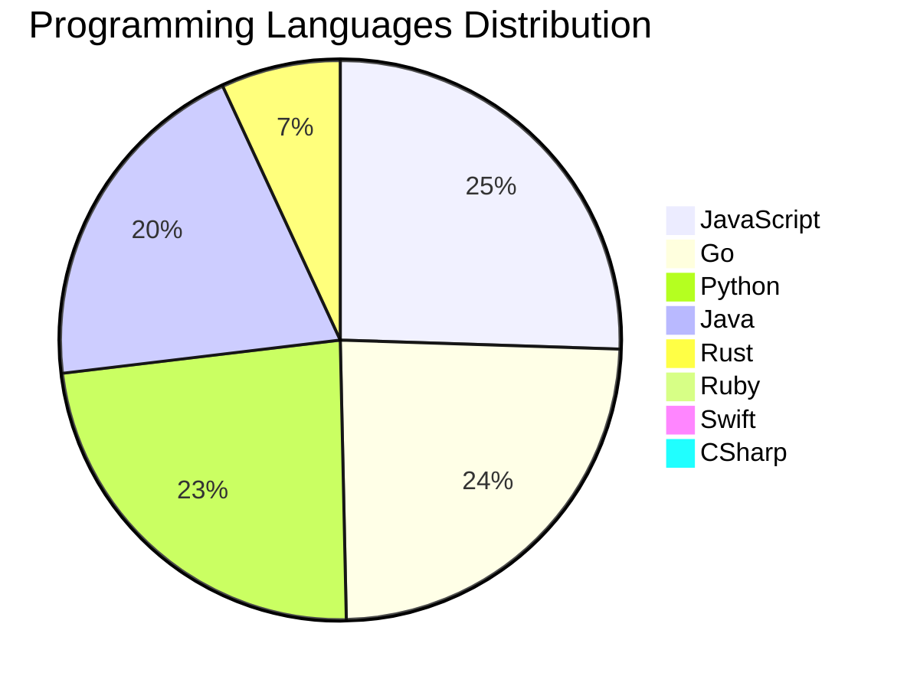

<div align="center">

# 📰 DevTech Auto News

**Your always-fresh digest of developer & AI tech news — curated automatically, around the clock.**


Aggregating [Dev.to](https://dev.to) · [Hacker News](https://news.ycombinator.com) · [GitHub Trending](https://github.com/trending) · [Lobste.rs](https://lobste.rs) · [Stack Overflow](https://stackoverflow.com) · [TechCrunch](https://techcrunch.com) · [freeCodeCamp](https://www.freecodecamp.org/news) — refreshed by GitHub Actions around the clock.

**[📰 Headlines](#-latest-headlines) · [💡 Interview Prep](#-interview-question-of-the-hour) · [📊 Statistics](#-statistics) · [⚙️ How It Works](#%EF%B8%8F-how-it-works)**

</div>

---

## 📰 Latest Headlines

> 🕐 Edition of **2026-07-13 22:00 CAT** — refreshed automatically, all day, every day.

### ✨ Featured Stories

<table>
<tr>
  <td align="center" width="33%">
    <a href="https://dev.to/ben/the-myth-of-the-post-documentation-era-39al">
      
      <br/>
      <b>The Myth of the Post-Documentation Era</b>
    </a>
    <br/>
    <sub>Dev.to</sub>
  </td>
  <td align="center" width="33%">
    <a href="https://dev.to/gde/porting-gemma-4-2b-4b-12b-to-aws-inferentia2-2jnf">
      
      <br/>
      <b>Porting Gemma-4 (2B / 4B / 12B) to AWS Inferentia2</b>
    </a>
    <br/>
    <sub>Dev.to</sub>
  </td>
  <td align="center" width="33%">
    <a href="https://dev.to/ben/a-lot-of-good-points-here-httpsantirezcomnews169-417f">
      
      <br/>
      <b>A lot of good points here https://antirez.com/news...</b>
    </a>
    <br/>
    <sub>Dev.to</sub>
  </td>
</tr>
<tr>
  <td align="center" width="33%">
    <a href="https://dev.to/ben/meme-monday-4eda">
      
      <br/>
      <b>Meme Monday</b>
    </a>
    <br/>
    <sub>Dev.to</sub>
  </td>
  <td align="center" width="33%">
    <a href="https://dev.to/gde/building-an-agentic-finops-platform-development-environment-setup-google-antigravity-mcps-and-4c43">
      
      <br/>
      <b>Building an Agentic FinOps Platform — Development ...</b>
    </a>
    <br/>
    <sub>Dev.to</sub>
  </td>
  <td align="center" width="33%">
    <a href="https://dev.to/gde/2b-gemma-4-qat-deployment-with-gce-nvidia-l4-mcp-and-antigravity-cli-4p7">
      
      <br/>
      <b>2B Gemma 4 QAT Deployment with GCE, NVIDIA L4, MCP...</b>
    </a>
    <br/>
    <sub>Dev.to</sub>
  </td>
</tr>
</table>


### 🗞️ Top Stories

| # | Headline | Source |
|---|----------|--------|
| 1 | [The Myth of the Post-Documentation Era](https://dev.to/ben/the-myth-of-the-post-documentation-era-39al) | Dev.to |
| 2 | [Porting Gemma-4 (2B / 4B / 12B) to AWS Inferentia2](https://dev.to/gde/porting-gemma-4-2b-4b-12b-to-aws-inferentia2-2jnf) | Dev.to |
| 3 | [A lot of good points here https://antirez.com/news/169](https://dev.to/ben/a-lot-of-good-points-here-httpsantirezcomnews169-417f) | Dev.to |
| 4 | [Meme Monday](https://dev.to/ben/meme-monday-4eda) | Dev.to |
| 5 | [Building an Agentic FinOps Platform — Development Environment Setup, Google Antigravity, MCPs and Skills, and ADK Bootstrapping with Agents CLI](https://dev.to/gde/building-an-agentic-finops-platform-development-environment-setup-google-antigravity-mcps-and-4c43) | Dev.to |
| 6 | [2B Gemma 4 QAT Deployment with GCE, NVIDIA L4, MCP, and Antigravity CLI](https://dev.to/gde/2b-gemma-4-qat-deployment-with-gce-nvidia-l4-mcp-and-antigravity-cli-4p7) | Dev.to |
| 7 | [Stop Copy-Pasting `dns:` Blocks: Introducing Transparent DNS Injection in Gubernator](https://dev.to/gde/stop-copy-pasting-dns-blocks-introducing-transparent-dns-injection-in-gubernator-ad4) | Dev.to |
| 8 | [Debugging Deployments with Gemma 2B, TPU v6e-1, MCP, and Antigravity CLI](https://dev.to/gde/debugging-deployments-with-gemma-2b-tpu-v6e-1-mcp-and-antigravity-cli-3hh3) | Dev.to |
| 9 | [[GCP Billing & Vertex AI] Solving Gemini Cost Allocation in a Single Project: Vertex AI Dynamic Billing Labels in Action](https://dev.to/gde/gcp-billing-vertex-ai-solving-gemini-cost-allocation-in-a-single-project-vertex-ai-dynamic-5aok) | Dev.to |
| 10 | [Should I quit IT or just live through the burnout?](https://dev.to/klaudiagrz/should-i-quit-it-or-just-live-through-the-burnout-1gng) | Dev.to |
| 11 | [Congrats to the June Solstice Game Jam Winners!](https://dev.to/devteam/congrats-to-the-june-solstice-game-jam-winners-46c0) | Dev.to |
| 12 | [Debugging Deployments with Gemma 4B, TPU v6e-4, MCP, and Antigravity CLI](https://dev.to/gde/debugging-deployments-with-gemma-4b-tpu-v6e-4-mcp-and-antigravity-cli-1l82) | Dev.to |
| 13 | [MCP Configuration for Looker with Antigravity CLI](https://dev.to/gde/mcp-configuration-for-looker-with-antigravity-cli-504d) | Dev.to |
| 14 | [Top 7 Featured DEV Posts of the Week](https://dev.to/devteam/top-7-featured-dev-posts-of-the-week-144b) | Dev.to |
| 15 | [Return on Attention: Why AI Code Reviews Are Wearing Us Out](https://dev.to/cseeman/return-on-attention-why-ai-code-reviews-are-wearing-us-out-2hh0) | Dev.to |
| 16 | [Your Career Matters. So Does the Person Building It.](https://dev.to/hemapriya_kanagala/your-career-matters-so-does-the-person-building-it-2jle) | Dev.to |
| 17 | [TPU Deployments with Gemma 31B, v6e-4, and Antigravity CLI](https://dev.to/gde/tpu-deployments-with-gemma-31b-v6e-4-and-antigravity-cli-50ia) | Dev.to |
| 18 | [MCP Configuration for Looker with Claude Code](https://dev.to/gde/mcp-configuration-for-looker-with-claude-code-21jh) | Dev.to |
| 19 | [✨Cool Effects, TTS, and Fun Animations (AI Avatar v15: VS Code and Chrome Extension)](https://dev.to/webdeveloperhyper/cool-effects-tts-and-fun-animations-ai-avatar-v15-vs-code-and-chrome-extension-3oec) | Dev.to |
| 20 | [Two-day hackathon kicks off AI Engineer World’s Fair](https://dev.to/dailycontext/two-day-hackathon-kicks-off-ai-engineer-worlds-fair-2l1d) | Dev.to |

<sub>Last fetched: Mon, 13 Jul 2026 22:59:33 CAT</sub>


---

## 💡 Interview Question of the Hour

> Sharpen your skills — new questions selected on every update. Try answering before opening the hint!

**1. `DataStructures` — Find the median of two sorted arrays**

&nbsp;&nbsp;&nbsp;&nbsp;🎯 Hard · 🏷 arrays, binary search

<details>
<summary>&nbsp;&nbsp;&nbsp;&nbsp;💡 Show hint</summary>

> Binary search, partition, time complexity O(log(min(m,n)))

</details>

**2. `Python` — Implement a context manager using __enter__ and __exit__**

&nbsp;&nbsp;&nbsp;&nbsp;🎯 Hard · 🏷 context managers, resource management

<details>
<summary>&nbsp;&nbsp;&nbsp;&nbsp;💡 Show hint</summary>

> with statement, setup/teardown, exception handling

</details>

**3. `React` — Explain the difference between state and props**

&nbsp;&nbsp;&nbsp;&nbsp;🎯 Easy · 🏷 data flow, components

<details>
<summary>&nbsp;&nbsp;&nbsp;&nbsp;💡 Show hint</summary>

> Ownership, mutability, data flow direction

</details>


---

## 📊 Statistics

#### 🗂 Articles by Category

| Category | Articles | Share | |
|----------|---------:|------:|---|
| **AI** | 76 | 41.3% | `████████████████████` |
| **Tools** | 46 | 25.0% | `████████████░░░░░░░░` |
| **JavaScript** | 37 | 20.1% | `██████████░░░░░░░░░░` |
| **Python** | 34 | 18.5% | `█████████░░░░░░░░░░░` |
| **Cloud** | 22 | 12.0% | `██████░░░░░░░░░░░░░░` |
| **DevOps** | 15 | 8.2% | `████░░░░░░░░░░░░░░░░` |
| **Security** | 15 | 8.2% | `████░░░░░░░░░░░░░░░░` |
| **WebDev** | 13 | 7.1% | `███░░░░░░░░░░░░░░░░░` |
| **Database** | 4 | 2.2% | `█░░░░░░░░░░░░░░░░░░░` |
| **Mobile** | 2 | 1.1% | `█░░░░░░░░░░░░░░░░░░░` |

<sub>Articles can match more than one category, so shares may sum to over 100%.</sub>


#### 📡 Articles by Source

| Source | Articles |
|--------|---------:|
| Dev.to | 60 |
| HackerNews | 49 |
| GitHub | 25 |
| Lobste.rs | 10 |
| StackOverflow | 20 |
| TechCrunch | 10 |
| freeCodeCamp | 10 |


#### 💻 Programming Language Trends

```
JavaScript      ██████████████████████████████ 24.8%
Go              ████████████████████████████ 23.5%
Python          ████████████████████████████ 22.8%
Java            ████████████████████████ 19.5%
Rust            ████████ 6.7%
Ruby            █ 0.7%
Swift           █ 0.7%
CSharp          █ 0.7%
PHP             █ 0.7%

```




#### 🏷 Trending Topics

            


---

## ⚙️ How It Works

This repository is a fully automated news pipeline. On every run, GitHub Actions:

1. **Fetches** the latest articles from seven sources: Dev.to, Hacker News, GitHub Trending, Lobste.rs, Stack Overflow, TechCrunch, and freeCodeCamp
2. **Deduplicates and categorizes** them across 10+ topics using keyword matching
3. **Extracts cover images** and computes language & category statistics
4. **Rebuilds this README** and appends everything to the [full archive](./data/news_log.md)
5. **Commits and pushes** the result — no human intervention needed

<details>
<summary><b>🚀 Run it yourself</b></summary>

```bash
git clone https://github.com/Derrick-MUGISHA/github-activity-bot.git
cd github-activity-bot
npm install
npm start
```

Fork the repo, enable GitHub Actions, and you have your own self-updating news feed.

</details>

<details>
<summary><b>📚 Data & resources</b></summary>

- [Full news archive](./data/news_log.md) — complete history of every fetched article
- [Statistics](./data/stats.json) — raw stats data (JSON)
- [Categorized articles](./data/categorized.json) — articles grouped by topic
- [Interview question bank](./data/interview_questions.json) — the full question set

</details>

---

## 🤝 Contributing

Ideas for new sources, categories, or interview questions are welcome — [open an issue](https://github.com/Derrick-MUGISHA/github-activity-bot/issues/new) or submit a pull request.

## 📄 License

Released under the [MIT License](https://opensource.org/licenses/MIT) — free to use, fork, and modify.

---

<div align="center">
  <sub>🤖 Last automated update: <b>Mon, 13 Jul 2026 20:59:33 GMT</b></sub><br/>
  <sub>Powered by GitHub Actions · Built with ❤️ by <a href="https://github.com/Derrick-MUGISHA">Derrick MUGISHA</a></sub>
</div>
