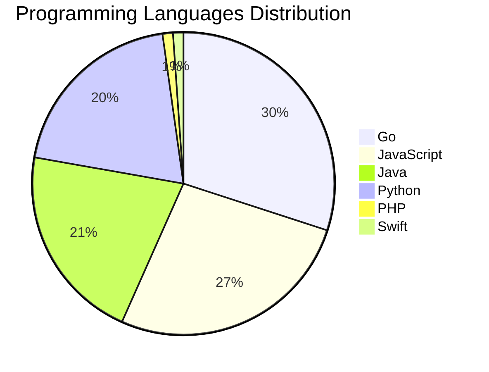

# 🚀 DevTech Auto News - Enhanced Edition


**DevTech Auto News Enhanced** is an advanced automated bot that aggregates trending topics in **AI**, **Web Development**, **Mobile**, **Cloud**, **DevOps**, and more from multiple sources including:

- 📰 [Dev.to](https://dev.to) - Developer community articles
- 🔥 [HackerNews](https://news.ycombinator.com) - Tech news discussions  
- 💻 [GitHub Trending](https://github.com/trending) - Trending repositories
- 🎯 Curated Interview Questions from multiple languages

## ✨ Features

✅ **Multi-Source Aggregation**: Combines articles from Dev.to, HackerNews, and GitHub  
✅ **Smart Categorization**: Automatically categorizes content into 10+ topics  
✅ **Image Support**: Displays cover images for visual appeal  
✅ **Pagination**: Fetches 50+ articles per update with deduplication  
✅ **Language Statistics**: Tracks programming language trends with charts  
✅ **Interview Questions**: Daily coding interview questions in multiple languages  
✅ **GitHub Actions**: Runs every 15 minutes automatically  

---

## 📊 Statistics Dashboard

### 📊 Articles by Category

**AI**: 🟦🟦🟦🟦🟦🟦🟦🟦🟦🟦🟦🟦🟦🟦🟦🟦🟦🟦🟦🟦 44 (41.9%)

**Tools**: 🟦🟦🟦🟦🟦🟦🟦🟦🟦🟦🟦🟦 26 (24.8%)

**JavaScript**: 🟦🟦🟦🟦🟦🟦🟦🟦🟦🟦🟦 24 (22.9%)

**Python**: 🟦🟦🟦🟦🟦🟦🟦🟦 18 (17.1%)

**Cloud**: 🟦🟦🟦🟦🟦🟦 13 (12.4%)

**Security**: 🟦🟦🟦🟦 9 (8.6%)

**DevOps**: 🟦🟦 4 (3.8%)

**WebDev**: 🟦 3 (2.9%)

**Mobile**: 🟦 2 (1.9%)

**Database**: 🟦 2 (1.9%)


### 📡 Sources

- **Dev.to**: 60 articles
- **HackerNews**: 30 articles
- **GitHub**: 15 articles


### 💻 Programming Language Trends

```
Go              ██████████████████████████████ 30.0 (30.0%)
JavaScript      ███████████████████████████ 26.7 (26.7%)
Java            █████████████████████ 21.1 (21.1%)
Python          ████████████████████ 20.0 (20.0%)
PHP             █ 1.1 (1.1%)
Swift           █ 1.1 (1.1%)

```




### 🏷️ Trending Tags

               


---

## 🛠️ How It Works

1. **Multi-Source Fetch**: Pulls from Dev.to (2 pages), HackerNews (3 topics), GitHub (3 languages)
2. **Smart Filter**: Uses keyword matching across 10+ categories  
3. **Deduplication**: Removes duplicate URLs  
4. **Image Extraction**: Captures cover images when available  
5. **Statistics**: Generates language trends and category breakdowns  
6. **Update Files**: Regenerates README and appends to comprehensive log  

---

## 📦 Installation & Usage

```bash
# Clone the repository
git clone https://github.com/Derrick-MUGISHA/github-activity-bot.git
cd github-activity-bot

# Install dependencies  
npm install

# Run manually
npm start

# Test mode
npm run test
```

---


# 🚀 DevTech Auto News - Enhanced Edition

## 📅 Latest Updates (2026-04-26 16:00 CAT)


### 🖼️ Featured Articles

<table>
<tr>
  <td align="center" width="33%">
    <a href="https://dev.to/devteam/what-was-your-win-this-week-8ep">
      
      <br/>
      <b>What was your win this week!?</b>
    </a>
    <br/>
    <sub>Dev.to</sub>
  </td>
  <td align="center" width="33%">
    <a href="https://dev.to/backboardio/the-hidden-challenge-of-multi-llm-context-management-1pbh">
      
      <br/>
      <b>The Hidden Challenge of Multi-LLM Context Manageme...</b>
    </a>
    <br/>
    <sub>Dev.to</sub>
  </td>
  <td align="center" width="33%">
    <a href="https://dev.to/gde/instructions-skills-tools-how-google-embedded-skills-into-every-layer-of-its-agent-stack-5415">
      
      <br/>
      <b>Instructions. Skills. Tools. How Google Embedded S...</b>
    </a>
    <br/>
    <sub>Dev.to</sub>
  </td>
</tr>
<tr>
  <td align="center" width="33%">
    <a href="https://dev.to/coderabbitai/how-to-use-ai-to-identify-and-fix-security-vulnerabilities-in-your-codebase-4na2">
      
      <br/>
      <b>How to use AI to identify and fix security vulnera...</b>
    </a>
    <br/>
    <sub>Dev.to</sub>
  </td>
  <td align="center" width="33%">
    <a href="https://dev.to/devteam/tune-in-and-join-the-google-cloud-next-26-writing-challenge-1000-in-prizes-21bd">
      
      <br/>
      <b>Tune In and Join the Google Cloud NEXT '26 Writing...</b>
    </a>
    <br/>
    <sub>Dev.to</sub>
  </td>
  <td align="center" width="33%">
    <a href="https://dev.to/dalenguyen/building-mcp-apps-with-angular-3849">
      
      <br/>
      <b>Building MCP Apps with Angular</b>
    </a>
    <br/>
    <sub>Dev.to</sub>
  </td>
</tr>
</table>


### 📰 Top Headlines

- [What was your win this week!?](https://dev.to/devteam/what-was-your-win-this-week-8ep) _[Dev.to]_
- [The Hidden Challenge of Multi-LLM Context Management](https://dev.to/backboardio/the-hidden-challenge-of-multi-llm-context-management-1pbh) _[Dev.to]_
- [Instructions. Skills. Tools. How Google Embedded Skills Into Every Layer of Its Agent Stack](https://dev.to/gde/instructions-skills-tools-how-google-embedded-skills-into-every-layer-of-its-agent-stack-5415) _[Dev.to]_
- [How to use AI to identify and fix security vulnerabilities in your codebase](https://dev.to/coderabbitai/how-to-use-ai-to-identify-and-fix-security-vulnerabilities-in-your-codebase-4na2) _[Dev.to]_
- [Tune In and Join the Google Cloud NEXT '26 Writing Challenge: $1,000 in Prizes!](https://dev.to/devteam/tune-in-and-join-the-google-cloud-next-26-writing-challenge-1000-in-prizes-21bd) _[Dev.to]_
- [Building MCP Apps with Angular](https://dev.to/dalenguyen/building-mcp-apps-with-angular-3849) _[Dev.to]_
- [How to make OpenClaw just work](https://dev.to/angeluz07/how-to-make-openclaw-just-work-2lm1) _[Dev.to]_
- [Remade the 1991 Classic "Gorillas" in Python—and Survived the Snapcraft Journey](https://dev.to/davdomin/remade-the-1991-classic-gorillas-in-python-and-survived-the-snapcraft-journey-2nfp) _[Dev.to]_
- [How to Filter and Sort Posts by Custom Field Value Using JetSmartFilters + Bricks Builder](https://dev.to/muazzami/how-to-filter-and-sort-posts-by-custom-field-value-using-jetsmartfilters-bricks-builder-57an) _[Dev.to]_
- [I built a shell script that sets up your entire AI coding agent workspace in 2 minutes](https://dev.to/shad_tech/i-built-a-shell-script-that-sets-up-your-entire-ai-coding-agent-workspace-in-2-minutes-13ep) _[Dev.to]_
- [Why LLM Reasoning Is Breaking AI Infrastructure (And How to Fix It)](https://dev.to/backboardio/why-llm-reasoning-is-breaking-ai-infrastructure-and-how-to-fix-it-2aik) _[Dev.to]_
- [Boring code is an organizational tell](https://dev.to/simme/boring-code-is-an-organizational-tell-4gca) _[Dev.to]_
- [I built a minimal timing game for iOS without retention mechanics. Here’s why](https://dev.to/fjmorant/i-built-a-mobile-game-without-retention-mechanics-heres-why-4941) _[Dev.to]_
- [How I Built an AI Agent That Investigates Cloud Bill Spikes (Architecture Inside)](https://dev.to/nash_matrixgard/how-i-built-an-ai-agent-that-investigates-cloud-bill-spikes-architecture-inside-113p) _[Dev.to]_
- [Less Than Six Hours From Idea to Dev Release: Building a new Drupal Canvas SDC Module With AI, Deliberately](https://dev.to/jcandan/i-built-a-new-drupal-canvas-sdc-module-with-ai-in-under-6-hours-and-the-review-process-still-59b8) _[Dev.to]_
- [I Built OxyTrack: Turning Small Daily Habits Into Real Environmental Impact 🌱](https://dev.to/ajitekom/i-built-oxytrack-turning-small-daily-habits-into-real-environmental-impact-1nj9) _[Dev.to]_
- [Installing pygame for IDLE on Mac](https://dev.to/paxfeline/installing-pygame-for-idle-on-mac-28kb) _[Dev.to]_
- [The Vonage Dev Discussion: Making mistakes](https://dev.to/vonagedev/the-vonage-dev-discussion-making-mistakes-32mc) _[Dev.to]_
- [Vercel Hack: Why You Need to Rotate Your "Non-Sensitive" Environment Variables Today](https://dev.to/jon_at_backboardio/vercel-hack-why-you-need-to-rotate-your-non-sensitive-environment-variables-today-25mh) _[Dev.to]_
- [Display and test openapi.yaml file](https://dev.to/gabrielweidmann/display-and-test-openapiyaml-file-53h9) _[Dev.to]_

_Last automated update: Sun, 26 Apr 2026 16:06:36 CAT_


## 💡 Daily Interview Questions

_Sharpen your skills with these curated questions_

### 1. Database: Design a database schema for a social media platform

**Difficulty**: Hard | **Topics**: design, scalability

<details>
<summary>💡 Hint</summary>

Users, posts, relationships, indexes, partitioning

</details>

### 2. Database: Explain database indexing and when to use it

**Difficulty**: Medium | **Topics**: optimization, performance

<details>
<summary>💡 Hint</summary>

B-tree, trade-offs, query performance

</details>

### 3. Database: What is database normalization and denormalization?

**Difficulty**: Medium | **Topics**: design, optimization

<details>
<summary>💡 Hint</summary>

Normal forms, redundancy, performance trade-offs

</details>


---

## 📚 Resources

- [Full News Archive](./data/news_log.md) - Complete history of all fetched articles
- [Statistics JSON](./data/stats.json) - Raw statistics data
- [Categorized Data](./data/categorized.json) - Articles organized by category
- [Interview Questions](./data/interview_questions.json) - Complete question bank

---

## 🤝 Contributing

Want to add more sources, categories, or interview questions? Feel free to:

1. Fork this repository
2. Add your improvements
3. Submit a pull request

---

## 📄 License

MIT License - Feel free to use and modify!

---

<p align="center">
  <b>Last automated update: Sun, 26 Apr 2026 14:06:36 GMT</b><br/>
  <sub>Powered by GitHub Actions | Made with ❤️ for developers</sub>
</p>

---

## 🔗 Quick Links

- [View Workflow](https://github.com/Derrick-MUGISHA/github-activity-bot/actions)
- [Report Issue](https://github.com/Derrick-MUGISHA/github-activity-bot/issues)
- [Suggest Feature](https://github.com/Derrick-MUGISHA/github-activity-bot/issues/new)
