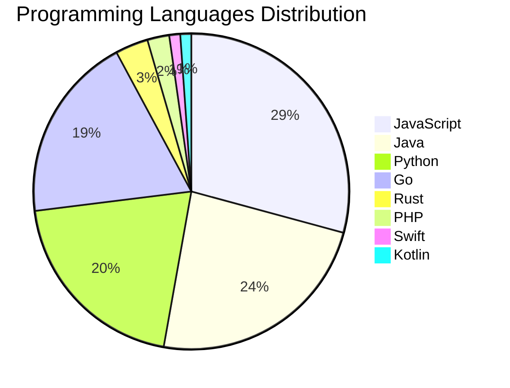

# 🚀 DevTech Auto News - Enhanced Edition


**DevTech Auto News Enhanced** is an advanced automated bot that aggregates trending topics in **AI**, **Web Development**, **Mobile**, **Cloud**, **DevOps**, and more from multiple sources including:

- 📰 [Dev.to](https://dev.to) - Developer community articles
- 🔥 [HackerNews](https://news.ycombinator.com) - Tech news discussions  
- 💻 [GitHub Trending](https://github.com/trending) - Trending repositories
- 🎯 Curated Interview Questions from multiple languages

## ✨ Features

✅ **Multi-Source Aggregation**: Combines articles from Dev.to, HackerNews, and GitHub  
✅ **Smart Categorization**: Automatically categorizes content into 10+ topics  
✅ **Image Support**: Displays cover images for visual appeal  
✅ **Pagination**: Fetches 50+ articles per update with deduplication  
✅ **Language Statistics**: Tracks programming language trends with charts  
✅ **Interview Questions**: Daily coding interview questions in multiple languages  
✅ **GitHub Actions**: Runs every 15 minutes automatically  

---

## 📊 Statistics Dashboard

### 📊 Articles by Category

**AI**: 🟦🟦🟦🟦🟦🟦🟦🟦🟦🟦🟦🟦🟦🟦🟦🟦🟦🟦🟦🟦 47 (45.6%)

**Tools**: 🟦🟦🟦🟦🟦🟦🟦🟦🟦🟦🟦🟦 29 (28.2%)

**JavaScript**: 🟦🟦🟦🟦🟦🟦🟦🟦🟦🟦🟦 26 (25.2%)

**Python**: 🟦🟦🟦🟦🟦🟦🟦🟦 18 (17.5%)

**WebDev**: 🟦🟦 5 (4.9%)

**DevOps**: 🟦🟦 4 (3.9%)

**Cloud**: 🟦🟦 4 (3.9%)

**Security**: 🟦🟦 4 (3.9%)

**Database**: 🟦 2 (1.9%)

**Mobile**:  1 (1.0%)


### 📡 Sources

- **Dev.to**: 58 articles
- **HackerNews**: 30 articles
- **GitHub**: 15 articles


### 💻 Programming Language Trends

```
JavaScript      ██████████████████████████████ 28.9 (28.9%)
Java            ████████████████████████ 23.3 (23.3%)
Python          █████████████████████ 20.0 (20.0%)
Go              ████████████████████ 18.9 (18.9%)
Rust            ███ 3.3 (3.3%)
PHP             ██ 2.2 (2.2%)
Swift           █ 1.1 (1.1%)
Kotlin          █ 1.1 (1.1%)
CSharp          █ 1.1 (1.1%)

```




### 🏷️ Trending Tags

               


---

## 🛠️ How It Works

1. **Multi-Source Fetch**: Pulls from Dev.to (2 pages), HackerNews (3 topics), GitHub (3 languages)
2. **Smart Filter**: Uses keyword matching across 10+ categories  
3. **Deduplication**: Removes duplicate URLs  
4. **Image Extraction**: Captures cover images when available  
5. **Statistics**: Generates language trends and category breakdowns  
6. **Update Files**: Regenerates README and appends to comprehensive log  

---

## 📦 Installation & Usage

```bash
# Clone the repository
git clone https://github.com/Derrick-MUGISHA/github-activity-bot.git
cd github-activity-bot

# Install dependencies  
npm install

# Run manually
npm start

# Test mode
npm run test
```

---


# 🚀 DevTech Auto News - Enhanced Edition

## 📅 Latest Updates (2026-03-01 22:00 CAT)


### 🖼️ Featured Articles

<table>
<tr>
  <td align="center" width="33%">
    <a href="https://dev.to/alistairjcbrown/i-built-a-film-club-discovery-tool-for-londons-cinema-community-2md">
      
      <br/>
      <b>Making London's hidden film clubs discoverable</b>
    </a>
    <br/>
    <sub>Dev.to</sub>
  </td>
  <td align="center" width="33%">
    <a href="https://dev.to/agp_marka_62a62d1cdadad70/why-i-spent-my-weekend-building-a-cyber-immune-system-for-students-4682">
      
      <br/>
      <b>Why I spent my weekend building a "Cyber-Immune Sy...</b>
    </a>
    <br/>
    <sub>Dev.to</sub>
  </td>
  <td align="center" width="33%">
    <a href="https://dev.to/luzero/bringing-up-an-ampereone-system-1ln6">
      
      <br/>
      <b>Bringing up an AmpereOne system</b>
    </a>
    <br/>
    <sub>Dev.to</sub>
  </td>
</tr>
<tr>
  <td align="center" width="33%">
    <a href="https://dev.to/hamizulfaiz/why-i-stopped-overthinking-the-livewire-vs-inertia-debate-and-how-to-pick-one-5h67">
      
      <br/>
      <b>Why I stopped overthinking the Livewire vs. Inerti...</b>
    </a>
    <br/>
    <sub>Dev.to</sub>
  </td>
  <td align="center" width="33%">
    <a href="https://dev.to/devteam/what-was-your-win-this-week-5h33">
      
      <br/>
      <b>What was your win this week?!</b>
    </a>
    <br/>
    <sub>Dev.to</sub>
  </td>
  <td align="center" width="33%">
    <a href="https://dev.to/dionysos/how-do-you-actually-know-if-ai-is-working-on-your-team-2b02">
      
      <br/>
      <b>How Do You Actually Know If AI Is Working On Your ...</b>
    </a>
    <br/>
    <sub>Dev.to</sub>
  </td>
</tr>
</table>


### 📰 Top Headlines

- [Making London's hidden film clubs discoverable](https://dev.to/alistairjcbrown/i-built-a-film-club-discovery-tool-for-londons-cinema-community-2md) _[Dev.to]_
- [Why I spent my weekend building a "Cyber-Immune System" for students](https://dev.to/agp_marka_62a62d1cdadad70/why-i-spent-my-weekend-building-a-cyber-immune-system-for-students-4682) _[Dev.to]_
- [Bringing up an AmpereOne system](https://dev.to/luzero/bringing-up-an-ampereone-system-1ln6) _[Dev.to]_
- [Why I stopped overthinking the Livewire vs. Inertia debate (and how to pick one)](https://dev.to/hamizulfaiz/why-i-stopped-overthinking-the-livewire-vs-inertia-debate-and-how-to-pick-one-5h67) _[Dev.to]_
- [What was your win this week?!](https://dev.to/devteam/what-was-your-win-this-week-5h33) _[Dev.to]_
- [How Do You Actually Know If AI Is Working On Your Team?](https://dev.to/dionysos/how-do-you-actually-know-if-ai-is-working-on-your-team-2b02) _[Dev.to]_
- [The Token Economy](https://dev.to/dannwaneri/the-token-economy-3cd9) _[Dev.to]_
- [Happening Now: DEV Weekend Challenge!! Submissions due March 2 at 7:59am UTC.](https://dev.to/devteam/happening-now-dev-weekend-challenge-submissions-due-march-2-at-759am-utc-5fg8) _[Dev.to]_
- [AI Ate the Homework: What Communities Are Actually For Now](https://dev.to/bekahhw/ai-ate-the-homework-what-communities-are-actually-for-now-11hi) _[Dev.to]_
- [Using tox to Test a Django App Across Multiple Django Versions](https://dev.to/djangotricks/using-tox-to-test-a-django-app-across-multiple-django-versions-28g9) _[Dev.to]_
- [Automatic cross-platform testing: part 7: 32 bit, again](https://dev.to/drhyde/automatic-cross-platform-testing-part-7-32-bit-again-1ipf) _[Dev.to]_
- [An App where you can Train your Own Hand Pose Model for your Project! 🤌](https://dev.to/francistrdev/an-app-where-you-can-train-your-own-hand-pose-model-for-your-project-58ib) _[Dev.to]_
- [Data Pseudonymization: When You Can't Just Delete Everything](https://dev.to/manualwise/data-pseudonymization-when-you-cant-just-delete-everything-4goa) _[Dev.to]_
- [Want your agent to write better code with fewer tokens? Ask the Google AI Team about Agent Skills!](https://dev.to/devteam/want-your-agent-to-write-better-code-with-fewer-tokens-ask-the-google-ai-team-about-agent-skills-44pg) _[Dev.to]_
- [Stop Burning Tokens on Redundant Context: Why your AGENTS.md is failing](https://dev.to/aileenvl/stop-burning-tokens-on-redundant-context-why-your-agentsmd-is-failing-3cpn) _[Dev.to]_
- [claude-sandbox: Yet another sandboxing tool for Claude Code on macOS](https://dev.to/kohkimakimoto/claude-sandbox-yet-another-sandboxing-tool-for-claude-code-on-macos-o6n) _[Dev.to]_
- [🐾 FurEver Log — The App I Built After Losing Abu](https://dev.to/siti_aisyahmatzainal_73/furever-log-the-app-i-built-after-losing-abu-4agn) _[Dev.to]_
- [Stop Wasting Context](https://dev.to/prathamudeshmukh/stop-wasting-context-34b3) _[Dev.to]_
- [Static Imports Are Undermining JavaScript’s Isomorphism](https://dev.to/flancer64/static-imports-are-undermining-javascripts-isomorphism-25nm) _[Dev.to]_
- [Join the "Built with Google Gemini: Writing Challenge" Presented by Major League Hacking (MLH). Win a Raspberry Pi AI Kit!](https://dev.to/devteam/join-the-built-with-google-gemini-writing-challenge-presented-by-major-league-hacking-mlh-win-17pk) _[Dev.to]_

_Last automated update: Sun, 01 Mar 2026 22:48:30 CAT_


## 💡 Daily Interview Questions

_Sharpen your skills with these curated questions_

### 1. NodeJS: Explain middleware in Express.js

**Difficulty**: Easy | **Topics**: express, architecture

<details>
<summary>💡 Hint</summary>

Request/response cycle, next(), chain of functions

</details>

### 2. DataStructures: Implement a function to reverse a linked list

**Difficulty**: Medium | **Topics**: linked lists, pointers

<details>
<summary>💡 Hint</summary>

Iterative or recursive, three pointers

</details>

### 3. NodeJS: How do you handle errors in async/await?

**Difficulty**: Medium | **Topics**: error handling, async

<details>
<summary>💡 Hint</summary>

try/catch, .catch(), error middleware

</details>


---

## 📚 Resources

- [Full News Archive](./data/news_log.md) - Complete history of all fetched articles
- [Statistics JSON](./data/stats.json) - Raw statistics data
- [Categorized Data](./data/categorized.json) - Articles organized by category
- [Interview Questions](./data/interview_questions.json) - Complete question bank

---

## 🤝 Contributing

Want to add more sources, categories, or interview questions? Feel free to:

1. Fork this repository
2. Add your improvements
3. Submit a pull request

---

## 📄 License

MIT License - Feel free to use and modify!

---

<p align="center">
  <b>Last automated update: Sun, 01 Mar 2026 20:48:30 GMT</b><br/>
  <sub>Powered by GitHub Actions | Made with ❤️ for developers</sub>
</p>

---

## 🔗 Quick Links

- [View Workflow](https://github.com/Derrick-MUGISHA/github-activity-bot/actions)
- [Report Issue](https://github.com/Derrick-MUGISHA/github-activity-bot/issues)
- [Suggest Feature](https://github.com/Derrick-MUGISHA/github-activity-bot/issues/new)
