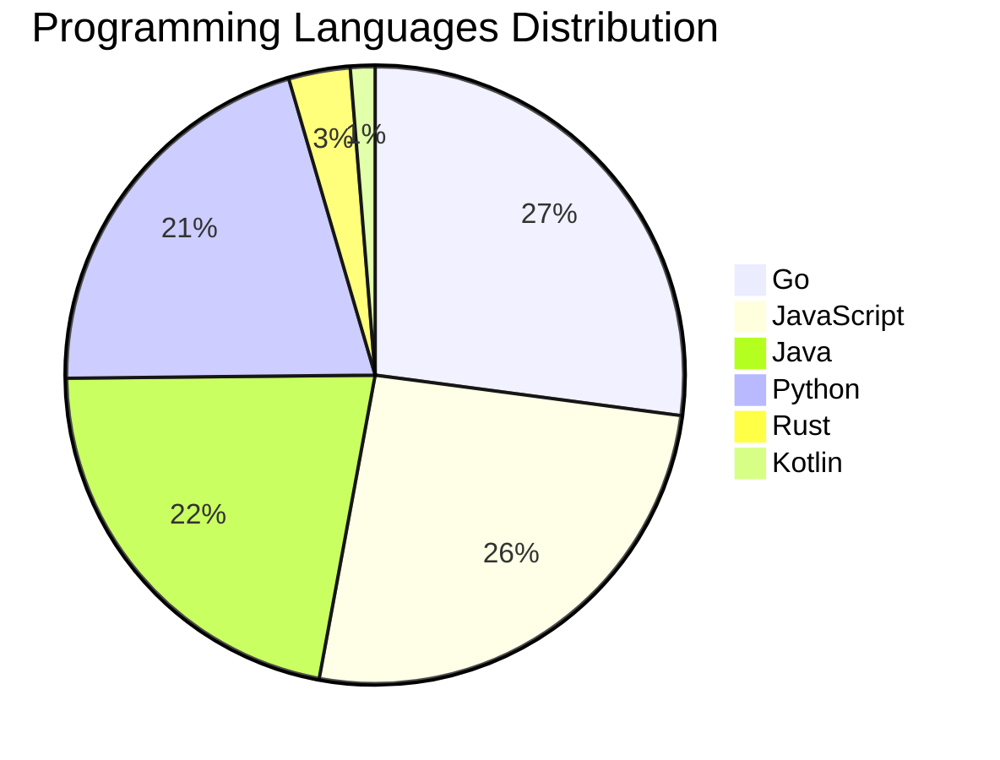

<div align="center">

# 📰 DevTech Auto News

**Your always-fresh digest of developer & AI tech news — curated automatically, around the clock.**


Aggregating [Dev.to](https://dev.to) · [Hacker News](https://news.ycombinator.com) · [GitHub Trending](https://github.com/trending) · [Lobste.rs](https://lobste.rs) · [Stack Overflow](https://stackoverflow.com) · [TechCrunch](https://techcrunch.com) · [freeCodeCamp](https://www.freecodecamp.org/news) — refreshed by GitHub Actions around the clock.

**[📰 Headlines](#-latest-headlines) · [💡 Interview Prep](#-interview-question-of-the-hour) · [📊 Statistics](#-statistics) · [⚙️ How It Works](#%EF%B8%8F-how-it-works)**

</div>

---

## 📰 Latest Headlines

> 🕐 Edition of **2026-08-07 8:00 CAT** — refreshed automatically, all day, every day.

### ✨ Featured Stories

<table>
<tr>
  <td align="center" width="33%">
    <a href="https://dev.to/thepracticaldev/general-challenge-updates-moving-forward-5h39">
      
      <br/>
      <b>General Challenge Updates Moving Forward</b>
    </a>
    <br/>
    <sub>Dev.to</sub>
  </td>
  <td align="center" width="33%">
    <a href="https://dev.to/gde/serving-gemma-4-2b-on-a-single-tpu-v5e-chip-with-mcp-and-antigravity-cli-33l8">
      
      <br/>
      <b>Serving Gemma 4 2B on a Single TPU v5e Chip with M...</b>
    </a>
    <br/>
    <sub>Dev.to</sub>
  </td>
  <td align="center" width="33%">
    <a href="https://dev.to/kirodotdev/kiro-crew-the-next-frontier-52h">
      
      <br/>
      <b>Kiro Crew: The Next Frontier</b>
    </a>
    <br/>
    <sub>Dev.to</sub>
  </td>
</tr>
<tr>
  <td align="center" width="33%">
    <a href="https://dev.to/gde/amazon-bedrock-agents-orchestrating-google-adk-over-a2a-5c2b">
      
      <br/>
      <b>Amazon Bedrock Agents Orchestrating Google ADK ove...</b>
    </a>
    <br/>
    <sub>Dev.to</sub>
  </td>
  <td align="center" width="33%">
    <a href="https://dev.to/jenueldev/how-to-build-a-local-ai-workspace-like-pewdiepies-odysseus-hardware-models-and-cost-3egh">
      
      <br/>
      <b>How to Build a Local AI Workspace Like PewDiePie's...</b>
    </a>
    <br/>
    <sub>Dev.to</sub>
  </td>
  <td align="center" width="33%">
    <a href="https://dev.to/gde/switching-tracks-in-blocsignal-the-universal-state-switchyard-for-bloc-riverpod-and-provider-929">
      
      <br/>
      <b>Switching Tracks in BlocSignal: The Universal Stat...</b>
    </a>
    <br/>
    <sub>Dev.to</sub>
  </td>
</tr>
</table>


### 🗞️ Top Stories

| # | Headline | Source |
|---|----------|--------|
| 1 | [General Challenge Updates Moving Forward](https://dev.to/thepracticaldev/general-challenge-updates-moving-forward-5h39) | Dev.to |
| 2 | [Serving Gemma 4 2B on a Single TPU v5e Chip with MCP and Antigravity CLI](https://dev.to/gde/serving-gemma-4-2b-on-a-single-tpu-v5e-chip-with-mcp-and-antigravity-cli-33l8) | Dev.to |
| 3 | [Kiro Crew: The Next Frontier](https://dev.to/kirodotdev/kiro-crew-the-next-frontier-52h) | Dev.to |
| 4 | [Amazon Bedrock Agents Orchestrating Google ADK over A2A](https://dev.to/gde/amazon-bedrock-agents-orchestrating-google-adk-over-a2a-5c2b) | Dev.to |
| 5 | [How to Build a Local AI Workspace Like PewDiePie's Odysseus: Hardware, Models, and Cost](https://dev.to/jenueldev/how-to-build-a-local-ai-workspace-like-pewdiepies-odysseus-hardware-models-and-cost-3egh) | Dev.to |
| 6 | [Switching Tracks in BlocSignal: The Universal State Switchyard for BLoC, Riverpod, and Provider](https://dev.to/gde/switching-tracks-in-blocsignal-the-universal-state-switchyard-for-bloc-riverpod-and-provider-929) | Dev.to |
| 7 | [Exploring Form Management Patterns in Flutter with BlocSignal](https://dev.to/gde/exploring-form-management-patterns-in-flutter-with-blocsignal-1c8j) | Dev.to |
| 8 | [Welcome Thread - v387](https://dev.to/devteam/welcome-thread-v387-1iej) | Dev.to |
| 9 | [Google's AI tools for developers and enterprise, and when to actually reach for each](https://dev.to/gde/googles-ai-tools-for-developers-and-enterprise-and-when-to-actually-reach-for-each-5816) | Dev.to |
| 10 | [Passkeys Explained Simply](https://dev.to/thomasbnt/passkeys-explained-simply-52jk) | Dev.to |
| 11 | [It Was Just a Patch Update. What Could Possibly Go Wrong?](https://dev.to/sylwia-lask/it-was-just-a-patch-update-what-could-possibly-go-wrong-3be3) | Dev.to |
| 12 | [Join our latest Frontend Challenge: Comfort Food Edition 🍲](https://dev.to/devteam/join-our-latest-frontend-challenge-comfort-food-edition-28a0) | Dev.to |
| 13 | [Catbot: Custom Grammar Problem Fixed](https://dev.to/annavi11arrea1/catbot-custom-grammar-problem-fixed-oc5) | Dev.to |
| 14 | [What was your win this week?](https://dev.to/devteam/what-was-your-win-this-week-1ed) | Dev.to |
| 15 | [Bug Smash isn't glamorous and that's what I love about it.](https://dev.to/devteam/bug-smash-isnt-glamorous-and-thats-what-i-love-about-it-445i) | Dev.to |
| 16 | [React 19's useActionState Showed Me Why Disabling My Submit Button Was Never Enough](https://dev.to/shubhradev/react-19s-useactionstate-showed-me-why-disabling-my-submit-button-was-never-enough-53jd) | Dev.to |
| 17 | [Building AI Agents with the TypeScript Agent Development Kit (ADK)](https://dev.to/gde/building-ai-agents-with-the-typescript-agent-development-kit-adk-3mf) | Dev.to |
| 18 | [Solving Riverpod’s Family Provider Cache Dilemma with Signals & mapSignal](https://dev.to/gde/solving-riverpods-family-provider-cache-dilemma-with-signals-mapsignal-474) | Dev.to |
| 19 | [Building AI Agents with the Python Agent Development Kit (ADK) — 2026 Edition (v2)](https://dev.to/gde/building-ai-agents-with-the-python-agent-development-kit-adk-2026-edition-v2-32hf) | Dev.to |
| 20 | [Building AI Agents with the GO Agent Development Kit (ADK) — 2026 Edition (v2)](https://dev.to/gde/building-ai-agents-with-the-go-agent-development-kit-adk-2026-edition-v2-4n55) | Dev.to |

<sub>Last fetched: Fri, 07 Aug 2026 08:38:26 CAT</sub>


---

## 💡 Interview Question of the Hour

> Sharpen your skills — new questions selected on every update. Try answering before opening the hint!

**1. `Python` — What is the difference between list and tuple in Python?**

&nbsp;&nbsp;&nbsp;&nbsp;🎯 Easy · 🏷 data structures, mutability

<details>
<summary>&nbsp;&nbsp;&nbsp;&nbsp;💡 Show hint</summary>

> Mutability, performance, use cases

</details>

**2. `NodeJS` — How do you handle errors in async/await?**

&nbsp;&nbsp;&nbsp;&nbsp;🎯 Medium · 🏷 error handling, async

<details>
<summary>&nbsp;&nbsp;&nbsp;&nbsp;💡 Show hint</summary>

> try/catch, .catch(), error middleware

</details>

**3. `SystemDesign` — Design a URL shortening service like bit.ly**

&nbsp;&nbsp;&nbsp;&nbsp;🎯 Medium · 🏷 system design, scalability

<details>
<summary>&nbsp;&nbsp;&nbsp;&nbsp;💡 Show hint</summary>

> Hash function, database design, caching, analytics

</details>


---

## 📊 Statistics

#### 🗂 Articles by Category

| Category | Articles | Share | |
|----------|---------:|------:|---|
| **AI** | 76 | 41.3% | `████████████████████` |
| **JavaScript** | 40 | 21.7% | `███████████░░░░░░░░░` |
| **Tools** | 40 | 21.7% | `███████████░░░░░░░░░` |
| **Python** | 32 | 17.4% | `████████░░░░░░░░░░░░` |
| **Security** | 20 | 10.9% | `█████░░░░░░░░░░░░░░░` |
| **Cloud** | 17 | 9.2% | `████░░░░░░░░░░░░░░░░` |
| **DevOps** | 14 | 7.6% | `████░░░░░░░░░░░░░░░░` |
| **Mobile** | 8 | 4.3% | `██░░░░░░░░░░░░░░░░░░` |
| **WebDev** | 7 | 3.8% | `██░░░░░░░░░░░░░░░░░░` |
| **Database** | 4 | 2.2% | `█░░░░░░░░░░░░░░░░░░░` |

<sub>Articles can match more than one category, so shares may sum to over 100%.</sub>


#### 📡 Articles by Source

| Source | Articles |
|--------|---------:|
| Dev.to | 60 |
| HackerNews | 49 |
| GitHub | 25 |
| Lobste.rs | 10 |
| StackOverflow | 20 |
| TechCrunch | 10 |
| freeCodeCamp | 10 |


#### 💻 Programming Language Trends

```
Go              ██████████████████████████████ 27.1%
JavaScript      █████████████████████████████ 25.8%
Java            ████████████████████████ 21.9%
Python          ███████████████████████ 20.6%
Rust            ████ 3.2%
Kotlin          █ 1.3%

```




#### 🏷 Trending Topics

            


---

## ⚙️ How It Works

This repository is a fully automated news pipeline. On every run, GitHub Actions:

1. **Fetches** the latest articles from seven sources: Dev.to, Hacker News, GitHub Trending, Lobste.rs, Stack Overflow, TechCrunch, and freeCodeCamp
2. **Deduplicates and categorizes** them across 10+ topics using keyword matching
3. **Extracts cover images** and computes language & category statistics
4. **Rebuilds this README** and appends everything to the [full archive](./data/news_log.md)
5. **Commits and pushes** the result — no human intervention needed

<details>
<summary><b>🚀 Run it yourself</b></summary>

```bash
git clone https://github.com/Derrick-MUGISHA/github-activity-bot.git
cd github-activity-bot
npm install
npm start
```

Fork the repo, enable GitHub Actions, and you have your own self-updating news feed.

</details>

<details>
<summary><b>📚 Data & resources</b></summary>

- [Full news archive](./data/news_log.md) — complete history of every fetched article
- [Statistics](./data/stats.json) — raw stats data (JSON)
- [Categorized articles](./data/categorized.json) — articles grouped by topic
- [Interview question bank](./data/interview_questions.json) — the full question set

</details>

---

## 🤝 Contributing

Ideas for new sources, categories, or interview questions are welcome — [open an issue](https://github.com/Derrick-MUGISHA/github-activity-bot/issues/new) or submit a pull request.

## 📄 License

Released under the [MIT License](https://opensource.org/licenses/MIT) — free to use, fork, and modify.

---

<div align="center">
  <sub>🤖 Last automated update: <b>Fri, 07 Aug 2026 06:38:26 GMT</b></sub><br/>
  <sub>Powered by GitHub Actions · Built with ❤️ by <a href="https://github.com/Derrick-MUGISHA">Derrick MUGISHA</a></sub>
</div>
