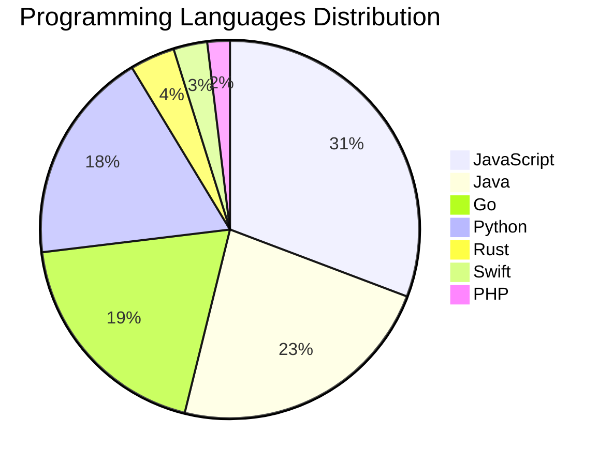

# 🚀 DevTech Auto News - Enhanced Edition


**DevTech Auto News Enhanced** is an advanced automated bot that aggregates trending topics in **AI**, **Web Development**, **Mobile**, **Cloud**, **DevOps**, and more from multiple sources including:

- 📰 [Dev.to](https://dev.to) - Developer community articles
- 🔥 [HackerNews](https://news.ycombinator.com) - Tech news discussions  
- 💻 [GitHub Trending](https://github.com/trending) - Trending repositories
- 🎯 Curated Interview Questions from multiple languages

## ✨ Features

✅ **Multi-Source Aggregation**: Combines articles from Dev.to, HackerNews, and GitHub  
✅ **Smart Categorization**: Automatically categorizes content into 10+ topics  
✅ **Image Support**: Displays cover images for visual appeal  
✅ **Pagination**: Fetches 50+ articles per update with deduplication  
✅ **Language Statistics**: Tracks programming language trends with charts  
✅ **Interview Questions**: Daily coding interview questions in multiple languages  
✅ **GitHub Actions**: Runs every 15 minutes automatically  

---

## 📊 Statistics Dashboard

### 📊 Articles by Category

**AI**: 🟦🟦🟦🟦🟦🟦🟦🟦🟦🟦🟦🟦🟦🟦🟦🟦🟦🟦🟦🟦 40 (38.5%)

**JavaScript**: 🟦🟦🟦🟦🟦🟦🟦🟦🟦🟦🟦🟦🟦🟦🟦🟦 32 (30.8%)

**Tools**: 🟦🟦🟦🟦🟦🟦🟦🟦🟦🟦🟦🟦🟦🟦 28 (26.9%)

**Python**: 🟦🟦🟦🟦🟦🟦🟦🟦🟦🟦 19 (18.3%)

**WebDev**: 🟦🟦🟦🟦🟦 9 (8.7%)

**Cloud**: 🟦🟦🟦🟦 8 (7.7%)

**Security**: 🟦🟦🟦 5 (4.8%)

**Database**: 🟦🟦 4 (3.8%)

**DevOps**: 🟦🟦 3 (2.9%)

**Mobile**: 🟦🟦 3 (2.9%)


### 📡 Sources

- **Dev.to**: 59 articles
- **HackerNews**: 30 articles
- **GitHub**: 15 articles


### 💻 Programming Language Trends

```
JavaScript      ██████████████████████████████ 30.8 (30.8%)
Java            ███████████████████████ 23.1 (23.1%)
Go              ███████████████████ 19.2 (19.2%)
Python          ██████████████████ 18.3 (18.3%)
Rust            ████ 3.8 (3.8%)
Swift           ███ 2.9 (2.9%)
PHP             ██ 1.9 (1.9%)

```




### 🏷️ Trending Tags

               


---

## 🛠️ How It Works

1. **Multi-Source Fetch**: Pulls from Dev.to (2 pages), HackerNews (3 topics), GitHub (3 languages)
2. **Smart Filter**: Uses keyword matching across 10+ categories  
3. **Deduplication**: Removes duplicate URLs  
4. **Image Extraction**: Captures cover images when available  
5. **Statistics**: Generates language trends and category breakdowns  
6. **Update Files**: Regenerates README and appends to comprehensive log  

---

## 📦 Installation & Usage

```bash
# Clone the repository
git clone https://github.com/Derrick-MUGISHA/github-activity-bot.git
cd github-activity-bot

# Install dependencies  
npm install

# Run manually
npm start

# Test mode
npm run test
```

---


# 🚀 DevTech Auto News - Enhanced Edition

## 📅 Latest Updates (2026-02-17 10:00 CAT)


### 🖼️ Featured Articles

<table>
<tr>
  <td align="center" width="33%">
    <a href="https://dev.to/itsugo/how-a-dev-friend-and-i-brought-two-avatars-to-life-chp">
      
      <br/>
      <b>How a DEV Friend and I Brought Two Avatars to Life</b>
    </a>
    <br/>
    <sub>Dev.to</sub>
  </td>
  <td align="center" width="33%">
    <a href="https://dev.to/ben/meme-monday-44jk">
      
      <br/>
      <b>Meme Monday</b>
    </a>
    <br/>
    <sub>Dev.to</sub>
  </td>
  <td align="center" width="33%">
    <a href="https://dev.to/rozd/building-a-native-feeling-theme-system-in-swiftui-h1k">
      
      <br/>
      <b>Building a Native-Feeling Theme System in SwiftUI</b>
    </a>
    <br/>
    <sub>Dev.to</sub>
  </td>
</tr>
<tr>
  <td align="center" width="33%">
    <a href="https://dev.to/abahgat/the-ghost-in-the-training-set-496n">
      
      <br/>
      <b>The Ghost in the Training Set</b>
    </a>
    <br/>
    <sub>Dev.to</sub>
  </td>
  <td align="center" width="33%">
    <a href="https://dev.to/yahav10/i-built-a-cli-that-turns-claude-codes-insights-report-into-actionable-skills-rules-and-workflows-377">
      
      <br/>
      <b>I Built a CLI That Turns Claude Code's /insights R...</b>
    </a>
    <br/>
    <sub>Dev.to</sub>
  </td>
  <td align="center" width="33%">
    <a href="https://dev.to/devoresyah/6-pitfalls-of-dynamic-og-image-generation-on-cloudflare-workers-satori-resvg-wasm-1kle">
      
      <br/>
      <b>6 Pitfalls of Dynamic OG Image Generation on Cloud...</b>
    </a>
    <br/>
    <sub>Dev.to</sub>
  </td>
</tr>
</table>


### 📰 Top Headlines

- [How a DEV Friend and I Brought Two Avatars to Life](https://dev.to/itsugo/how-a-dev-friend-and-i-brought-two-avatars-to-life-chp) _[Dev.to]_
- [Meme Monday](https://dev.to/ben/meme-monday-44jk) _[Dev.to]_
- [Building a Native-Feeling Theme System in SwiftUI](https://dev.to/rozd/building-a-native-feeling-theme-system-in-swiftui-h1k) _[Dev.to]_
- [The Ghost in the Training Set](https://dev.to/abahgat/the-ghost-in-the-training-set-496n) _[Dev.to]_
- [I Built a CLI That Turns Claude Code's /insights Report Into Actionable Skills, Rules, and Workflows](https://dev.to/yahav10/i-built-a-cli-that-turns-claude-codes-insights-report-into-actionable-skills-rules-and-workflows-377) _[Dev.to]_
- [6 Pitfalls of Dynamic OG Image Generation on Cloudflare Workers (Satori + resvg-wasm)](https://dev.to/devoresyah/6-pitfalls-of-dynamic-og-image-generation-on-cloudflare-workers-satori-resvg-wasm-1kle) _[Dev.to]_
- [What was your win this week??](https://dev.to/devteam/what-was-your-win-this-week-a3a) _[Dev.to]_
- [From Idea to Maintainable UI: A Practical React/TS Sprint Workflow](https://dev.to/semosem_20/from-idea-to-maintainable-ui-a-practical-reactts-sprint-workflow-4fak) _[Dev.to]_
- [Visualizing UV on a Polygon2D in Godot](https://dev.to/datadeer/visualizing-uv-on-a-polygon2d-in-godot-1e8o) _[Dev.to]_
- [Command Center for AI Coding Agents (Claude Code + Codex)](https://dev.to/deivid11/command-center-for-ai-coding-agents-claude-code-codex-3d5g) _[Dev.to]_
- [Do people still genuinely care about technical articles ?](https://dev.to/miracool/do-people-still-genuinely-care-about-technical-articles--1hfk) _[Dev.to]_
- [Checking Django Settings](https://dev.to/adamghill/checking-django-settings-12g4) _[Dev.to]_
- [I rebuilt OpenClaw from scratch without the security flaws](https://dev.to/composiodev/i-rebuilt-openclaw-from-scratch-without-the-security-flaws-2mle) _[Dev.to]_
- [But what exactly is an AI agent?](https://dev.to/herrkris/but-what-exactly-is-an-agentic-assistant-2cma) _[Dev.to]_
- [Nike Was Right: The Only Coding Advice You Actually Need](https://dev.to/maame-codes/nike-was-right-the-only-coding-advice-you-actually-need-1cih) _[Dev.to]_
- [Announcement: OxideDock Rust + Vue 3 desktop starter built on Tauri v2](https://dev.to/fridzema/announcement-oxidedock-rust-vue-3-desktop-starter-built-on-tauri-v2-3d6a) _[Dev.to]_
- [Stop Wrestling with JSON-LD: Type-Safe Structured Data for Next.js](https://dev.to/arindamdawn/stop-wrestling-with-json-ld-type-safe-structured-data-for-nextjs-38on) _[Dev.to]_
- [I replaced Stripe's dunning emails with SMS — here's the architecture and why it recovers 2x more revenue](https://dev.to/aledb/i-replaced-stripes-dunning-emails-with-sms-heres-the-architecture-and-why-it-recovers-2x-more-5ei3) _[Dev.to]_
- [Mitigant Threat Catalog: Turning Static Cloud Techniques to Dynamic Executions](https://dev.to/aws-builders/mitigant-threat-catalog-turning-static-cloud-techniques-to-dynamic-executions-46nb) _[Dev.to]_
- [Building a Simple Blog with Supabase (Posts & Comments)](https://dev.to/bosz/building-a-simple-blog-with-supabase-posts-comments-4384) _[Dev.to]_

_Last automated update: Tue, 17 Feb 2026 10:27:24 CAT_


## 💡 Daily Interview Questions

_Sharpen your skills with these curated questions_

### 1. JavaScript: Explain event delegation and why it's useful

**Difficulty**: Medium | **Topics**: events, DOM

<details>
<summary>💡 Hint</summary>

Event bubbling, single listener for multiple elements

</details>

### 2. Java: What are Java Streams and how do they work?

**Difficulty**: Medium | **Topics**: functional programming, collections

<details>
<summary>💡 Hint</summary>

Lazy evaluation, pipeline, terminal operations

</details>

### 3. JavaScript: Implement a debounce function from scratch

**Difficulty**: Hard | **Topics**: functions, timing

<details>
<summary>💡 Hint</summary>

setTimeout, clearTimeout, wrapper function

</details>


---

## 📚 Resources

- [Full News Archive](./data/news_log.md) - Complete history of all fetched articles
- [Statistics JSON](./data/stats.json) - Raw statistics data
- [Categorized Data](./data/categorized.json) - Articles organized by category
- [Interview Questions](./data/interview_questions.json) - Complete question bank

---

## 🤝 Contributing

Want to add more sources, categories, or interview questions? Feel free to:

1. Fork this repository
2. Add your improvements
3. Submit a pull request

---

## 📄 License

MIT License - Feel free to use and modify!

---

<p align="center">
  <b>Last automated update: Tue, 17 Feb 2026 08:27:24 GMT</b><br/>
  <sub>Powered by GitHub Actions | Made with ❤️ for developers</sub>
</p>

---

## 🔗 Quick Links

- [View Workflow](https://github.com/Derrick-MUGISHA/github-activity-bot/actions)
- [Report Issue](https://github.com/Derrick-MUGISHA/github-activity-bot/issues)
- [Suggest Feature](https://github.com/Derrick-MUGISHA/github-activity-bot/issues/new)
