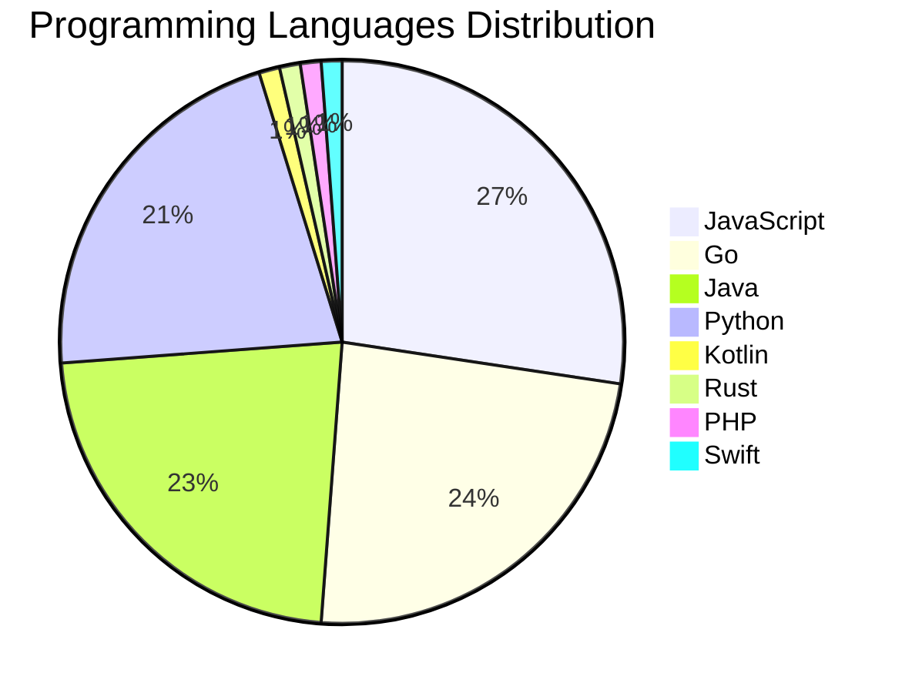

# 🚀 DevTech Auto News - Enhanced Edition


**DevTech Auto News Enhanced** is an advanced automated bot that aggregates trending topics in **AI**, **Web Development**, **Mobile**, **Cloud**, **DevOps**, and more from multiple sources including:

- 📰 [Dev.to](https://dev.to) - Developer community articles
- 🔥 [HackerNews](https://news.ycombinator.com) - Tech news discussions  
- 💻 [GitHub Trending](https://github.com/trending) - Trending repositories
- 🎯 Curated Interview Questions from multiple languages

## ✨ Features

✅ **Multi-Source Aggregation**: Combines articles from Dev.to, HackerNews, and GitHub  
✅ **Smart Categorization**: Automatically categorizes content into 10+ topics  
✅ **Image Support**: Displays cover images for visual appeal  
✅ **Pagination**: Fetches 50+ articles per update with deduplication  
✅ **Language Statistics**: Tracks programming language trends with charts  
✅ **Interview Questions**: Daily coding interview questions in multiple languages  
✅ **GitHub Actions**: Runs every 15 minutes automatically  

---

## 📊 Statistics Dashboard

### 📊 Articles by Category

**AI**: 🟦🟦🟦🟦🟦🟦🟦🟦🟦🟦🟦🟦🟦🟦🟦🟦🟦🟦🟦🟦 49 (46.7%)

**Tools**: 🟦🟦🟦🟦🟦🟦🟦🟦🟦🟦🟦 28 (26.7%)

**JavaScript**: 🟦🟦🟦🟦🟦🟦🟦🟦🟦 23 (21.9%)

**Python**: 🟦🟦🟦🟦🟦🟦🟦 18 (17.1%)

**WebDev**: 🟦🟦 6 (5.7%)

**DevOps**: 🟦🟦 5 (4.8%)

**Database**: 🟦🟦 5 (4.8%)

**Cloud**: 🟦🟦 4 (3.8%)

**Mobile**: 🟦 2 (1.9%)

**Security**: 🟦 2 (1.9%)


### 📡 Sources

- **Dev.to**: 60 articles
- **HackerNews**: 30 articles
- **GitHub**: 15 articles


### 💻 Programming Language Trends

```
JavaScript      ██████████████████████████████ 27.4 (27.4%)
Go              ██████████████████████████ 23.8 (23.8%)
Java            █████████████████████████ 22.6 (22.6%)
Python          ███████████████████████ 21.4 (21.4%)
Kotlin          █ 1.2 (1.2%)
Rust            █ 1.2 (1.2%)
PHP             █ 1.2 (1.2%)
Swift           █ 1.2 (1.2%)

```




### 🏷️ Trending Tags

               


---

## 🛠️ How It Works

1. **Multi-Source Fetch**: Pulls from Dev.to (2 pages), HackerNews (3 topics), GitHub (3 languages)
2. **Smart Filter**: Uses keyword matching across 10+ categories  
3. **Deduplication**: Removes duplicate URLs  
4. **Image Extraction**: Captures cover images when available  
5. **Statistics**: Generates language trends and category breakdowns  
6. **Update Files**: Regenerates README and appends to comprehensive log  

---

## 📦 Installation & Usage

```bash
# Clone the repository
git clone https://github.com/Derrick-MUGISHA/github-activity-bot.git
cd github-activity-bot

# Install dependencies  
npm install

# Run manually
npm start

# Test mode
npm run test
```

---


# 🚀 DevTech Auto News - Enhanced Edition

## 📅 Latest Updates (2026-05-15 14:00 CAT)


### 🖼️ Featured Articles

<table>
<tr>
  <td align="center" width="33%">
    <a href="https://dev.to/tahosin/my-github-graveyard-has-27-dead-projects-here-is-the-brutal-truth-about-why-52d9">
      
      <br/>
      <b>My GitHub Graveyard has 27 dead projects. Here is ...</b>
    </a>
    <br/>
    <sub>Dev.to</sub>
  </td>
  <td align="center" width="33%">
    <a href="https://dev.to/tkuenneth/building-a-custom-launcher-for-chromeos-4fb7">
      
      <br/>
      <b>Building a custom launcher for ChromeOS</b>
    </a>
    <br/>
    <sub>Dev.to</sub>
  </td>
  <td align="center" width="33%">
    <a href="https://dev.to/gde/vercel-ai-sdk-middleware-vs-genkit-middleware-a-hands-on-comparison-41hg">
      
      <br/>
      <b>Vercel AI SDK Middleware vs Genkit Middleware: a H...</b>
    </a>
    <br/>
    <sub>Dev.to</sub>
  </td>
</tr>
<tr>
  <td align="center" width="33%">
    <a href="https://dev.to/gde/gemmabridge-ai-bridging-the-inclusion-gap-for-neurodiverse-learners-48ba">
      
      <br/>
      <b>GemmaBridge: AI Bridging the Inclusion Gap for Neu...</b>
    </a>
    <br/>
    <sub>Dev.to</sub>
  </td>
  <td align="center" width="33%">
    <a href="https://dev.to/gde/genkit-middleware-intercept-extend-and-harden-your-gen-ai-pipelines-4k03">
      
      <br/>
      <b>Genkit Middleware: Intercept, Extend and Harden yo...</b>
    </a>
    <br/>
    <sub>Dev.to</sub>
  </td>
  <td align="center" width="33%">
    <a href="https://dev.to/darkwiiplayer/onclick-is-great-actually-1l3p">
      
      <br/>
      <b>onclick is great, actually</b>
    </a>
    <br/>
    <sub>Dev.to</sub>
  </td>
</tr>
</table>


### 📰 Top Headlines

- [My GitHub Graveyard has 27 dead projects. Here is the brutal truth about why.](https://dev.to/tahosin/my-github-graveyard-has-27-dead-projects-here-is-the-brutal-truth-about-why-52d9) _[Dev.to]_
- [Building a custom launcher for ChromeOS](https://dev.to/tkuenneth/building-a-custom-launcher-for-chromeos-4fb7) _[Dev.to]_
- [Vercel AI SDK Middleware vs Genkit Middleware: a Hands-On Comparison](https://dev.to/gde/vercel-ai-sdk-middleware-vs-genkit-middleware-a-hands-on-comparison-41hg) _[Dev.to]_
- [GemmaBridge: AI Bridging the Inclusion Gap for Neurodiverse Learners](https://dev.to/gde/gemmabridge-ai-bridging-the-inclusion-gap-for-neurodiverse-learners-48ba) _[Dev.to]_
- [Genkit Middleware: Intercept, Extend and Harden your Gen AI Pipelines](https://dev.to/gde/genkit-middleware-intercept-extend-and-harden-your-gen-ai-pipelines-4k03) _[Dev.to]_
- [onclick is great, actually](https://dev.to/darkwiiplayer/onclick-is-great-actually-1l3p) _[Dev.to]_
- [Vibe Coding, Demystified](https://dev.to/mlh/vibe-coding-demystified-169b) _[Dev.to]_
- [I built a quiz app with my 8-year-old to fix homework — and accidentally a family ritual](https://dev.to/apostopher/i-built-a-quiz-app-with-my-8-year-old-to-fix-homework-and-accidentally-a-family-ritual-1c1b) _[Dev.to]_
- [Gemini API File Search: Enhanced Multimodal Capabilities with Embedding 2, Including Open-Source LINE Bot Implementation](https://dev.to/gde/gemini-api-file-search-enhanced-multimodal-capabilities-with-embedding-2-including-open-source-g72) _[Dev.to]_
- [Agent Factory Recap: How Gemma 4 Taught Itself Physics](https://dev.to/googleai/agent-factory-recap-how-gemma-4-taught-itself-physics-17e6) _[Dev.to]_
- [Two DEV Users. Two Countries. One Weird Little Avatar Project.](https://dev.to/itsugo/two-dev-users-two-countries-one-weird-little-avatar-project-3gd3) _[Dev.to]_
- [How AI is changing my job as a Staff Engineer: Tracer bullets](https://dev.to/vinibrsl/how-ai-is-changing-my-job-as-a-staff-engineer-tracer-bullets-4nck) _[Dev.to]_
- [Leafer Editor — A Free, Open-Source Vector Design Tool for the Browser](https://dev.to/fayismahmood/leafer-editor-a-free-open-source-vector-design-tool-for-the-browser-176l) _[Dev.to]_
- [Google Cloud x NVIDIA Meet Up - 5/20/26 @ 5:30pm, Mountain View, CA](https://dev.to/googleai/google-cloud-x-nvidia-meet-up-52026-530pm-mountain-view-ca-9ea) _[Dev.to]_
- [Old PC vs New AI: Can a 2015 Desktop Actually Run Gemma 4? (2B vs 4B Benchmark)](https://dev.to/gramli/old-pc-vs-new-ai-can-a-2015-desktop-actually-run-gemma-4-2b-vs-4b-benchmark-2eg6) _[Dev.to]_
- [Building an AI Agent Inside Jira —— A Jira Copilot Implementation Guide](https://dev.to/shenxianpeng/building-an-ai-agent-inside-jira-a-jira-copilot-implementation-guide-2baj) _[Dev.to]_
- [SQL Execution Order: Write Queries That Think Like the Database](https://dev.to/kalkwst/sql-execution-order-write-queries-that-think-like-the-database-13lf) _[Dev.to]_
- [Gemma4 Speculative Decoding with n-gram](https://dev.to/gde/gemma4-speculative-decoding-with-n-gram-1c9b) _[Dev.to]_
- [Deploying a Rust MCP Server to Amazon EKS](https://dev.to/gde/deploying-a-rust-mcp-server-to-amazon-eks-183g) _[Dev.to]_
- [GPT-5.5 Instant: The New ChatGPT Default Model Complete Guide 2026](https://dev.to/akaranjkar08/gpt-55-instant-the-new-chatgpt-default-model-complete-guide-2026-1l4) _[Dev.to]_

_Last automated update: Fri, 15 May 2026 14:06:35 CAT_


## 💡 Daily Interview Questions

_Sharpen your skills with these curated questions_

### 1. React: How would you optimize a React app's performance?

**Difficulty**: Hard | **Topics**: optimization, performance

<details>
<summary>💡 Hint</summary>

React.memo, useMemo, useCallback, code splitting, lazy loading

</details>

### 2. Python: Explain decorators in Python with an example

**Difficulty**: Medium | **Topics**: functions, metaprogramming

<details>
<summary>💡 Hint</summary>

Function wrappers, @syntax, practical uses

</details>

### 3. Java: What is the difference between abstract class and interface?

**Difficulty**: Easy | **Topics**: OOP, design

<details>
<summary>💡 Hint</summary>

Multiple inheritance, method implementation, use cases

</details>


---

## 📚 Resources

- [Full News Archive](./data/news_log.md) - Complete history of all fetched articles
- [Statistics JSON](./data/stats.json) - Raw statistics data
- [Categorized Data](./data/categorized.json) - Articles organized by category
- [Interview Questions](./data/interview_questions.json) - Complete question bank

---

## 🤝 Contributing

Want to add more sources, categories, or interview questions? Feel free to:

1. Fork this repository
2. Add your improvements
3. Submit a pull request

---

## 📄 License

MIT License - Feel free to use and modify!

---

<p align="center">
  <b>Last automated update: Fri, 15 May 2026 12:06:35 GMT</b><br/>
  <sub>Powered by GitHub Actions | Made with ❤️ for developers</sub>
</p>

---

## 🔗 Quick Links

- [View Workflow](https://github.com/Derrick-MUGISHA/github-activity-bot/actions)
- [Report Issue](https://github.com/Derrick-MUGISHA/github-activity-bot/issues)
- [Suggest Feature](https://github.com/Derrick-MUGISHA/github-activity-bot/issues/new)
