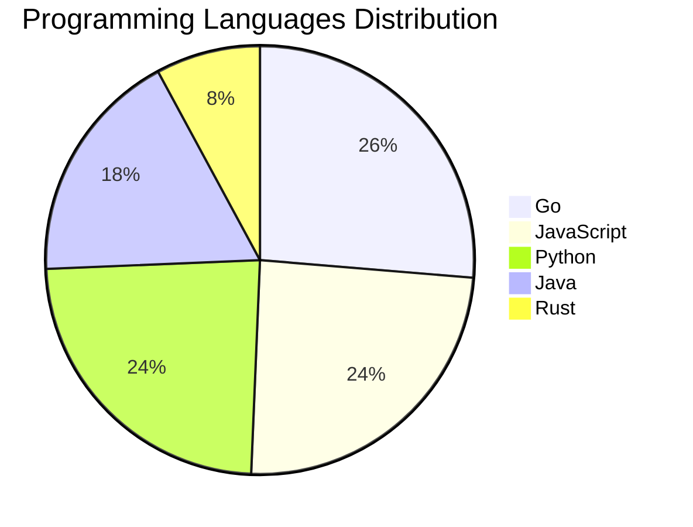

<div align="center">

# 📰 DevTech Auto News

**Your always-fresh digest of developer & AI tech news — curated automatically, around the clock.**


Aggregating [Dev.to](https://dev.to) · [Hacker News](https://news.ycombinator.com) · [GitHub Trending](https://github.com/trending) · [Lobste.rs](https://lobste.rs) · [Stack Overflow](https://stackoverflow.com) · [TechCrunch](https://techcrunch.com) · [freeCodeCamp](https://www.freecodecamp.org/news) — refreshed by GitHub Actions around the clock.

**[📰 Headlines](#-latest-headlines) · [💡 Interview Prep](#-interview-question-of-the-hour) · [📊 Statistics](#-statistics) · [⚙️ How It Works](#%EF%B8%8F-how-it-works)**

</div>

---

## 📰 Latest Headlines

> 🕐 Edition of **2026-07-17 0:00 CAT** — refreshed automatically, all day, every day.

### ✨ Featured Stories

<table>
<tr>
  <td align="center" width="33%">
    <a href="https://dev.to/aws/did-you-know-tlds-can-be-websites-2j13">
      
      <br/>
      <b>Did You Know TLDs Can Be Websites?</b>
    </a>
    <br/>
    <sub>Dev.to</sub>
  </td>
  <td align="center" width="33%">
    <a href="https://dev.to/googleai/what-is-an-agentic-harness-actually-4oie">
      
      <br/>
      <b>What is an "agentic harness," actually?</b>
    </a>
    <br/>
    <sub>Dev.to</sub>
  </td>
  <td align="center" width="33%">
    <a href="https://dev.to/sidhantpanda/claude-might-be-saturating-your-machine-3h07">
      
      <br/>
      <b>Claude might be saturating your machine</b>
    </a>
    <br/>
    <sub>Dev.to</sub>
  </td>
</tr>
<tr>
  <td align="center" width="33%">
    <a href="https://dev.to/gde/my-benchmarks-python-column-was-na-for-a-year-cpythons-4300-digit-limit-and-eight-other-bugs-1hgk">
      
      <br/>
      <b>My benchmark's Python column was N/A for a year — ...</b>
    </a>
    <br/>
    <sub>Dev.to</sub>
  </td>
  <td align="center" width="33%">
    <a href="https://dev.to/gde/26b-gemma-4-qat-deployment-with-gce-g2-standard-nvidia-l4-mcp-and-antigravity-cli-1bmd">
      
      <br/>
      <b>26B Gemma 4 QAT Deployment with GCE g2-standard, N...</b>
    </a>
    <br/>
    <sub>Dev.to</sub>
  </td>
  <td align="center" width="33%">
    <a href="https://dev.to/gde/smash-story-the-demo-script-that-out-debugged-my-test-suite-430k">
      
      <br/>
      <b>Smash Story: The Demo Script That Out-Debugged My ...</b>
    </a>
    <br/>
    <sub>Dev.to</sub>
  </td>
</tr>
</table>


### 🗞️ Top Stories

| # | Headline | Source |
|---|----------|--------|
| 1 | [Did You Know TLDs Can Be Websites?](https://dev.to/aws/did-you-know-tlds-can-be-websites-2j13) | Dev.to |
| 2 | [What is an "agentic harness," actually?](https://dev.to/googleai/what-is-an-agentic-harness-actually-4oie) | Dev.to |
| 3 | [Claude might be saturating your machine](https://dev.to/sidhantpanda/claude-might-be-saturating-your-machine-3h07) | Dev.to |
| 4 | [My benchmark's Python column was N/A for a year — CPython's 4300-digit limit, and eight other bugs](https://dev.to/gde/my-benchmarks-python-column-was-na-for-a-year-cpythons-4300-digit-limit-and-eight-other-bugs-1hgk) | Dev.to |
| 5 | [26B Gemma 4 QAT Deployment with GCE g2-standard, NVIDIA L4, MCP, and Antigravity CLI](https://dev.to/gde/26b-gemma-4-qat-deployment-with-gce-g2-standard-nvidia-l4-mcp-and-antigravity-cli-1bmd) | Dev.to |
| 6 | [Smash Story: The Demo Script That Out-Debugged My Test Suite](https://dev.to/gde/smash-story-the-demo-script-that-out-debugged-my-test-suite-430k) | Dev.to |
| 7 | [Why did my benchmark stop at N=22? A debugging story in nine bugs](https://dev.to/gde/why-did-my-benchmark-stop-at-n22-a-debugging-story-in-nine-bugs-3m2l) | Dev.to |
| 8 | [DiffusionGemma: The Developer Guide](https://dev.to/googleai/diffusiongemma-the-developer-guide-5a3l) | Dev.to |
| 9 | [5 Trends That Defined AI Engineering at World’s Fair 2026](https://dev.to/latentspace/5-trends-that-defined-ai-engineering-at-worlds-fair-2026-5dj6) | Dev.to |
| 10 | [The Myth of the Post-Documentation Era](https://dev.to/ben/the-myth-of-the-post-documentation-era-39al) | Dev.to |
| 11 | [TPU Deployments with Gemma 31B, v6e-8, and Antigravity CLI](https://dev.to/gde/tpu-deployments-with-gemma-31b-v6e-8-and-antigravity-cli-3e4n) | Dev.to |
| 12 | [Debugging Deployments with Gemma 2B, TPU v6e-1, MCP, and Antigravity CLI](https://dev.to/gde/debugging-deployments-with-gemma-2b-tpu-v6e-1-mcp-and-antigravity-cli-3hh3) | Dev.to |
| 13 | [Building a Hybrid Docker Orchestrator in Go: The Journey from Single VM to Multi-Node Cluster](https://dev.to/gde/building-a-hybrid-docker-orchestrator-in-go-the-journey-from-single-vm-to-multi-node-cluster-3i7m) | Dev.to |
| 14 | [Stop Copy-Pasting `dns:` Blocks: Introducing Transparent DNS Injection in Gubernator](https://dev.to/gde/stop-copy-pasting-dns-blocks-introducing-transparent-dns-injection-in-gubernator-ad4) | Dev.to |
| 15 | [[GCP Billing & Vertex AI] Solving Gemini Cost Allocation in a Single Project: Vertex AI Dynamic Billing Labels in Action](https://dev.to/gde/gcp-billing-vertex-ai-solving-gemini-cost-allocation-in-a-single-project-vertex-ai-dynamic-5aok) | Dev.to |
| 16 | [Should I quit IT or just live through the burnout?](https://dev.to/klaudiagrz/should-i-quit-it-or-just-live-through-the-burnout-1gng) | Dev.to |
| 17 | [I Finally Built the Dev Opportunity Radar Website ❤️](https://dev.to/hemapriya_kanagala/i-finally-built-the-dev-opportunity-radar-website-1dpi) | Dev.to |
| 18 | [Build Firebase AI Logic Application with Antigravity CLI and Stitch MCP Server [GDE]](https://dev.to/gde/build-firebase-ai-logic-application-with-antigravity-cli-and-stitch-mcp-server-gde-g6o) | Dev.to |
| 19 | [This is remarkable

https://bobdahacker.com/blog/fifa-hack](https://dev.to/ben/this-is-remarkablehttpsbobdahackercomblogfifa-hack-3kb0) | Dev.to |
| 20 | [Debugging Deployments with Gemma 4B, TPU v6e-4, MCP, and Antigravity CLI](https://dev.to/gde/debugging-deployments-with-gemma-4b-tpu-v6e-4-mcp-and-antigravity-cli-1l82) | Dev.to |

<sub>Last fetched: Fri, 17 Jul 2026 00:36:04 CAT</sub>


---

## 💡 Interview Question of the Hour

> Sharpen your skills — new questions selected on every update. Try answering before opening the hint!

**1. `Python` — Explain GIL and its implications for multithreading**

&nbsp;&nbsp;&nbsp;&nbsp;🎯 Hard · 🏷 concurrency, performance

<details>
<summary>&nbsp;&nbsp;&nbsp;&nbsp;💡 Show hint</summary>

> Global Interpreter Lock, multiprocessing alternatives

</details>

**2. `Java` — What is the difference between abstract class and interface?**

&nbsp;&nbsp;&nbsp;&nbsp;🎯 Easy · 🏷 OOP, design

<details>
<summary>&nbsp;&nbsp;&nbsp;&nbsp;💡 Show hint</summary>

> Multiple inheritance, method implementation, use cases

</details>

**3. `Database` — What is database normalization and denormalization?**

&nbsp;&nbsp;&nbsp;&nbsp;🎯 Medium · 🏷 design, optimization

<details>
<summary>&nbsp;&nbsp;&nbsp;&nbsp;💡 Show hint</summary>

> Normal forms, redundancy, performance trade-offs

</details>


---

## 📊 Statistics

#### 🗂 Articles by Category

| Category | Articles | Share | |
|----------|---------:|------:|---|
| **AI** | 74 | 41.3% | `████████████████████` |
| **JavaScript** | 37 | 20.7% | `██████████░░░░░░░░░░` |
| **Python** | 36 | 20.1% | `██████████░░░░░░░░░░` |
| **Tools** | 31 | 17.3% | `████████░░░░░░░░░░░░` |
| **Cloud** | 17 | 9.5% | `█████░░░░░░░░░░░░░░░` |
| **DevOps** | 15 | 8.4% | `████░░░░░░░░░░░░░░░░` |
| **Security** | 13 | 7.3% | `████░░░░░░░░░░░░░░░░` |
| **WebDev** | 6 | 3.4% | `██░░░░░░░░░░░░░░░░░░` |
| **Database** | 5 | 2.8% | `█░░░░░░░░░░░░░░░░░░░` |
| **Mobile** | 2 | 1.1% | `█░░░░░░░░░░░░░░░░░░░` |

<sub>Articles can match more than one category, so shares may sum to over 100%.</sub>


#### 📡 Articles by Source

| Source | Articles |
|--------|---------:|
| Dev.to | 60 |
| HackerNews | 49 |
| GitHub | 20 |
| Lobste.rs | 10 |
| StackOverflow | 20 |
| TechCrunch | 10 |
| freeCodeCamp | 10 |


#### 💻 Programming Language Trends

```
Go              ██████████████████████████████ 26.3%
JavaScript      ████████████████████████████ 24.3%
Python          ███████████████████████████ 23.7%
Java            ████████████████████ 17.8%
Rust            █████████ 7.9%

```




#### 🏷 Trending Topics

            


---

## ⚙️ How It Works

This repository is a fully automated news pipeline. On every run, GitHub Actions:

1. **Fetches** the latest articles from seven sources: Dev.to, Hacker News, GitHub Trending, Lobste.rs, Stack Overflow, TechCrunch, and freeCodeCamp
2. **Deduplicates and categorizes** them across 10+ topics using keyword matching
3. **Extracts cover images** and computes language & category statistics
4. **Rebuilds this README** and appends everything to the [full archive](./data/news_log.md)
5. **Commits and pushes** the result — no human intervention needed

<details>
<summary><b>🚀 Run it yourself</b></summary>

```bash
git clone https://github.com/Derrick-MUGISHA/github-activity-bot.git
cd github-activity-bot
npm install
npm start
```

Fork the repo, enable GitHub Actions, and you have your own self-updating news feed.

</details>

<details>
<summary><b>📚 Data & resources</b></summary>

- [Full news archive](./data/news_log.md) — complete history of every fetched article
- [Statistics](./data/stats.json) — raw stats data (JSON)
- [Categorized articles](./data/categorized.json) — articles grouped by topic
- [Interview question bank](./data/interview_questions.json) — the full question set

</details>

---

## 🤝 Contributing

Ideas for new sources, categories, or interview questions are welcome — [open an issue](https://github.com/Derrick-MUGISHA/github-activity-bot/issues/new) or submit a pull request.

## 📄 License

Released under the [MIT License](https://opensource.org/licenses/MIT) — free to use, fork, and modify.

---

<div align="center">
  <sub>🤖 Last automated update: <b>Thu, 16 Jul 2026 22:36:04 GMT</b></sub><br/>
  <sub>Powered by GitHub Actions · Built with ❤️ by <a href="https://github.com/Derrick-MUGISHA">Derrick MUGISHA</a></sub>
</div>
