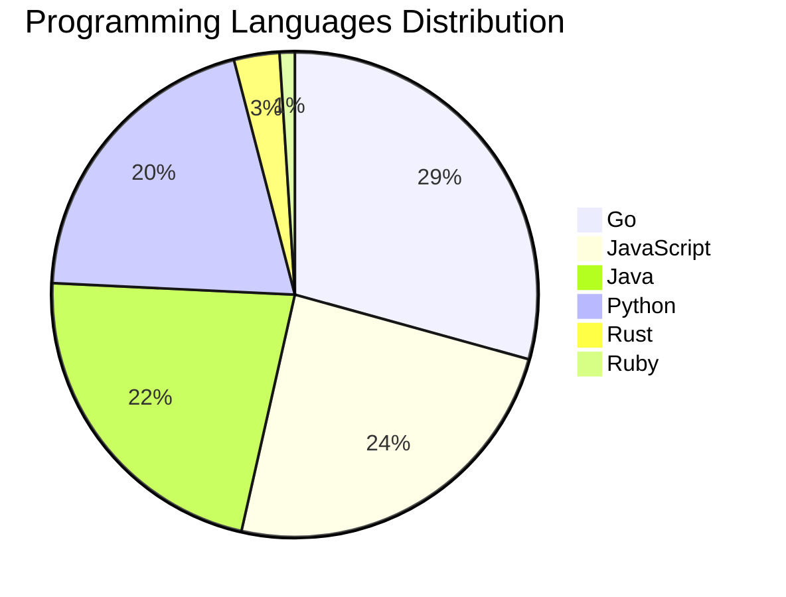

# 🚀 DevTech Auto News - Enhanced Edition


**DevTech Auto News Enhanced** is an advanced automated bot that aggregates trending topics in **AI**, **Web Development**, **Mobile**, **Cloud**, **DevOps**, and more from multiple sources including:

- 📰 [Dev.to](https://dev.to) - Developer community articles
- 🔥 [HackerNews](https://news.ycombinator.com) - Tech news discussions  
- 💻 [GitHub Trending](https://github.com/trending) - Trending repositories
- 🎯 Curated Interview Questions from multiple languages

## ✨ Features

✅ **Multi-Source Aggregation**: Combines articles from Dev.to, HackerNews, and GitHub  
✅ **Smart Categorization**: Automatically categorizes content into 10+ topics  
✅ **Image Support**: Displays cover images for visual appeal  
✅ **Pagination**: Fetches 50+ articles per update with deduplication  
✅ **Language Statistics**: Tracks programming language trends with charts  
✅ **Interview Questions**: Daily coding interview questions in multiple languages  
✅ **GitHub Actions**: Runs every 15 minutes automatically  

---

## 📊 Statistics Dashboard

### 📊 Articles by Category

**AI**: 🟦🟦🟦🟦🟦🟦🟦🟦🟦🟦🟦🟦🟦🟦🟦🟦🟦🟦🟦🟦 59 (56.2%)

**JavaScript**: 🟦🟦🟦🟦🟦🟦🟦🟦 24 (22.9%)

**Tools**: 🟦🟦🟦🟦🟦🟦🟦 22 (21.0%)

**Python**: 🟦🟦🟦🟦🟦🟦🟦 20 (19.0%)

**Cloud**: 🟦🟦🟦🟦🟦 15 (14.3%)

**Security**: 🟦🟦 7 (6.7%)

**DevOps**: 🟦 4 (3.8%)

**Database**: 🟦 4 (3.8%)

**WebDev**: 🟦 3 (2.9%)


### 📡 Sources

- **Dev.to**: 60 articles
- **HackerNews**: 30 articles
- **GitHub**: 15 articles


### 💻 Programming Language Trends

```
Go              ██████████████████████████████ 29.3 (29.3%)
JavaScript      █████████████████████████ 24.2 (24.2%)
Java            ███████████████████████ 22.2 (22.2%)
Python          █████████████████████ 20.2 (20.2%)
Rust            ███ 3.0 (3.0%)
Ruby            █ 1.0 (1.0%)

```




### 🏷️ Trending Tags

               


---

## 🛠️ How It Works

1. **Multi-Source Fetch**: Pulls from Dev.to (2 pages), HackerNews (3 topics), GitHub (3 languages)
2. **Smart Filter**: Uses keyword matching across 10+ categories  
3. **Deduplication**: Removes duplicate URLs  
4. **Image Extraction**: Captures cover images when available  
5. **Statistics**: Generates language trends and category breakdowns  
6. **Update Files**: Regenerates README and appends to comprehensive log  

---

## 📦 Installation & Usage

```bash
# Clone the repository
git clone https://github.com/Derrick-MUGISHA/github-activity-bot.git
cd github-activity-bot

# Install dependencies  
npm install

# Run manually
npm start

# Test mode
npm run test
```

---


# 🚀 DevTech Auto News - Enhanced Edition

## 📅 Latest Updates (2026-04-15 18:00 CAT)


### 🖼️ Featured Articles

<table>
<tr>
  <td align="center" width="33%">
    <a href="https://dev.to/devteam/top-7-featured-dev-posts-of-the-week-5e38">
      
      <br/>
      <b>Top 7 Featured DEV Posts of the Week</b>
    </a>
    <br/>
    <sub>Dev.to</sub>
  </td>
  <td align="center" width="33%">
    <a href="https://dev.to/aws/lost-in-the-ai-hype-i-started-small-2a72">
      
      <br/>
      <b>Lost in the AI Hype, I Started Small</b>
    </a>
    <br/>
    <sub>Dev.to</sub>
  </td>
  <td align="center" width="33%">
    <a href="https://dev.to/serhiip/things-youre-overengineering-in-your-ai-agent-the-llm-already-handles-them-2lop">
      
      <br/>
      <b>Things You're Overengineering in Your AI Agent (Th...</b>
    </a>
    <br/>
    <sub>Dev.to</sub>
  </td>
</tr>
<tr>
  <td align="center" width="33%">
    <a href="https://dev.to/sebs/local-ai-will-save-us-all-the-math-says-so-trust-me-4m22">
      
      <br/>
      <b>Local AI Will Save Us All (The Math Says So, Trust...</b>
    </a>
    <br/>
    <sub>Dev.to</sub>
  </td>
  <td align="center" width="33%">
    <a href="https://dev.to/tworrell/how-im-using-asts-and-gemini-to-solve-the-codebase-onboarding-problem-1la9">
      
      <br/>
      <b>How I'm using ASTs and Gemini to solve the "Codeba...</b>
    </a>
    <br/>
    <sub>Dev.to</sub>
  </td>
  <td align="center" width="33%">
    <a href="https://dev.to/pwd9000/steer-github-copilot-cli-sessions-remotely-from-any-device-3mee">
      
      <br/>
      <b>Steer GitHub Copilot CLI Sessions Remotely from An...</b>
    </a>
    <br/>
    <sub>Dev.to</sub>
  </td>
</tr>
</table>


### 📰 Top Headlines

- [Top 7 Featured DEV Posts of the Week](https://dev.to/devteam/top-7-featured-dev-posts-of-the-week-5e38) _[Dev.to]_
- [Lost in the AI Hype, I Started Small](https://dev.to/aws/lost-in-the-ai-hype-i-started-small-2a72) _[Dev.to]_
- [Things You're Overengineering in Your AI Agent (The LLM Already Handles Them)](https://dev.to/serhiip/things-youre-overengineering-in-your-ai-agent-the-llm-already-handles-them-2lop) _[Dev.to]_
- [Local AI Will Save Us All (The Math Says So, Trust Me)](https://dev.to/sebs/local-ai-will-save-us-all-the-math-says-so-trust-me-4m22) _[Dev.to]_
- [How I'm using ASTs and Gemini to solve the "Codebase Onboarding" problem 🧠](https://dev.to/tworrell/how-im-using-asts-and-gemini-to-solve-the-codebase-onboarding-problem-1la9) _[Dev.to]_
- [Steer GitHub Copilot CLI Sessions Remotely from Any Device](https://dev.to/pwd9000/steer-github-copilot-cli-sessions-remotely-from-any-device-3mee) _[Dev.to]_
- [How I Built an Autonomous Dataset Generator with CrewAI + Ollama (72-hour run, 1,065 entries)](https://dev.to/robopilingui/how-i-built-an-autonomous-dataset-generator-with-crewai-ollama-72-hour-run-1065-entries-2280) _[Dev.to]_
- [Your AI Memory System Can't Tell a River Bank from a Savings Account](https://dev.to/eyepaq/your-ai-memory-system-cant-tell-a-river-bank-from-a-savings-account-34j) _[Dev.to]_
- [Multi-Agent A2A with the Agent Development Kit(ADK), Azure AKS, and Gemini CLI](https://dev.to/gde/multi-agent-a2a-with-the-agent-development-kitadk-azure-aks-and-gemini-cli-231o) _[Dev.to]_
- [Amazon Bedrock for Beginners From First Prompt to AI Agent (Full Tutorial)](https://dev.to/aws/amazon-bedrock-for-beginners-from-first-prompt-to-ai-agent-full-tutorial-12ln) _[Dev.to]_
- [From Software Engineer to Developer Advocate: The Silent Transition I've Been Making for Years Without Knowing It](https://dev.to/ceohitchcock/from-software-engineer-to-developer-advocate-the-silent-transition-ive-been-making-for-years-4jc6) _[Dev.to]_
- [FastAPI Async+Pytest, Event Loop Trap](https://dev.to/neerajkansal9/fastapi-asyncpytest-event-loop-trap-295c) _[Dev.to]_
- [Schrödinger's Backup: If You Haven't Tested a Restore, You Don't Have a Backup](https://dev.to/hugovalters/schrodingers-backup-if-you-havent-tested-a-restore-you-dont-have-a-backup-1d53) _[Dev.to]_
- [Claude skills vs Commands](https://dev.to/hellonehha/claude-skills-vs-commands-1dcm) _[Dev.to]_
- [They Said Kubernetes Isn't Coming to Coolify. I'm Going to Find Out If That's True.](https://dev.to/drtobbyas/they-said-kubernetes-isnt-coming-to-coolify-im-going-to-find-out-if-thats-true-4eee) _[Dev.to]_
- [Deploy OpenClaw on AWS: Choose the right options for your AI workload](https://dev.to/aws/deploy-openclaw-on-aws-choose-the-right-options-for-your-ai-workload-297f) _[Dev.to]_
- [Building a Multimodal Cross Cloud Live Agent with ADK, Azure Fabric, and Gemini CLI](https://dev.to/gde/building-a-multimodal-cross-cloud-live-agent-with-adk-azure-fabric-and-gemini-cli-3k4a) _[Dev.to]_
- [I Saw Someone Build an AI-Powered Kali Lab at BSides San Diego. Then I Built My Own.](https://dev.to/_spac3gh0st/i-saw-someone-build-an-ai-powered-kali-lab-at-bsides-san-diego-then-i-built-my-own-1944) _[Dev.to]_
- [How do AI video generation models work?](https://dev.to/googleai/how-do-ai-video-generation-models-work-a82) _[Dev.to]_
- [My 14-Year Journey Away from ORMs - How I Built pGenie, the SQL-First Postgres Code Generator](https://dev.to/nikitavolkov/my-14-year-journey-away-from-orms-how-i-built-pgenie-the-sql-first-postgres-code-generator-5c3j) _[Dev.to]_

_Last automated update: Wed, 15 Apr 2026 18:59:28 CAT_


## 💡 Daily Interview Questions

_Sharpen your skills with these curated questions_

### 1. JavaScript: What is the difference between `let`, `const`, and `var`?

**Difficulty**: Easy | **Topics**: variables, scope

<details>
<summary>💡 Hint</summary>

Scope, hoisting, and reassignment capabilities

</details>

### 2. SystemDesign: Design Twitter's timeline feature

**Difficulty**: Hard | **Topics**: system design, scalability

<details>
<summary>💡 Hint</summary>

Fan-out, caching, ranking, real-time updates

</details>

### 3. Database: Explain database indexing and when to use it

**Difficulty**: Medium | **Topics**: optimization, performance

<details>
<summary>💡 Hint</summary>

B-tree, trade-offs, query performance

</details>


---

## 📚 Resources

- [Full News Archive](./data/news_log.md) - Complete history of all fetched articles
- [Statistics JSON](./data/stats.json) - Raw statistics data
- [Categorized Data](./data/categorized.json) - Articles organized by category
- [Interview Questions](./data/interview_questions.json) - Complete question bank

---

## 🤝 Contributing

Want to add more sources, categories, or interview questions? Feel free to:

1. Fork this repository
2. Add your improvements
3. Submit a pull request

---

## 📄 License

MIT License - Feel free to use and modify!

---

<p align="center">
  <b>Last automated update: Wed, 15 Apr 2026 16:59:28 GMT</b><br/>
  <sub>Powered by GitHub Actions | Made with ❤️ for developers</sub>
</p>

---

## 🔗 Quick Links

- [View Workflow](https://github.com/Derrick-MUGISHA/github-activity-bot/actions)
- [Report Issue](https://github.com/Derrick-MUGISHA/github-activity-bot/issues)
- [Suggest Feature](https://github.com/Derrick-MUGISHA/github-activity-bot/issues/new)
