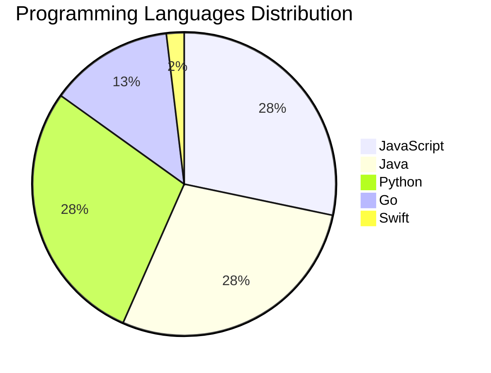

# 🚀 DevTech Auto News - Enhanced Edition


**DevTech Auto News Enhanced** is an advanced automated bot that aggregates trending topics in **AI**, **Web Development**, **Mobile**, **Cloud**, **DevOps**, and more from multiple sources including:

- 📰 [Dev.to](https://dev.to) - Developer community articles
- 🔥 [HackerNews](https://news.ycombinator.com) - Tech news discussions  
- 💻 [GitHub Trending](https://github.com/trending) - Trending repositories
- 🎯 Curated Interview Questions from multiple languages

## ✨ Features

✅ **Multi-Source Aggregation**: Combines articles from Dev.to, HackerNews, and GitHub  
✅ **Smart Categorization**: Automatically categorizes content into 10+ topics  
✅ **Image Support**: Displays cover images for visual appeal  
✅ **Pagination**: Fetches 50+ articles per update with deduplication  
✅ **Language Statistics**: Tracks programming language trends with charts  
✅ **Interview Questions**: Daily coding interview questions in multiple languages  
✅ **GitHub Actions**: Runs every 15 minutes automatically  

---

## 📊 Statistics Dashboard

### 📊 Articles by Category

**AI**: 🟦🟦🟦🟦🟦🟦🟦🟦🟦🟦🟦🟦🟦🟦🟦🟦🟦🟦🟦🟦 21 (46.7%)

**JavaScript**: 🟦🟦🟦🟦🟦🟦🟦🟦🟦🟦🟦🟦🟦🟦 15 (33.3%)

**Python**: 🟦🟦🟦🟦🟦🟦🟦🟦🟦🟦🟦🟦🟦🟦 15 (33.3%)

**Tools**: 🟦🟦🟦🟦🟦🟦🟦🟦🟦🟦🟦🟦🟦🟦 15 (33.3%)

**WebDev**: 🟦🟦 2 (4.4%)

**Security**: 🟦🟦 2 (4.4%)

**Mobile**: 🟦 1 (2.2%)

**Cloud**: 🟦 1 (2.2%)

**Database**: 🟦 1 (2.2%)


### 📡 Sources

- **HackerNews**: 30 articles
- **GitHub**: 15 articles


### 💻 Programming Language Trends

```
JavaScript      ██████████████████████████████ 28.3 (28.3%)
Java            ██████████████████████████████ 28.3 (28.3%)
Python          ██████████████████████████████ 28.3 (28.3%)
Go              ██████████████ 13.2 (13.2%)
Swift           ██ 1.9 (1.9%)

```




### 🏷️ Trending Tags

        


---

## 🛠️ How It Works

1. **Multi-Source Fetch**: Pulls from Dev.to (2 pages), HackerNews (3 topics), GitHub (3 languages)
2. **Smart Filter**: Uses keyword matching across 10+ categories  
3. **Deduplication**: Removes duplicate URLs  
4. **Image Extraction**: Captures cover images when available  
5. **Statistics**: Generates language trends and category breakdowns  
6. **Update Files**: Regenerates README and appends to comprehensive log  

---

## 📦 Installation & Usage

```bash
# Clone the repository
git clone https://github.com/Derrick-MUGISHA/github-activity-bot.git
cd github-activity-bot

# Install dependencies  
npm install

# Run manually
npm start

# Test mode
npm run test
```

---


# 🚀 DevTech Auto News - Enhanced Edition

## 📅 Latest Updates (2026-06-10 6:00 CAT)


### 🖼️ Featured Articles

<table>
<tr>
  <td align="center" width="33%">
    <a href="https://github.com/JimLiu/baoyu-design">
      
      <br/>
      <b>JimLiu/baoyu-design - Run Claude Design locally as...</b>
    </a>
    <br/>
    <sub>GitHub</sub>
  </td>
  <td align="center" width="33%">
    <a href="https://github.com/Jane-xiaoer/xiaoer-videolab">
      
      <br/>
      <b>Jane-xiaoer/xiaoer-videolab - One click on the too...</b>
    </a>
    <br/>
    <sub>GitHub</sub>
  </td>
  <td align="center" width="33%">
    <a href="https://github.com/adamallcock/codex-chatgpt-control">
      
      <br/>
      <b>adamallcock/codex-chatgpt-control - Unofficial SDK...</b>
    </a>
    <br/>
    <sub>GitHub</sub>
  </td>
</tr>
<tr>
  <td align="center" width="33%">
    <a href="https://github.com/techjarves/Local-AI-Image-Generator">
      
      <br/>
      <b>techjarves/Local-AI-Image-Generator - A fully self...</b>
    </a>
    <br/>
    <sub>GitHub</sub>
  </td>
  <td align="center" width="33%">
    <a href="https://github.com/wechat-miniprogram/ai-mode-demo">
      
      <br/>
      <b>wechat-miniprogram/ai-mode-demo - GitHub Repositor...</b>
    </a>
    <br/>
    <sub>GitHub</sub>
  </td>
  <td align="center" width="33%">
    <a href="https://github.com/GordenSun/GordenSuperPPTSkills">
      
      <br/>
      <b>GordenSun/GordenSuperPPTSkills - AI PPT赛道终结者，史上最最最...</b>
    </a>
    <br/>
    <sub>GitHub</sub>
  </td>
</tr>
</table>


### 📰 Top Headlines

- [Don't post generated/AI-edited comments. HN is for conversation between humans](https://news.ycombinator.com/newsguidelines.html#generated) _[HackerNews]_
- [Airfoil](https://ciechanow.ski/airfoil/) _[HackerNews]_
- [Open source AI is the path forward](https://about.fb.com/news/2024/07/open-source-ai-is-the-path-forward/) _[HackerNews]_
- [My AI skeptic friends are all nuts](https://fly.io/blog/youre-all-nuts/) _[HackerNews]_
- [An AI agent published a hit piece on me](https://theshamblog.com/an-ai-agent-published-a-hit-piece-on-me/) _[HackerNews]_
- [Gemini AI](https://deepmind.google/technologies/gemini/) _[HackerNews]_
- [I believe there are entire companies right now under AI psychosis](https://twitter.com/mitchellh/status/2055380239711457578) _[HackerNews]_
- [IDF killed Gaza aid workers at point blank range in 2025 massacre: Report](https://www.dropsitenews.com/p/israeli-soldiers-tel-sultan-gaza-red-crescent-civil-defense-massacre-report-forensic-architecture-earshot) _[HackerNews]_
- [I'm Tired of Talking to AI](https://orchidfiles.com/im-tired-of-ai-generated-answers/) _[HackerNews]_
- [Bypassing airport security via SQL injection](https://ian.sh/tsa) _[HackerNews]_
- [Yarn – A new package manager for JavaScript](https://code.facebook.com/posts/1840075619545360) _[HackerNews]_
- [A spreadsheet in fewer than 30 lines of JavaScript, no library used](http://jsfiddle.net/ondras/hYfN3/) _[HackerNews]_
- [Bun: Fast JavaScript runtime, transpiler, and NPM client written in Zig](https://bun.sh/?launch) _[HackerNews]_
- [JavaScript Temporal is coming](https://developer.mozilla.org/en-US/blog/javascript-temporal-is-coming/) _[HackerNews]_
- [Show HN: Meteor, a realtime JavaScript framework](http://www.meteor.com) _[HackerNews]_
- [Eloquent JavaScript 4th edition (2024)](https://eloquentjavascript.net/) _[HackerNews]_
- [Modern Javascript: Everything you missed over the last 10 years (2020)](https://turriate.com/articles/modern-javascript-everything-you-missed-over-10-years) _[HackerNews]_
- [My son (9 yrs old) used plain JavaScript to make a game, and wants your feedback](https://www.armaansahni.com/game/) _[HackerNews]_
- [Draw SVG rope using JavaScript](https://muffinman.io/blog/draw-svg-rope-using-javascript/) _[HackerNews]_
- [How to manage HTML DOM with vanilla JavaScript only?](https://htmldom.dev/) _[HackerNews]_

_Last automated update: Wed, 10 Jun 2026 06:47:06 CAT_


## 💡 Daily Interview Questions

_Sharpen your skills with these curated questions_

### 1. SystemDesign: Design Twitter's timeline feature

**Difficulty**: Hard | **Topics**: system design, scalability

<details>
<summary>💡 Hint</summary>

Fan-out, caching, ranking, real-time updates

</details>

### 2. JavaScript: Implement a debounce function from scratch

**Difficulty**: Hard | **Topics**: functions, timing

<details>
<summary>💡 Hint</summary>

setTimeout, clearTimeout, wrapper function

</details>

### 3. Python: Implement a context manager using __enter__ and __exit__

**Difficulty**: Hard | **Topics**: context managers, resource management

<details>
<summary>💡 Hint</summary>

with statement, setup/teardown, exception handling

</details>


---

## 📚 Resources

- [Full News Archive](./data/news_log.md) - Complete history of all fetched articles
- [Statistics JSON](./data/stats.json) - Raw statistics data
- [Categorized Data](./data/categorized.json) - Articles organized by category
- [Interview Questions](./data/interview_questions.json) - Complete question bank

---

## 🤝 Contributing

Want to add more sources, categories, or interview questions? Feel free to:

1. Fork this repository
2. Add your improvements
3. Submit a pull request

---

## 📄 License

MIT License - Feel free to use and modify!

---

<p align="center">
  <b>Last automated update: Wed, 10 Jun 2026 04:47:06 GMT</b><br/>
  <sub>Powered by GitHub Actions | Made with ❤️ for developers</sub>
</p>

---

## 🔗 Quick Links

- [View Workflow](https://github.com/Derrick-MUGISHA/github-activity-bot/actions)
- [Report Issue](https://github.com/Derrick-MUGISHA/github-activity-bot/issues)
- [Suggest Feature](https://github.com/Derrick-MUGISHA/github-activity-bot/issues/new)
