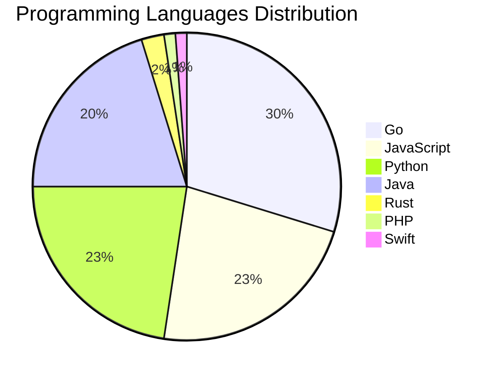

# 🚀 DevTech Auto News - Enhanced Edition


**DevTech Auto News Enhanced** is an advanced automated bot that aggregates trending topics in **AI**, **Web Development**, **Mobile**, **Cloud**, **DevOps**, and more from multiple sources including:

- 📰 [Dev.to](https://dev.to) - Developer community articles
- 🔥 [HackerNews](https://news.ycombinator.com) - Tech news discussions  
- 💻 [GitHub Trending](https://github.com/trending) - Trending repositories
- 🎯 Curated Interview Questions from multiple languages

## ✨ Features

✅ **Multi-Source Aggregation**: Combines articles from Dev.to, HackerNews, and GitHub  
✅ **Smart Categorization**: Automatically categorizes content into 10+ topics  
✅ **Image Support**: Displays cover images for visual appeal  
✅ **Pagination**: Fetches 50+ articles per update with deduplication  
✅ **Language Statistics**: Tracks programming language trends with charts  
✅ **Interview Questions**: Daily coding interview questions in multiple languages  
✅ **GitHub Actions**: Runs every 15 minutes automatically  

---

## 📊 Statistics Dashboard

### 📊 Articles by Category

**AI**: 🟦🟦🟦🟦🟦🟦🟦🟦🟦🟦🟦🟦🟦🟦🟦🟦🟦🟦🟦🟦 47 (44.8%)

**Tools**: 🟦🟦🟦🟦🟦🟦🟦🟦🟦🟦🟦 27 (25.7%)

**JavaScript**: 🟦🟦🟦🟦🟦🟦🟦🟦 19 (18.1%)

**Python**: 🟦🟦🟦🟦🟦🟦🟦🟦 19 (18.1%)

**Cloud**: 🟦🟦🟦 7 (6.7%)

**WebDev**: 🟦🟦🟦 6 (5.7%)

**DevOps**: 🟦🟦 4 (3.8%)

**Database**: 🟦🟦 4 (3.8%)

**Security**: 🟦🟦 4 (3.8%)

**Mobile**:  1 (1.0%)


### 📡 Sources

- **Dev.to**: 60 articles
- **HackerNews**: 30 articles
- **GitHub**: 15 articles


### 💻 Programming Language Trends

```
Go              ██████████████████████████████ 29.8 (29.8%)
JavaScript      ███████████████████████ 22.6 (22.6%)
Python          ███████████████████████ 22.6 (22.6%)
Java            ████████████████████ 20.2 (20.2%)
Rust            ██ 2.4 (2.4%)
PHP             █ 1.2 (1.2%)
Swift           █ 1.2 (1.2%)

```




### 🏷️ Trending Tags

               


---

## 🛠️ How It Works

1. **Multi-Source Fetch**: Pulls from Dev.to (2 pages), HackerNews (3 topics), GitHub (3 languages)
2. **Smart Filter**: Uses keyword matching across 10+ categories  
3. **Deduplication**: Removes duplicate URLs  
4. **Image Extraction**: Captures cover images when available  
5. **Statistics**: Generates language trends and category breakdowns  
6. **Update Files**: Regenerates README and appends to comprehensive log  

---

## 📦 Installation & Usage

```bash
# Clone the repository
git clone https://github.com/Derrick-MUGISHA/github-activity-bot.git
cd github-activity-bot

# Install dependencies  
npm install

# Run manually
npm start

# Test mode
npm run test
```

---


# 🚀 DevTech Auto News - Enhanced Edition

## 📅 Latest Updates (2026-05-14 11:00 CAT)


### 🖼️ Featured Articles

<table>
<tr>
  <td align="center" width="33%">
    <a href="https://dev.to/itsugo/two-dev-users-two-countries-one-weird-little-avatar-project-3gd3">
      
      <br/>
      <b>Two DEV Users. Two Countries. One Weird Little Ava...</b>
    </a>
    <br/>
    <sub>Dev.to</sub>
  </td>
  <td align="center" width="33%">
    <a href="https://dev.to/darkwiiplayer/onclick-is-great-actually-1l3p">
      
      <br/>
      <b>onclick is great, actually</b>
    </a>
    <br/>
    <sub>Dev.to</sub>
  </td>
  <td align="center" width="33%">
    <a href="https://dev.to/aws/lambda-just-got-a-file-system-i-put-ai-agents-on-it-1ej8">
      
      <br/>
      <b>Lambda Just Got a File System. I Put AI Agents on ...</b>
    </a>
    <br/>
    <sub>Dev.to</sub>
  </td>
</tr>
<tr>
  <td align="center" width="33%">
    <a href="https://dev.to/katafrakt/untimely-feedback-as-a-root-cause-of-tech-debt-2ipd">
      
      <br/>
      <b>Untimely feedback as a root cause of tech debt</b>
    </a>
    <br/>
    <sub>Dev.to</sub>
  </td>
  <td align="center" width="33%">
    <a href="https://dev.to/gde/gemini-api-file-search-enhanced-multimodal-capabilities-with-embedding-2-including-open-source-g72">
      
      <br/>
      <b>Gemini API File Search: Enhanced Multimodal Capabi...</b>
    </a>
    <br/>
    <sub>Dev.to</sub>
  </td>
  <td align="center" width="33%">
    <a href="https://dev.to/kalkwst/sql-execution-order-write-queries-that-think-like-the-database-13lf">
      
      <br/>
      <b>SQL Execution Order: Write Queries That Think Like...</b>
    </a>
    <br/>
    <sub>Dev.to</sub>
  </td>
</tr>
</table>


### 📰 Top Headlines

- [Two DEV Users. Two Countries. One Weird Little Avatar Project.](https://dev.to/itsugo/two-dev-users-two-countries-one-weird-little-avatar-project-3gd3) _[Dev.to]_
- [onclick is great, actually](https://dev.to/darkwiiplayer/onclick-is-great-actually-1l3p) _[Dev.to]_
- [Lambda Just Got a File System. I Put AI Agents on It.](https://dev.to/aws/lambda-just-got-a-file-system-i-put-ai-agents-on-it-1ej8) _[Dev.to]_
- [Untimely feedback as a root cause of tech debt](https://dev.to/katafrakt/untimely-feedback-as-a-root-cause-of-tech-debt-2ipd) _[Dev.to]_
- [Gemini API File Search: Enhanced Multimodal Capabilities with Embedding 2, Including Open-Source LINE Bot Implementation](https://dev.to/gde/gemini-api-file-search-enhanced-multimodal-capabilities-with-embedding-2-including-open-source-g72) _[Dev.to]_
- [SQL Execution Order: Write Queries That Think Like the Database](https://dev.to/kalkwst/sql-execution-order-write-queries-that-think-like-the-database-13lf) _[Dev.to]_
- [Deploying a Rust MCP Server to Amazon EKS](https://dev.to/gde/deploying-a-rust-mcp-server-to-amazon-eks-183g) _[Dev.to]_
- [Compile-time vs runtime: where MCP security actually lives](https://dev.to/kcrazy/compile-time-vs-runtime-where-mcp-security-actually-lives-1g6l) _[Dev.to]_
- [GPT-5.5 Instant: The New ChatGPT Default Model Complete Guide 2026](https://dev.to/akaranjkar08/gpt-55-instant-the-new-chatgpt-default-model-complete-guide-2026-1l4) _[Dev.to]_
- [The Tech Giants Cannot Continue Like This: Why We Need an Opt-In Model and "Pay-per-Citation" by Law](https://dev.to/jcarlosweb/the-tech-giants-cannot-continue-like-this-why-we-need-an-opt-in-model-and-pay-per-citation-by-law-4jgl) _[Dev.to]_
- [The Hidden Cost of "It Works": Why Quick Fixes Kill Long-Term Speed](https://dev.to/gavincettolo/the-hidden-cost-of-it-works-why-quick-fixes-kill-long-term-speed-1gi5) _[Dev.to]_
- [I Built a One-Command macOS Terminal Setup — Ghostty + Zsh + 30 Modern CLI Tools](https://dev.to/satyamsoni2211/i-built-a-one-command-macos-terminal-setup-ghostty-zsh-30-modern-cli-tools-43f5) _[Dev.to]_
- [Building Team A: An AI System for Turning Volunteer Chaos into Structured Engineering Work](https://dev.to/miry/building-team-a-an-ai-system-for-turning-volunteer-chaos-into-structured-engineering-work-mgo) _[Dev.to]_
- [Playwright is Powerful, But Managing It at Scale? That's Another Story](https://dev.to/prakashm88/playwright-is-powerful-but-managing-it-at-scale-thats-another-story-2g37) _[Dev.to]_
- [I Built a Chrome Extension to Sync AI Studio System Instructions. Here's Why chrome.storage.sync Couldn't Do It](https://dev.to/codewithahsan/i-built-a-chrome-extension-to-sync-ai-studio-system-instructions-heres-why-chromestoragesync-2llm) _[Dev.to]_
- [MCP Configuration for Google Workspace with Gemini CLI](https://dev.to/gde/mcp-configuration-for-google-workspace-with-gemini-cli-3nd2) _[Dev.to]_
- [Hacking perfectly square AI videos with Veo 3.1 and NanoBanana 2](https://dev.to/googleai/hacking-perfectly-square-ai-videos-with-veo-31-and-nanobanana-2-5cpn) _[Dev.to]_
- [Local-First AI Done Right: How Gemma 4 E2B and 'Thinking Mode' Powered DiagramFlowAI](https://dev.to/gde/local-first-ai-done-right-how-gemma-4-e2b-and-thinking-mode-powered-diagramflowai-3bop) _[Dev.to]_
- [Speed, caching, and the 40x cost wall](https://dev.to/sanketsahu/speed-caching-and-the-40x-cost-wall-2gn0) _[Dev.to]_
- [Computers and upgrades](https://dev.to/unsungnovelty/computers-and-upgrades-3n7f) _[Dev.to]_

_Last automated update: Thu, 14 May 2026 11:13:33 CAT_


## 💡 Daily Interview Questions

_Sharpen your skills with these curated questions_

### 1. DataStructures: Find the median of two sorted arrays

**Difficulty**: Hard | **Topics**: arrays, binary search

<details>
<summary>💡 Hint</summary>

Binary search, partition, time complexity O(log(min(m,n)))

</details>

### 2. JavaScript: Explain event delegation and why it's useful

**Difficulty**: Medium | **Topics**: events, DOM

<details>
<summary>💡 Hint</summary>

Event bubbling, single listener for multiple elements

</details>

### 3. Database: Explain database indexing and when to use it

**Difficulty**: Medium | **Topics**: optimization, performance

<details>
<summary>💡 Hint</summary>

B-tree, trade-offs, query performance

</details>


---

## 📚 Resources

- [Full News Archive](./data/news_log.md) - Complete history of all fetched articles
- [Statistics JSON](./data/stats.json) - Raw statistics data
- [Categorized Data](./data/categorized.json) - Articles organized by category
- [Interview Questions](./data/interview_questions.json) - Complete question bank

---

## 🤝 Contributing

Want to add more sources, categories, or interview questions? Feel free to:

1. Fork this repository
2. Add your improvements
3. Submit a pull request

---

## 📄 License

MIT License - Feel free to use and modify!

---

<p align="center">
  <b>Last automated update: Thu, 14 May 2026 09:13:33 GMT</b><br/>
  <sub>Powered by GitHub Actions | Made with ❤️ for developers</sub>
</p>

---

## 🔗 Quick Links

- [View Workflow](https://github.com/Derrick-MUGISHA/github-activity-bot/actions)
- [Report Issue](https://github.com/Derrick-MUGISHA/github-activity-bot/issues)
- [Suggest Feature](https://github.com/Derrick-MUGISHA/github-activity-bot/issues/new)
