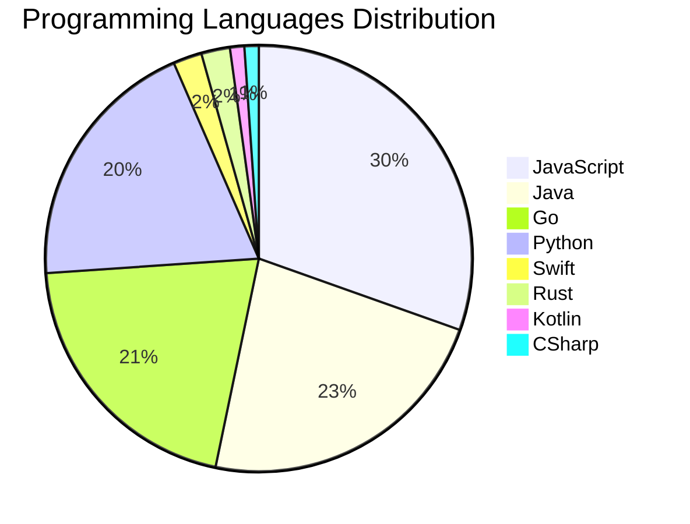

# 🚀 DevTech Auto News - Enhanced Edition


**DevTech Auto News Enhanced** is an advanced automated bot that aggregates trending topics in **AI**, **Web Development**, **Mobile**, **Cloud**, **DevOps**, and more from multiple sources including:

- 📰 [Dev.to](https://dev.to) - Developer community articles
- 🔥 [HackerNews](https://news.ycombinator.com) - Tech news discussions  
- 💻 [GitHub Trending](https://github.com/trending) - Trending repositories
- 🎯 Curated Interview Questions from multiple languages

## ✨ Features

✅ **Multi-Source Aggregation**: Combines articles from Dev.to, HackerNews, and GitHub  
✅ **Smart Categorization**: Automatically categorizes content into 10+ topics  
✅ **Image Support**: Displays cover images for visual appeal  
✅ **Pagination**: Fetches 50+ articles per update with deduplication  
✅ **Language Statistics**: Tracks programming language trends with charts  
✅ **Interview Questions**: Daily coding interview questions in multiple languages  
✅ **GitHub Actions**: Runs every 15 minutes automatically  

---

## 📊 Statistics Dashboard

### 📊 Articles by Category

**AI**: 🟦🟦🟦🟦🟦🟦🟦🟦🟦🟦🟦🟦🟦🟦🟦🟦🟦🟦🟦🟦 47 (44.8%)

**Tools**: 🟦🟦🟦🟦🟦🟦🟦🟦🟦🟦🟦🟦🟦🟦 32 (30.5%)

**JavaScript**: 🟦🟦🟦🟦🟦🟦🟦🟦🟦🟦🟦🟦 28 (26.7%)

**Python**: 🟦🟦🟦🟦🟦🟦🟦🟦 18 (17.1%)

**WebDev**: 🟦🟦🟦 7 (6.7%)

**Security**: 🟦🟦 5 (4.8%)

**DevOps**: 🟦🟦 4 (3.8%)

**Cloud**: 🟦🟦 4 (3.8%)

**Mobile**: 🟦 2 (1.9%)

**Database**: 🟦 2 (1.9%)


### 📡 Sources

- **Dev.to**: 60 articles
- **HackerNews**: 30 articles
- **GitHub**: 15 articles


### 💻 Programming Language Trends

```
JavaScript      ██████████████████████████████ 30.4 (30.4%)
Java            ███████████████████████ 22.8 (22.8%)
Go              ████████████████████ 20.7 (20.7%)
Python          ███████████████████ 19.6 (19.6%)
Swift           ██ 2.2 (2.2%)
Rust            ██ 2.2 (2.2%)
Kotlin          █ 1.1 (1.1%)
CSharp          █ 1.1 (1.1%)

```




### 🏷️ Trending Tags

               


---

## 🛠️ How It Works

1. **Multi-Source Fetch**: Pulls from Dev.to (2 pages), HackerNews (3 topics), GitHub (3 languages)
2. **Smart Filter**: Uses keyword matching across 10+ categories  
3. **Deduplication**: Removes duplicate URLs  
4. **Image Extraction**: Captures cover images when available  
5. **Statistics**: Generates language trends and category breakdowns  
6. **Update Files**: Regenerates README and appends to comprehensive log  

---

## 📦 Installation & Usage

```bash
# Clone the repository
git clone https://github.com/Derrick-MUGISHA/github-activity-bot.git
cd github-activity-bot

# Install dependencies  
npm install

# Run manually
npm start

# Test mode
npm run test
```

---


# 🚀 DevTech Auto News - Enhanced Edition

## 📅 Latest Updates (2026-02-27 21:00 CAT)


### 🖼️ Featured Articles

<table>
<tr>
  <td align="center" width="33%">
    <a href="https://dev.to/devteam/what-was-your-win-this-week-5h33">
      
      <br/>
      <b>What was your win this week?!</b>
    </a>
    <br/>
    <sub>Dev.to</sub>
  </td>
  <td align="center" width="33%">
    <a href="https://dev.to/devteam/join-the-built-with-google-gemini-writing-challenge-presented-by-major-league-hacking-mlh-win-17pk">
      
      <br/>
      <b>Join the "Built with Google Gemini: Writing Challe...</b>
    </a>
    <br/>
    <sub>Dev.to</sub>
  </td>
  <td align="center" width="33%">
    <a href="https://dev.to/devteam/happening-now-dev-weekend-challenge-submissions-due-march-2-at-759am-utc-5fg8">
      
      <br/>
      <b>Happening Now: DEV Weekend Challenge!! Submissions...</b>
    </a>
    <br/>
    <sub>Dev.to</sub>
  </td>
</tr>
<tr>
  <td align="center" width="33%">
    <a href="https://dev.to/dannwaneri/the-token-economy-3cd9">
      
      <br/>
      <b>The Token Economy</b>
    </a>
    <br/>
    <sub>Dev.to</sub>
  </td>
  <td align="center" width="33%">
    <a href="https://dev.to/devteam/upgraded-embed-experience-and-new-embed-types-in-dev-posts-1kho">
      
      <br/>
      <b>Upgraded embed experience and new embed types in D...</b>
    </a>
    <br/>
    <sub>Dev.to</sub>
  </td>
  <td align="center" width="33%">
    <a href="https://dev.to/googleai/a-founders-blueprint-to-creating-a-technical-sales-team-247f">
      
      <br/>
      <b>A Founder’s Blueprint to Creating a Technical Sale...</b>
    </a>
    <br/>
    <sub>Dev.to</sub>
  </td>
</tr>
</table>


### 📰 Top Headlines

- [What was your win this week?!](https://dev.to/devteam/what-was-your-win-this-week-5h33) _[Dev.to]_
- [Join the "Built with Google Gemini: Writing Challenge" Presented by Major League Hacking (MLH). Win a Raspberry Pi AI Kit!](https://dev.to/devteam/join-the-built-with-google-gemini-writing-challenge-presented-by-major-league-hacking-mlh-win-17pk) _[Dev.to]_
- [Happening Now: DEV Weekend Challenge!! Submissions due March 2 at 7:59am UTC.](https://dev.to/devteam/happening-now-dev-weekend-challenge-submissions-due-march-2-at-759am-utc-5fg8) _[Dev.to]_
- [The Token Economy](https://dev.to/dannwaneri/the-token-economy-3cd9) _[Dev.to]_
- [Upgraded embed experience and new embed types in DEV posts](https://dev.to/devteam/upgraded-embed-experience-and-new-embed-types-in-dev-posts-1kho) _[Dev.to]_
- [A Founder’s Blueprint to Creating a Technical Sales Team](https://dev.to/googleai/a-founders-blueprint-to-creating-a-technical-sales-team-247f) _[Dev.to]_
- [The Agent Skills Gold Rush Has a Malware Problem](https://dev.to/meimakes/the-agent-skills-gold-rush-has-a-malware-problem-2jai) _[Dev.to]_
- [Data Pseudonymization: When You Can't Just Delete Everything](https://dev.to/manualwise/data-pseudonymization-when-you-cant-just-delete-everything-4goa) _[Dev.to]_
- [The Developer I'm Grateful I Never Became](https://dev.to/narnaiezzsshaa/the-developer-im-grateful-i-never-became-255d) _[Dev.to]_
- [Domain-First Nx Monorepos: Using `packages/` to Make Ownership and Boundaries Obvious](https://dev.to/codenamegrant/domain-first-nx-monorepos-using-packages-to-make-ownership-and-boundaries-obvious-4h5g) _[Dev.to]_
- [Wiring Claude Into Real Systems With Tool Use](https://dev.to/prabhatkjena/wiring-claude-into-real-systems-with-tool-use-2i86) _[Dev.to]_
- [Preview Deployments with Firebase Hosting & GitHub Actions](https://dev.to/ozantunca/preview-deployments-with-firebase-hosting-github-actions-27ag) _[Dev.to]_
- [Stop Ignoring RFC 2324. It's the Most Important Protocol You've Never Implemented.](https://dev.to/pascal_cescato_692b7a8a20/stop-ignoring-rfc-2324-its-the-most-important-protocol-youve-never-implemented-53pe) _[Dev.to]_
- [Nano Banana 2: Combining Pro capabilities with lightning-fast speed](https://dev.to/googleai/nano-banana-2-combining-pro-capabilities-with-lightning-fast-speed-4fm1) _[Dev.to]_
- [Want your agent to write better code with fewer tokens? Ask the Google AI Team about Agent Skills!](https://dev.to/devteam/want-your-agent-to-write-better-code-with-fewer-tokens-ask-the-google-ai-team-about-agent-skills-44pg) _[Dev.to]_
- [Understanding Next.js Rewrites](https://dev.to/cole_ruche/understanding-nextjs-rewrites-234j) _[Dev.to]_
- [Stop Burning Tokens on Redundant Context: Why your AGENTS.md is failing](https://dev.to/aileenvl/stop-burning-tokens-on-redundant-context-why-your-agentsmd-is-failing-3cpn) _[Dev.to]_
- [claude-sandbox: Yet another sandboxing tool for Claude Code on macOS](https://dev.to/kohkimakimoto/claude-sandbox-yet-another-sandboxing-tool-for-claude-code-on-macos-o6n) _[Dev.to]_
- [Stop Wasting Context](https://dev.to/prathamudeshmukh/stop-wasting-context-34b3) _[Dev.to]_
- [Static Imports Are Undermining JavaScript’s Isomorphism](https://dev.to/flancer64/static-imports-are-undermining-javascripts-isomorphism-25nm) _[Dev.to]_

_Last automated update: Fri, 27 Feb 2026 21:02:25 CAT_


## 💡 Daily Interview Questions

_Sharpen your skills with these curated questions_

### 1. React: What are hooks and why were they introduced?

**Difficulty**: Medium | **Topics**: hooks, functional components

<details>
<summary>💡 Hint</summary>

State in functional components, reusable logic, cleaner code

</details>

### 2. JavaScript: Implement a debounce function from scratch

**Difficulty**: Hard | **Topics**: functions, timing

<details>
<summary>💡 Hint</summary>

setTimeout, clearTimeout, wrapper function

</details>

### 3. Python: What are generators and when would you use them?

**Difficulty**: Medium | **Topics**: iterators, memory

<details>
<summary>💡 Hint</summary>

yield keyword, lazy evaluation, memory efficiency

</details>


---

## 📚 Resources

- [Full News Archive](./data/news_log.md) - Complete history of all fetched articles
- [Statistics JSON](./data/stats.json) - Raw statistics data
- [Categorized Data](./data/categorized.json) - Articles organized by category
- [Interview Questions](./data/interview_questions.json) - Complete question bank

---

## 🤝 Contributing

Want to add more sources, categories, or interview questions? Feel free to:

1. Fork this repository
2. Add your improvements
3. Submit a pull request

---

## 📄 License

MIT License - Feel free to use and modify!

---

<p align="center">
  <b>Last automated update: Fri, 27 Feb 2026 19:02:25 GMT</b><br/>
  <sub>Powered by GitHub Actions | Made with ❤️ for developers</sub>
</p>

---

## 🔗 Quick Links

- [View Workflow](https://github.com/Derrick-MUGISHA/github-activity-bot/actions)
- [Report Issue](https://github.com/Derrick-MUGISHA/github-activity-bot/issues)
- [Suggest Feature](https://github.com/Derrick-MUGISHA/github-activity-bot/issues/new)
