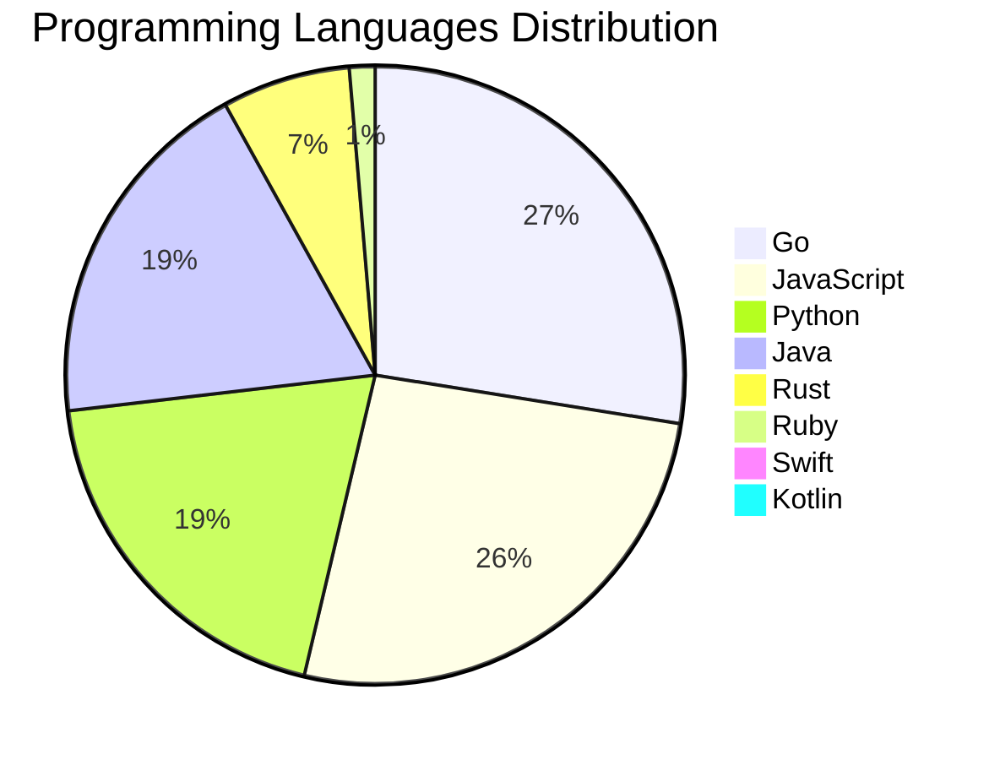

<div align="center">

# 📰 DevTech Auto News

**Your always-fresh digest of developer & AI tech news — curated automatically, around the clock.**


Aggregating [Dev.to](https://dev.to) · [Hacker News](https://news.ycombinator.com) · [GitHub Trending](https://github.com/trending) · [Lobste.rs](https://lobste.rs) · [Stack Overflow](https://stackoverflow.com) · [TechCrunch](https://techcrunch.com) · [freeCodeCamp](https://www.freecodecamp.org/news) — refreshed by GitHub Actions around the clock.

**[📰 Headlines](#-latest-headlines) · [💡 Interview Prep](#-interview-question-of-the-hour) · [📊 Statistics](#-statistics) · [⚙️ How It Works](#%EF%B8%8F-how-it-works)**

</div>

---

## 📰 Latest Headlines

> 🕐 Edition of **2026-09-01 2:00 CAT** — refreshed automatically, all day, every day.

### ✨ Featured Stories

<table>
<tr>
  <td align="center" width="33%">
    <a href="https://dev.to/gde/automate-flutters-new-split-package-migration-with-ai-agent-skills-bn2">
      
      <br/>
      <b>Automate Flutter's New Split Package Migration wit...</b>
    </a>
    <br/>
    <sub>Dev.to</sub>
  </td>
  <td align="center" width="33%">
    <a href="https://dev.to/ben/meme-monday-k1">
      
      <br/>
      <b>Meme Monday</b>
    </a>
    <br/>
    <sub>Dev.to</sub>
  </td>
  <td align="center" width="33%">
    <a href="https://dev.to/gde/overcoming-darts-single-inheritance-wall-composable-cubitsignalmixin-blocsignalmixin-in-flutter-43bf">
      
      <br/>
      <b>Overcoming Dart's Single Inheritance Wall: Composa...</b>
    </a>
    <br/>
    <sub>Dev.to</sub>
  </td>
</tr>
<tr>
  <td align="center" width="33%">
    <a href="https://dev.to/gde/production-flutter-networking-without-the-boilerplate-reactive-repositories-with-blocsignal-4c3c">
      
      <br/>
      <b>Production Flutter Networking Without the Boilerpl...</b>
    </a>
    <br/>
    <sub>Dev.to</sub>
  </td>
  <td align="center" width="33%">
    <a href="https://dev.to/googlecloud/native-cors-support-on-gke-gateway-offloading-cross-origin-policy-management-to-infrastructure-3c0m">
      
      <br/>
      <b>Native CORS support on GKE Gateway: Offloading cro...</b>
    </a>
    <br/>
    <sub>Dev.to</sub>
  </td>
  <td align="center" width="33%">
    <a href="https://dev.to/gde/kubeflow-without-kubernetes-deploy-a-complete-mlops-suite-in-60-seconds-with-gubernator-3moo">
      
      <br/>
      <b>Kubeflow Without Kubernetes? Deploy a Complete MLO...</b>
    </a>
    <br/>
    <sub>Dev.to</sub>
  </td>
</tr>
</table>


### 🗞️ Top Stories

| # | Headline | Source |
|---|----------|--------|
| 1 | [Automate Flutter's New Split Package Migration with AI Agent Skills](https://dev.to/gde/automate-flutters-new-split-package-migration-with-ai-agent-skills-bn2) | Dev.to |
| 2 | [Meme Monday](https://dev.to/ben/meme-monday-k1) | Dev.to |
| 3 | [Overcoming Dart's Single Inheritance Wall: Composable CubitSignalMixin & BlocSignalMixin in Flutter](https://dev.to/gde/overcoming-darts-single-inheritance-wall-composable-cubitsignalmixin-blocsignalmixin-in-flutter-43bf) | Dev.to |
| 4 | [Production Flutter Networking Without the Boilerplate: Reactive Repositories with BlocSignal](https://dev.to/gde/production-flutter-networking-without-the-boilerplate-reactive-repositories-with-blocsignal-4c3c) | Dev.to |
| 5 | [Native CORS support on GKE Gateway: Offloading cross-origin policy management to infrastructure](https://dev.to/googlecloud/native-cors-support-on-gke-gateway-offloading-cross-origin-policy-management-to-infrastructure-3c0m) | Dev.to |
| 6 | [Kubeflow Without Kubernetes? Deploy a Complete MLOps Suite in 60 Seconds with Gubernator](https://dev.to/gde/kubeflow-without-kubernetes-deploy-a-complete-mlops-suite-in-60-seconds-with-gubernator-3moo) | Dev.to |
| 7 | [Two-step control plane upgrades in GKE: How minor version rollbacks work under the hood](https://dev.to/googlecloud/two-step-control-plane-upgrades-in-gke-how-minor-version-rollbacks-work-under-the-hood-i1l) | Dev.to |
| 8 | [Cross Cloud A2A Agent Card Field Comparison](https://dev.to/gde/cross-cloud-a2a-agent-card-field-comparison-2hod) | Dev.to |
| 9 | [What was your win this week?!](https://dev.to/devteam/what-was-your-win-this-week-51oc) | Dev.to |
| 10 | [What Do You Do While AI Codes?](https://dev.to/anchildress1/what-do-you-do-while-ai-codes-k8k) | Dev.to |
| 11 | [What should the next Weekend Challenge theme be??](https://dev.to/devteam/what-should-the-next-weekend-challenge-theme-be-3mha) | Dev.to |
| 12 | [Google Antigravity Comes to VS Code: Agentic Coding Without Leaving Your Editor](https://dev.to/gdg/google-antigravity-comes-to-vs-code-agentic-coding-without-leaving-your-editor-2nkg) | Dev.to |
| 13 | [Grand Central Station: Why BLoC, Riverpod, and BlocSignal Are Now True Peers](https://dev.to/gde/grand-central-station-why-bloc-riverpod-and-blocsignal-are-now-true-peers-3fd8) | Dev.to |
| 14 | [Unlocking workload rightsizing visibility on GKE: How VPA decision logs bring observability to autoscaling](https://dev.to/googlecloud/unlocking-workload-rightsizing-visibility-on-gke-how-vpa-decision-logs-bring-observability-to-17md) | Dev.to |
| 15 | [Accelerating JVM startup on GKE: How VPA CPU startup boost eliminates ongoing resource waste](https://dev.to/googlecloud/accelerating-jvm-startup-on-gke-how-vpa-cpu-startup-boost-eliminates-ongoing-resource-waste-33i2) | Dev.to |
| 16 | [Why AI Websites All Look the Same and How to Build Something Different](https://dev.to/gdg/why-ai-websites-all-look-the-same-and-how-to-build-something-different-1gan) | Dev.to |
| 17 | [Wiring the Reasoning Loop: Gemini + Neo4j + MCP for Multi-Hop AI Agents](https://dev.to/gde/wiring-the-reasoning-loop-gemini-neo4j-mcp-for-multi-hop-ai-agents-51p9) | Dev.to |
| 18 | [Coding agents got boring the moment we built a really good one.](https://dev.to/backboardio/coding-agents-got-boring-the-moment-we-built-a-really-good-one-1mc4) | Dev.to |
| 19 | [Mix and Match: One Agent, Three Clouds, One Protocol](https://dev.to/gde/mix-and-match-one-agent-three-clouds-one-protocol-4e5l) | Dev.to |
| 20 | [I Counted the Attack Vectors in Our AI Stack and Now I Can't Sleep](https://dev.to/jon_at_backboardio/i-counted-the-attack-vectors-in-our-ai-stack-and-now-i-cant-sleep-155o) | Dev.to |

<sub>Last fetched: Tue, 01 Sep 2026 02:39:13 CAT</sub>


---

## 💡 Interview Question of the Hour

> Sharpen your skills — new questions selected on every update. Try answering before opening the hint!

**1. `Python` — Explain decorators in Python with an example**

&nbsp;&nbsp;&nbsp;&nbsp;🎯 Medium · 🏷 functions, metaprogramming

<details>
<summary>&nbsp;&nbsp;&nbsp;&nbsp;💡 Show hint</summary>

> Function wrappers, @syntax, practical uses

</details>

**2. `SystemDesign` — Design a URL shortening service like bit.ly**

&nbsp;&nbsp;&nbsp;&nbsp;🎯 Medium · 🏷 system design, scalability

<details>
<summary>&nbsp;&nbsp;&nbsp;&nbsp;💡 Show hint</summary>

> Hash function, database design, caching, analytics

</details>

**3. `Python` — Implement a context manager using __enter__ and __exit__**

&nbsp;&nbsp;&nbsp;&nbsp;🎯 Hard · 🏷 context managers, resource management

<details>
<summary>&nbsp;&nbsp;&nbsp;&nbsp;💡 Show hint</summary>

> with statement, setup/teardown, exception handling

</details>


---

## 📊 Statistics

#### 🗂 Articles by Category

| Category | Articles | Share | |
|----------|---------:|------:|---|
| **AI** | 78 | 42.4% | `████████████████████` |
| **Tools** | 45 | 24.5% | `████████████░░░░░░░░` |
| **JavaScript** | 39 | 21.2% | `██████████░░░░░░░░░░` |
| **Python** | 29 | 15.8% | `███████░░░░░░░░░░░░░` |
| **Security** | 20 | 10.9% | `█████░░░░░░░░░░░░░░░` |
| **Cloud** | 18 | 9.8% | `█████░░░░░░░░░░░░░░░` |
| **DevOps** | 17 | 9.2% | `████░░░░░░░░░░░░░░░░` |
| **Mobile** | 12 | 6.5% | `███░░░░░░░░░░░░░░░░░` |
| **WebDev** | 8 | 4.3% | `██░░░░░░░░░░░░░░░░░░` |
| **Database** | 4 | 2.2% | `█░░░░░░░░░░░░░░░░░░░` |

<sub>Articles can match more than one category, so shares may sum to over 100%.</sub>


#### 📡 Articles by Source

| Source | Articles |
|--------|---------:|
| Dev.to | 60 |
| HackerNews | 49 |
| GitHub | 25 |
| Lobste.rs | 10 |
| StackOverflow | 20 |
| TechCrunch | 10 |
| freeCodeCamp | 10 |


#### 💻 Programming Language Trends

```
Go              ██████████████████████████████ 27.2%
JavaScript      ████████████████████████████ 25.8%
Python          █████████████████████ 19.2%
Java            ████████████████████ 18.5%
Rust            ███████ 6.6%
Ruby            █ 1.3%
Swift           █ 0.7%
Kotlin          █ 0.7%

```




#### 🏷 Trending Topics

            


---

## ⚙️ How It Works

This repository is a fully automated news pipeline. On every run, GitHub Actions:

1. **Fetches** the latest articles from seven sources: Dev.to, Hacker News, GitHub Trending, Lobste.rs, Stack Overflow, TechCrunch, and freeCodeCamp
2. **Deduplicates and categorizes** them across 10+ topics using keyword matching
3. **Extracts cover images** and computes language & category statistics
4. **Rebuilds this README** and appends everything to the [full archive](./data/news_log.md)
5. **Commits and pushes** the result — no human intervention needed

<details>
<summary><b>🚀 Run it yourself</b></summary>

```bash
git clone https://github.com/Derrick-MUGISHA/github-activity-bot.git
cd github-activity-bot
npm install
npm start
```

Fork the repo, enable GitHub Actions, and you have your own self-updating news feed.

</details>

<details>
<summary><b>📚 Data & resources</b></summary>

- [Full news archive](./data/news_log.md) — complete history of every fetched article
- [Statistics](./data/stats.json) — raw stats data (JSON)
- [Categorized articles](./data/categorized.json) — articles grouped by topic
- [Interview question bank](./data/interview_questions.json) — the full question set

</details>

---

## 🤝 Contributing

Ideas for new sources, categories, or interview questions are welcome — [open an issue](https://github.com/Derrick-MUGISHA/github-activity-bot/issues/new) or submit a pull request.

## 📄 License

Released under the [MIT License](https://opensource.org/licenses/MIT) — free to use, fork, and modify.

---

<div align="center">
  <sub>🤖 Last automated update: <b>Tue, 01 Sep 2026 00:39:13 GMT</b></sub><br/>
  <sub>Powered by GitHub Actions · Built with ❤️ by <a href="https://github.com/Derrick-MUGISHA">Derrick MUGISHA</a></sub>
</div>
