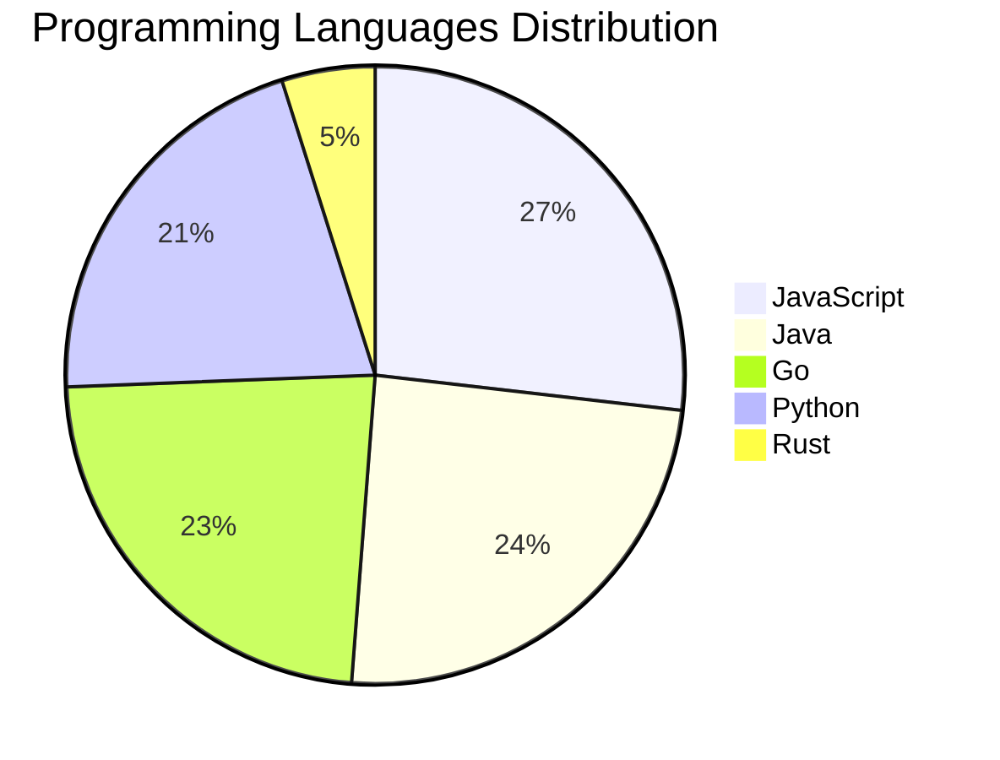

# 🚀 DevTech Auto News - Enhanced Edition


**DevTech Auto News Enhanced** is an advanced automated bot that aggregates trending topics in **AI**, **Web Development**, **Mobile**, **Cloud**, **DevOps**, and more from multiple sources including:

- 📰 [Dev.to](https://dev.to) - Developer community articles
- 🔥 [HackerNews](https://news.ycombinator.com) - Tech news discussions  
- 💻 [GitHub Trending](https://github.com/trending) - Trending repositories
- 🎯 Curated Interview Questions from multiple languages

## ✨ Features

✅ **Multi-Source Aggregation**: Combines articles from Dev.to, HackerNews, and GitHub  
✅ **Smart Categorization**: Automatically categorizes content into 10+ topics  
✅ **Image Support**: Displays cover images for visual appeal  
✅ **Pagination**: Fetches 50+ articles per update with deduplication  
✅ **Language Statistics**: Tracks programming language trends with charts  
✅ **Interview Questions**: Daily coding interview questions in multiple languages  
✅ **GitHub Actions**: Runs every 15 minutes automatically  

---

## 📊 Statistics Dashboard

### 📊 Articles by Category

**AI**: 🟦🟦🟦🟦🟦🟦🟦🟦🟦🟦🟦🟦🟦🟦🟦🟦🟦🟦🟦🟦 62 (59.0%)

**Tools**: 🟦🟦🟦🟦🟦🟦🟦🟦🟦 29 (27.6%)

**JavaScript**: 🟦🟦🟦🟦🟦🟦🟦 22 (21.0%)

**Python**: 🟦🟦🟦🟦🟦 17 (16.2%)

**Cloud**: 🟦🟦🟦 10 (9.5%)

**DevOps**: 🟦 4 (3.8%)

**WebDev**: 🟦 3 (2.9%)

**Security**: 🟦 3 (2.9%)

**Database**: 🟦 2 (1.9%)


### 📡 Sources

- **Dev.to**: 60 articles
- **HackerNews**: 30 articles
- **GitHub**: 15 articles


### 💻 Programming Language Trends

```
JavaScript      ██████████████████████████████ 26.8 (26.8%)
Java            ███████████████████████████ 24.4 (24.4%)
Go              ██████████████████████████ 23.2 (23.2%)
Python          ███████████████████████ 20.7 (20.7%)
Rust            █████ 4.9 (4.9%)

```




### 🏷️ Trending Tags

               


---

## 🛠️ How It Works

1. **Multi-Source Fetch**: Pulls from Dev.to (2 pages), HackerNews (3 topics), GitHub (3 languages)
2. **Smart Filter**: Uses keyword matching across 10+ categories  
3. **Deduplication**: Removes duplicate URLs  
4. **Image Extraction**: Captures cover images when available  
5. **Statistics**: Generates language trends and category breakdowns  
6. **Update Files**: Regenerates README and appends to comprehensive log  

---

## 📦 Installation & Usage

```bash
# Clone the repository
git clone https://github.com/Derrick-MUGISHA/github-activity-bot.git
cd github-activity-bot

# Install dependencies  
npm install

# Run manually
npm start

# Test mode
npm run test
```

---


# 🚀 DevTech Auto News - Enhanced Edition

## 📅 Latest Updates (2026-06-30 18:00 CAT)


### 🖼️ Featured Articles

<table>
<tr>
  <td align="center" width="33%">
    <a href="https://dev.to/devteam/need-a-break-play-todays-game-from-the-daily-context-1fli">
      
      <br/>
      <b>Need a break? Play today's game from The Daily Con...</b>
    </a>
    <br/>
    <sub>Dev.to</sub>
  </td>
  <td align="center" width="33%">
    <a href="https://dev.to/dailycontext/welcome-to-ai-engineer-worlds-fair-2026-2o09">
      
      <br/>
      <b>Welcome to AI Engineer World’s Fair 2026</b>
    </a>
    <br/>
    <sub>Dev.to</sub>
  </td>
  <td align="center" width="33%">
    <a href="https://dev.to/sylwia-lask/whats-next-for-ai-219i">
      
      <br/>
      <b>What's Next for AI?</b>
    </a>
    <br/>
    <sub>Dev.to</sub>
  </td>
</tr>
<tr>
  <td align="center" width="33%">
    <a href="https://dev.to/dannwaneri/someone-else-pays-for-your-ai-access-5149">
      
      <br/>
      <b>Someone Else Pays for Your AI Access</b>
    </a>
    <br/>
    <sub>Dev.to</sub>
  </td>
  <td align="center" width="33%">
    <a href="https://dev.to/dailycontext/hackathon-winners-scoop-35000-in-cash-and-credits-2ddl">
      
      <br/>
      <b>Hackathon Winners Scoop $35,000 In Cash And Credit...</b>
    </a>
    <br/>
    <sub>Dev.to</sub>
  </td>
  <td align="center" width="33%">
    <a href="https://dev.to/dailycontext/this-is-softwares-iphone-moment-16d">
      
      <br/>
      <b>This Is Software’s iPhone Moment</b>
    </a>
    <br/>
    <sub>Dev.to</sub>
  </td>
</tr>
</table>


### 📰 Top Headlines

- [Need a break? Play today's game from The Daily Context.](https://dev.to/devteam/need-a-break-play-todays-game-from-the-daily-context-1fli) _[Dev.to]_
- [Welcome to AI Engineer World’s Fair 2026](https://dev.to/dailycontext/welcome-to-ai-engineer-worlds-fair-2026-2o09) _[Dev.to]_
- [What's Next for AI?](https://dev.to/sylwia-lask/whats-next-for-ai-219i) _[Dev.to]_
- [Someone Else Pays for Your AI Access](https://dev.to/dannwaneri/someone-else-pays-for-your-ai-access-5149) _[Dev.to]_
- [Hackathon Winners Scoop $35,000 In Cash And Credits](https://dev.to/dailycontext/hackathon-winners-scoop-35000-in-cash-and-credits-2ddl) _[Dev.to]_
- [This Is Software’s iPhone Moment](https://dev.to/dailycontext/this-is-softwares-iphone-moment-16d) _[Dev.to]_
- [Pragmatism in an Age of Infinite Code and Unavoidable Bottlenecks](https://dev.to/dailycontext/pragmatism-in-an-age-of-infinite-code-and-unavoidable-bottlenecks-1bkd) _[Dev.to]_
- [The Future Of AI Is Local And Open](https://dev.to/dailycontext/the-future-of-ai-is-local-and-open-522c) _[Dev.to]_
- [Gemma, the Epstein Files, and sandboxing cause a stir at the World's Fair](https://dev.to/dailycontext/gemma-the-epstein-files-and-sandboxing-cause-a-stir-at-the-worlds-fair-2a7p) _[Dev.to]_
- [Developers Urged To Reach Out And Touch Someone](https://dev.to/dailycontext/developers-urged-to-reach-out-and-touch-someone-4943) _[Dev.to]_
- [AI Engineer Meets AI Engineer](https://dev.to/dailycontext/ai-engineer-meets-ai-engineer-1klj) _[Dev.to]_
- [You’re not really that far behind.](https://dev.to/dailycontext/youre-not-really-that-far-behind-h4d) _[Dev.to]_
- [My commit message said "You've hit your session limit"](https://dev.to/shyamala_u/my-commit-message-said-youve-hit-your-session-limit-2abn) _[Dev.to]_
- [Scientists On AI: It’s Still Experimental](https://dev.to/dailycontext/scientists-on-ai-its-still-experimental-5gm3) _[Dev.to]_
- [You Don’t Always Need The Frontier](https://dev.to/dailycontext/you-dont-always-need-the-frontier-1k8o) _[Dev.to]_
- [The Evolution & Role of Context Engineering in AI Today](https://dev.to/dailycontext/the-evolution-role-of-context-engineering-in-ai-today-430f) _[Dev.to]_
- [Fluid, natural voice translation with Gemini 3.5 Live Translate](https://dev.to/googleai/fluid-natural-voice-translation-with-gemini-35-live-translate-27n9) _[Dev.to]_
- [The Log Is the Agent](https://dev.to/dailycontext/the-log-is-the-agent-5096) _[Dev.to]_
- [AI Drone Swarm Shines Out Over San Francisco](https://dev.to/dailycontext/ai-drone-swarm-shines-out-over-san-francisco-20gg) _[Dev.to]_
- [Reconciling the Distributed System: How the AI Engineer World's Fair Engineered Human Connection](https://dev.to/dailycontext/reconciling-the-distributed-system-how-the-ai-engineer-worlds-fair-engineered-human-connection-4p47) _[Dev.to]_

_Last automated update: Tue, 30 Jun 2026 18:16:33 CAT_


## 💡 Daily Interview Questions

_Sharpen your skills with these curated questions_

### 1. Database: Explain database indexing and when to use it

**Difficulty**: Medium | **Topics**: optimization, performance

<details>
<summary>💡 Hint</summary>

B-tree, trade-offs, query performance

</details>

### 2. Database: What is the difference between SQL and NoSQL databases?

**Difficulty**: Easy | **Topics**: databases, design

<details>
<summary>💡 Hint</summary>

Schema, scalability, ACID vs BASE

</details>

### 3. DataStructures: Find the longest substring without repeating characters

**Difficulty**: Medium | **Topics**: strings, sliding window

<details>
<summary>💡 Hint</summary>

Sliding window, hash map, two pointers

</details>


---

## 📚 Resources

- [Full News Archive](./data/news_log.md) - Complete history of all fetched articles
- [Statistics JSON](./data/stats.json) - Raw statistics data
- [Categorized Data](./data/categorized.json) - Articles organized by category
- [Interview Questions](./data/interview_questions.json) - Complete question bank

---

## 🤝 Contributing

Want to add more sources, categories, or interview questions? Feel free to:

1. Fork this repository
2. Add your improvements
3. Submit a pull request

---

## 📄 License

MIT License - Feel free to use and modify!

---

<p align="center">
  <b>Last automated update: Tue, 30 Jun 2026 16:16:33 GMT</b><br/>
  <sub>Powered by GitHub Actions | Made with ❤️ for developers</sub>
</p>

---

## 🔗 Quick Links

- [View Workflow](https://github.com/Derrick-MUGISHA/github-activity-bot/actions)
- [Report Issue](https://github.com/Derrick-MUGISHA/github-activity-bot/issues)
- [Suggest Feature](https://github.com/Derrick-MUGISHA/github-activity-bot/issues/new)
