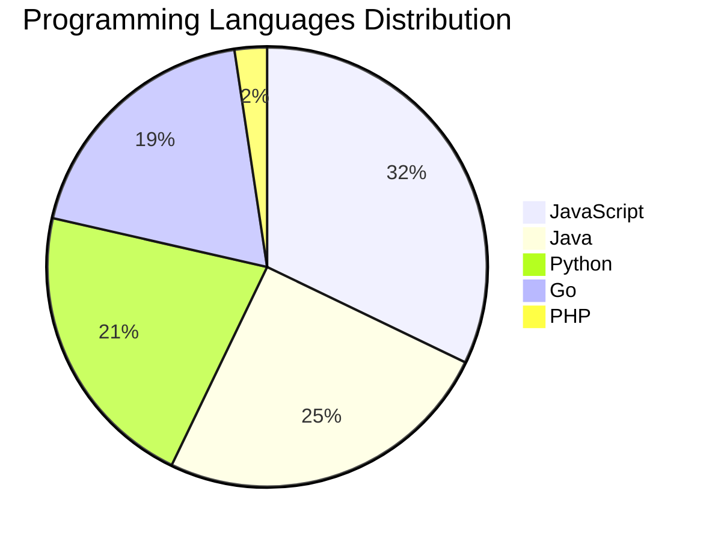

# 🚀 DevTech Auto News - Enhanced Edition


**DevTech Auto News Enhanced** is an advanced automated bot that aggregates trending topics in **AI**, **Web Development**, **Mobile**, **Cloud**, **DevOps**, and more from multiple sources including:

- 📰 [Dev.to](https://dev.to) - Developer community articles
- 🔥 [HackerNews](https://news.ycombinator.com) - Tech news discussions  
- 💻 [GitHub Trending](https://github.com/trending) - Trending repositories
- 🎯 Curated Interview Questions from multiple languages

## ✨ Features

✅ **Multi-Source Aggregation**: Combines articles from Dev.to, HackerNews, and GitHub  
✅ **Smart Categorization**: Automatically categorizes content into 10+ topics  
✅ **Image Support**: Displays cover images for visual appeal  
✅ **Pagination**: Fetches 50+ articles per update with deduplication  
✅ **Language Statistics**: Tracks programming language trends with charts  
✅ **Interview Questions**: Daily coding interview questions in multiple languages  
✅ **GitHub Actions**: Runs every 15 minutes automatically  

---

## 📊 Statistics Dashboard

### 📊 Articles by Category

**AI**: 🟦🟦🟦🟦🟦🟦🟦🟦🟦🟦🟦🟦🟦🟦🟦🟦🟦🟦🟦🟦 51 (48.6%)

**Tools**: 🟦🟦🟦🟦🟦🟦🟦🟦🟦🟦🟦🟦 31 (29.5%)

**JavaScript**: 🟦🟦🟦🟦🟦🟦🟦🟦🟦🟦🟦 27 (25.7%)

**Python**: 🟦🟦🟦🟦🟦🟦🟦 18 (17.1%)

**WebDev**: 🟦🟦🟦🟦 9 (8.6%)

**DevOps**: 🟦🟦 5 (4.8%)

**Database**: 🟦🟦 4 (3.8%)

**Cloud**: 🟦 3 (2.9%)

**Security**: 🟦 3 (2.9%)

**Mobile**:  1 (1.0%)


### 📡 Sources

- **Dev.to**: 60 articles
- **HackerNews**: 30 articles
- **GitHub**: 15 articles


### 💻 Programming Language Trends

```
JavaScript      ██████████████████████████████ 32.1 (32.1%)
Java            ███████████████████████ 25.0 (25.0%)
Python          ████████████████████ 21.4 (21.4%)
Go              ██████████████████ 19.0 (19.0%)
PHP             ██ 2.4 (2.4%)

```




### 🏷️ Trending Tags

               


---

## 🛠️ How It Works

1. **Multi-Source Fetch**: Pulls from Dev.to (2 pages), HackerNews (3 topics), GitHub (3 languages)
2. **Smart Filter**: Uses keyword matching across 10+ categories  
3. **Deduplication**: Removes duplicate URLs  
4. **Image Extraction**: Captures cover images when available  
5. **Statistics**: Generates language trends and category breakdowns  
6. **Update Files**: Regenerates README and appends to comprehensive log  

---

## 📦 Installation & Usage

```bash
# Clone the repository
git clone https://github.com/Derrick-MUGISHA/github-activity-bot.git
cd github-activity-bot

# Install dependencies  
npm install

# Run manually
npm start

# Test mode
npm run test
```

---


# 🚀 DevTech Auto News - Enhanced Edition

## 📅 Latest Updates (2026-03-06 16:00 CAT)


### 🖼️ Featured Articles

<table>
<tr>
  <td align="center" width="33%">
    <a href="https://dev.to/devteam/share-embed-and-curate-agent-sessions-on-dev-beta-5bj6">
      
      <br/>
      <b>Share, Embed, and Curate Agent Sessions on DEV [Be...</b>
    </a>
    <br/>
    <sub>Dev.to</sub>
  </td>
  <td align="center" width="33%">
    <a href="https://dev.to/miss_terry/i-built-a-pixel-art-village-where-ai-characters-have-real-emotions-ccg">
      
      <br/>
      <b>I Built a Pixel Art Village Where AI Characters Ha...</b>
    </a>
    <br/>
    <sub>Dev.to</sub>
  </td>
  <td align="center" width="33%">
    <a href="https://dev.to/iamovi/i-built-a-social-platform-where-everything-vanishes-after-24-hours-3imk">
      
      <br/>
      <b>i built a social platform where everything vanishe...</b>
    </a>
    <br/>
    <sub>Dev.to</sub>
  </td>
</tr>
<tr>
  <td align="center" width="33%">
    <a href="https://dev.to/hamzatopo/i-built-a-tiny-linux-tool-that-shouts-fahh-when-i-type-the-wrong-command-3fio">
      
      <br/>
      <b>I built a tiny Linux tool that shouts “FAHH” when ...</b>
    </a>
    <br/>
    <sub>Dev.to</sub>
  </td>
  <td align="center" width="33%">
    <a href="https://dev.to/gramli/whats-the-worst-advice-ai-has-given-you-heres-mine-58j4">
      
      <br/>
      <b>What’s the Worst Advice AI Has Given You? Here’s M...</b>
    </a>
    <br/>
    <sub>Dev.to</sub>
  </td>
  <td align="center" width="33%">
    <a href="https://dev.to/sovereignrevenueguard/the-silent-behavioral-shift-why-gpt-54-exposes-the-uis-fragile-dependence-on-backend-semantics-1lkl">
      
      <br/>
      <b>The Silent Behavioral Shift: Why GPT-5.4 Exposes t...</b>
    </a>
    <br/>
    <sub>Dev.to</sub>
  </td>
</tr>
</table>


### 📰 Top Headlines

- [Share, Embed, and Curate Agent Sessions on DEV [Beta]](https://dev.to/devteam/share-embed-and-curate-agent-sessions-on-dev-beta-5bj6) _[Dev.to]_
- [I Built a Pixel Art Village Where AI Characters Have Real Emotions](https://dev.to/miss_terry/i-built-a-pixel-art-village-where-ai-characters-have-real-emotions-ccg) _[Dev.to]_
- [i built a social platform where everything vanishes after 24 hours](https://dev.to/iamovi/i-built-a-social-platform-where-everything-vanishes-after-24-hours-3imk) _[Dev.to]_
- [I built a tiny Linux tool that shouts “FAHH” when I type the wrong command](https://dev.to/hamzatopo/i-built-a-tiny-linux-tool-that-shouts-fahh-when-i-type-the-wrong-command-3fio) _[Dev.to]_
- [What’s the Worst Advice AI Has Given You? Here’s Mine.](https://dev.to/gramli/whats-the-worst-advice-ai-has-given-you-heres-mine-58j4) _[Dev.to]_
- [The Silent Behavioral Shift: Why GPT-5.4 Exposes the UI's Fragile Dependence on Backend Semantics](https://dev.to/sovereignrevenueguard/the-silent-behavioral-shift-why-gpt-54-exposes-the-uis-fragile-dependence-on-backend-semantics-1lkl) _[Dev.to]_
- [React: Singletons aren't as evil as you think](https://dev.to/link2twenty/react-singletons-arent-as-evil-as-you-think-44m8) _[Dev.to]_
- [Why I stopped overthinking the Livewire vs. Inertia debate (and how to pick one)](https://dev.to/hamizulfaiz/why-i-stopped-overthinking-the-livewire-vs-inertia-debate-and-how-to-pick-one-5h67) _[Dev.to]_
- [How Do You Actually Know If AI Is Working On Your Team?](https://dev.to/dionysos/how-do-you-actually-know-if-ai-is-working-on-your-team-2b02) _[Dev.to]_
- [How Claude Skills Replaced Our Documentation](https://dev.to/magnusrodseth/how-claude-skills-replaced-our-documentation-emi) _[Dev.to]_
- [The Old Seniority Definition Is Collapsing](https://dev.to/marcosomma/the-old-seniority-definition-is-collapsing-12lj) _[Dev.to]_
- [I used Google Gemini for the First Time. A Deep Analysis of my Experience so far! ✨](https://dev.to/francistrdev/i-used-google-gemini-for-the-first-time-a-deep-analysis-of-my-experience-so-far-2n12) _[Dev.to]_
- [Mastering JavaScript Arrays: A Beginner's Guide to Organize Data Like a Pro](https://dev.to/ritam369/mastering-javascript-arrays-a-beginners-guide-to-organize-data-like-a-pro-2dk0) _[Dev.to]_
- [SaaS Companies Fear Me: Cloning* Granola for Linux](https://dev.to/thisisryanswift/saas-companies-fear-me-cloning-granola-for-linux-3pk0) _[Dev.to]_
- [SQLite as an MCP context saver: stop cramming raw API data into your LLM](https://dev.to/richardbaxter/sqlite-as-an-mcp-context-saver-stop-cramming-raw-api-data-into-your-llm-2oj4) _[Dev.to]_
- [Retention Over Clicks: A Surprising Lesson from Browser Game Analytics](https://dev.to/sebhoek/retention-over-clicks-a-surprising-lesson-from-browser-game-analytics-3o86) _[Dev.to]_
- [How I Use Multi-Agent AI to Debug Production Errors in My Laravel App](https://dev.to/ojie-oriarewo/how-i-use-multi-agent-ai-to-debug-production-errors-in-my-laravel-app-2f90) _[Dev.to]_
- [What should I do and learn in 2026?](https://dev.to/missamarakay/what-should-i-do-and-learn-in-2026-4enc) _[Dev.to]_
- [Fusing NASA Data with AI: How I Built CosmoDex and Won the MLH Data Hackfest!](https://dev.to/astrodeeptej/fusing-nasa-data-with-ai-how-i-built-cosmodex-and-won-the-mlh-data-hackfest-5fmm) _[Dev.to]_
- [In the AI Era, Code Is Cheap. Reputation Isn’t.](https://dev.to/kaleman15/in-the-ai-era-code-is-cheap-reputation-isnt-3482) _[Dev.to]_

_Last automated update: Fri, 06 Mar 2026 16:34:57 CAT_


## 💡 Daily Interview Questions

_Sharpen your skills with these curated questions_

### 1. SystemDesign: Design Twitter's timeline feature

**Difficulty**: Hard | **Topics**: system design, scalability

<details>
<summary>💡 Hint</summary>

Fan-out, caching, ranking, real-time updates

</details>

### 2. DataStructures: Find the median of two sorted arrays

**Difficulty**: Hard | **Topics**: arrays, binary search

<details>
<summary>💡 Hint</summary>

Binary search, partition, time complexity O(log(min(m,n)))

</details>

### 3. NodeJS: What is the difference between process.nextTick() and setImmediate()?

**Difficulty**: Medium | **Topics**: event loop, async

<details>
<summary>💡 Hint</summary>

Execution timing, event loop phases

</details>


---

## 📚 Resources

- [Full News Archive](./data/news_log.md) - Complete history of all fetched articles
- [Statistics JSON](./data/stats.json) - Raw statistics data
- [Categorized Data](./data/categorized.json) - Articles organized by category
- [Interview Questions](./data/interview_questions.json) - Complete question bank

---

## 🤝 Contributing

Want to add more sources, categories, or interview questions? Feel free to:

1. Fork this repository
2. Add your improvements
3. Submit a pull request

---

## 📄 License

MIT License - Feel free to use and modify!

---

<p align="center">
  <b>Last automated update: Fri, 06 Mar 2026 14:34:57 GMT</b><br/>
  <sub>Powered by GitHub Actions | Made with ❤️ for developers</sub>
</p>

---

## 🔗 Quick Links

- [View Workflow](https://github.com/Derrick-MUGISHA/github-activity-bot/actions)
- [Report Issue](https://github.com/Derrick-MUGISHA/github-activity-bot/issues)
- [Suggest Feature](https://github.com/Derrick-MUGISHA/github-activity-bot/issues/new)
