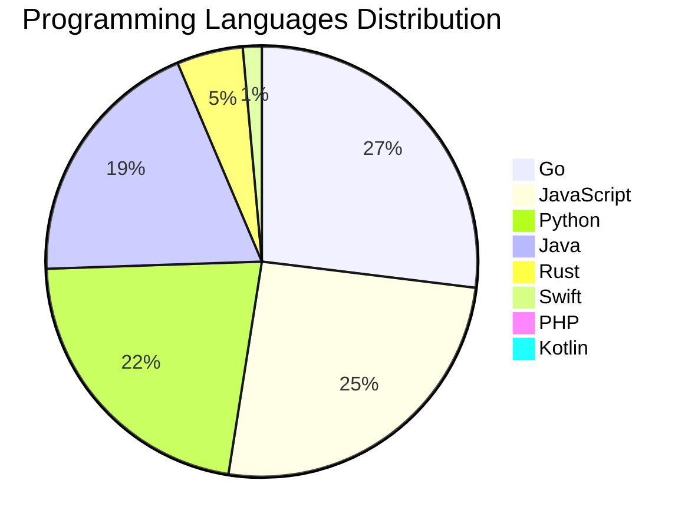

<div align="center">

# 📰 DevTech Auto News

**Your always-fresh digest of developer & AI tech news — curated automatically, around the clock.**


Aggregating [Dev.to](https://dev.to) · [Hacker News](https://news.ycombinator.com) · [GitHub Trending](https://github.com/trending) · [Lobste.rs](https://lobste.rs) · [Stack Overflow](https://stackoverflow.com) · [TechCrunch](https://techcrunch.com) · [freeCodeCamp](https://www.freecodecamp.org/news) — refreshed by GitHub Actions around the clock.

**[📰 Headlines](#-latest-headlines) · [💡 Interview Prep](#-interview-question-of-the-hour) · [📊 Statistics](#-statistics) · [⚙️ How It Works](#%EF%B8%8F-how-it-works)**

</div>

---

## 📰 Latest Headlines

> 🕐 Edition of **2026-07-22 18:00 CAT** — refreshed automatically, all day, every day.

### ✨ Featured Stories

<table>
<tr>
  <td align="center" width="33%">
    <a href="https://dev.to/gde/tpu-management-a-claude-code-skill-for-running-gemma-4-on-cloud-tpus-1b1e">
      
      <br/>
      <b>tpu-management: a Claude Code skill for running Ge...</b>
    </a>
    <br/>
    <sub>Dev.to</sub>
  </td>
  <td align="center" width="33%">
    <a href="https://dev.to/ben/new-gemini-models-dropped-59l8">
      
      <br/>
      <b>New Gemini models dropped

https://blog.google/i...</b>
    </a>
    <br/>
    <sub>Dev.to</sub>
  </td>
  <td align="center" width="33%">
    <a href="https://dev.to/nazar-boyko/ai-and-code-ownership-who-is-responsible-for-generated-code-1dnj">
      
      <br/>
      <b>AI And Code Ownership: Who Is Responsible For Gene...</b>
    </a>
    <br/>
    <sub>Dev.to</sub>
  </td>
</tr>
<tr>
  <td align="center" width="33%">
    <a href="https://dev.to/canro91/ive-spent-10-years-in-software-engineering-after-sickness-burnout-and-a-layoff-im-rebuilding-efc">
      
      <br/>
      <b>I've Spent 10+ Years in Software Engineering. Afte...</b>
    </a>
    <br/>
    <sub>Dev.to</sub>
  </td>
  <td align="center" width="33%">
    <a href="https://dev.to/devteam/top-7-featured-dev-posts-of-the-week-1oei">
      
      <br/>
      <b>Top 7 Featured DEV Posts of the Week</b>
    </a>
    <br/>
    <sub>Dev.to</sub>
  </td>
  <td align="center" width="33%">
    <a href="https://dev.to/googleai/gemini-36-flash-35-flash-lite-developer-guide-i17">
      
      <br/>
      <b>Gemini 3.6 Flash & 3.5 Flash-Lite: Developer guide</b>
    </a>
    <br/>
    <sub>Dev.to</sub>
  </td>
</tr>
</table>


### 🗞️ Top Stories

| # | Headline | Source |
|---|----------|--------|
| 1 | [tpu-management: a Claude Code skill for running Gemma 4 on Cloud TPUs](https://dev.to/gde/tpu-management-a-claude-code-skill-for-running-gemma-4-on-cloud-tpus-1b1e) | Dev.to |
| 2 | [New Gemini models dropped

https://blog.google/innovation-and-ai/models-and-research/gemini-models/gemini-3-6-flash-3-5-flash-lite-3-5-flash-cyber/](https://dev.to/ben/new-gemini-models-dropped-59l8) | Dev.to |
| 3 | [AI And Code Ownership: Who Is Responsible For Generated Code?](https://dev.to/nazar-boyko/ai-and-code-ownership-who-is-responsible-for-generated-code-1dnj) | Dev.to |
| 4 | [I've Spent 10+ Years in Software Engineering. After Sickness, Burnout, and a Layoff, I'm Rebuilding My Career. Ask Me Anything](https://dev.to/canro91/ive-spent-10-years-in-software-engineering-after-sickness-burnout-and-a-layoff-im-rebuilding-efc) | Dev.to |
| 5 | [Top 7 Featured DEV Posts of the Week](https://dev.to/devteam/top-7-featured-dev-posts-of-the-week-1oei) | Dev.to |
| 6 | [Gemini 3.6 Flash & 3.5 Flash-Lite: Developer guide](https://dev.to/googleai/gemini-36-flash-35-flash-lite-developer-guide-i17) | Dev.to |
| 7 | [Google Cloud Labs: Accelerate AI with Cloud Run](https://dev.to/googleai/google-cloud-labs-accelerate-ai-with-cloud-run-md3) | Dev.to |
| 8 | [Gemma4 DevOps In Action](https://dev.to/gde/gemma4-devops-in-action-10bl) | Dev.to |
| 9 | [Gemma 4 E2B on a Single TPU v6e Chip: A Serving Deep Dive](https://dev.to/gde/gemma-4-e2b-on-a-single-tpu-v6e-chip-a-serving-deep-dive-53n) | Dev.to |
| 10 | [Context Is King: Rethinking Domain Ownership, Product, and the "Spec Phase"](https://dev.to/ben/context-is-king-rethinking-domain-ownership-product-and-the-spec-phase-gp8) | Dev.to |
| 11 | [TPU Deployments with Gemma 31B, v6e-8, and Antigravity CLI](https://dev.to/gde/tpu-deployments-with-gemma-31b-v6e-8-and-antigravity-cli-3e4n) | Dev.to |
| 12 | [From Apple Health Data to Clinical Storytelling: Building an AI-Powered Report with Python and Gemini](https://dev.to/gdg/from-apple-health-data-to-clinical-storytelling-building-an-ai-powered-report-with-python-and-3n8n) | Dev.to |
| 13 | [Debugging Deployments with Gemma 2B, TPU v6e-1, MCP, and Antigravity CLI](https://dev.to/gde/debugging-deployments-with-gemma-2b-tpu-v6e-1-mcp-and-antigravity-cli-3hh3) | Dev.to |
| 14 | [[GCP Billing & Vertex AI] Solving Gemini Cost Allocation in a Single Project: Vertex AI Dynamic Billing Labels in Action](https://dev.to/gde/gcp-billing-vertex-ai-solving-gemini-cost-allocation-in-a-single-project-vertex-ai-dynamic-5aok) | Dev.to |
| 15 | [Should I quit IT or just live through the burnout?](https://dev.to/klaudiagrz/should-i-quit-it-or-just-live-through-the-burnout-1gng) | Dev.to |
| 16 | [Build Firebase AI Logic Application with Antigravity CLI and Stitch MCP Server [GDE]](https://dev.to/gde/build-firebase-ai-logic-application-with-antigravity-cli-and-stitch-mcp-server-gde-g6o) | Dev.to |
| 17 | [Debugging Deployments with Gemma 4B, TPU v6e-4, MCP, and Antigravity CLI](https://dev.to/gde/debugging-deployments-with-gemma-4b-tpu-v6e-4-mcp-and-antigravity-cli-1l82) | Dev.to |
| 18 | [MCP Configuration for Looker with Antigravity CLI](https://dev.to/gde/mcp-configuration-for-looker-with-antigravity-cli-504d) | Dev.to |
| 19 | [How to Respectfully Contribute to Open Source](https://dev.to/opensourcepledge/how-to-respectfully-contribute-to-open-source-cbh) | Dev.to |
| 20 | [4B Gemma 4 QAT Deployment with GCE, NVIDIA L4, MCP, and Antigravity CLI](https://dev.to/gde/4b-gemma-4-qat-deployment-with-gce-nvidia-l4-mcp-and-antigravity-cli-gh6) | Dev.to |

<sub>Last fetched: Wed, 22 Jul 2026 18:56:07 CAT</sub>


---

## 💡 Interview Question of the Hour

> Sharpen your skills — new questions selected on every update. Try answering before opening the hint!

**1. `React` — What are hooks and why were they introduced?**

&nbsp;&nbsp;&nbsp;&nbsp;🎯 Medium · 🏷 hooks, functional components

<details>
<summary>&nbsp;&nbsp;&nbsp;&nbsp;💡 Show hint</summary>

> State in functional components, reusable logic, cleaner code

</details>

**2. `Database` — What is the difference between SQL and NoSQL databases?**

&nbsp;&nbsp;&nbsp;&nbsp;🎯 Easy · 🏷 databases, design

<details>
<summary>&nbsp;&nbsp;&nbsp;&nbsp;💡 Show hint</summary>

> Schema, scalability, ACID vs BASE

</details>

**3. `SystemDesign` — Design a distributed cache system**

&nbsp;&nbsp;&nbsp;&nbsp;🎯 Hard · 🏷 distributed systems, caching

<details>
<summary>&nbsp;&nbsp;&nbsp;&nbsp;💡 Show hint</summary>

> Consistency, partitioning, replication, eviction policies

</details>


---

## 📊 Statistics

#### 🗂 Articles by Category

| Category | Articles | Share | |
|----------|---------:|------:|---|
| **AI** | 78 | 42.9% | `████████████████████` |
| **Tools** | 43 | 23.6% | `███████████░░░░░░░░░` |
| **JavaScript** | 36 | 19.8% | `█████████░░░░░░░░░░░` |
| **Python** | 32 | 17.6% | `████████░░░░░░░░░░░░` |
| **Cloud** | 22 | 12.1% | `██████░░░░░░░░░░░░░░` |
| **Security** | 18 | 9.9% | `█████░░░░░░░░░░░░░░░` |
| **DevOps** | 16 | 8.8% | `████░░░░░░░░░░░░░░░░` |
| **WebDev** | 7 | 3.8% | `██░░░░░░░░░░░░░░░░░░` |
| **Database** | 6 | 3.3% | `██░░░░░░░░░░░░░░░░░░` |
| **Mobile** | 3 | 1.6% | `█░░░░░░░░░░░░░░░░░░░` |

<sub>Articles can match more than one category, so shares may sum to over 100%.</sub>


#### 📡 Articles by Source

| Source | Articles |
|--------|---------:|
| Dev.to | 59 |
| HackerNews | 48 |
| Lobste.rs | 10 |
| GitHub | 25 |
| StackOverflow | 20 |
| TechCrunch | 10 |
| freeCodeCamp | 10 |


#### 💻 Programming Language Trends

```
Go              ██████████████████████████████ 26.6%
JavaScript      ████████████████████████████ 25.2%
Python          ████████████████████████ 21.7%
Java            █████████████████████ 18.9%
Rust            ██████ 4.9%
Swift           ██ 1.4%
PHP             █ 0.7%
Kotlin          █ 0.7%

```




#### 🏷 Trending Topics

            


---

## ⚙️ How It Works

This repository is a fully automated news pipeline. On every run, GitHub Actions:

1. **Fetches** the latest articles from seven sources: Dev.to, Hacker News, GitHub Trending, Lobste.rs, Stack Overflow, TechCrunch, and freeCodeCamp
2. **Deduplicates and categorizes** them across 10+ topics using keyword matching
3. **Extracts cover images** and computes language & category statistics
4. **Rebuilds this README** and appends everything to the [full archive](./data/news_log.md)
5. **Commits and pushes** the result — no human intervention needed

<details>
<summary><b>🚀 Run it yourself</b></summary>

```bash
git clone https://github.com/Derrick-MUGISHA/github-activity-bot.git
cd github-activity-bot
npm install
npm start
```

Fork the repo, enable GitHub Actions, and you have your own self-updating news feed.

</details>

<details>
<summary><b>📚 Data & resources</b></summary>

- [Full news archive](./data/news_log.md) — complete history of every fetched article
- [Statistics](./data/stats.json) — raw stats data (JSON)
- [Categorized articles](./data/categorized.json) — articles grouped by topic
- [Interview question bank](./data/interview_questions.json) — the full question set

</details>

---

## 🤝 Contributing

Ideas for new sources, categories, or interview questions are welcome — [open an issue](https://github.com/Derrick-MUGISHA/github-activity-bot/issues/new) or submit a pull request.

## 📄 License

Released under the [MIT License](https://opensource.org/licenses/MIT) — free to use, fork, and modify.

---

<div align="center">
  <sub>🤖 Last automated update: <b>Wed, 22 Jul 2026 16:56:07 GMT</b></sub><br/>
  <sub>Powered by GitHub Actions · Built with ❤️ by <a href="https://github.com/Derrick-MUGISHA">Derrick MUGISHA</a></sub>
</div>
