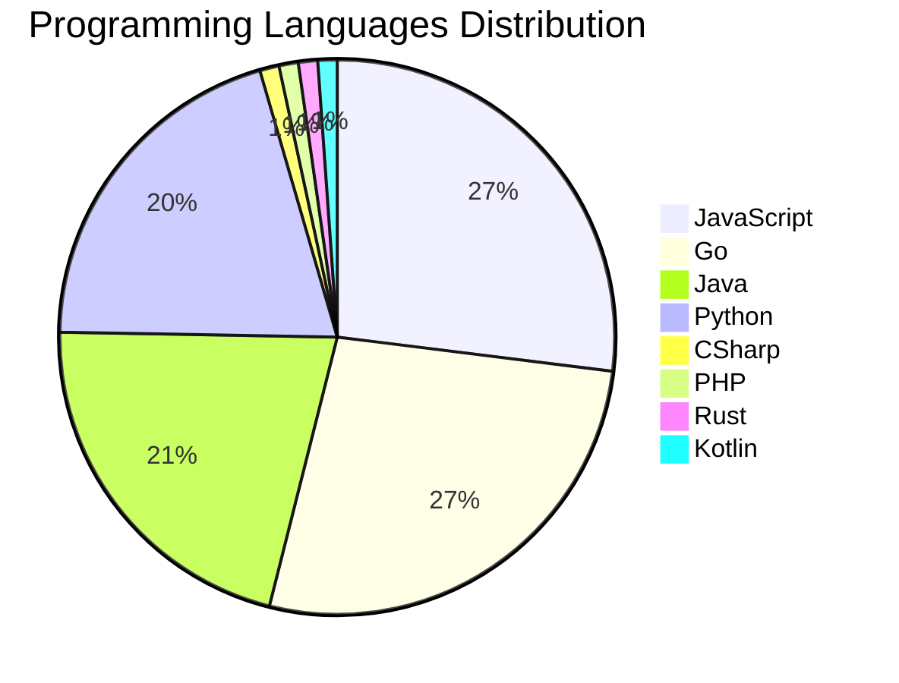

# 🚀 DevTech Auto News - Enhanced Edition


**DevTech Auto News Enhanced** is an advanced automated bot that aggregates trending topics in **AI**, **Web Development**, **Mobile**, **Cloud**, **DevOps**, and more from multiple sources including:

- 📰 [Dev.to](https://dev.to) - Developer community articles
- 🔥 [HackerNews](https://news.ycombinator.com) - Tech news discussions  
- 💻 [GitHub Trending](https://github.com/trending) - Trending repositories
- 🎯 Curated Interview Questions from multiple languages

## ✨ Features

✅ **Multi-Source Aggregation**: Combines articles from Dev.to, HackerNews, and GitHub  
✅ **Smart Categorization**: Automatically categorizes content into 10+ topics  
✅ **Image Support**: Displays cover images for visual appeal  
✅ **Pagination**: Fetches 50+ articles per update with deduplication  
✅ **Language Statistics**: Tracks programming language trends with charts  
✅ **Interview Questions**: Daily coding interview questions in multiple languages  
✅ **GitHub Actions**: Runs every 15 minutes automatically  

---

## 📊 Statistics Dashboard

### 📊 Articles by Category

**AI**: 🟦🟦🟦🟦🟦🟦🟦🟦🟦🟦🟦🟦🟦🟦🟦🟦🟦🟦🟦🟦 46 (43.8%)

**Tools**: 🟦🟦🟦🟦🟦🟦🟦🟦🟦🟦🟦🟦🟦🟦 33 (31.4%)

**JavaScript**: 🟦🟦🟦🟦🟦🟦🟦🟦🟦🟦 24 (22.9%)

**Python**: 🟦🟦🟦🟦🟦🟦🟦🟦 18 (17.1%)

**Cloud**: 🟦🟦🟦🟦🟦🟦🟦 16 (15.2%)

**DevOps**: 🟦🟦🟦 6 (5.7%)

**WebDev**: 🟦🟦 5 (4.8%)

**Security**: 🟦 3 (2.9%)

**Mobile**:  1 (1.0%)

**Database**:  1 (1.0%)


### 📡 Sources

- **Dev.to**: 60 articles
- **HackerNews**: 30 articles
- **GitHub**: 15 articles


### 💻 Programming Language Trends

```
JavaScript      ██████████████████████████████ 27.0 (27.0%)
Go              ██████████████████████████████ 27.0 (27.0%)
Java            ████████████████████████ 21.3 (21.3%)
Python          ██████████████████████ 20.2 (20.2%)
CSharp          █ 1.1 (1.1%)
PHP             █ 1.1 (1.1%)
Rust            █ 1.1 (1.1%)
Kotlin          █ 1.1 (1.1%)

```




### 🏷️ Trending Tags

               


---

## 🛠️ How It Works

1. **Multi-Source Fetch**: Pulls from Dev.to (2 pages), HackerNews (3 topics), GitHub (3 languages)
2. **Smart Filter**: Uses keyword matching across 10+ categories  
3. **Deduplication**: Removes duplicate URLs  
4. **Image Extraction**: Captures cover images when available  
5. **Statistics**: Generates language trends and category breakdowns  
6. **Update Files**: Regenerates README and appends to comprehensive log  

---

## 📦 Installation & Usage

```bash
# Clone the repository
git clone https://github.com/Derrick-MUGISHA/github-activity-bot.git
cd github-activity-bot

# Install dependencies  
npm install

# Run manually
npm start

# Test mode
npm run test
```

---


# 🚀 DevTech Auto News - Enhanced Edition

## 📅 Latest Updates (2026-06-04 7:00 CAT)


### 🖼️ Featured Articles

<table>
<tr>
  <td align="center" width="33%">
    <a href="https://dev.to/devteam/join-the-june-solstice-game-jam-1000-in-prizes-3jla">
      
      <br/>
      <b>Join the June Solstice Game Jam: $1,000 in prizes!</b>
    </a>
    <br/>
    <sub>Dev.to</sub>
  </td>
  <td align="center" width="33%">
    <a href="https://dev.to/marcosomma/am-i-becoming-too-slow-for-the-ai-world-1904">
      
      <br/>
      <b>Am I Becoming Too Slow for the AI World?</b>
    </a>
    <br/>
    <sub>Dev.to</sub>
  </td>
  <td align="center" width="33%">
    <a href="https://dev.to/devteam/want-to-work-with-me-were-hiring-a-community-program-manager-at-dev-3fol">
      
      <br/>
      <b>Want to work with me? We're hiring a Community Pro...</b>
    </a>
    <br/>
    <sub>Dev.to</sub>
  </td>
</tr>
<tr>
  <td align="center" width="33%">
    <a href="https://dev.to/shubhradev/after-7-nextjs-16-caching-bugs-i-stopped-guessing-and-built-a-system-4ijp">
      
      <br/>
      <b>After 7 Next.js 16 Caching Bugs, I Stopped Guessin...</b>
    </a>
    <br/>
    <sub>Dev.to</sub>
  </td>
  <td align="center" width="33%">
    <a href="https://dev.to/devteam/top-7-featured-dev-posts-of-the-week-62k">
      
      <br/>
      <b>Top 7 Featured DEV Posts of the Week</b>
    </a>
    <br/>
    <sub>Dev.to</sub>
  </td>
  <td align="center" width="33%">
    <a href="https://dev.to/googlecloud/surviving-the-eviction-how-to-build-interrupt-resilient-ai-workloads-on-gke-5581">
      
      <br/>
      <b>Surviving the eviction: How to build interrupt-res...</b>
    </a>
    <br/>
    <sub>Dev.to</sub>
  </td>
</tr>
</table>


### 📰 Top Headlines

- [Join the June Solstice Game Jam: $1,000 in prizes!](https://dev.to/devteam/join-the-june-solstice-game-jam-1000-in-prizes-3jla) _[Dev.to]_
- [Am I Becoming Too Slow for the AI World?](https://dev.to/marcosomma/am-i-becoming-too-slow-for-the-ai-world-1904) _[Dev.to]_
- [Want to work with me? We're hiring a Community Program Manager at DEV!](https://dev.to/devteam/want-to-work-with-me-were-hiring-a-community-program-manager-at-dev-3fol) _[Dev.to]_
- [After 7 Next.js 16 Caching Bugs, I Stopped Guessing and Built a System](https://dev.to/shubhradev/after-7-nextjs-16-caching-bugs-i-stopped-guessing-and-built-a-system-4ijp) _[Dev.to]_
- [Top 7 Featured DEV Posts of the Week](https://dev.to/devteam/top-7-featured-dev-posts-of-the-week-62k) _[Dev.to]_
- [Surviving the eviction: How to build interrupt-resilient AI workloads on GKE](https://dev.to/googlecloud/surviving-the-eviction-how-to-build-interrupt-resilient-ai-workloads-on-gke-5581) _[Dev.to]_
- [Every tool seems to have a coding agent horned in these days..... I don't think that makes sense.](https://dev.to/ben/every-tool-seems-to-have-a-coding-agent-horned-in-these-days-i-dont-think-that-makes-sense-3db) _[Dev.to]_
- [How we turned the Replay keynote surprise into an open-source embedded playground](https://dev.to/temporalio/how-we-turned-the-replay-keynote-surprise-into-an-open-source-embedded-playground-49hm) _[Dev.to]_
- [What I'm building, and why](https://dev.to/harish_kumar/what-im-building-and-why-4o3n) _[Dev.to]_
- [Malicious npm Packages With Valid SLSA Provenance: Inside the TanStack Attack](https://dev.to/olivrg/malicious-npm-packages-with-valid-slsa-provenance-inside-the-tanstack-attack-2gi9) _[Dev.to]_
- [Gubernator [the kill ku8s]](https://dev.to/gde/gubernator-the-kill-ku8s-2g0e) _[Dev.to]_
- [I Built an Autonomous AI Agent with Google ADK + Gemini That Spots Trends and Drafts Dev.to Articles for Me](https://dev.to/gde/i-built-an-autonomous-ai-agent-with-google-adk-gemini-20-flash-that-spots-trends-and-drafts-60) _[Dev.to]_
- [Learning Lessons from Gaming](https://dev.to/ingosteinke/learning-lessons-from-gaming-1jgm) _[Dev.to]_
- [31B — Gemma 4 Deployment with NVIDIA L4, MCP, Cloud Run, and Antigravity CLI](https://dev.to/gde/31b-gemma-4-deployment-with-nvidia-l4-mcp-cloud-run-and-antigravity-cli-2334) _[Dev.to]_
- [26B Gemma 4 Deployment with NVIDIA L4, MCP, Cloud Run, and Antigravity CLI](https://dev.to/gde/26b-gemma-4-deployment-with-nvidia-l4-mcp-cloud-run-and-antigravity-cli-194p) _[Dev.to]_
- [Executing Google Apps Script on Complex Schedules using Vibe Coding](https://dev.to/gde/executing-google-apps-script-on-complex-schedules-using-vibe-coding-1i3m) _[Dev.to]_
- [TypeScript Monorepo Magic: Organize, Build, and Ship Multi-Package Apps](https://dev.to/_mh/typescript-monorepo-magic-organize-build-and-ship-multi-package-apps-4cgf) _[Dev.to]_
- [[Gemini][Agent] Google Managed Agents API](https://dev.to/gde/geminiagent-google-managed-agents-api-4e43) _[Dev.to]_
- [Stop writing prompts to classify text: make evaluation declarative](https://dev.to/ayoolasolomon/stop-writing-prompts-to-classify-text-make-evaluation-declarative-5555) _[Dev.to]_
- [Debloating The AI-Grown Codebase](https://dev.to/maximsaplin/debloating-the-ai-grown-codebase-2om) _[Dev.to]_

_Last automated update: Thu, 04 Jun 2026 07:23:03 CAT_


## 💡 Daily Interview Questions

_Sharpen your skills with these curated questions_

### 1. Java: Explain the Java memory model

**Difficulty**: Hard | **Topics**: memory, JVM

<details>
<summary>💡 Hint</summary>

Heap, stack, garbage collection

</details>

### 2. JavaScript: What are closures and provide a practical example?

**Difficulty**: Medium | **Topics**: functions, scope

<details>
<summary>💡 Hint</summary>

Function + lexical environment, data privacy, callbacks

</details>

### 3. Database: Design a database schema for a social media platform

**Difficulty**: Hard | **Topics**: design, scalability

<details>
<summary>💡 Hint</summary>

Users, posts, relationships, indexes, partitioning

</details>


---

## 📚 Resources

- [Full News Archive](./data/news_log.md) - Complete history of all fetched articles
- [Statistics JSON](./data/stats.json) - Raw statistics data
- [Categorized Data](./data/categorized.json) - Articles organized by category
- [Interview Questions](./data/interview_questions.json) - Complete question bank

---

## 🤝 Contributing

Want to add more sources, categories, or interview questions? Feel free to:

1. Fork this repository
2. Add your improvements
3. Submit a pull request

---

## 📄 License

MIT License - Feel free to use and modify!

---

<p align="center">
  <b>Last automated update: Thu, 04 Jun 2026 05:23:03 GMT</b><br/>
  <sub>Powered by GitHub Actions | Made with ❤️ for developers</sub>
</p>

---

## 🔗 Quick Links

- [View Workflow](https://github.com/Derrick-MUGISHA/github-activity-bot/actions)
- [Report Issue](https://github.com/Derrick-MUGISHA/github-activity-bot/issues)
- [Suggest Feature](https://github.com/Derrick-MUGISHA/github-activity-bot/issues/new)
