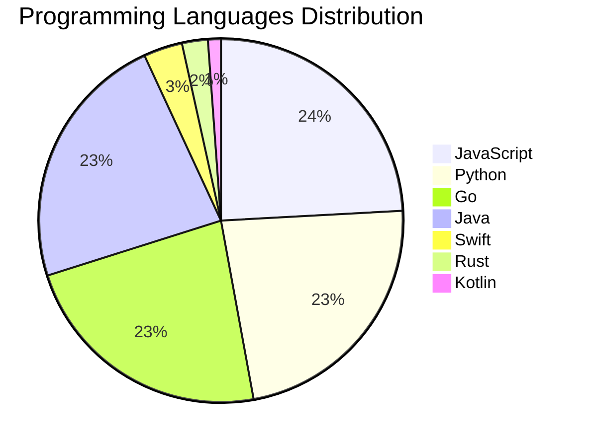

# 🚀 DevTech Auto News - Enhanced Edition


**DevTech Auto News Enhanced** is an advanced automated bot that aggregates trending topics in **AI**, **Web Development**, **Mobile**, **Cloud**, **DevOps**, and more from multiple sources including:

- 📰 [Dev.to](https://dev.to) - Developer community articles
- 🔥 [HackerNews](https://news.ycombinator.com) - Tech news discussions  
- 💻 [GitHub Trending](https://github.com/trending) - Trending repositories
- 🎯 Curated Interview Questions from multiple languages

## ✨ Features

✅ **Multi-Source Aggregation**: Combines articles from Dev.to, HackerNews, and GitHub  
✅ **Smart Categorization**: Automatically categorizes content into 10+ topics  
✅ **Image Support**: Displays cover images for visual appeal  
✅ **Pagination**: Fetches 50+ articles per update with deduplication  
✅ **Language Statistics**: Tracks programming language trends with charts  
✅ **Interview Questions**: Daily coding interview questions in multiple languages  
✅ **GitHub Actions**: Runs every 15 minutes automatically  

---

## 📊 Statistics Dashboard

### 📊 Articles by Category

**AI**: 🟦🟦🟦🟦🟦🟦🟦🟦🟦🟦🟦🟦🟦🟦🟦🟦🟦🟦🟦🟦 53 (50.5%)

**Tools**: 🟦🟦🟦🟦🟦🟦🟦🟦🟦🟦 27 (25.7%)

**JavaScript**: 🟦🟦🟦🟦🟦🟦🟦🟦 21 (20.0%)

**Python**: 🟦🟦🟦🟦🟦🟦🟦🟦 21 (20.0%)

**Security**: 🟦🟦🟦 8 (7.6%)

**Cloud**: 🟦🟦 6 (5.7%)

**DevOps**: 🟦🟦 4 (3.8%)

**WebDev**: 🟦🟦 4 (3.8%)

**Mobile**: 🟦 3 (2.9%)

**Database**: 🟦 3 (2.9%)


### 📡 Sources

- **Dev.to**: 60 articles
- **HackerNews**: 30 articles
- **GitHub**: 15 articles


### 💻 Programming Language Trends

```
JavaScript      ██████████████████████████████ 24.1 (24.1%)
Python          █████████████████████████████ 23.0 (23.0%)
Go              █████████████████████████████ 23.0 (23.0%)
Java            █████████████████████████████ 23.0 (23.0%)
Swift           ████ 3.4 (3.4%)
Rust            ███ 2.3 (2.3%)
Kotlin          █ 1.1 (1.1%)

```




### 🏷️ Trending Tags

               


---

## 🛠️ How It Works

1. **Multi-Source Fetch**: Pulls from Dev.to (2 pages), HackerNews (3 topics), GitHub (3 languages)
2. **Smart Filter**: Uses keyword matching across 10+ categories  
3. **Deduplication**: Removes duplicate URLs  
4. **Image Extraction**: Captures cover images when available  
5. **Statistics**: Generates language trends and category breakdowns  
6. **Update Files**: Regenerates README and appends to comprehensive log  

---

## 📦 Installation & Usage

```bash
# Clone the repository
git clone https://github.com/Derrick-MUGISHA/github-activity-bot.git
cd github-activity-bot

# Install dependencies  
npm install

# Run manually
npm start

# Test mode
npm run test
```

---


# 🚀 DevTech Auto News - Enhanced Edition

## 📅 Latest Updates (2026-03-25 7:00 CAT)


### 🖼️ Featured Articles

<table>
<tr>
  <td align="center" width="33%">
    <a href="https://dev.to/francistrdev/check-up-with-each-other-2ogc">
      
      <br/>
      <b>Check Up with Each Other</b>
    </a>
    <br/>
    <sub>Dev.to</sub>
  </td>
  <td align="center" width="33%">
    <a href="https://dev.to/devteam/top-7-featured-dev-posts-of-the-week-4ig2">
      
      <br/>
      <b>Top 7 Featured DEV Posts of the Week</b>
    </a>
    <br/>
    <sub>Dev.to</sub>
  </td>
  <td align="center" width="33%">
    <a href="https://dev.to/ben/meme-monday-1bec">
      
      <br/>
      <b>Meme Monday</b>
    </a>
    <br/>
    <sub>Dev.to</sub>
  </td>
</tr>
<tr>
  <td align="center" width="33%">
    <a href="https://dev.to/gde/implementing-a-rag-system-crawl-5li">
      
      <br/>
      <b>Implementing a RAG system: Crawl</b>
    </a>
    <br/>
    <sub>Dev.to</sub>
  </td>
  <td align="center" width="33%">
    <a href="https://dev.to/gde/deploy-a-multi-agent-adk-application-to-google-cloud-run-59on">
      
      <br/>
      <b>Deploy a Multi Agent ADK Application to Google Clo...</b>
    </a>
    <br/>
    <sub>Dev.to</sub>
  </td>
  <td align="center" width="33%">
    <a href="https://dev.to/gde/building-a-multimodal-cross-cloud-live-agent-with-adk-amazon-lightsail-and-gemini-cli-4p56">
      
      <br/>
      <b>Building a Multimodal Cross Cloud Live Agent with ...</b>
    </a>
    <br/>
    <sub>Dev.to</sub>
  </td>
</tr>
</table>


### 📰 Top Headlines

- [Check Up with Each Other](https://dev.to/francistrdev/check-up-with-each-other-2ogc) _[Dev.to]_
- [Top 7 Featured DEV Posts of the Week](https://dev.to/devteam/top-7-featured-dev-posts-of-the-week-4ig2) _[Dev.to]_
- [Meme Monday](https://dev.to/ben/meme-monday-1bec) _[Dev.to]_
- [Implementing a RAG system: Crawl](https://dev.to/gde/implementing-a-rag-system-crawl-5li) _[Dev.to]_
- [Deploy a Multi Agent ADK Application to Google Cloud Run](https://dev.to/gde/deploy-a-multi-agent-adk-application-to-google-cloud-run-59on) _[Dev.to]_
- [Building a Multimodal Cross Cloud Live Agent with ADK, Amazon Lightsail, and Gemini CLI](https://dev.to/gde/building-a-multimodal-cross-cloud-live-agent-with-adk-amazon-lightsail-and-gemini-cli-4p56) _[Dev.to]_
- [AI Writes Code. You Own Quality.](https://dev.to/helderberto/ai-writes-code-you-own-quality-19g0) _[Dev.to]_
- [Building a Weather Station Using an Old Raspberry Pi](https://dev.to/nandofm/building-a-weather-station-using-an-old-raspberry-pi-5333) _[Dev.to]_
- [I built a terminal-native Little Snitch alternative for macOS](https://dev.to/nickciolpan/i-built-a-terminal-native-little-snitch-alternative-for-macos-4807) _[Dev.to]_
- [I Built a Type-Safe SI Unit Library in Swift — And the Compiler Catches Your Physics Mistakes](https://dev.to/moriturus/i-built-a-type-safe-si-unit-library-in-swift-and-the-compiler-catches-your-physics-mistakes-32he) _[Dev.to]_
- [TypeScript deserved a real DDD framework - so I built one](https://dev.to/dogganidhal/typescript-deserved-a-real-ddd-framework-so-i-built-one-4dpf) _[Dev.to]_
- [Introducing Aerostack: Workflows, MCPs, and Intelligent Bots on the Edge](https://dev.to/aerostack/introducing-aerostack-workflows-mcps-and-intelligent-bots-on-the-edge-4pla) _[Dev.to]_
- [I Added Langfuse to My RAG App and It Immediately Caught Two Bugs](https://dev.to/taiwrash/i-added-langfuse-to-my-rag-app-and-it-immediately-caught-two-bugs-4li3) _[Dev.to]_
- [I Put a Prompt Injection on My Resume](https://dev.to/fielding/i-put-a-prompt-injection-on-my-resume-48l1) _[Dev.to]_
- [Agentic Engineering: Lessons Learned Vol. 2](https://dev.to/duske/agentic-engineering-lessons-learned-vol-2-7mh) _[Dev.to]_
- [AI context management across Claude, Cursor, Kiro, Gemini and custom agents](https://dev.to/madeburo/ai-context-management-across-claude-cursor-kiro-gemini-and-custom-agents-2n1f) _[Dev.to]_
- [Git-Native Agent Orchestration: A Stateless Maker-Checker Pattern](https://dev.to/szkiba/git-native-agent-orchestration-a-stateless-maker-checker-pattern-4956) _[Dev.to]_
- [How I Moved a React Component Across the DOM Without Losing Its State — A Checkout Story](https://dev.to/gowdagold/how-i-moved-a-react-component-across-the-dom-without-losing-its-state-a-checkout-story-57g8) _[Dev.to]_
- [Jargon Doesn't Make You Senior](https://dev.to/jonoherrington/jargon-doesnt-make-you-senior-50fd) _[Dev.to]_
- [How We Use AWS CDK to Deploy OpenClaw for Enterprise Teams — API Key Management Without the Chaos](https://dev.to/chenkuansun/how-we-use-aws-cdk-to-deploy-openclaw-for-enterprise-teams-api-key-management-without-the-chaos-2p1b) _[Dev.to]_

_Last automated update: Wed, 25 Mar 2026 07:10:48 CAT_


## 💡 Daily Interview Questions

_Sharpen your skills with these curated questions_

### 1. SystemDesign: Design a distributed cache system

**Difficulty**: Hard | **Topics**: distributed systems, caching

<details>
<summary>💡 Hint</summary>

Consistency, partitioning, replication, eviction policies

</details>

### 2. Python: Implement a context manager using __enter__ and __exit__

**Difficulty**: Hard | **Topics**: context managers, resource management

<details>
<summary>💡 Hint</summary>

with statement, setup/teardown, exception handling

</details>

### 3. DataStructures: Find the median of two sorted arrays

**Difficulty**: Hard | **Topics**: arrays, binary search

<details>
<summary>💡 Hint</summary>

Binary search, partition, time complexity O(log(min(m,n)))

</details>


---

## 📚 Resources

- [Full News Archive](./data/news_log.md) - Complete history of all fetched articles
- [Statistics JSON](./data/stats.json) - Raw statistics data
- [Categorized Data](./data/categorized.json) - Articles organized by category
- [Interview Questions](./data/interview_questions.json) - Complete question bank

---

## 🤝 Contributing

Want to add more sources, categories, or interview questions? Feel free to:

1. Fork this repository
2. Add your improvements
3. Submit a pull request

---

## 📄 License

MIT License - Feel free to use and modify!

---

<p align="center">
  <b>Last automated update: Wed, 25 Mar 2026 05:10:48 GMT</b><br/>
  <sub>Powered by GitHub Actions | Made with ❤️ for developers</sub>
</p>

---

## 🔗 Quick Links

- [View Workflow](https://github.com/Derrick-MUGISHA/github-activity-bot/actions)
- [Report Issue](https://github.com/Derrick-MUGISHA/github-activity-bot/issues)
- [Suggest Feature](https://github.com/Derrick-MUGISHA/github-activity-bot/issues/new)
