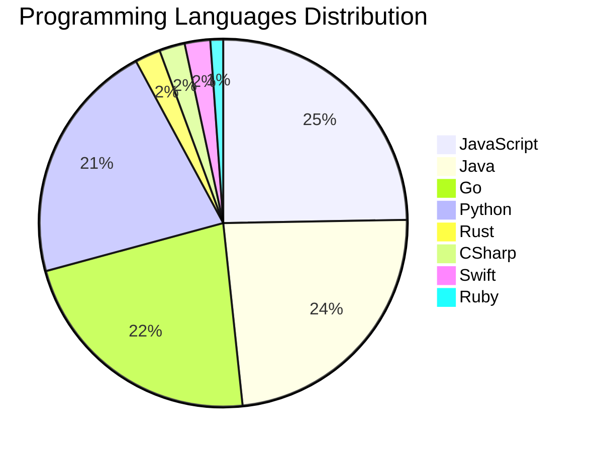

# 🚀 DevTech Auto News - Enhanced Edition


**DevTech Auto News Enhanced** is an advanced automated bot that aggregates trending topics in **AI**, **Web Development**, **Mobile**, **Cloud**, **DevOps**, and more from multiple sources including:

- 📰 [Dev.to](https://dev.to) - Developer community articles
- 🔥 [HackerNews](https://news.ycombinator.com) - Tech news discussions  
- 💻 [GitHub Trending](https://github.com/trending) - Trending repositories
- 🎯 Curated Interview Questions from multiple languages

## ✨ Features

✅ **Multi-Source Aggregation**: Combines articles from Dev.to, HackerNews, and GitHub  
✅ **Smart Categorization**: Automatically categorizes content into 10+ topics  
✅ **Image Support**: Displays cover images for visual appeal  
✅ **Pagination**: Fetches 50+ articles per update with deduplication  
✅ **Language Statistics**: Tracks programming language trends with charts  
✅ **Interview Questions**: Daily coding interview questions in multiple languages  
✅ **GitHub Actions**: Runs every 15 minutes automatically  

---

## 📊 Statistics Dashboard

### 📊 Articles by Category

**AI**: 🟦🟦🟦🟦🟦🟦🟦🟦🟦🟦🟦🟦🟦🟦🟦🟦🟦🟦🟦🟦 56 (53.8%)

**Tools**: 🟦🟦🟦🟦🟦🟦🟦🟦🟦🟦 27 (26.0%)

**JavaScript**: 🟦🟦🟦🟦🟦🟦🟦🟦 22 (21.2%)

**Python**: 🟦🟦🟦🟦🟦🟦🟦 19 (18.3%)

**Cloud**: 🟦🟦🟦 8 (7.7%)

**Security**: 🟦🟦 6 (5.8%)

**WebDev**: 🟦 4 (3.8%)

**Database**: 🟦 4 (3.8%)

**DevOps**: 🟦 2 (1.9%)

**Mobile**: 🟦 2 (1.9%)


### 📡 Sources

- **Dev.to**: 59 articles
- **HackerNews**: 30 articles
- **GitHub**: 15 articles


### 💻 Programming Language Trends

```
JavaScript      ██████████████████████████████ 24.4 (24.4%)
Java            █████████████████████████████ 23.3 (23.3%)
Go              ███████████████████████████ 22.2 (22.2%)
Python          ██████████████████████████ 21.1 (21.1%)
Rust            ███ 2.2 (2.2%)
CSharp          ███ 2.2 (2.2%)
Swift           ███ 2.2 (2.2%)
Ruby            █ 1.1 (1.1%)
PHP             █ 1.1 (1.1%)

```




### 🏷️ Trending Tags

               


---

## 🛠️ How It Works

1. **Multi-Source Fetch**: Pulls from Dev.to (2 pages), HackerNews (3 topics), GitHub (3 languages)
2. **Smart Filter**: Uses keyword matching across 10+ categories  
3. **Deduplication**: Removes duplicate URLs  
4. **Image Extraction**: Captures cover images when available  
5. **Statistics**: Generates language trends and category breakdowns  
6. **Update Files**: Regenerates README and appends to comprehensive log  

---

## 📦 Installation & Usage

```bash
# Clone the repository
git clone https://github.com/Derrick-MUGISHA/github-activity-bot.git
cd github-activity-bot

# Install dependencies  
npm install

# Run manually
npm start

# Test mode
npm run test
```

---


# 🚀 DevTech Auto News - Enhanced Edition

## 📅 Latest Updates (2026-03-30 14:00 CAT)


### 🖼️ Featured Articles

<table>
<tr>
  <td align="center" width="33%">
    <a href="https://dev.to/mezbahalam/why-rails-still-feels-like-a-startups-best-friend-in-the-ai-era-45hn">
      
      <br/>
      <b>Why Rails Still Feels Like a Startup’s Best Friend...</b>
    </a>
    <br/>
    <sub>Dev.to</sub>
  </td>
  <td align="center" width="33%">
    <a href="https://dev.to/cafedeluv/building-for-production-a-guide-to-deploying-a-3-tier-app-on-azure-chb">
      
      <br/>
      <b>Building for Production: A Guide to Deploying a 3-...</b>
    </a>
    <br/>
    <sub>Dev.to</sub>
  </td>
  <td align="center" width="33%">
    <a href="https://dev.to/abarron/vibe-with-code-plan-first-build-second-3n8o">
      
      <br/>
      <b>Vibe with Code: Plan First, Build Second</b>
    </a>
    <br/>
    <sub>Dev.to</sub>
  </td>
</tr>
<tr>
  <td align="center" width="33%">
    <a href="https://dev.to/ritam369/understanding-object-oriented-programming-in-javascript-570e">
      
      <br/>
      <b>Understanding Object-Oriented Programming in JavaS...</b>
    </a>
    <br/>
    <sub>Dev.to</sub>
  </td>
  <td align="center" width="33%">
    <a href="https://dev.to/ben/im-so-sick-of-my-editor-telling-me-how-great-i-am-not-that-im-not-great-2oam">
      
      <br/>
      <b>I'm so sick of my editor telling me how great I am...</b>
    </a>
    <br/>
    <sub>Dev.to</sub>
  </td>
  <td align="center" width="33%">
    <a href="https://dev.to/fafhrd91/building-a-error-library-3kda">
      
      <br/>
      <b>Building a Error Library</b>
    </a>
    <br/>
    <sub>Dev.to</sub>
  </td>
</tr>
</table>


### 📰 Top Headlines

- [Why Rails Still Feels Like a Startup’s Best Friend in the AI Era](https://dev.to/mezbahalam/why-rails-still-feels-like-a-startups-best-friend-in-the-ai-era-45hn) _[Dev.to]_
- [Building for Production: A Guide to Deploying a 3-Tier App on Azure](https://dev.to/cafedeluv/building-for-production-a-guide-to-deploying-a-3-tier-app-on-azure-chb) _[Dev.to]_
- [Vibe with Code: Plan First, Build Second](https://dev.to/abarron/vibe-with-code-plan-first-build-second-3n8o) _[Dev.to]_
- [Understanding Object-Oriented Programming in JavaScript](https://dev.to/ritam369/understanding-object-oriented-programming-in-javascript-570e) _[Dev.to]_
- [I'm so sick of my editor telling me how great I am. Not that I'm not great.](https://dev.to/ben/im-so-sick-of-my-editor-telling-me-how-great-i-am-not-that-im-not-great-2oam) _[Dev.to]_
- [Building a Error Library](https://dev.to/fafhrd91/building-a-error-library-3kda) _[Dev.to]_
- [Async without async](https://dev.to/szymongib/async-without-async-eik) _[Dev.to]_
- [Stop Writing Custom Importers: Import Multilingual Data in Drupal with Migrate API](https://dev.to/baikho/stop-writing-custom-importers-import-multilingual-data-in-drupal-with-migrate-api-m35) _[Dev.to]_
- [Your AI agent can't fetch behind logins. I built a <400kb fix in Zig.](https://dev.to/ancs21/your-ai-agent-cant-fetch-behind-logins-i-built-a-400kb-fix-in-zig-4d31) _[Dev.to]_
- [Modular Monolith Architecture in .NET: The Pragmatic Middle Ground](https://dev.to/aldacosta/modular-monolith-architecture-in-net-the-pragmatic-middle-ground-2fm5) _[Dev.to]_
- [How to use Timberborn 🦫 (yes, the beaver city-building game) as a database 💾](https://dev.to/thormeier/how-to-use-timberborn-yes-the-beaver-city-building-game-as-a-database-489c) _[Dev.to]_
- [I Built Jira for AI Agents - Here's why your AI Coding Assistant needs its own project management](https://dev.to/rpostulart/i-built-jira-for-ai-agents-heres-why-your-ai-coding-assistant-needs-its-own-project-management-1m5f) _[Dev.to]_
- [Auth0 MCP Server Extension for Gemini CLI](https://dev.to/auth0/auth0-mcp-server-extension-for-gemini-cli-405m) _[Dev.to]_
- [Speed vs smarts for coding agents?](https://dev.to/ben/speed-vs-smarts-for-coding-agents-3h) _[Dev.to]_
- [Building Framework-Agnostic AI Swarms: Compare LangGraph, Strands, and OpenAI Swarm](https://dev.to/launchdarkly/building-framework-agnostic-ai-swarms-compare-langgraph-strands-and-openai-swarm-14ip) _[Dev.to]_
- [Cross Cloud ADK with Amazon Fargate, and Gemini CLI](https://dev.to/gde/cross-cloud-adk-with-amazon-fargate-and-gemini-cli-594e) _[Dev.to]_
- [Gemma-SRE: Self-Hosted vLLM Infrastructure Agent](https://dev.to/gde/gemma-sre-self-hosted-vllm-infrastructure-agent-2bam) _[Dev.to]_
- [Decoding Bronze Age Paperwork: Modern AI vs. Ancient Assyrian Clay Tablets](https://dev.to/gde/decoding-bronze-age-paperwork-modern-ai-vs-ancient-assyrian-clay-tablets-5adf) _[Dev.to]_
- [I Added Langfuse to My RAG App and It Immediately Caught Two Bugs](https://dev.to/taiwrash/i-added-langfuse-to-my-rag-app-and-it-immediately-caught-two-bugs-4li3) _[Dev.to]_
- [Gemini 3.1: Real-World Voice Recognition with Flash Live: Making Your LINE Bot Understand You](https://dev.to/gde/gemini-31-real-world-voice-recognition-with-flash-live-making-your-line-bot-understand-you-560o) _[Dev.to]_

_Last automated update: Mon, 30 Mar 2026 14:08:28 CAT_


## 💡 Daily Interview Questions

_Sharpen your skills with these curated questions_

### 1. JavaScript: What are closures and provide a practical example?

**Difficulty**: Medium | **Topics**: functions, scope

<details>
<summary>💡 Hint</summary>

Function + lexical environment, data privacy, callbacks

</details>

### 2. React: What is the Virtual DOM and how does React use it?

**Difficulty**: Easy | **Topics**: rendering, performance

<details>
<summary>💡 Hint</summary>

Diffing algorithm, reconciliation, efficiency

</details>

### 3. Database: Explain database indexing and when to use it

**Difficulty**: Medium | **Topics**: optimization, performance

<details>
<summary>💡 Hint</summary>

B-tree, trade-offs, query performance

</details>


---

## 📚 Resources

- [Full News Archive](./data/news_log.md) - Complete history of all fetched articles
- [Statistics JSON](./data/stats.json) - Raw statistics data
- [Categorized Data](./data/categorized.json) - Articles organized by category
- [Interview Questions](./data/interview_questions.json) - Complete question bank

---

## 🤝 Contributing

Want to add more sources, categories, or interview questions? Feel free to:

1. Fork this repository
2. Add your improvements
3. Submit a pull request

---

## 📄 License

MIT License - Feel free to use and modify!

---

<p align="center">
  <b>Last automated update: Mon, 30 Mar 2026 12:08:28 GMT</b><br/>
  <sub>Powered by GitHub Actions | Made with ❤️ for developers</sub>
</p>

---

## 🔗 Quick Links

- [View Workflow](https://github.com/Derrick-MUGISHA/github-activity-bot/actions)
- [Report Issue](https://github.com/Derrick-MUGISHA/github-activity-bot/issues)
- [Suggest Feature](https://github.com/Derrick-MUGISHA/github-activity-bot/issues/new)
