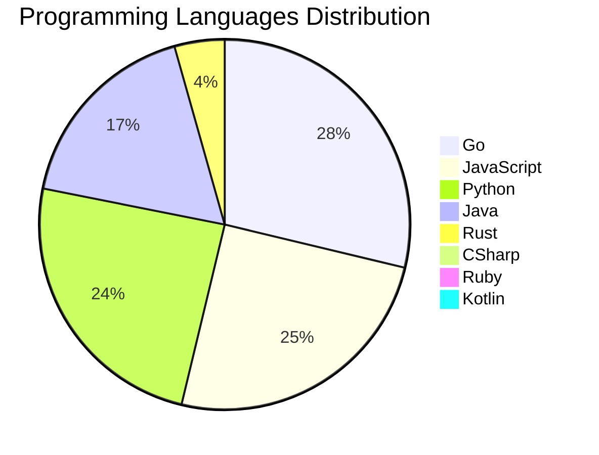

<div align="center">

# 📰 DevTech Auto News

**Your always-fresh digest of developer & AI tech news — curated automatically, around the clock.**


Aggregating [Dev.to](https://dev.to) · [Hacker News](https://news.ycombinator.com) · [GitHub Trending](https://github.com/trending) · [Lobste.rs](https://lobste.rs) · [Stack Overflow](https://stackoverflow.com) · [TechCrunch](https://techcrunch.com) · [freeCodeCamp](https://www.freecodecamp.org/news) — refreshed by GitHub Actions around the clock.

**[📰 Headlines](#-latest-headlines) · [💡 Interview Prep](#-interview-question-of-the-hour) · [📊 Statistics](#-statistics) · [⚙️ How It Works](#%EF%B8%8F-how-it-works)**

</div>

---

## 📰 Latest Headlines

> 🕐 Edition of **2026-09-21 8:00 CAT** — refreshed automatically, all day, every day.

### ✨ Featured Stories

<table>
<tr>
  <td align="center" width="33%">
    <a href="https://dev.to/devteam/congrats-to-the-dev-weekend-challenge-dog-days-edition-winners-300g">
      
      <br/>
      <b>Congrats to the DEV Weekend Challenge: Dog Days Ed...</b>
    </a>
    <br/>
    <sub>Dev.to</sub>
  </td>
  <td align="center" width="33%">
    <a href="https://dev.to/devteam/what-was-your-win-this-week-2hcb">
      
      <br/>
      <b>What was your win this week?!</b>
    </a>
    <br/>
    <sub>Dev.to</sub>
  </td>
  <td align="center" width="33%">
    <a href="https://dev.to/gde/the-symmetry-of-state-why-flutter-deserves-contextvalue-and-contextstate-4250">
      
      <br/>
      <b>The Symmetry of State: Why Flutter Deserves contex...</b>
    </a>
    <br/>
    <sub>Dev.to</sub>
  </td>
</tr>
<tr>
  <td align="center" width="33%">
    <a href="https://dev.to/gde/build-in-the-vm-think-on-the-mac-gpu-debian-13-on-apple-container-with-a-local-gemma-4-2d8b">
      
      <br/>
      <b>Build in the VM, Think on the Mac GPU: Debian 13 o...</b>
    </a>
    <br/>
    <sub>Dev.to</sub>
  </td>
  <td align="center" width="33%">
    <a href="https://dev.to/gde/serving-gemma-4-on-an-amd-mi300x-what-199-an-hour-buys-52h9">
      
      <br/>
      <b>Serving Gemma 4 on an AMD MI300X: What $1.99 an Ho...</b>
    </a>
    <br/>
    <sub>Dev.to</sub>
  </td>
  <td align="center" width="33%">
    <a href="https://dev.to/gde/the-modern-pitch-for-blocsignal-why-engineering-leads-are-moving-to-reactive-primitives-5d5h">
      
      <br/>
      <b>The Modern Pitch for BlocSignal: Why Engineering L...</b>
    </a>
    <br/>
    <sub>Dev.to</sub>
  </td>
</tr>
</table>


### 🗞️ Top Stories

| # | Headline | Source |
|---|----------|--------|
| 1 | [Congrats to the DEV Weekend Challenge: Dog Days Edition Winners!](https://dev.to/devteam/congrats-to-the-dev-weekend-challenge-dog-days-edition-winners-300g) | Dev.to |
| 2 | [What was your win this week?!](https://dev.to/devteam/what-was-your-win-this-week-2hcb) | Dev.to |
| 3 | [The Symmetry of State: Why Flutter Deserves context.value and context.state](https://dev.to/gde/the-symmetry-of-state-why-flutter-deserves-contextvalue-and-contextstate-4250) | Dev.to |
| 4 | [Build in the VM, Think on the Mac GPU: Debian 13 on Apple container With a Local Gemma 4](https://dev.to/gde/build-in-the-vm-think-on-the-mac-gpu-debian-13-on-apple-container-with-a-local-gemma-4-2d8b) | Dev.to |
| 5 | [Serving Gemma 4 on an AMD MI300X: What $1.99 an Hour Buys](https://dev.to/gde/serving-gemma-4-on-an-amd-mi300x-what-199-an-hour-buys-52h9) | Dev.to |
| 6 | [The Modern Pitch for BlocSignal: Why Engineering Leads Are Moving to Reactive Primitives](https://dev.to/gde/the-modern-pitch-for-blocsignal-why-engineering-leads-are-moving-to-reactive-primitives-5d5h) | Dev.to |
| 7 | [Gemma 4 on an 2021 4 GB Laptop GPU: QAT Takes It From 9.5 GiB to 1.6](https://dev.to/gde/gemma-4-on-an-old-4-gb-laptop-gpu-qat-takes-it-from-95-gib-to-16-b5l) | Dev.to |
| 8 | [The Only Container Orchestrator with Built-In Compliance: How Gubernator Enforces ENS, NIS 2, DORA, CIS Benchmark, and ISO 27001](https://dev.to/gde/the-only-container-orchestrator-with-built-in-compliance-how-gubernator-enforces-ens-nis-2-cis-mbf) | Dev.to |
| 9 | [ELT with Dataform on Google Cloud](https://dev.to/gde/elt-with-dataform-on-google-cloud-kc9) | Dev.to |
| 10 | [Running an AI Agent Locally: ADK, Gemma 4, and Docker Model Runner](https://dev.to/gde/running-an-ai-agent-locally-adk-gemma-4-and-docker-model-runner-44db) | Dev.to |
| 11 | [Nano Banana 2 Lite, Revisited: MCP 2.0, the New Interactions API, and Three Agent CLIs](https://dev.to/gde/nano-banana-2-lite-revisited-mcp-20-the-new-interactions-api-and-three-agent-clis-37g5) | Dev.to |
| 12 | [Harness engineering doesn't mean building your own harness](https://dev.to/annthurium/harness-engineering-doesnt-mean-building-your-own-harness-16pk) | Dev.to |
| 13 | [20 Agentic AI Terms Every Developer Should Know (Explained Simply)](https://dev.to/sylwia-lask/20-agentic-ai-terms-every-developer-should-know-explained-simply-jii) | Dev.to |
| 14 | [A 4 GB Laptop GPU Beats a 12-Core CPU by 4.3x on Gemma 4](https://dev.to/gde/a-4-gb-laptop-gpu-beats-a-12-core-cpu-by-43x-on-gemma-4-4150) | Dev.to |
| 15 | [An MI300X Over MCP: What the Matrix Cores Execute, and What They Don't](https://dev.to/gde/an-mi300x-over-mcp-what-the-matrix-cores-execute-and-what-they-dont-1me9) | Dev.to |
| 16 | [Dev Opportunity Radar #17: $138K Amazon Hackathon, Stanford's Code in Place X, and Dev3Pack Hackathon](https://dev.to/devengers/dev-opportunity-radar-17-138k-amazon-hackathon-stanfords-code-in-place-x-and-dev3pack-4imm) | Dev.to |
| 17 | [Welcome Thread - v 393](https://dev.to/sloan/welcome-thread-v-393-5f09) | Dev.to |
| 18 | [Join the Sanity Challenge: $2,500 in prizes for FIVE winners!](https://dev.to/devteam/join-the-sanity-challenge-2500-in-prizes-for-five-winners-514m) | Dev.to |
| 19 | [2B Gemma 4 Deployment with Cloud Run, NVIDIA L4, MCP SDK 2.x, and Claude Code](https://dev.to/gde/2b-gemma-4-deployment-with-cloud-run-nvidia-l4-mcp-sdk-2x-and-claude-code-4ml3) | Dev.to |
| 20 | [How we built a desktop companion robot with Gemma 4 and Raspberry Pi](https://dev.to/googleai/how-we-built-a-desktop-companion-robot-with-gemma-4-and-raspberry-pi-2oke) | Dev.to |

<sub>Last fetched: Mon, 21 Sep 2026 08:34:01 CAT</sub>


---

## 💡 Interview Question of the Hour

> Sharpen your skills — new questions selected on every update. Try answering before opening the hint!

**1. `SystemDesign` — Design a URL shortening service like bit.ly**

&nbsp;&nbsp;&nbsp;&nbsp;🎯 Medium · 🏷 system design, scalability

<details>
<summary>&nbsp;&nbsp;&nbsp;&nbsp;💡 Show hint</summary>

> Hash function, database design, caching, analytics

</details>

**2. `Python` — What are generators and when would you use them?**

&nbsp;&nbsp;&nbsp;&nbsp;🎯 Medium · 🏷 iterators, memory

<details>
<summary>&nbsp;&nbsp;&nbsp;&nbsp;💡 Show hint</summary>

> yield keyword, lazy evaluation, memory efficiency

</details>

**3. `JavaScript` — Explain event delegation and why it's useful**

&nbsp;&nbsp;&nbsp;&nbsp;🎯 Medium · 🏷 events, DOM

<details>
<summary>&nbsp;&nbsp;&nbsp;&nbsp;💡 Show hint</summary>

> Event bubbling, single listener for multiple elements

</details>


---

## 📊 Statistics

#### 🗂 Articles by Category

| Category | Articles | Share | |
|----------|---------:|------:|---|
| **AI** | 75 | 40.8% | `████████████████████` |
| **Tools** | 42 | 22.8% | `███████████░░░░░░░░░` |
| **JavaScript** | 40 | 21.7% | `███████████░░░░░░░░░` |
| **Python** | 39 | 21.2% | `██████████░░░░░░░░░░` |
| **Cloud** | 24 | 13.0% | `██████░░░░░░░░░░░░░░` |
| **DevOps** | 19 | 10.3% | `█████░░░░░░░░░░░░░░░` |
| **Security** | 17 | 9.2% | `█████░░░░░░░░░░░░░░░` |
| **WebDev** | 10 | 5.4% | `███░░░░░░░░░░░░░░░░░` |
| **Mobile** | 6 | 3.3% | `██░░░░░░░░░░░░░░░░░░` |
| **Database** | 3 | 1.6% | `█░░░░░░░░░░░░░░░░░░░` |

<sub>Articles can match more than one category, so shares may sum to over 100%.</sub>


#### 📡 Articles by Source

| Source | Articles |
|--------|---------:|
| Dev.to | 60 |
| HackerNews | 49 |
| GitHub | 25 |
| Lobste.rs | 10 |
| StackOverflow | 20 |
| TechCrunch | 10 |
| freeCodeCamp | 10 |


#### 💻 Programming Language Trends

```
Go              ██████████████████████████████ 28.0%
JavaScript      ██████████████████████████ 24.4%
Python          ██████████████████████████ 23.8%
Java            ██████████████████ 17.1%
Rust            █████ 4.3%
CSharp          █ 0.6%
Ruby            █ 0.6%
Kotlin          █ 0.6%
Swift           █ 0.6%

```




#### 🏷 Trending Topics

            


---

## ⚙️ How It Works

This repository is a fully automated news pipeline. On every run, GitHub Actions:

1. **Fetches** the latest articles from seven sources: Dev.to, Hacker News, GitHub Trending, Lobste.rs, Stack Overflow, TechCrunch, and freeCodeCamp
2. **Deduplicates and categorizes** them across 10+ topics using keyword matching
3. **Extracts cover images** and computes language & category statistics
4. **Rebuilds this README** and appends everything to the [full archive](./data/news_log.md)
5. **Commits and pushes** the result — no human intervention needed

<details>
<summary><b>🚀 Run it yourself</b></summary>

```bash
git clone https://github.com/Derrick-MUGISHA/github-activity-bot.git
cd github-activity-bot
npm install
npm start
```

Fork the repo, enable GitHub Actions, and you have your own self-updating news feed.

</details>

<details>
<summary><b>📚 Data & resources</b></summary>

- [Full news archive](./data/news_log.md) — complete history of every fetched article
- [Statistics](./data/stats.json) — raw stats data (JSON)
- [Categorized articles](./data/categorized.json) — articles grouped by topic
- [Interview question bank](./data/interview_questions.json) — the full question set

</details>

---

## 🤝 Contributing

Ideas for new sources, categories, or interview questions are welcome — [open an issue](https://github.com/Derrick-MUGISHA/github-activity-bot/issues/new) or submit a pull request.

## 📄 License

Released under the [MIT License](https://opensource.org/licenses/MIT) — free to use, fork, and modify.

---

<div align="center">
  <sub>🤖 Last automated update: <b>Mon, 21 Sep 2026 06:34:01 GMT</b></sub><br/>
  <sub>Powered by GitHub Actions · Built with ❤️ by <a href="https://github.com/Derrick-MUGISHA">Derrick MUGISHA</a></sub>
</div>
