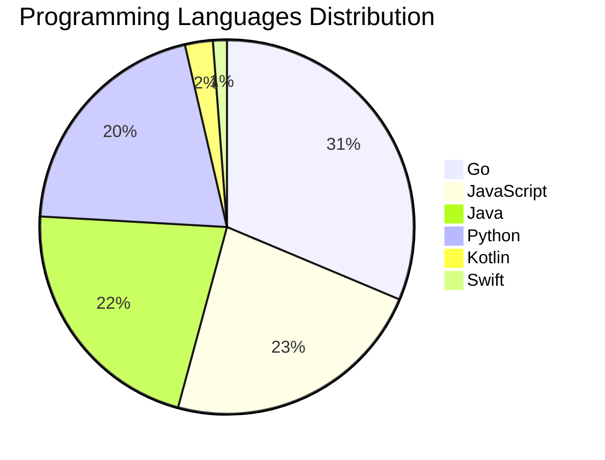

# 🚀 DevTech Auto News - Enhanced Edition


**DevTech Auto News Enhanced** is an advanced automated bot that aggregates trending topics in **AI**, **Web Development**, **Mobile**, **Cloud**, **DevOps**, and more from multiple sources including:

- 📰 [Dev.to](https://dev.to) - Developer community articles
- 🔥 [HackerNews](https://news.ycombinator.com) - Tech news discussions  
- 💻 [GitHub Trending](https://github.com/trending) - Trending repositories
- 🎯 Curated Interview Questions from multiple languages

## ✨ Features

✅ **Multi-Source Aggregation**: Combines articles from Dev.to, HackerNews, and GitHub  
✅ **Smart Categorization**: Automatically categorizes content into 10+ topics  
✅ **Image Support**: Displays cover images for visual appeal  
✅ **Pagination**: Fetches 50+ articles per update with deduplication  
✅ **Language Statistics**: Tracks programming language trends with charts  
✅ **Interview Questions**: Daily coding interview questions in multiple languages  
✅ **GitHub Actions**: Runs every 15 minutes automatically  

---

## 📊 Statistics Dashboard

### 📊 Articles by Category

**AI**: 🟦🟦🟦🟦🟦🟦🟦🟦🟦🟦🟦🟦🟦🟦🟦🟦🟦🟦🟦🟦 50 (47.6%)

**Tools**: 🟦🟦🟦🟦🟦🟦🟦🟦🟦🟦 25 (23.8%)

**JavaScript**: 🟦🟦🟦🟦🟦🟦🟦🟦 19 (18.1%)

**Python**: 🟦🟦🟦🟦🟦🟦🟦 17 (16.2%)

**Cloud**: 🟦🟦🟦🟦🟦🟦🟦 17 (16.2%)

**Mobile**: 🟦🟦 5 (4.8%)

**Security**: 🟦🟦 5 (4.8%)

**WebDev**: 🟦🟦 4 (3.8%)

**DevOps**: 🟦 3 (2.9%)

**Database**:  1 (1.0%)


### 📡 Sources

- **Dev.to**: 60 articles
- **HackerNews**: 30 articles
- **GitHub**: 15 articles


### 💻 Programming Language Trends

```
Go              ██████████████████████████████ 31.3 (31.3%)
JavaScript      ██████████████████████ 22.9 (22.9%)
Java            █████████████████████ 21.7 (21.7%)
Python          ████████████████████ 20.5 (20.5%)
Kotlin          ██ 2.4 (2.4%)
Swift           █ 1.2 (1.2%)

```




### 🏷️ Trending Tags

               


---

## 🛠️ How It Works

1. **Multi-Source Fetch**: Pulls from Dev.to (2 pages), HackerNews (3 topics), GitHub (3 languages)
2. **Smart Filter**: Uses keyword matching across 10+ categories  
3. **Deduplication**: Removes duplicate URLs  
4. **Image Extraction**: Captures cover images when available  
5. **Statistics**: Generates language trends and category breakdowns  
6. **Update Files**: Regenerates README and appends to comprehensive log  

---

## 📦 Installation & Usage

```bash
# Clone the repository
git clone https://github.com/Derrick-MUGISHA/github-activity-bot.git
cd github-activity-bot

# Install dependencies  
npm install

# Run manually
npm start

# Test mode
npm run test
```

---


# 🚀 DevTech Auto News - Enhanced Edition

## 📅 Latest Updates (2026-05-01 15:00 CAT)


### 🖼️ Featured Articles

<table>
<tr>
  <td align="center" width="33%">
    <a href="https://dev.to/devteam/announcing-the-winners-of-the-dev-weekend-challenge-earth-day-edition-1n4">
      
      <br/>
      <b>Announcing the Winners of the DEV Weekend Challeng...</b>
    </a>
    <br/>
    <sub>Dev.to</sub>
  </td>
  <td align="center" width="33%">
    <a href="https://dev.to/thisisryanswift/stop-using-your-clipboard-to-share-context-3941">
      
      <br/>
      <b>Stop Using Your Clipboard to Share Context</b>
    </a>
    <br/>
    <sub>Dev.to</sub>
  </td>
  <td align="center" width="33%">
    <a href="https://dev.to/eevajonnapanula/more-accessible-focus-indicators-with-compose-1ca4">
      
      <br/>
      <b>More Accessible Focus Indicators with Compose</b>
    </a>
    <br/>
    <sub>Dev.to</sub>
  </td>
</tr>
<tr>
  <td align="center" width="33%">
    <a href="https://dev.to/matthewrevell/using-gemini-with-openclaw-setup-guide-real-use-cases-2i48">
      
      <br/>
      <b>Using Gemini with OpenClaw: Setup Guide + Real Use...</b>
    </a>
    <br/>
    <sub>Dev.to</sub>
  </td>
  <td align="center" width="33%">
    <a href="https://dev.to/gde/agents-are-building-their-own-uis-now-heres-when-thats-worth-doing-o9d">
      
      <br/>
      <b>Agents are building their own UIs now. Here's when...</b>
    </a>
    <br/>
    <sub>Dev.to</sub>
  </td>
  <td align="center" width="33%">
    <a href="https://dev.to/gde/mcp-configuration-for-looker-with-gemini-cli-id">
      
      <br/>
      <b>MCP Configuration for Looker with Gemini CLI</b>
    </a>
    <br/>
    <sub>Dev.to</sub>
  </td>
</tr>
</table>


### 📰 Top Headlines

- [Announcing the Winners of the DEV Weekend Challenge: Earth Day Edition 🌍](https://dev.to/devteam/announcing-the-winners-of-the-dev-weekend-challenge-earth-day-edition-1n4) _[Dev.to]_
- [Stop Using Your Clipboard to Share Context](https://dev.to/thisisryanswift/stop-using-your-clipboard-to-share-context-3941) _[Dev.to]_
- [More Accessible Focus Indicators with Compose](https://dev.to/eevajonnapanula/more-accessible-focus-indicators-with-compose-1ca4) _[Dev.to]_
- [Using Gemini with OpenClaw: Setup Guide + Real Use Cases](https://dev.to/matthewrevell/using-gemini-with-openclaw-setup-guide-real-use-cases-2i48) _[Dev.to]_
- [Agents are building their own UIs now. Here's when that's worth doing.](https://dev.to/gde/agents-are-building-their-own-uis-now-heres-when-thats-worth-doing-o9d) _[Dev.to]_
- [MCP Configuration for Looker with Gemini CLI](https://dev.to/gde/mcp-configuration-for-looker-with-gemini-cli-id) _[Dev.to]_
- [Creating a CLI Tool with AI Agents: My Journey with kdn](https://dev.to/feloy/creating-a-cli-tool-with-ai-agents-my-journey-with-kdn-46d8) _[Dev.to]_
- [Service-to-Service Calls vs Event-Driven Flows: When to Use Which](https://dev.to/toybz/service-to-service-calls-vs-event-driven-flows-when-to-use-which-1da8) _[Dev.to]_
- [Mapbox GL JS adds support for PMTiles vector sources](https://dev.to/mapbox/mapbox-gl-js-adds-support-for-pmtiles-vector-and-raster-sources-141b) _[Dev.to]_
- [Leadership Micro Katas](https://dev.to/yrizos/leadership-micro-katas-363f) _[Dev.to]_
- [Why I'm Building SaaS in 2026](https://dev.to/arunkant/why-im-building-saas-in-2026-55hn) _[Dev.to]_
- [Forking Paseo: Mobile vibe coding for me](https://dev.to/thisisryanswift/forking-paseo-mobile-vibe-coding-for-me-48pa) _[Dev.to]_
- [Meme Monday](https://dev.to/ben/meme-monday-98e) _[Dev.to]_
- [How I Used AI to Fix Our E2E Test Architecture](https://dev.to/debs_obrien/how-i-used-ai-to-fix-our-e2e-test-architecture-444a) _[Dev.to]_
- [Platform-Neutral AI Tools Are the Safer Long-Term Bet](https://dev.to/mrlarson2007_62/platform-neutral-ai-tools-are-the-safer-long-term-bet-42i1) _[Dev.to]_
- [Everyone's Talking About Gemini. The Real Story at Google Cloud NEXT '26 Was GKE Agent Sandbox.](https://dev.to/sreejit_caab72e273a4faa1f/everyones-talking-about-gemini-the-real-story-at-google-cloud-next-26-was-gke-agent-sandbox-19g2) _[Dev.to]_
- [vLLM on Google Cloud TPU: A Model Size vs Chip Cheat Sheet (With Interactive Tool)](https://dev.to/1grace/vllm-on-google-cloud-tpu-a-model-size-vs-chip-cheat-sheet-with-interactive-tool-2c3k) _[Dev.to]_
- [I built a shell script that sets up your entire AI coding agent workspace in 2 minutes](https://dev.to/shad_tech/i-built-a-shell-script-that-sets-up-your-entire-ai-coding-agent-workspace-in-2-minutes-13ep) _[Dev.to]_
- [Boring code is an organizational tell](https://dev.to/simme/boring-code-is-an-organizational-tell-4gca) _[Dev.to]_
- [Are We Using AI at the Wrong Scale?](https://dev.to/kernelpryanic/are-we-using-ai-at-the-wrong-scale-2klo) _[Dev.to]_

_Last automated update: Fri, 01 May 2026 15:54:28 CAT_


## 💡 Daily Interview Questions

_Sharpen your skills with these curated questions_

### 1. JavaScript: What is the difference between `let`, `const`, and `var`?

**Difficulty**: Easy | **Topics**: variables, scope

<details>
<summary>💡 Hint</summary>

Scope, hoisting, and reassignment capabilities

</details>

### 2. DataStructures: Implement LRU Cache

**Difficulty**: Hard | **Topics**: design, hash map, linked list

<details>
<summary>💡 Hint</summary>

Doubly linked list + hash map, O(1) operations

</details>

### 3. JavaScript: What are closures and provide a practical example?

**Difficulty**: Medium | **Topics**: functions, scope

<details>
<summary>💡 Hint</summary>

Function + lexical environment, data privacy, callbacks

</details>


---

## 📚 Resources

- [Full News Archive](./data/news_log.md) - Complete history of all fetched articles
- [Statistics JSON](./data/stats.json) - Raw statistics data
- [Categorized Data](./data/categorized.json) - Articles organized by category
- [Interview Questions](./data/interview_questions.json) - Complete question bank

---

## 🤝 Contributing

Want to add more sources, categories, or interview questions? Feel free to:

1. Fork this repository
2. Add your improvements
3. Submit a pull request

---

## 📄 License

MIT License - Feel free to use and modify!

---

<p align="center">
  <b>Last automated update: Fri, 01 May 2026 13:54:28 GMT</b><br/>
  <sub>Powered by GitHub Actions | Made with ❤️ for developers</sub>
</p>

---

## 🔗 Quick Links

- [View Workflow](https://github.com/Derrick-MUGISHA/github-activity-bot/actions)
- [Report Issue](https://github.com/Derrick-MUGISHA/github-activity-bot/issues)
- [Suggest Feature](https://github.com/Derrick-MUGISHA/github-activity-bot/issues/new)
