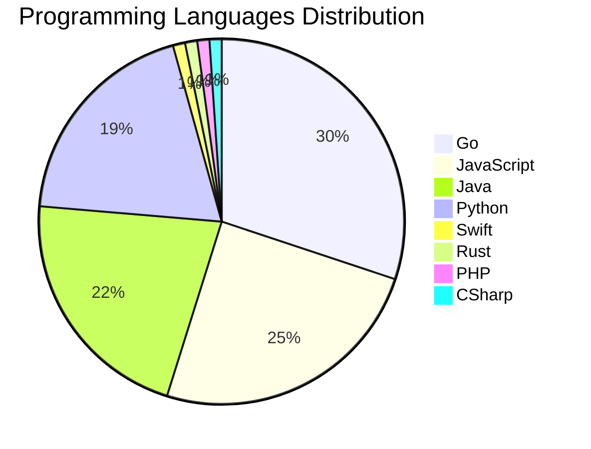

# 🚀 DevTech Auto News - Enhanced Edition


**DevTech Auto News Enhanced** is an advanced automated bot that aggregates trending topics in **AI**, **Web Development**, **Mobile**, **Cloud**, **DevOps**, and more from multiple sources including:

- 📰 [Dev.to](https://dev.to) - Developer community articles
- 🔥 [HackerNews](https://news.ycombinator.com) - Tech news discussions  
- 💻 [GitHub Trending](https://github.com/trending) - Trending repositories
- 🎯 Curated Interview Questions from multiple languages

## ✨ Features

✅ **Multi-Source Aggregation**: Combines articles from Dev.to, HackerNews, and GitHub  
✅ **Smart Categorization**: Automatically categorizes content into 10+ topics  
✅ **Image Support**: Displays cover images for visual appeal  
✅ **Pagination**: Fetches 50+ articles per update with deduplication  
✅ **Language Statistics**: Tracks programming language trends with charts  
✅ **Interview Questions**: Daily coding interview questions in multiple languages  
✅ **GitHub Actions**: Runs every 15 minutes automatically  

---

## 📊 Statistics Dashboard

### 📊 Articles by Category

**AI**: 🟦🟦🟦🟦🟦🟦🟦🟦🟦🟦🟦🟦🟦🟦🟦🟦🟦🟦🟦🟦 51 (48.6%)

**Tools**: 🟦🟦🟦🟦🟦🟦🟦🟦🟦🟦🟦🟦 31 (29.5%)

**JavaScript**: 🟦🟦🟦🟦🟦🟦🟦🟦🟦 23 (21.9%)

**Python**: 🟦🟦🟦🟦🟦🟦🟦 18 (17.1%)

**Cloud**: 🟦🟦🟦🟦 11 (10.5%)

**DevOps**: 🟦🟦 6 (5.7%)

**WebDev**: 🟦🟦 5 (4.8%)

**Database**: 🟦 2 (1.9%)

**Mobile**:  1 (1.0%)

**Security**:  1 (1.0%)


### 📡 Sources

- **Dev.to**: 60 articles
- **HackerNews**: 30 articles
- **GitHub**: 15 articles


### 💻 Programming Language Trends

```
Go              ██████████████████████████████ 30.1 (30.1%)
JavaScript      █████████████████████████ 24.7 (24.7%)
Java            █████████████████████ 21.5 (21.5%)
Python          ███████████████████ 19.4 (19.4%)
Swift           █ 1.1 (1.1%)
Rust            █ 1.1 (1.1%)
PHP             █ 1.1 (1.1%)
CSharp          █ 1.1 (1.1%)

```




### 🏷️ Trending Tags

               


---

## 🛠️ How It Works

1. **Multi-Source Fetch**: Pulls from Dev.to (2 pages), HackerNews (3 topics), GitHub (3 languages)
2. **Smart Filter**: Uses keyword matching across 10+ categories  
3. **Deduplication**: Removes duplicate URLs  
4. **Image Extraction**: Captures cover images when available  
5. **Statistics**: Generates language trends and category breakdowns  
6. **Update Files**: Regenerates README and appends to comprehensive log  

---

## 📦 Installation & Usage

```bash
# Clone the repository
git clone https://github.com/Derrick-MUGISHA/github-activity-bot.git
cd github-activity-bot

# Install dependencies  
npm install

# Run manually
npm start

# Test mode
npm run test
```

---


# 🚀 DevTech Auto News - Enhanced Edition

## 📅 Latest Updates (2026-06-08 19:00 CAT)


### 🖼️ Featured Articles

<table>
<tr>
  <td align="center" width="33%">
    <a href="https://dev.to/hadil/youre-a-real-typescript-developer-only-if-1d9o">
      
      <br/>
      <b>You’re a Real TypeScript Developer Only If...</b>
    </a>
    <br/>
    <sub>Dev.to</sub>
  </td>
  <td align="center" width="33%">
    <a href="https://dev.to/sebs/its-time-we-all-eat-some-cucumber-16ic">
      
      <br/>
      <b>It's Time We All Eat some more Cucumber!</b>
    </a>
    <br/>
    <sub>Dev.to</sub>
  </td>
  <td align="center" width="33%">
    <a href="https://dev.to/gde/dialling-our-agents-to-11-my-favourite-mcp-servers-3hbm">
      
      <br/>
      <b>Dialling Our Agents to 11: My Favourite MCP Server...</b>
    </a>
    <br/>
    <sub>Dev.to</sub>
  </td>
</tr>
<tr>
  <td align="center" width="33%">
    <a href="https://dev.to/ben/meme-monday-1m9f">
      
      <br/>
      <b>Meme Monday</b>
    </a>
    <br/>
    <sub>Dev.to</sub>
  </td>
  <td align="center" width="33%">
    <a href="https://dev.to/googlecloud/seamless-scaling-with-vpa-in-place-pod-resize-on-gke-117p">
      
      <br/>
      <b>Seamless scaling with VPA In-place Pod Resize on G...</b>
    </a>
    <br/>
    <sub>Dev.to</sub>
  </td>
  <td align="center" width="33%">
    <a href="https://dev.to/rodrigovidal/physics-engineering-and-architecture-in-software-systems-and-the-obsession-with-architecture-68j">
      
      <br/>
      <b>Physics, Engineering, and Architecture in Software...</b>
    </a>
    <br/>
    <sub>Dev.to</sub>
  </td>
</tr>
</table>


### 📰 Top Headlines

- [You’re a Real TypeScript Developer Only If...](https://dev.to/hadil/youre-a-real-typescript-developer-only-if-1d9o) _[Dev.to]_
- [It's Time We All Eat some more Cucumber!](https://dev.to/sebs/its-time-we-all-eat-some-cucumber-16ic) _[Dev.to]_
- [Dialling Our Agents to 11: My Favourite MCP Servers](https://dev.to/gde/dialling-our-agents-to-11-my-favourite-mcp-servers-3hbm) _[Dev.to]_
- [Meme Monday](https://dev.to/ben/meme-monday-1m9f) _[Dev.to]_
- [Seamless scaling with VPA In-place Pod Resize on GKE](https://dev.to/googlecloud/seamless-scaling-with-vpa-in-place-pod-resize-on-gke-117p) _[Dev.to]_
- [Physics, Engineering, and Architecture in Software Systems and the obsession with Architecture](https://dev.to/rodrigovidal/physics-engineering-and-architecture-in-software-systems-and-the-obsession-with-architecture-68j) _[Dev.to]_
- [Dystopian Civilization Scenarios](https://dev.to/ingosteinke/dystopian-civilization-scenarios-4422) _[Dev.to]_
- [Building an AI Sales RFP Assistant with Google Workspace Studio & NotebookLM](https://dev.to/gde/building-an-ai-sales-rfp-assistant-with-google-workspace-studio-notebooklm-3cl) _[Dev.to]_
- [Retour sur le Google I/O 2026 | Focus Antigravity 2.0](https://dev.to/gde/retour-sur-le-google-io-2026-focus-antigravity-20-33jh) _[Dev.to]_
- [Join the June Solstice Game Jam: $1,000 in prizes!](https://dev.to/devteam/join-the-june-solstice-game-jam-1000-in-prizes-3jla) _[Dev.to]_
- [LiveKnowledge: Engineering Verifiable Knowledge](https://dev.to/adamrybinski/liveknowledge-engineering-verifiable-knowledge-5gkl) _[Dev.to]_
- [Stop writing prompts to classify text: make evaluation declarative](https://dev.to/ayoolasolomon/stop-writing-prompts-to-classify-text-make-evaluation-declarative-5555) _[Dev.to]_
- [[GCP Practical] LINE Business Card Bot](https://dev.to/gde/gcp-practical-line-business-card-bot-d46) _[Dev.to]_
- [Strategies for running AI workloads on GKE without committed quota](https://dev.to/googlecloud/strategies-for-running-ai-workloads-on-gke-without-committed-quota-484l) _[Dev.to]_
- [Dev Opportunity Radar #2: A Fully-Funded Residency in Finland, AI Research Program, and a $60K Hackathon](https://dev.to/hemapriya_kanagala/dev-opportunity-radar-2-a-fully-funded-residency-in-finland-ai-research-program-and-a-60k-33l4) _[Dev.to]_
- [I Finished What I Started: Adding AI to Every Layer of a Form Builder (With GitHub Copilot)](https://dev.to/natheesh_kumar_8ad28dbe85/i-finished-what-i-started-adding-ai-to-every-layer-of-a-form-builder-with-github-copilot-942) _[Dev.to]_
- [🦄 Modernizing Wild Rydes with modern technologies](https://dev.to/cferreirasuazo/modernizing-wild-rydes-with-modern-technologies-5g2p) _[Dev.to]_
- [The Software Developer's Guide to AEO](https://dev.to/karllhughes/the-software-developers-guide-to-aeo-1h5h) _[Dev.to]_
- [Extending a MCP/A2A Currency Agent with A2UI](https://dev.to/gde/extending-a-mcpa2a-currency-agent-with-a2ui-5hj3) _[Dev.to]_
- [How Are Developers Actually Using AI At Work?](https://dev.to/sylwia-lask/how-are-developers-actually-using-ai-at-work-4g9c) _[Dev.to]_

_Last automated update: Mon, 08 Jun 2026 19:28:27 CAT_


## 💡 Daily Interview Questions

_Sharpen your skills with these curated questions_

### 1. SystemDesign: Design a distributed cache system

**Difficulty**: Hard | **Topics**: distributed systems, caching

<details>
<summary>💡 Hint</summary>

Consistency, partitioning, replication, eviction policies

</details>

### 2. React: Explain the difference between state and props

**Difficulty**: Easy | **Topics**: data flow, components

<details>
<summary>💡 Hint</summary>

Ownership, mutability, data flow direction

</details>

### 3. SystemDesign: Design Twitter's timeline feature

**Difficulty**: Hard | **Topics**: system design, scalability

<details>
<summary>💡 Hint</summary>

Fan-out, caching, ranking, real-time updates

</details>


---

## 📚 Resources

- [Full News Archive](./data/news_log.md) - Complete history of all fetched articles
- [Statistics JSON](./data/stats.json) - Raw statistics data
- [Categorized Data](./data/categorized.json) - Articles organized by category
- [Interview Questions](./data/interview_questions.json) - Complete question bank

---

## 🤝 Contributing

Want to add more sources, categories, or interview questions? Feel free to:

1. Fork this repository
2. Add your improvements
3. Submit a pull request

---

## 📄 License

MIT License - Feel free to use and modify!

---

<p align="center">
  <b>Last automated update: Mon, 08 Jun 2026 17:28:27 GMT</b><br/>
  <sub>Powered by GitHub Actions | Made with ❤️ for developers</sub>
</p>

---

## 🔗 Quick Links

- [View Workflow](https://github.com/Derrick-MUGISHA/github-activity-bot/actions)
- [Report Issue](https://github.com/Derrick-MUGISHA/github-activity-bot/issues)
- [Suggest Feature](https://github.com/Derrick-MUGISHA/github-activity-bot/issues/new)
