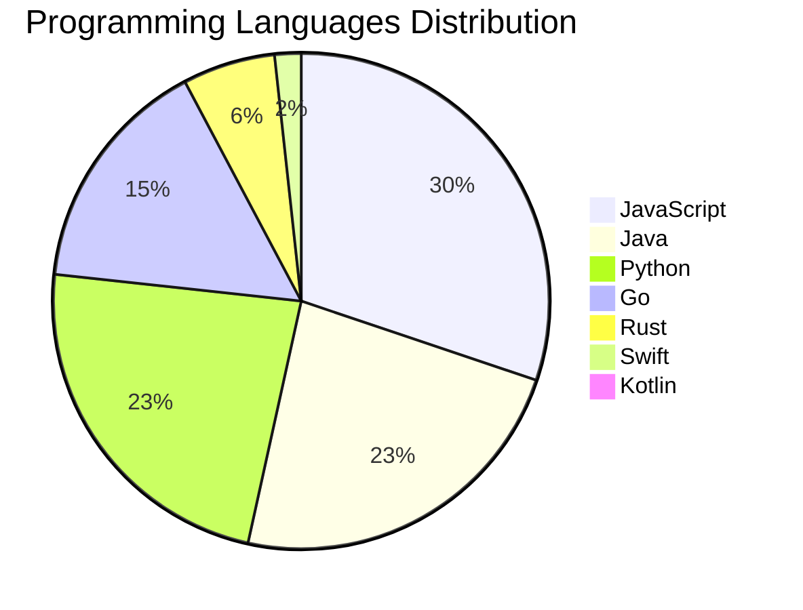

<div align="center">

# 📰 DevTech Auto News

**Your always-fresh digest of developer & AI tech news — curated automatically, around the clock.**


Aggregating [Dev.to](https://dev.to) · [Hacker News](https://news.ycombinator.com) · [GitHub Trending](https://github.com/trending) · [Lobste.rs](https://lobste.rs) · [Stack Overflow](https://stackoverflow.com) · [TechCrunch](https://techcrunch.com) · [freeCodeCamp](https://www.freecodecamp.org/news) — refreshed by GitHub Actions around the clock.

**[📰 Headlines](#-latest-headlines) · [💡 Interview Prep](#-interview-question-of-the-hour) · [📊 Statistics](#-statistics) · [⚙️ How It Works](#%EF%B8%8F-how-it-works)**

</div>

---

## 📰 Latest Headlines

> 🕐 Edition of **2026-07-26 2:00 CAT** — refreshed automatically, all day, every day.

### ✨ Featured Stories

<table>
<tr>
  <td align="center" width="33%">
    <a href="https://github.com/gnipbao/story-to-handdrawn-video">
      
      <br/>
      <b>gnipbao/story-to-handdrawn-video - Agent skill: co...</b>
    </a>
    <br/>
    <sub>GitHub</sub>
  </td>
</tr>
</table>


### 🗞️ Top Stories

| # | Headline | Source |
|---|----------|--------|
| 1 | [Don't post generated/AI-edited comments. HN is for conversation between humans](https://news.ycombinator.com/newsguidelines.html#generated) | HackerNews |
| 2 | [Airfoil](https://ciechanow.ski/airfoil/) | HackerNews |
| 3 | [Open source AI is the path forward](https://about.fb.com/news/2024/07/open-source-ai-is-the-path-forward/) | HackerNews |
| 4 | [My AI skeptic friends are all nuts](https://fly.io/blog/youre-all-nuts/) | HackerNews |
| 5 | [An AI agent published a hit piece on me](https://theshamblog.com/an-ai-agent-published-a-hit-piece-on-me/) | HackerNews |
| 6 | [Gemini AI](https://deepmind.google/technologies/gemini/) | HackerNews |
| 7 | [I believe there are entire companies right now under AI psychosis](https://twitter.com/mitchellh/status/2055380239711457578) | HackerNews |
| 8 | [IDF killed Gaza aid workers at point blank range in 2025 massacre: Report](https://www.dropsitenews.com/p/israeli-soldiers-tel-sultan-gaza-red-crescent-civil-defense-massacre-report-forensic-architecture-earshot) | HackerNews |
| 9 | [I'm Tired of Talking to AI](https://orchidfiles.com/im-tired-of-ai-generated-answers/) | HackerNews |
| 10 | [Bypassing airport security via SQL injection](https://ian.sh/tsa) | HackerNews |
| 11 | [Yarn – A new package manager for JavaScript](https://code.facebook.com/posts/1840075619545360) | HackerNews |
| 12 | [A spreadsheet in fewer than 30 lines of JavaScript, no library used](http://jsfiddle.net/ondras/hYfN3/) | HackerNews |
| 13 | [Bun: Fast JavaScript runtime, transpiler, and NPM client written in Zig](https://bun.sh/?launch) | HackerNews |
| 14 | [JavaScript Temporal is coming](https://developer.mozilla.org/en-US/blog/javascript-temporal-is-coming/) | HackerNews |
| 15 | [Show HN: Meteor, a realtime JavaScript framework](http://www.meteor.com) | HackerNews |
| 16 | [Eloquent JavaScript 4th edition (2024)](https://eloquentjavascript.net/) | HackerNews |
| 17 | [Modern Javascript: Everything you missed over the last 10 years (2020)](https://turriate.com/articles/modern-javascript-everything-you-missed-over-10-years) | HackerNews |
| 18 | [My son (9 yrs old) used plain JavaScript to make a game, and wants your feedback](https://www.armaansahni.com/game/) | HackerNews |
| 19 | [Draw SVG rope using JavaScript](https://muffinman.io/blog/draw-svg-rope-using-javascript/) | HackerNews |
| 20 | [How to manage HTML DOM with vanilla JavaScript only?](https://htmldom.dev/) | HackerNews |

<sub>Last fetched: Sun, 26 Jul 2026 02:20:36 CAT</sub>


---

## 💡 Interview Question of the Hour

> Sharpen your skills — new questions selected on every update. Try answering before opening the hint!

**1. `Python` — Explain GIL and its implications for multithreading**

&nbsp;&nbsp;&nbsp;&nbsp;🎯 Hard · 🏷 concurrency, performance

<details>
<summary>&nbsp;&nbsp;&nbsp;&nbsp;💡 Show hint</summary>

> Global Interpreter Lock, multiprocessing alternatives

</details>

**2. `Database` — What is database normalization and denormalization?**

&nbsp;&nbsp;&nbsp;&nbsp;🎯 Medium · 🏷 design, optimization

<details>
<summary>&nbsp;&nbsp;&nbsp;&nbsp;💡 Show hint</summary>

> Normal forms, redundancy, performance trade-offs

</details>

**3. `React` — What is the Virtual DOM and how does React use it?**

&nbsp;&nbsp;&nbsp;&nbsp;🎯 Easy · 🏷 rendering, performance

<details>
<summary>&nbsp;&nbsp;&nbsp;&nbsp;💡 Show hint</summary>

> Diffing algorithm, reconciliation, efficiency

</details>


---

## 📊 Statistics

#### 🗂 Articles by Category

| Category | Articles | Share | |
|----------|---------:|------:|---|
| **AI** | 43 | 34.7% | `████████████████████` |
| **JavaScript** | 35 | 28.2% | `████████████████░░░░` |
| **Tools** | 32 | 25.8% | `███████████████░░░░░` |
| **Python** | 27 | 21.8% | `█████████████░░░░░░░` |
| **Security** | 14 | 11.3% | `███████░░░░░░░░░░░░░` |
| **DevOps** | 11 | 8.9% | `█████░░░░░░░░░░░░░░░` |
| **Database** | 8 | 6.5% | `████░░░░░░░░░░░░░░░░` |
| **WebDev** | 7 | 5.6% | `███░░░░░░░░░░░░░░░░░` |
| **Cloud** | 4 | 3.2% | `██░░░░░░░░░░░░░░░░░░` |
| **Mobile** | 3 | 2.4% | `█░░░░░░░░░░░░░░░░░░░` |

<sub>Articles can match more than one category, so shares may sum to over 100%.</sub>


#### 📡 Articles by Source

| Source | Articles |
|--------|---------:|
| HackerNews | 49 |
| GitHub | 25 |
| Lobste.rs | 10 |
| StackOverflow | 20 |
| TechCrunch | 10 |
| freeCodeCamp | 10 |


#### 💻 Programming Language Trends

```
JavaScript      ██████████████████████████████ 29.9%
Java            ███████████████████████ 23.1%
Python          ███████████████████████ 23.1%
Go              ███████████████ 15.4%
Rust            ██████ 6.0%
Swift           ██ 1.7%
Kotlin          █ 0.9%

```




#### 🏷 Trending Topics

            


---

## ⚙️ How It Works

This repository is a fully automated news pipeline. On every run, GitHub Actions:

1. **Fetches** the latest articles from seven sources: Dev.to, Hacker News, GitHub Trending, Lobste.rs, Stack Overflow, TechCrunch, and freeCodeCamp
2. **Deduplicates and categorizes** them across 10+ topics using keyword matching
3. **Extracts cover images** and computes language & category statistics
4. **Rebuilds this README** and appends everything to the [full archive](./data/news_log.md)
5. **Commits and pushes** the result — no human intervention needed

<details>
<summary><b>🚀 Run it yourself</b></summary>

```bash
git clone https://github.com/Derrick-MUGISHA/github-activity-bot.git
cd github-activity-bot
npm install
npm start
```

Fork the repo, enable GitHub Actions, and you have your own self-updating news feed.

</details>

<details>
<summary><b>📚 Data & resources</b></summary>

- [Full news archive](./data/news_log.md) — complete history of every fetched article
- [Statistics](./data/stats.json) — raw stats data (JSON)
- [Categorized articles](./data/categorized.json) — articles grouped by topic
- [Interview question bank](./data/interview_questions.json) — the full question set

</details>

---

## 🤝 Contributing

Ideas for new sources, categories, or interview questions are welcome — [open an issue](https://github.com/Derrick-MUGISHA/github-activity-bot/issues/new) or submit a pull request.

## 📄 License

Released under the [MIT License](https://opensource.org/licenses/MIT) — free to use, fork, and modify.

---

<div align="center">
  <sub>🤖 Last automated update: <b>Sun, 26 Jul 2026 00:20:36 GMT</b></sub><br/>
  <sub>Powered by GitHub Actions · Built with ❤️ by <a href="https://github.com/Derrick-MUGISHA">Derrick MUGISHA</a></sub>
</div>
