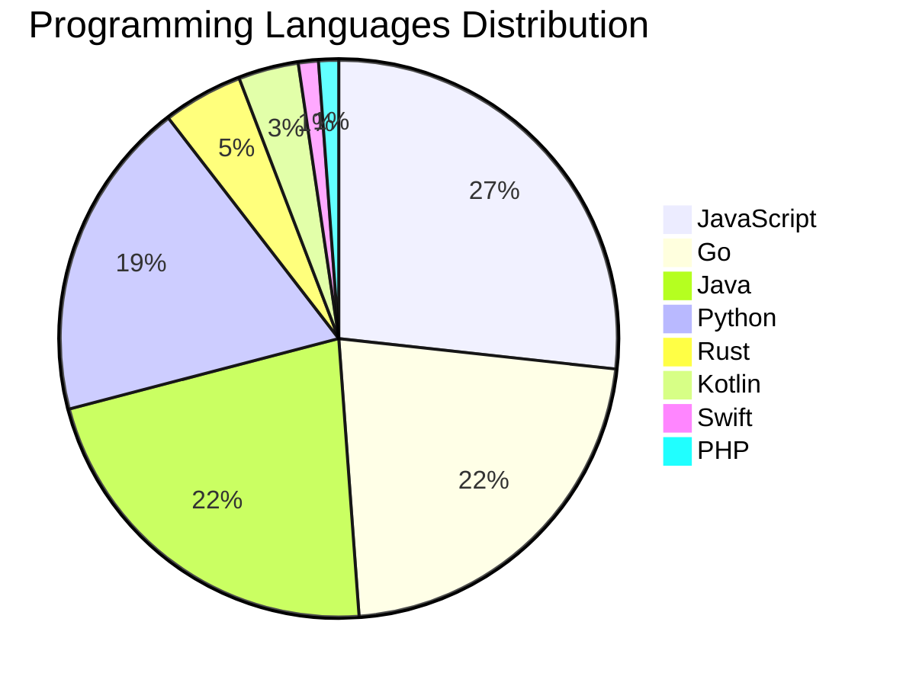

# 🚀 DevTech Auto News - Enhanced Edition


**DevTech Auto News Enhanced** is an advanced automated bot that aggregates trending topics in **AI**, **Web Development**, **Mobile**, **Cloud**, **DevOps**, and more from multiple sources including:

- 📰 [Dev.to](https://dev.to) - Developer community articles
- 🔥 [HackerNews](https://news.ycombinator.com) - Tech news discussions  
- 💻 [GitHub Trending](https://github.com/trending) - Trending repositories
- 🎯 Curated Interview Questions from multiple languages

## ✨ Features

✅ **Multi-Source Aggregation**: Combines articles from Dev.to, HackerNews, and GitHub  
✅ **Smart Categorization**: Automatically categorizes content into 10+ topics  
✅ **Image Support**: Displays cover images for visual appeal  
✅ **Pagination**: Fetches 50+ articles per update with deduplication  
✅ **Language Statistics**: Tracks programming language trends with charts  
✅ **Interview Questions**: Daily coding interview questions in multiple languages  
✅ **GitHub Actions**: Runs every 15 minutes automatically  

---

## 📊 Statistics Dashboard

### 📊 Articles by Category

**AI**: 🟦🟦🟦🟦🟦🟦🟦🟦🟦🟦🟦🟦🟦🟦🟦🟦🟦🟦🟦🟦 48 (45.7%)

**Tools**: 🟦🟦🟦🟦🟦🟦🟦🟦🟦🟦🟦🟦🟦 30 (28.6%)

**JavaScript**: 🟦🟦🟦🟦🟦🟦🟦🟦🟦🟦 23 (21.9%)

**Python**: 🟦🟦🟦🟦🟦🟦🟦 16 (15.2%)

**Cloud**: 🟦🟦🟦🟦🟦 11 (10.5%)

**Database**: 🟦🟦 5 (4.8%)

**WebDev**: 🟦🟦 4 (3.8%)

**Mobile**: 🟦🟦 4 (3.8%)

**Security**: 🟦 3 (2.9%)

**DevOps**: 🟦 2 (1.9%)


### 📡 Sources

- **Dev.to**: 60 articles
- **HackerNews**: 30 articles
- **GitHub**: 15 articles


### 💻 Programming Language Trends

```
JavaScript      ██████████████████████████████ 26.7 (26.7%)
Go              █████████████████████████ 22.1 (22.1%)
Java            █████████████████████████ 22.1 (22.1%)
Python          █████████████████████ 18.6 (18.6%)
Rust            █████ 4.7 (4.7%)
Kotlin          ████ 3.5 (3.5%)
Swift           █ 1.2 (1.2%)
PHP             █ 1.2 (1.2%)

```




### 🏷️ Trending Tags

               


---

## 🛠️ How It Works

1. **Multi-Source Fetch**: Pulls from Dev.to (2 pages), HackerNews (3 topics), GitHub (3 languages)
2. **Smart Filter**: Uses keyword matching across 10+ categories  
3. **Deduplication**: Removes duplicate URLs  
4. **Image Extraction**: Captures cover images when available  
5. **Statistics**: Generates language trends and category breakdowns  
6. **Update Files**: Regenerates README and appends to comprehensive log  

---

## 📦 Installation & Usage

```bash
# Clone the repository
git clone https://github.com/Derrick-MUGISHA/github-activity-bot.git
cd github-activity-bot

# Install dependencies  
npm install

# Run manually
npm start

# Test mode
npm run test
```

---


# 🚀 DevTech Auto News - Enhanced Edition

## 📅 Latest Updates (2026-05-29 6:00 CAT)


### 🖼️ Featured Articles

<table>
<tr>
  <td align="center" width="33%">
    <a href="https://dev.to/sylwia-lask/how-are-developers-actually-using-ai-at-work-4g9c">
      
      <br/>
      <b>How Are Developers Actually Using AI At Work?</b>
    </a>
    <br/>
    <sub>Dev.to</sub>
  </td>
  <td align="center" width="33%">
    <a href="https://dev.to/devteam/top-7-featured-dev-posts-of-the-week-45na">
      
      <br/>
      <b>Top 7 Featured DEV Posts of the Week</b>
    </a>
    <br/>
    <sub>Dev.to</sub>
  </td>
  <td align="center" width="33%">
    <a href="https://dev.to/harsh2644/i-spent-10x-longer-debugging-ai-code-than-writing-it-15h4">
      
      <br/>
      <b>I Spent 10x Longer Debugging AI Code Than Writing ...</b>
    </a>
    <br/>
    <sub>Dev.to</sub>
  </td>
</tr>
<tr>
  <td align="center" width="33%">
    <a href="https://dev.to/haritad/copilot-helped-me-deploy-my-passion-project-to-the-app-store-21m6">
      
      <br/>
      <b>Copilot helped me deploy my passion project to the...</b>
    </a>
    <br/>
    <sub>Dev.to</sub>
  </td>
  <td align="center" width="33%">
    <a href="https://dev.to/googleai/how-i-built-a-supersonic-ai-riddling-duel-in-under-20-minutes-with-zero-manual-coding-16ah">
      
      <br/>
      <b>How I built a supersonic AI riddling duel in under...</b>
    </a>
    <br/>
    <sub>Dev.to</sub>
  </td>
  <td align="center" width="33%">
    <a href="https://dev.to/devteam/winner-announcement-delayed-for-the-gemma-4-challenge-2opb">
      
      <br/>
      <b>Winner Announcement Delayed for the Gemma 4 Challe...</b>
    </a>
    <br/>
    <sub>Dev.to</sub>
  </td>
</tr>
</table>


### 📰 Top Headlines

- [How Are Developers Actually Using AI At Work?](https://dev.to/sylwia-lask/how-are-developers-actually-using-ai-at-work-4g9c) _[Dev.to]_
- [Top 7 Featured DEV Posts of the Week](https://dev.to/devteam/top-7-featured-dev-posts-of-the-week-45na) _[Dev.to]_
- [I Spent 10x Longer Debugging AI Code Than Writing It](https://dev.to/harsh2644/i-spent-10x-longer-debugging-ai-code-than-writing-it-15h4) _[Dev.to]_
- [Copilot helped me deploy my passion project to the App Store](https://dev.to/haritad/copilot-helped-me-deploy-my-passion-project-to-the-app-store-21m6) _[Dev.to]_
- [How I built a supersonic AI riddling duel in under 20 Minutes (with zero manual coding)](https://dev.to/googleai/how-i-built-a-supersonic-ai-riddling-duel-in-under-20-minutes-with-zero-manual-coding-16ah) _[Dev.to]_
- [Winner Announcement Delayed for the Gemma 4 Challenge](https://dev.to/devteam/winner-announcement-delayed-for-the-gemma-4-challenge-2opb) _[Dev.to]_
- [In 2026, you can just prompt your way to a working Android app. 🤯](https://dev.to/googleai/in-2026-you-can-just-prompt-your-way-to-a-working-android-app-31i9) _[Dev.to]_
- [Accessibility question: is nesting interactive elements bad?](https://dev.to/codepo8/accessibility-question-is-nesting-interactive-elements-bad-4oof) _[Dev.to]_
- [Reviving a 12K+ Star Abandoned Library: toastr-next v3 🍞](https://dev.to/divyesh5981/reviving-a-12k-star-abandoned-library-toastr-next-v3-25mf) _[Dev.to]_
- [How a 500 MB Buffer Killed Our Archival Job — And Why Streaming Fixed It](https://dev.to/harishteens/how-a-500-mb-buffer-killed-our-archival-job-and-why-streaming-fixed-it-4iek) _[Dev.to]_
- [How I Found a Fake Job Assessment Repo Hiding Malware Inside SVG Files](https://dev.to/arsen1c/how-i-found-a-fake-job-assessment-repo-hiding-malware-inside-svg-files-13oi) _[Dev.to]_
- [Why does AI forget what you said (and how to fix it)](https://dev.to/aws/why-does-ai-forget-what-you-said-and-how-to-fix-it-52f6) _[Dev.to]_
- [Build Your First Claude Skill: An Gmail-to-GDrive Receipt Filer in 20 Minutes](https://dev.to/devpato/build-your-first-claude-skill-an-gmail-to-gdrive-receipt-filer-in-20-minutes-2fn7) _[Dev.to]_
- [I love MJML — I just didn't want a whole templating engine for two tiny things](https://dev.to/kralik12/i-love-mjml-i-just-didnt-want-a-whole-templating-engine-for-two-tiny-things-5a10) _[Dev.to]_
- [Building an SEO crawler in TypeScript: what I learned](https://dev.to/codepurse/building-an-seo-crawler-in-typescript-what-i-learned-1doo) _[Dev.to]_
- [An LLM API call, in 4 GIFs](https://dev.to/jasmin/an-llm-api-call-in-4-gifs-33b1) _[Dev.to]_
- [Claude Code Slash Commands You Should Know (I wasn't either)](https://dev.to/lizziepika/claude-code-slash-commands-you-should-know-i-wasnt-either-1hnf) _[Dev.to]_
- [I built 'Ask Your Life' — a personal Coral agent that answers questions about your money & deadlines with SQL](https://dev.to/sahil9001/i-built-ask-your-life-a-personal-coral-agent-that-answers-questions-about-your-money--52a8) _[Dev.to]_
- [Advent of Code 2015 days 3-8 in Clojure](https://dev.to/andyn/advent-of-code-2015-days-3-8-in-clojure-3c94) _[Dev.to]_
- [Cross Language A2A Agent Benchmarking with Antigravity CLI](https://dev.to/gde/cross-language-a2a-agent-benchmarking-with-antigravity-cli-hn1) _[Dev.to]_

_Last automated update: Fri, 29 May 2026 06:41:47 CAT_


## 💡 Daily Interview Questions

_Sharpen your skills with these curated questions_

### 1. Python: Implement a context manager using __enter__ and __exit__

**Difficulty**: Hard | **Topics**: context managers, resource management

<details>
<summary>💡 Hint</summary>

with statement, setup/teardown, exception handling

</details>

### 2. SystemDesign: How would you design a rate limiter?

**Difficulty**: Medium | **Topics**: system design, algorithms

<details>
<summary>💡 Hint</summary>

Token bucket, sliding window, distributed systems

</details>

### 3. DataStructures: Find the median of two sorted arrays

**Difficulty**: Hard | **Topics**: arrays, binary search

<details>
<summary>💡 Hint</summary>

Binary search, partition, time complexity O(log(min(m,n)))

</details>


---

## 📚 Resources

- [Full News Archive](./data/news_log.md) - Complete history of all fetched articles
- [Statistics JSON](./data/stats.json) - Raw statistics data
- [Categorized Data](./data/categorized.json) - Articles organized by category
- [Interview Questions](./data/interview_questions.json) - Complete question bank

---

## 🤝 Contributing

Want to add more sources, categories, or interview questions? Feel free to:

1. Fork this repository
2. Add your improvements
3. Submit a pull request

---

## 📄 License

MIT License - Feel free to use and modify!

---

<p align="center">
  <b>Last automated update: Fri, 29 May 2026 04:41:47 GMT</b><br/>
  <sub>Powered by GitHub Actions | Made with ❤️ for developers</sub>
</p>

---

## 🔗 Quick Links

- [View Workflow](https://github.com/Derrick-MUGISHA/github-activity-bot/actions)
- [Report Issue](https://github.com/Derrick-MUGISHA/github-activity-bot/issues)
- [Suggest Feature](https://github.com/Derrick-MUGISHA/github-activity-bot/issues/new)
