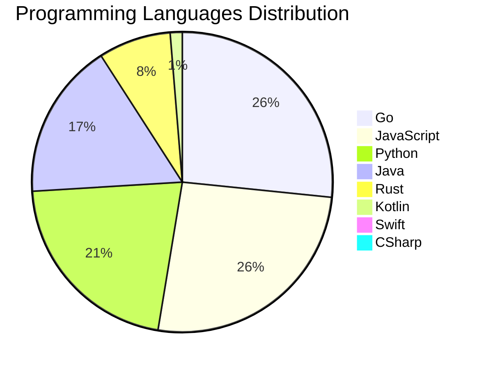

<div align="center">

# 📰 DevTech Auto News

**Your always-fresh digest of developer & AI tech news — curated automatically, around the clock.**


Aggregating [Dev.to](https://dev.to) · [Hacker News](https://news.ycombinator.com) · [GitHub Trending](https://github.com/trending) · [Lobste.rs](https://lobste.rs) · [Stack Overflow](https://stackoverflow.com) · [TechCrunch](https://techcrunch.com) · [freeCodeCamp](https://www.freecodecamp.org/news) — refreshed by GitHub Actions around the clock.

**[📰 Headlines](#-latest-headlines) · [💡 Interview Prep](#-interview-question-of-the-hour) · [📊 Statistics](#-statistics) · [⚙️ How It Works](#%EF%B8%8F-how-it-works)**

</div>

---

## 📰 Latest Headlines

> 🕐 Edition of **2026-07-15 19:00 CAT** — refreshed automatically, all day, every day.

### ✨ Featured Stories

<table>
<tr>
  <td align="center" width="33%">
    <a href="https://dev.to/zacharylee/how-i-made-a-rust-hot-path-27x-faster-and-the-ai-fix-i-refused-to-merge-3llg">
      
      <br/>
      <b>How I made a Rust hot path 27x faster, and the AI ...</b>
    </a>
    <br/>
    <sub>Dev.to</sub>
  </td>
  <td align="center" width="33%">
    <a href="https://dev.to/ben/this-is-remarkablehttpsbobdahackercomblogfifa-hack-3kb0">
      
      <br/>
      <b>This is remarkable

https://bobdahacker.com/blog...</b>
    </a>
    <br/>
    <sub>Dev.to</sub>
  </td>
  <td align="center" width="33%">
    <a href="https://dev.to/hemapriya_kanagala/i-finally-built-the-dev-opportunity-radar-website-1dpi">
      
      <br/>
      <b>I Finally Built the Dev Opportunity Radar Website ...</b>
    </a>
    <br/>
    <sub>Dev.to</sub>
  </td>
</tr>
<tr>
  <td align="center" width="33%">
    <a href="https://dev.to/ben/http-gets-a-query-method-so-complex-searches-can-stop-pretending-to-be-post-j28">
      
      <br/>
      <b>HTTP gets a QUERY method so complex searches can s...</b>
    </a>
    <br/>
    <sub>Dev.to</sub>
  </td>
  <td align="center" width="33%">
    <a href="https://dev.to/ben/a-lot-of-good-points-here-httpsantirezcomnews169-417f">
      
      <br/>
      <b>A lot of good points here https://antirez.com/news...</b>
    </a>
    <br/>
    <sub>Dev.to</sub>
  </td>
  <td align="center" width="33%">
    <a href="https://dev.to/ben/the-myth-of-the-post-documentation-era-39al">
      
      <br/>
      <b>The Myth of the Post-Documentation Era</b>
    </a>
    <br/>
    <sub>Dev.to</sub>
  </td>
</tr>
</table>


### 🗞️ Top Stories

| # | Headline | Source |
|---|----------|--------|
| 1 | [How I made a Rust hot path 27x faster, and the AI fix I refused to merge](https://dev.to/zacharylee/how-i-made-a-rust-hot-path-27x-faster-and-the-ai-fix-i-refused-to-merge-3llg) | Dev.to |
| 2 | [This is remarkable

https://bobdahacker.com/blog/fifa-hack](https://dev.to/ben/this-is-remarkablehttpsbobdahackercomblogfifa-hack-3kb0) | Dev.to |
| 3 | [I Finally Built the Dev Opportunity Radar Website ❤️](https://dev.to/hemapriya_kanagala/i-finally-built-the-dev-opportunity-radar-website-1dpi) | Dev.to |
| 4 | [HTTP gets a QUERY method so complex searches can stop pretending to be POST

https://www.theregister.com/devops/2026/07/13/http-gets-a-query-method-so-complex-searches-can-stop-pretending-to-be-post/5270192](https://dev.to/ben/http-gets-a-query-method-so-complex-searches-can-stop-pretending-to-be-post-j28) | Dev.to |
| 5 | [A lot of good points here https://antirez.com/news/169](https://dev.to/ben/a-lot-of-good-points-here-httpsantirezcomnews169-417f) | Dev.to |
| 6 | [The Myth of the Post-Documentation Era](https://dev.to/ben/the-myth-of-the-post-documentation-era-39al) | Dev.to |
| 7 | [DEV’s Big Summer Bug Smash is now LIVE! Share $5,000 in cash prizes, skateboards, and more across 20+ winners. 🐛🐞🪲](https://dev.to/devteam/devs-big-summer-bug-smash-is-now-live-share-5000-in-cash-prizes-skateboards-and-more-across-57mk) | Dev.to |
| 8 | [Chasing the Sentry prize for DEV's Summer Bug Smash? Let us know what questions you have.](https://dev.to/sentry/chasing-the-sentry-prize-for-devs-summer-bug-smash-let-us-know-what-questions-you-have-1506) | Dev.to |
| 9 | [Debugging Deployments with Gemma 2B, TPU v6e-1, MCP, and Antigravity CLI](https://dev.to/gde/debugging-deployments-with-gemma-2b-tpu-v6e-1-mcp-and-antigravity-cli-3hh3) | Dev.to |
| 10 | [Building a Hybrid Docker Orchestrator in Go: The Journey from Single VM to Multi-Node Cluster](https://dev.to/gde/building-a-hybrid-docker-orchestrator-in-go-the-journey-from-single-vm-to-multi-node-cluster-3i7m) | Dev.to |
| 11 | [How to Respectfully Contribute to Open Source](https://dev.to/opensourcepledge/how-to-respectfully-contribute-to-open-source-cbh) | Dev.to |
| 12 | [DiffusionGemma: 4x faster text generation](https://dev.to/googleai/diffusiongemma-4x-faster-text-generation-fmd) | Dev.to |
| 13 | [4B Gemma 4 QAT Deployment with GCE, NVIDIA L4, MCP, and Antigravity CLI](https://dev.to/gde/4b-gemma-4-qat-deployment-with-gce-nvidia-l4-mcp-and-antigravity-cli-gh6) | Dev.to |
| 14 | [Should I quit IT or just live through the burnout?](https://dev.to/klaudiagrz/should-i-quit-it-or-just-live-through-the-burnout-1gng) | Dev.to |
| 15 | [Stop Copy-Pasting `dns:` Blocks: Introducing Transparent DNS Injection in Gubernator](https://dev.to/gde/stop-copy-pasting-dns-blocks-introducing-transparent-dns-injection-in-gubernator-ad4) | Dev.to |
| 16 | [[GCP Billing & Vertex AI] Solving Gemini Cost Allocation in a Single Project: Vertex AI Dynamic Billing Labels in Action](https://dev.to/gde/gcp-billing-vertex-ai-solving-gemini-cost-allocation-in-a-single-project-vertex-ai-dynamic-5aok) | Dev.to |
| 17 | [A Vibe Is Not a Verdict: I Built a Tool That's Allowed to Say 'I Don't Know'](https://dev.to/copyleftdev/a-vibe-is-not-a-verdict-i-built-a-tool-thats-allowed-to-say-i-dont-know-4foe) | Dev.to |
| 18 | [Porting Gemma-4 (2B / 4B / 12B) to AWS Inferentia2](https://dev.to/gde/porting-gemma-4-2b-4b-12b-to-aws-inferentia2-2jnf) | Dev.to |
| 19 | [Debugging Deployments with Gemma 4B, TPU v6e-4, MCP, and Antigravity CLI](https://dev.to/gde/debugging-deployments-with-gemma-4b-tpu-v6e-4-mcp-and-antigravity-cli-1l82) | Dev.to |
| 20 | [MCP Configuration for Looker with Antigravity CLI](https://dev.to/gde/mcp-configuration-for-looker-with-antigravity-cli-504d) | Dev.to |

<sub>Last fetched: Wed, 15 Jul 2026 19:03:28 CAT</sub>


---

## 💡 Interview Question of the Hour

> Sharpen your skills — new questions selected on every update. Try answering before opening the hint!

**1. `React` — How would you optimize a React app's performance?**

&nbsp;&nbsp;&nbsp;&nbsp;🎯 Hard · 🏷 optimization, performance

<details>
<summary>&nbsp;&nbsp;&nbsp;&nbsp;💡 Show hint</summary>

> React.memo, useMemo, useCallback, code splitting, lazy loading

</details>

**2. `JavaScript` — What is the event loop and how does it work?**

&nbsp;&nbsp;&nbsp;&nbsp;🎯 Hard · 🏷 async, runtime

<details>
<summary>&nbsp;&nbsp;&nbsp;&nbsp;💡 Show hint</summary>

> Call stack, callback queue, microtask queue

</details>

**3. `React` — What is the Virtual DOM and how does React use it?**

&nbsp;&nbsp;&nbsp;&nbsp;🎯 Easy · 🏷 rendering, performance

<details>
<summary>&nbsp;&nbsp;&nbsp;&nbsp;💡 Show hint</summary>

> Diffing algorithm, reconciliation, efficiency

</details>


---

## 📊 Statistics

#### 🗂 Articles by Category

| Category | Articles | Share | |
|----------|---------:|------:|---|
| **AI** | 72 | 39.3% | `████████████████████` |
| **JavaScript** | 40 | 21.9% | `███████████░░░░░░░░░` |
| **Tools** | 40 | 21.9% | `███████████░░░░░░░░░` |
| **Python** | 33 | 18.0% | `█████████░░░░░░░░░░░` |
| **DevOps** | 19 | 10.4% | `█████░░░░░░░░░░░░░░░` |
| **Cloud** | 18 | 9.8% | `█████░░░░░░░░░░░░░░░` |
| **Security** | 15 | 8.2% | `████░░░░░░░░░░░░░░░░` |
| **WebDev** | 7 | 3.8% | `██░░░░░░░░░░░░░░░░░░` |
| **Mobile** | 3 | 1.6% | `█░░░░░░░░░░░░░░░░░░░` |
| **Database** | 2 | 1.1% | `█░░░░░░░░░░░░░░░░░░░` |

<sub>Articles can match more than one category, so shares may sum to over 100%.</sub>


#### 📡 Articles by Source

| Source | Articles |
|--------|---------:|
| Dev.to | 59 |
| HackerNews | 49 |
| GitHub | 25 |
| Lobste.rs | 10 |
| StackOverflow | 20 |
| TechCrunch | 10 |
| freeCodeCamp | 10 |


#### 💻 Programming Language Trends

```
Go              ██████████████████████████████ 26.3%
JavaScript      █████████████████████████████ 25.6%
Python          ████████████████████████ 21.2%
Java            ███████████████████ 16.7%
Rust            █████████ 7.7%
Kotlin          █ 1.3%
Swift           █ 0.6%
CSharp          █ 0.6%

```




#### 🏷 Trending Topics

            


---

## ⚙️ How It Works

This repository is a fully automated news pipeline. On every run, GitHub Actions:

1. **Fetches** the latest articles from seven sources: Dev.to, Hacker News, GitHub Trending, Lobste.rs, Stack Overflow, TechCrunch, and freeCodeCamp
2. **Deduplicates and categorizes** them across 10+ topics using keyword matching
3. **Extracts cover images** and computes language & category statistics
4. **Rebuilds this README** and appends everything to the [full archive](./data/news_log.md)
5. **Commits and pushes** the result — no human intervention needed

<details>
<summary><b>🚀 Run it yourself</b></summary>

```bash
git clone https://github.com/Derrick-MUGISHA/github-activity-bot.git
cd github-activity-bot
npm install
npm start
```

Fork the repo, enable GitHub Actions, and you have your own self-updating news feed.

</details>

<details>
<summary><b>📚 Data & resources</b></summary>

- [Full news archive](./data/news_log.md) — complete history of every fetched article
- [Statistics](./data/stats.json) — raw stats data (JSON)
- [Categorized articles](./data/categorized.json) — articles grouped by topic
- [Interview question bank](./data/interview_questions.json) — the full question set

</details>

---

## 🤝 Contributing

Ideas for new sources, categories, or interview questions are welcome — [open an issue](https://github.com/Derrick-MUGISHA/github-activity-bot/issues/new) or submit a pull request.

## 📄 License

Released under the [MIT License](https://opensource.org/licenses/MIT) — free to use, fork, and modify.

---

<div align="center">
  <sub>🤖 Last automated update: <b>Wed, 15 Jul 2026 17:03:28 GMT</b></sub><br/>
  <sub>Powered by GitHub Actions · Built with ❤️ by <a href="https://github.com/Derrick-MUGISHA">Derrick MUGISHA</a></sub>
</div>
