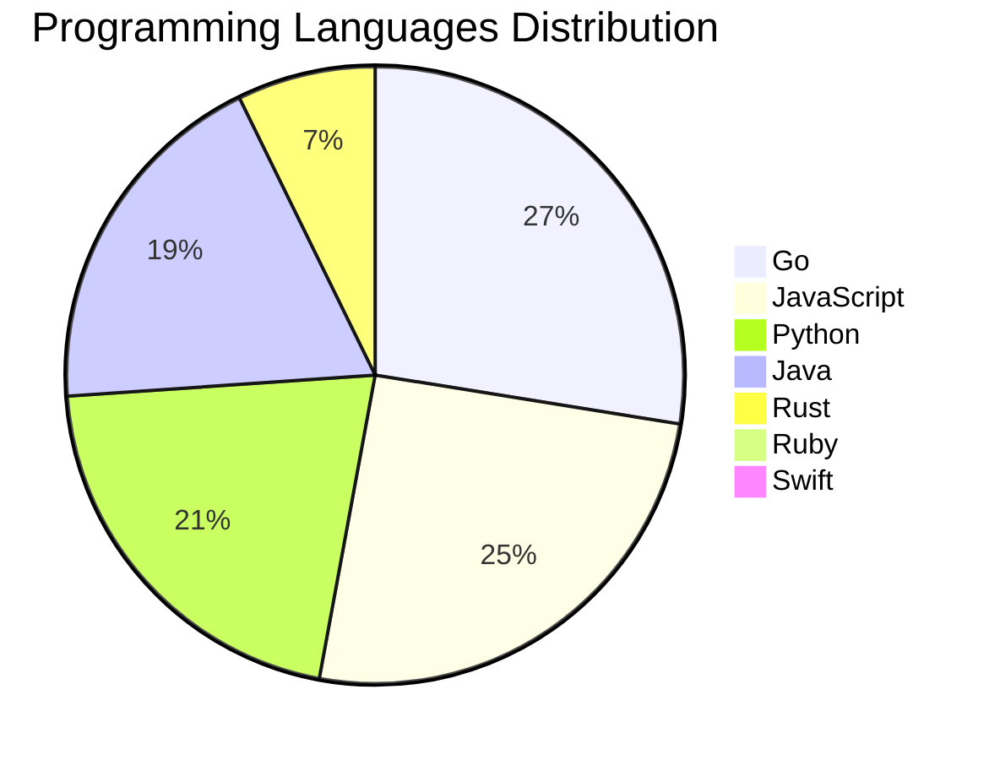

<div align="center">

# 📰 DevTech Auto News

**Your always-fresh digest of developer & AI tech news — curated automatically, around the clock.**


Aggregating [Dev.to](https://dev.to) · [Hacker News](https://news.ycombinator.com) · [GitHub Trending](https://github.com/trending) · [Lobste.rs](https://lobste.rs) · [Stack Overflow](https://stackoverflow.com) · [TechCrunch](https://techcrunch.com) · [freeCodeCamp](https://www.freecodecamp.org/news) — refreshed by GitHub Actions around the clock.

**[📰 Headlines](#-latest-headlines) · [💡 Interview Prep](#-interview-question-of-the-hour) · [📊 Statistics](#-statistics) · [⚙️ How It Works](#%EF%B8%8F-how-it-works)**

</div>

---

## 📰 Latest Headlines

> 🕐 Edition of **2026-09-05 23:00 CAT** — refreshed automatically, all day, every day.

### ✨ Featured Stories

<table>
<tr>
  <td align="center" width="33%">
    <a href="https://dev.to/sylwia-lask/20-agentic-ai-terms-every-developer-should-know-explained-simply-jii">
      
      <br/>
      <b>20 Agentic AI Terms Every Developer Should Know (E...</b>
    </a>
    <br/>
    <sub>Dev.to</sub>
  </td>
  <td align="center" width="33%">
    <a href="https://dev.to/ujja/ai-engineering-is-easy-changing-how-we-work-is-hard-39j4">
      
      <br/>
      <b>AI Engineering Is Easy. Changing How We Work Is Ha...</b>
    </a>
    <br/>
    <sub>Dev.to</sub>
  </td>
  <td align="center" width="33%">
    <a href="https://dev.to/gde/taming-flutter-infinite-scroll-part-2-turning-scrollcontroller-into-a-reactive-state-machine-cgh">
      
      <br/>
      <b>Taming Flutter Infinite Scroll (Part 2): Turning S...</b>
    </a>
    <br/>
    <sub>Dev.to</sub>
  </td>
</tr>
<tr>
  <td align="center" width="33%">
    <a href="https://dev.to/devteam/what-was-your-win-this-week-1mo8">
      
      <br/>
      <b>What was your win this week?</b>
    </a>
    <br/>
    <sub>Dev.to</sub>
  </td>
  <td align="center" width="33%">
    <a href="https://dev.to/gde/kong-ai-gateway-20-on-google-cloud-securing-gke-cloud-run-and-vertex-ai-219o">
      
      <br/>
      <b>Kong AI Gateway 2.0 on Google Cloud: Securing GKE,...</b>
    </a>
    <br/>
    <sub>Dev.to</sub>
  </td>
  <td align="center" width="33%">
    <a href="https://dev.to/gde/gemini-agentic-video-isnt-always-cheaper-a-24-run-benchmark-4ge3">
      
      <br/>
      <b>Gemini Agentic Video Isn't Always Cheaper: A 24-Ru...</b>
    </a>
    <br/>
    <sub>Dev.to</sub>
  </td>
</tr>
</table>


### 🗞️ Top Stories

| # | Headline | Source |
|---|----------|--------|
| 1 | [20 Agentic AI Terms Every Developer Should Know (Explained Simply)](https://dev.to/sylwia-lask/20-agentic-ai-terms-every-developer-should-know-explained-simply-jii) | Dev.to |
| 2 | [AI Engineering Is Easy. Changing How We Work Is Hard](https://dev.to/ujja/ai-engineering-is-easy-changing-how-we-work-is-hard-39j4) | Dev.to |
| 3 | [Taming Flutter Infinite Scroll (Part 2): Turning ScrollController into a Reactive State Machine with CubitSignalMixin](https://dev.to/gde/taming-flutter-infinite-scroll-part-2-turning-scrollcontroller-into-a-reactive-state-machine-cgh) | Dev.to |
| 4 | [What was your win this week?](https://dev.to/devteam/what-was-your-win-this-week-1mo8) | Dev.to |
| 5 | [Kong AI Gateway 2.0 on Google Cloud: Securing GKE, Cloud Run, and Vertex AI(Agent Platform)](https://dev.to/gde/kong-ai-gateway-20-on-google-cloud-securing-gke-cloud-run-and-vertex-ai-219o) | Dev.to |
| 6 | [Gemini Agentic Video Isn't Always Cheaper: A 24-Run Benchmark](https://dev.to/gde/gemini-agentic-video-isnt-always-cheaper-a-24-run-benchmark-4ge3) | Dev.to |
| 7 | [Your First Multi-agent system: A Beginner's Guide to Building an AI Trend finder with ADK](https://dev.to/googleai/your-first-multi-agent-system-a-beginners-guide-to-building-an-ai-trend-finder-with-adk-48jp) | Dev.to |
| 8 | [AI-assisted genealogy](https://dev.to/nfrankel/ai-assisted-genealogy-9cn) | Dev.to |
| 9 | [I Built My First AWS Agent Workflow, and the Hardest Part Was Getting It to Stop Assuming Things](https://dev.to/hemapriya_kanagala/i-built-my-first-aws-agent-workflow-and-the-hardest-part-was-getting-it-to-stop-assuming-things-8fg) | Dev.to |
| 10 | [Kubeflow Without Kubernetes? Deploy a Complete MLOps Suite in 60 Seconds with Gubernator](https://dev.to/gde/kubeflow-without-kubernetes-deploy-a-complete-mlops-suite-in-60-seconds-with-gubernator-3moo) | Dev.to |
| 11 | [Your First AI Agent: A Beginner's Guide to Building an AI Trend finder with ADK](https://dev.to/googleai/your-first-ai-agent-a-beginners-guide-to-building-an-ai-trend-finder-with-adk-5f8k) | Dev.to |
| 12 | [Two-step control plane upgrades in GKE: How minor version rollbacks work under the hood](https://dev.to/googlecloud/two-step-control-plane-upgrades-in-gke-how-minor-version-rollbacks-work-under-the-hood-i1l) | Dev.to |
| 13 | [Cross Cloud A2A Agent Card Field Comparison](https://dev.to/gde/cross-cloud-a2a-agent-card-field-comparison-2hod) | Dev.to |
| 14 | [My Thermostat Was Speaking an Industrial Protocol. Just Not to Me.](https://dev.to/managerfx/my-thermostat-was-speaking-an-industrial-protocol-just-not-to-me-2a0p) | Dev.to |
| 15 | [Join our DEV Weekend Challenge: Generosity Edition! $1,000 in Prizes Across FIVE Winners. Submissions Due September 7 at 6:59 AM UTC.](https://dev.to/devteam/join-our-dev-weekend-challenge-generosity-edition-1000-in-prizes-across-five-winners-20en) | Dev.to |
| 16 | [The job description already changed. We're not coders anymore, but couriers.](https://dev.to/canro91/the-job-description-already-changed-were-not-coders-anymore-but-couriers-40eg) | Dev.to |
| 17 | [[AI in Practice] Building a Dynamic LINE Group Buying Bot with Edit and Unsend Webhooks](https://dev.to/gde/ai-in-practice-building-a-dynamic-line-group-buying-bot-with-edit-and-unsend-webhooks-1clh) | Dev.to |
| 18 | [How to Write Reliable Rubrics for LLM-as-a-Judge Evaluations](https://dev.to/googleai/how-to-write-reliable-rubrics-for-llm-as-a-judge-evaluations-ndp) | Dev.to |
| 19 | [Hearing the Mountain's Roar: How Antigravity CLI's AI Agents & IoT Data Track Volcanic Shockwaves](https://dev.to/gde/hearing-the-mountains-roar-how-antigravity-clis-ai-agents-iot-data-track-volcanic-shockwaves-13hp) | Dev.to |
| 20 | [Step up to the Sheets: AI Eval Export and Illustrating Data](https://dev.to/googleai/step-up-to-the-sheets-ai-eval-export-and-illustrating-data-bak) | Dev.to |

<sub>Last fetched: Sat, 05 Sep 2026 23:20:54 CAT</sub>


---

## 💡 Interview Question of the Hour

> Sharpen your skills — new questions selected on every update. Try answering before opening the hint!

**1. `Java` — What is the difference between abstract class and interface?**

&nbsp;&nbsp;&nbsp;&nbsp;🎯 Easy · 🏷 OOP, design

<details>
<summary>&nbsp;&nbsp;&nbsp;&nbsp;💡 Show hint</summary>

> Multiple inheritance, method implementation, use cases

</details>

**2. `NodeJS` — What is the difference between process.nextTick() and setImmediate()?**

&nbsp;&nbsp;&nbsp;&nbsp;🎯 Medium · 🏷 event loop, async

<details>
<summary>&nbsp;&nbsp;&nbsp;&nbsp;💡 Show hint</summary>

> Execution timing, event loop phases

</details>

**3. `JavaScript` — What are closures and provide a practical example?**

&nbsp;&nbsp;&nbsp;&nbsp;🎯 Medium · 🏷 functions, scope

<details>
<summary>&nbsp;&nbsp;&nbsp;&nbsp;💡 Show hint</summary>

> Function + lexical environment, data privacy, callbacks

</details>


---

## 📊 Statistics

#### 🗂 Articles by Category

| Category | Articles | Share | |
|----------|---------:|------:|---|
| **AI** | 87 | 47.3% | `████████████████████` |
| **Tools** | 39 | 21.2% | `█████████░░░░░░░░░░░` |
| **JavaScript** | 35 | 19.0% | `████████░░░░░░░░░░░░` |
| **Python** | 29 | 15.8% | `███████░░░░░░░░░░░░░` |
| **DevOps** | 19 | 10.3% | `████░░░░░░░░░░░░░░░░` |
| **Cloud** | 17 | 9.2% | `████░░░░░░░░░░░░░░░░` |
| **Security** | 17 | 9.2% | `████░░░░░░░░░░░░░░░░` |
| **WebDev** | 7 | 3.8% | `██░░░░░░░░░░░░░░░░░░` |
| **Mobile** | 6 | 3.3% | `█░░░░░░░░░░░░░░░░░░░` |
| **Database** | 3 | 1.6% | `█░░░░░░░░░░░░░░░░░░░` |

<sub>Articles can match more than one category, so shares may sum to over 100%.</sub>


#### 📡 Articles by Source

| Source | Articles |
|--------|---------:|
| Dev.to | 60 |
| HackerNews | 49 |
| GitHub | 25 |
| Lobste.rs | 10 |
| StackOverflow | 20 |
| TechCrunch | 10 |
| freeCodeCamp | 10 |


#### 💻 Programming Language Trends

```
Go              ██████████████████████████████ 27.1%
JavaScript      ████████████████████████████ 25.0%
Python          ███████████████████████ 20.7%
Java            █████████████████████ 18.6%
Rust            ████████ 7.1%
Ruby            █ 0.7%
Swift           █ 0.7%

```




#### 🏷 Trending Topics

            


---

## ⚙️ How It Works

This repository is a fully automated news pipeline. On every run, GitHub Actions:

1. **Fetches** the latest articles from seven sources: Dev.to, Hacker News, GitHub Trending, Lobste.rs, Stack Overflow, TechCrunch, and freeCodeCamp
2. **Deduplicates and categorizes** them across 10+ topics using keyword matching
3. **Extracts cover images** and computes language & category statistics
4. **Rebuilds this README** and appends everything to the [full archive](./data/news_log.md)
5. **Commits and pushes** the result — no human intervention needed

<details>
<summary><b>🚀 Run it yourself</b></summary>

```bash
git clone https://github.com/Derrick-MUGISHA/github-activity-bot.git
cd github-activity-bot
npm install
npm start
```

Fork the repo, enable GitHub Actions, and you have your own self-updating news feed.

</details>

<details>
<summary><b>📚 Data & resources</b></summary>

- [Full news archive](./data/news_log.md) — complete history of every fetched article
- [Statistics](./data/stats.json) — raw stats data (JSON)
- [Categorized articles](./data/categorized.json) — articles grouped by topic
- [Interview question bank](./data/interview_questions.json) — the full question set

</details>

---

## 🤝 Contributing

Ideas for new sources, categories, or interview questions are welcome — [open an issue](https://github.com/Derrick-MUGISHA/github-activity-bot/issues/new) or submit a pull request.

## 📄 License

Released under the [MIT License](https://opensource.org/licenses/MIT) — free to use, fork, and modify.

---

<div align="center">
  <sub>🤖 Last automated update: <b>Sat, 05 Sep 2026 21:20:54 GMT</b></sub><br/>
  <sub>Powered by GitHub Actions · Built with ❤️ by <a href="https://github.com/Derrick-MUGISHA">Derrick MUGISHA</a></sub>
</div>
