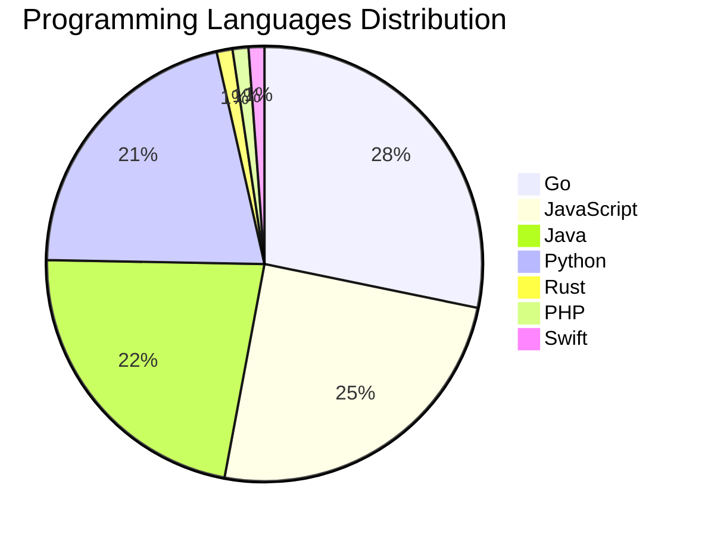

# 🚀 DevTech Auto News - Enhanced Edition


**DevTech Auto News Enhanced** is an advanced automated bot that aggregates trending topics in **AI**, **Web Development**, **Mobile**, **Cloud**, **DevOps**, and more from multiple sources including:

- 📰 [Dev.to](https://dev.to) - Developer community articles
- 🔥 [HackerNews](https://news.ycombinator.com) - Tech news discussions  
- 💻 [GitHub Trending](https://github.com/trending) - Trending repositories
- 🎯 Curated Interview Questions from multiple languages

## ✨ Features

✅ **Multi-Source Aggregation**: Combines articles from Dev.to, HackerNews, and GitHub  
✅ **Smart Categorization**: Automatically categorizes content into 10+ topics  
✅ **Image Support**: Displays cover images for visual appeal  
✅ **Pagination**: Fetches 50+ articles per update with deduplication  
✅ **Language Statistics**: Tracks programming language trends with charts  
✅ **Interview Questions**: Daily coding interview questions in multiple languages  
✅ **GitHub Actions**: Runs every 15 minutes automatically  

---

## 📊 Statistics Dashboard

### 📊 Articles by Category

**AI**: 🟦🟦🟦🟦🟦🟦🟦🟦🟦🟦🟦🟦🟦🟦🟦🟦🟦🟦🟦🟦 41 (41.4%)

**Tools**: 🟦🟦🟦🟦🟦🟦🟦🟦🟦🟦🟦🟦🟦 26 (26.3%)

**JavaScript**: 🟦🟦🟦🟦🟦🟦🟦🟦🟦🟦 21 (21.2%)

**Python**: 🟦🟦🟦🟦🟦🟦🟦🟦🟦 18 (18.2%)

**Cloud**: 🟦🟦🟦🟦🟦🟦 12 (12.1%)

**Security**: 🟦🟦🟦 7 (7.1%)

**DevOps**: 🟦🟦 4 (4.0%)

**WebDev**: 🟦 2 (2.0%)

**Mobile**: 🟦 2 (2.0%)

**Database**: 🟦 2 (2.0%)


### 📡 Sources

- **Dev.to**: 54 articles
- **HackerNews**: 30 articles
- **GitHub**: 15 articles


### 💻 Programming Language Trends

```
Go              ██████████████████████████████ 28.2 (28.2%)
JavaScript      ██████████████████████████ 24.7 (24.7%)
Java            ████████████████████████ 22.4 (22.4%)
Python          ███████████████████████ 21.2 (21.2%)
Rust            █ 1.2 (1.2%)
PHP             █ 1.2 (1.2%)
Swift           █ 1.2 (1.2%)

```




### 🏷️ Trending Tags

               


---

## 🛠️ How It Works

1. **Multi-Source Fetch**: Pulls from Dev.to (2 pages), HackerNews (3 topics), GitHub (3 languages)
2. **Smart Filter**: Uses keyword matching across 10+ categories  
3. **Deduplication**: Removes duplicate URLs  
4. **Image Extraction**: Captures cover images when available  
5. **Statistics**: Generates language trends and category breakdowns  
6. **Update Files**: Regenerates README and appends to comprehensive log  

---

## 📦 Installation & Usage

```bash
# Clone the repository
git clone https://github.com/Derrick-MUGISHA/github-activity-bot.git
cd github-activity-bot

# Install dependencies  
npm install

# Run manually
npm start

# Test mode
npm run test
```

---


# 🚀 DevTech Auto News - Enhanced Edition

## 📅 Latest Updates (2026-04-26 12:00 CAT)


### 🖼️ Featured Articles

<table>
<tr>
  <td align="center" width="33%">
    <a href="https://dev.to/devteam/what-was-your-win-this-week-8ep">
      
      <br/>
      <b>What was your win this week!?</b>
    </a>
    <br/>
    <sub>Dev.to</sub>
  </td>
  <td align="center" width="33%">
    <a href="https://dev.to/ai_made_tools/im-running-gemini-as-an-autonomous-coding-agent-heres-what-it-cant-do-and-which-next-26-6p2">
      
      <br/>
      <b>I'm Running Gemini as an Autonomous Coding Agent. ...</b>
    </a>
    <br/>
    <sub>Dev.to</sub>
  </td>
  <td align="center" width="33%">
    <a href="https://dev.to/vonagedev/the-vonage-dev-discussion-making-mistakes-32mc">
      
      <br/>
      <b>The Vonage Dev Discussion: Making mistakes</b>
    </a>
    <br/>
    <sub>Dev.to</sub>
  </td>
</tr>
<tr>
  <td align="center" width="33%">
    <a href="https://dev.to/backboardio/the-hidden-challenge-of-multi-llm-context-management-1pbh">
      
      <br/>
      <b>The Hidden Challenge of Multi-LLM Context Manageme...</b>
    </a>
    <br/>
    <sub>Dev.to</sub>
  </td>
  <td align="center" width="33%">
    <a href="https://dev.to/devteam/congrats-to-the-april-fools-challenge-winners-l8f">
      
      <br/>
      <b>Congrats to the April Fools Challenge Winners!!</b>
    </a>
    <br/>
    <sub>Dev.to</sub>
  </td>
  <td align="center" width="33%">
    <a href="https://dev.to/gde/instructions-skills-tools-how-google-embedded-skills-into-every-layer-of-its-agent-stack-5415">
      
      <br/>
      <b>Instructions. Skills. Tools. How Google Embedded S...</b>
    </a>
    <br/>
    <sub>Dev.to</sub>
  </td>
</tr>
</table>


### 📰 Top Headlines

- [What was your win this week!?](https://dev.to/devteam/what-was-your-win-this-week-8ep) _[Dev.to]_
- [I'm Running Gemini as an Autonomous Coding Agent. Here's What It Can't Do and Which NEXT '26 Announcements Would Fix It.](https://dev.to/ai_made_tools/im-running-gemini-as-an-autonomous-coding-agent-heres-what-it-cant-do-and-which-next-26-6p2) _[Dev.to]_
- [The Vonage Dev Discussion: Making mistakes](https://dev.to/vonagedev/the-vonage-dev-discussion-making-mistakes-32mc) _[Dev.to]_
- [The Hidden Challenge of Multi-LLM Context Management](https://dev.to/backboardio/the-hidden-challenge-of-multi-llm-context-management-1pbh) _[Dev.to]_
- [Congrats to the April Fools Challenge Winners!!](https://dev.to/devteam/congrats-to-the-april-fools-challenge-winners-l8f) _[Dev.to]_
- [Instructions. Skills. Tools. How Google Embedded Skills Into Every Layer of Its Agent Stack](https://dev.to/gde/instructions-skills-tools-how-google-embedded-skills-into-every-layer-of-its-agent-stack-5415) _[Dev.to]_
- [Empowering Autonomous AI Agents through Dynamic Tool Creation](https://dev.to/gde/empowering-autonomous-ai-agents-through-dynamic-tool-creation-3pfm) _[Dev.to]_
- [tinyboot v0.4.0 Released — The API is Stable](https://dev.to/aq1018/tinyboot-v040-released-the-api-is-stable-2h76) _[Dev.to]_
- [How to use AI to identify and fix security vulnerabilities in your codebase](https://dev.to/coderabbitai/how-to-use-ai-to-identify-and-fix-security-vulnerabilities-in-your-codebase-4na2) _[Dev.to]_
- [Building MCP Apps with Angular](https://dev.to/dalenguyen/building-mcp-apps-with-angular-3849) _[Dev.to]_
- [How to make OpenClaw just work](https://dev.to/angeluz07/how-to-make-openclaw-just-work-2lm1) _[Dev.to]_
- [Remade the 1991 Classic "Gorillas" in Python—and Survived the Snapcraft Journey](https://dev.to/davdomin/remade-the-1991-classic-gorillas-in-python-and-survived-the-snapcraft-journey-2nfp) _[Dev.to]_
- [Tune In and Join the Google Cloud NEXT '26 Writing Challenge: $1,000 in Prizes!](https://dev.to/devteam/tune-in-and-join-the-google-cloud-next-26-writing-challenge-1000-in-prizes-21bd) _[Dev.to]_
- [I built a shell script that sets up your entire AI coding agent workspace in 2 minutes](https://dev.to/shad_tech/i-built-a-shell-script-that-sets-up-your-entire-ai-coding-agent-workspace-in-2-minutes-13ep) _[Dev.to]_
- [How to Filter and Sort Posts by Custom Field Value Using JetSmartFilters + Bricks Builder](https://dev.to/muazzami/how-to-filter-and-sort-posts-by-custom-field-value-using-jetsmartfilters-bricks-builder-57an) _[Dev.to]_
- [Why LLM Reasoning Is Breaking AI Infrastructure (And How to Fix It)](https://dev.to/backboardio/why-llm-reasoning-is-breaking-ai-infrastructure-and-how-to-fix-it-2aik) _[Dev.to]_
- [Build and Deploy to Google Cloud with Antigravity: The Era of Agent-First Development](https://dev.to/gde/build-and-deploy-to-google-cloud-with-antigravity-the-era-of-agent-first-development-36d0) _[Dev.to]_
- [Boring code is an organizational tell](https://dev.to/simme/boring-code-is-an-organizational-tell-4gca) _[Dev.to]_
- [I built a minimal timing game for iOS without retention mechanics. Here’s why](https://dev.to/fjmorant/i-built-a-mobile-game-without-retention-mechanics-heres-why-4941) _[Dev.to]_
- [How I Built an AI Agent That Investigates Cloud Bill Spikes (Architecture Inside)](https://dev.to/nash_matrixgard/how-i-built-an-ai-agent-that-investigates-cloud-bill-spikes-architecture-inside-113p) _[Dev.to]_

_Last automated update: Sun, 26 Apr 2026 12:08:12 CAT_


## 💡 Daily Interview Questions

_Sharpen your skills with these curated questions_

### 1. SystemDesign: Design Twitter's timeline feature

**Difficulty**: Hard | **Topics**: system design, scalability

<details>
<summary>💡 Hint</summary>

Fan-out, caching, ranking, real-time updates

</details>

### 2. Java: What are Java Streams and how do they work?

**Difficulty**: Medium | **Topics**: functional programming, collections

<details>
<summary>💡 Hint</summary>

Lazy evaluation, pipeline, terminal operations

</details>

### 3. React: What is the Virtual DOM and how does React use it?

**Difficulty**: Easy | **Topics**: rendering, performance

<details>
<summary>💡 Hint</summary>

Diffing algorithm, reconciliation, efficiency

</details>


---

## 📚 Resources

- [Full News Archive](./data/news_log.md) - Complete history of all fetched articles
- [Statistics JSON](./data/stats.json) - Raw statistics data
- [Categorized Data](./data/categorized.json) - Articles organized by category
- [Interview Questions](./data/interview_questions.json) - Complete question bank

---

## 🤝 Contributing

Want to add more sources, categories, or interview questions? Feel free to:

1. Fork this repository
2. Add your improvements
3. Submit a pull request

---

## 📄 License

MIT License - Feel free to use and modify!

---

<p align="center">
  <b>Last automated update: Sun, 26 Apr 2026 10:08:12 GMT</b><br/>
  <sub>Powered by GitHub Actions | Made with ❤️ for developers</sub>
</p>

---

## 🔗 Quick Links

- [View Workflow](https://github.com/Derrick-MUGISHA/github-activity-bot/actions)
- [Report Issue](https://github.com/Derrick-MUGISHA/github-activity-bot/issues)
- [Suggest Feature](https://github.com/Derrick-MUGISHA/github-activity-bot/issues/new)
