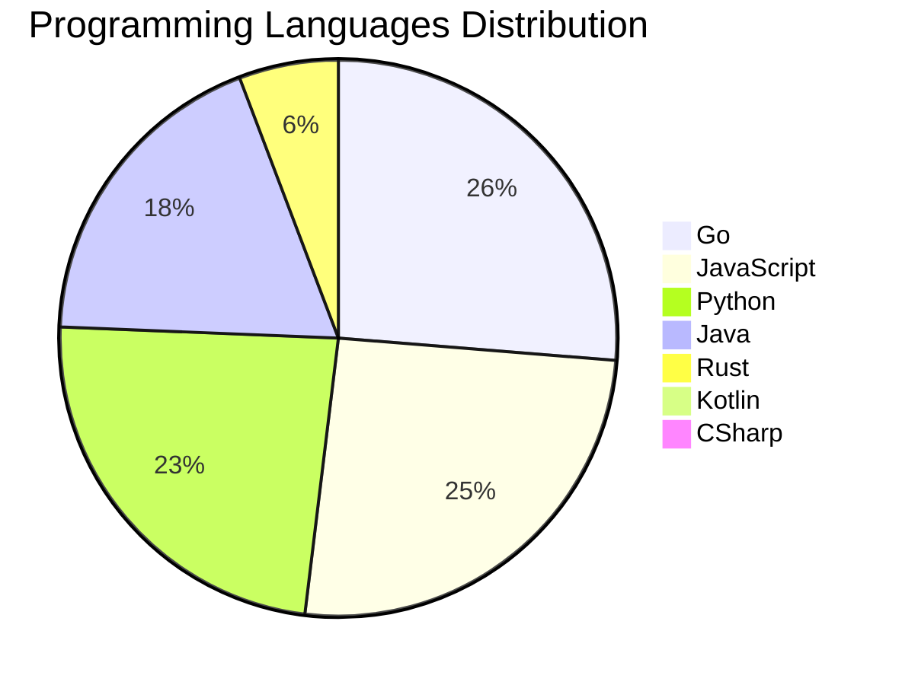

<div align="center">

# 📰 DevTech Auto News

**Your always-fresh digest of developer & AI tech news — curated automatically, around the clock.**


Aggregating [Dev.to](https://dev.to) · [Hacker News](https://news.ycombinator.com) · [GitHub Trending](https://github.com/trending) · [Lobste.rs](https://lobste.rs) · [Stack Overflow](https://stackoverflow.com) · [TechCrunch](https://techcrunch.com) · [freeCodeCamp](https://www.freecodecamp.org/news) — refreshed by GitHub Actions around the clock.

**[📰 Headlines](#-latest-headlines) · [💡 Interview Prep](#-interview-question-of-the-hour) · [📊 Statistics](#-statistics) · [⚙️ How It Works](#%EF%B8%8F-how-it-works)**

</div>

---

## 📰 Latest Headlines

> 🕐 Edition of **2026-07-20 0:00 CAT** — refreshed automatically, all day, every day.

### ✨ Featured Stories

<table>
<tr>
  <td align="center" width="33%">
    <a href="https://dev.to/gde/five-gemma-4-models-one-accelerator-what-porting-e2b-31b-to-aws-inferentia2-taught-me-2gf5">
      
      <br/>
      <b>Five Gemma-4 models, one accelerator: what porting...</b>
    </a>
    <br/>
    <sub>Dev.to</sub>
  </td>
  <td align="center" width="33%">
    <a href="https://dev.to/latentspace/5-trends-that-defined-ai-engineering-at-worlds-fair-2026-5dj6">
      
      <br/>
      <b>5 Trends That Defined AI Engineering at World’s Fa...</b>
    </a>
    <br/>
    <sub>Dev.to</sub>
  </td>
  <td align="center" width="33%">
    <a href="https://dev.to/googleai/diffusiongemma-the-developer-guide-5a3l">
      
      <br/>
      <b>DiffusionGemma: The Developer Guide</b>
    </a>
    <br/>
    <sub>Dev.to</sub>
  </td>
</tr>
<tr>
  <td align="center" width="33%">
    <a href="https://dev.to/gde/tpu-deployments-with-gemma-31b-v6e-8-and-antigravity-cli-3e4n">
      
      <br/>
      <b>TPU Deployments with Gemma 31B, v6e-8, and Antigra...</b>
    </a>
    <br/>
    <sub>Dev.to</sub>
  </td>
  <td align="center" width="33%">
    <a href="https://dev.to/gde/debugging-deployments-with-gemma-2b-tpu-v6e-1-mcp-and-antigravity-cli-3hh3">
      
      <br/>
      <b>Debugging Deployments with Gemma 2B, TPU v6e-1, MC...</b>
    </a>
    <br/>
    <sub>Dev.to</sub>
  </td>
  <td align="center" width="33%">
    <a href="https://dev.to/toboreeee/hey-dev-im-tobore-lets-actually-connect-1m02">
      
      <br/>
      <b>Hey DEV, I'm Tobore. Let's actually connect.</b>
    </a>
    <br/>
    <sub>Dev.to</sub>
  </td>
</tr>
</table>


### 🗞️ Top Stories

| # | Headline | Source |
|---|----------|--------|
| 1 | [Five Gemma-4 models, one accelerator: what porting E2B 31B to AWS Inferentia2 taught me](https://dev.to/gde/five-gemma-4-models-one-accelerator-what-porting-e2b-31b-to-aws-inferentia2-taught-me-2gf5) | Dev.to |
| 2 | [5 Trends That Defined AI Engineering at World’s Fair 2026](https://dev.to/latentspace/5-trends-that-defined-ai-engineering-at-worlds-fair-2026-5dj6) | Dev.to |
| 3 | [DiffusionGemma: The Developer Guide](https://dev.to/googleai/diffusiongemma-the-developer-guide-5a3l) | Dev.to |
| 4 | [TPU Deployments with Gemma 31B, v6e-8, and Antigravity CLI](https://dev.to/gde/tpu-deployments-with-gemma-31b-v6e-8-and-antigravity-cli-3e4n) | Dev.to |
| 5 | [Debugging Deployments with Gemma 2B, TPU v6e-1, MCP, and Antigravity CLI](https://dev.to/gde/debugging-deployments-with-gemma-2b-tpu-v6e-1-mcp-and-antigravity-cli-3hh3) | Dev.to |
| 6 | [Hey DEV, I'm Tobore. Let's actually connect.](https://dev.to/toboreeee/hey-dev-im-tobore-lets-actually-connect-1m02) | Dev.to |
| 7 | [[GCP Billing & Vertex AI] Solving Gemini Cost Allocation in a Single Project: Vertex AI Dynamic Billing Labels in Action](https://dev.to/gde/gcp-billing-vertex-ai-solving-gemini-cost-allocation-in-a-single-project-vertex-ai-dynamic-5aok) | Dev.to |
| 8 | [Smash Story: The Demo Script That Out-Debugged My Test Suite](https://dev.to/gde/smash-story-the-demo-script-that-out-debugged-my-test-suite-430k) | Dev.to |
| 9 | [What was your win this week!?](https://dev.to/devteam/what-was-your-win-this-week-amo) | Dev.to |
| 10 | [Should I quit IT or just live through the burnout?](https://dev.to/klaudiagrz/should-i-quit-it-or-just-live-through-the-burnout-1gng) | Dev.to |
| 11 | [Build Firebase AI Logic Application with Antigravity CLI and Stitch MCP Server [GDE]](https://dev.to/gde/build-firebase-ai-logic-application-with-antigravity-cli-and-stitch-mcp-server-gde-g6o) | Dev.to |
| 12 | [I burned through thousands of AI tokens. Then a friend did it for free](https://dev.to/phalkmin/i-burned-through-thousands-of-ai-tokens-then-a-friend-did-it-for-free-31m8) | Dev.to |
| 13 | [Debugging Deployments with Gemma 4B, TPU v6e-4, MCP, and Antigravity CLI](https://dev.to/gde/debugging-deployments-with-gemma-4b-tpu-v6e-4-mcp-and-antigravity-cli-1l82) | Dev.to |
| 14 | [MCP Configuration for Looker with Antigravity CLI](https://dev.to/gde/mcp-configuration-for-looker-with-antigravity-cli-504d) | Dev.to |
| 15 | [How to Respectfully Contribute to Open Source](https://dev.to/opensourcepledge/how-to-respectfully-contribute-to-open-source-cbh) | Dev.to |
| 16 | [What is an "agentic harness," actually?](https://dev.to/googleai/what-is-an-agentic-harness-actually-4oie) | Dev.to |
| 17 | [Did You Know TLDs Can Be Websites?](https://dev.to/aws/did-you-know-tlds-can-be-websites-2j13) | Dev.to |
| 18 | [4B Gemma 4 QAT Deployment with GCE, NVIDIA L4, MCP, and Antigravity CLI](https://dev.to/gde/4b-gemma-4-qat-deployment-with-gce-nvidia-l4-mcp-and-antigravity-cli-gh6) | Dev.to |
| 19 | [Top 7 Featured DEV Posts of the Week](https://dev.to/devteam/top-7-featured-dev-posts-of-the-week-144b) | Dev.to |
| 20 | [2B Gemma 4 QAT Deployment with GCE, NVIDIA L4, MCP, and Antigravity CLI](https://dev.to/gde/2b-gemma-4-qat-deployment-with-gce-nvidia-l4-mcp-and-antigravity-cli-4p7) | Dev.to |

<sub>Last fetched: Mon, 20 Jul 2026 00:36:48 CAT</sub>


---

## 💡 Interview Question of the Hour

> Sharpen your skills — new questions selected on every update. Try answering before opening the hint!

**1. `DataStructures` — Implement LRU Cache**

&nbsp;&nbsp;&nbsp;&nbsp;🎯 Hard · 🏷 design, hash map, linked list

<details>
<summary>&nbsp;&nbsp;&nbsp;&nbsp;💡 Show hint</summary>

> Doubly linked list + hash map, O(1) operations

</details>

**2. `JavaScript` — What is the event loop and how does it work?**

&nbsp;&nbsp;&nbsp;&nbsp;🎯 Hard · 🏷 async, runtime

<details>
<summary>&nbsp;&nbsp;&nbsp;&nbsp;💡 Show hint</summary>

> Call stack, callback queue, microtask queue

</details>

**3. `JavaScript` — Implement a debounce function from scratch**

&nbsp;&nbsp;&nbsp;&nbsp;🎯 Hard · 🏷 functions, timing

<details>
<summary>&nbsp;&nbsp;&nbsp;&nbsp;💡 Show hint</summary>

> setTimeout, clearTimeout, wrapper function

</details>


---

## 📊 Statistics

#### 🗂 Articles by Category

| Category | Articles | Share | |
|----------|---------:|------:|---|
| **AI** | 71 | 38.6% | `████████████████████` |
| **Tools** | 41 | 22.3% | `████████████░░░░░░░░` |
| **JavaScript** | 40 | 21.7% | `███████████░░░░░░░░░` |
| **Python** | 37 | 20.1% | `██████████░░░░░░░░░░` |
| **Cloud** | 20 | 10.9% | `██████░░░░░░░░░░░░░░` |
| **DevOps** | 15 | 8.2% | `████░░░░░░░░░░░░░░░░` |
| **Security** | 12 | 6.5% | `███░░░░░░░░░░░░░░░░░` |
| **WebDev** | 5 | 2.7% | `█░░░░░░░░░░░░░░░░░░░` |
| **Mobile** | 5 | 2.7% | `█░░░░░░░░░░░░░░░░░░░` |
| **Database** | 2 | 1.1% | `█░░░░░░░░░░░░░░░░░░░` |

<sub>Articles can match more than one category, so shares may sum to over 100%.</sub>


#### 📡 Articles by Source

| Source | Articles |
|--------|---------:|
| Dev.to | 60 |
| HackerNews | 49 |
| GitHub | 25 |
| Lobste.rs | 10 |
| StackOverflow | 20 |
| TechCrunch | 10 |
| freeCodeCamp | 10 |


#### 💻 Programming Language Trends

```
Go              ██████████████████████████████ 25.9%
JavaScript      █████████████████████████████ 25.3%
Python          ███████████████████████████ 23.4%
Java            █████████████████████ 18.4%
Rust            ███████ 5.7%
Kotlin          █ 0.6%
CSharp          █ 0.6%

```




#### 🏷 Trending Topics

            


---

## ⚙️ How It Works

This repository is a fully automated news pipeline. On every run, GitHub Actions:

1. **Fetches** the latest articles from seven sources: Dev.to, Hacker News, GitHub Trending, Lobste.rs, Stack Overflow, TechCrunch, and freeCodeCamp
2. **Deduplicates and categorizes** them across 10+ topics using keyword matching
3. **Extracts cover images** and computes language & category statistics
4. **Rebuilds this README** and appends everything to the [full archive](./data/news_log.md)
5. **Commits and pushes** the result — no human intervention needed

<details>
<summary><b>🚀 Run it yourself</b></summary>

```bash
git clone https://github.com/Derrick-MUGISHA/github-activity-bot.git
cd github-activity-bot
npm install
npm start
```

Fork the repo, enable GitHub Actions, and you have your own self-updating news feed.

</details>

<details>
<summary><b>📚 Data & resources</b></summary>

- [Full news archive](./data/news_log.md) — complete history of every fetched article
- [Statistics](./data/stats.json) — raw stats data (JSON)
- [Categorized articles](./data/categorized.json) — articles grouped by topic
- [Interview question bank](./data/interview_questions.json) — the full question set

</details>

---

## 🤝 Contributing

Ideas for new sources, categories, or interview questions are welcome — [open an issue](https://github.com/Derrick-MUGISHA/github-activity-bot/issues/new) or submit a pull request.

## 📄 License

Released under the [MIT License](https://opensource.org/licenses/MIT) — free to use, fork, and modify.

---

<div align="center">
  <sub>🤖 Last automated update: <b>Sun, 19 Jul 2026 22:36:48 GMT</b></sub><br/>
  <sub>Powered by GitHub Actions · Built with ❤️ by <a href="https://github.com/Derrick-MUGISHA">Derrick MUGISHA</a></sub>
</div>
