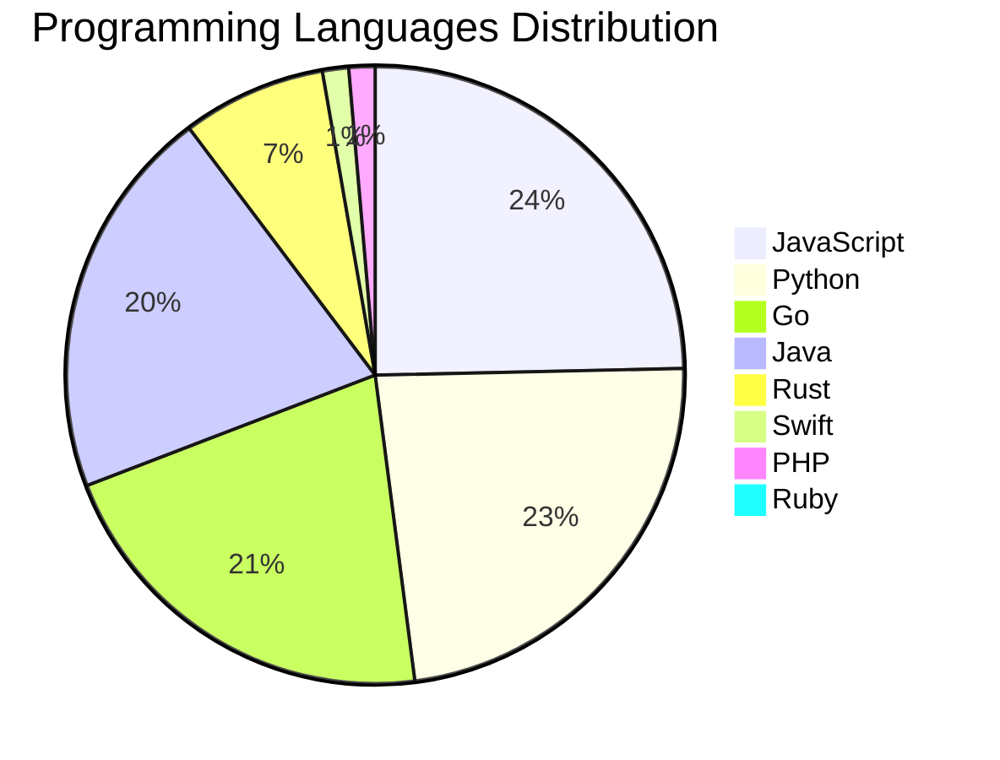

<div align="center">

# 📰 DevTech Auto News

**Your always-fresh digest of developer & AI tech news — curated automatically, around the clock.**


Aggregating [Dev.to](https://dev.to) · [Hacker News](https://news.ycombinator.com) · [GitHub Trending](https://github.com/trending) · [Lobste.rs](https://lobste.rs) · [Stack Overflow](https://stackoverflow.com) · [TechCrunch](https://techcrunch.com) · [freeCodeCamp](https://www.freecodecamp.org/news) — refreshed by GitHub Actions around the clock.

**[📰 Headlines](#-latest-headlines) · [💡 Interview Prep](#-interview-question-of-the-hour) · [📊 Statistics](#-statistics) · [⚙️ How It Works](#%EF%B8%8F-how-it-works)**

</div>

---

## 📰 Latest Headlines

> 🕐 Edition of **2026-07-10 1:00 CAT** — refreshed automatically, all day, every day.

### ✨ Featured Stories

<table>
<tr>
  <td align="center" width="33%">
    <a href="https://dev.to/klaudiagrz/should-i-quit-it-or-just-live-through-the-burnout-1gng">
      
      <br/>
      <b>Should I quit IT or just live through the burnout?</b>
    </a>
    <br/>
    <sub>Dev.to</sub>
  </td>
  <td align="center" width="33%">
    <a href="https://dev.to/devteam/congrats-to-the-june-solstice-game-jam-winners-46c0">
      
      <br/>
      <b>Congrats to the June Solstice Game Jam Winners!</b>
    </a>
    <br/>
    <sub>Dev.to</sub>
  </td>
  <td align="center" width="33%">
    <a href="https://dev.to/devteam/top-7-featured-dev-posts-of-the-week-144b">
      
      <br/>
      <b>Top 7 Featured DEV Posts of the Week</b>
    </a>
    <br/>
    <sub>Dev.to</sub>
  </td>
</tr>
<tr>
  <td align="center" width="33%">
    <a href="https://dev.to/gde/guarding-the-till-while-autonomous-data-agents-do-the-digging-3nmi">
      
      <br/>
      <b>Guarding the till while autonomous data agents do ...</b>
    </a>
    <br/>
    <sub>Dev.to</sub>
  </td>
  <td align="center" width="33%">
    <a href="https://dev.to/hemapriya_kanagala/your-career-matters-so-does-the-person-building-it-2jle">
      
      <br/>
      <b>Your Career Matters. So Does the Person Building I...</b>
    </a>
    <br/>
    <sub>Dev.to</sub>
  </td>
  <td align="center" width="33%">
    <a href="https://dev.to/dumebii/has-the-audience-for-technical-articles-dropped-5ceh">
      
      <br/>
      <b>Has the audience for technical articles dropped?</b>
    </a>
    <br/>
    <sub>Dev.to</sub>
  </td>
</tr>
</table>


### 🗞️ Top Stories

| # | Headline | Source |
|---|----------|--------|
| 1 | [Should I quit IT or just live through the burnout?](https://dev.to/klaudiagrz/should-i-quit-it-or-just-live-through-the-burnout-1gng) | Dev.to |
| 2 | [Congrats to the June Solstice Game Jam Winners!](https://dev.to/devteam/congrats-to-the-june-solstice-game-jam-winners-46c0) | Dev.to |
| 3 | [Top 7 Featured DEV Posts of the Week](https://dev.to/devteam/top-7-featured-dev-posts-of-the-week-144b) | Dev.to |
| 4 | [Guarding the till while autonomous data agents do the digging](https://dev.to/gde/guarding-the-till-while-autonomous-data-agents-do-the-digging-3nmi) | Dev.to |
| 5 | [Your Career Matters. So Does the Person Building It.](https://dev.to/hemapriya_kanagala/your-career-matters-so-does-the-person-building-it-2jle) | Dev.to |
| 6 | [Has the audience for technical articles dropped?](https://dev.to/dumebii/has-the-audience-for-technical-articles-dropped-5ceh) | Dev.to |
| 7 | [DEV's Summer Bug Smash Launches on July 14. Register Now!](https://dev.to/devteam/devs-summer-bug-smash-launches-on-july-14-register-now-3g2n) | Dev.to |
| 8 | [✨Cool Effects, TTS, and Fun Animations (AI Avatar v15: VS Code and Chrome Extension)](https://dev.to/webdeveloperhyper/cool-effects-tts-and-fun-animations-ai-avatar-v15-vs-code-and-chrome-extension-3oec) | Dev.to |
| 9 | [A Pragmatic Look at AI in 2030](https://dev.to/link2twenty/a-pragmatic-look-at-ai-in-2030-3n6h) | Dev.to |
| 10 | [Cloudinary's New Image Generation API: One API, Multiple AI Models, and Built-in Asset Management](https://dev.to/cloudinary/cloudinarys-new-image-generation-api-one-api-multiple-ai-models-and-built-in-asset-management-3ldl) | Dev.to |
| 11 | [Building an Autonomous SRE Agent with Google ADK and the Antigravity SDK](https://dev.to/gde/building-an-autonomous-sre-agent-with-google-adk-and-the-antigravity-sdk-1fgl) | Dev.to |
| 12 | [Bigger Context Windows Didn't Make Our RAG Smarter](https://dev.to/valerykot/bigger-context-windows-didnt-make-our-rag-smarter-4d0l) | Dev.to |
| 13 | [Debugging Deployments with Gemma 4B, TPU v6e-4, MCP, and Antigravity CLI](https://dev.to/gde/debugging-deployments-with-gemma-4b-tpu-v6e-4-mcp-and-antigravity-cli-1l82) | Dev.to |
| 14 | [Being an engineer in the AI era](https://dev.to/ale3oula/being-an-engineer-in-the-ai-era-277p) | Dev.to |
| 15 | [Stop Your LLMs from Forgetting: How a 2016 String Algorithm Solves AI's Biggest Memory Loss Problem](https://dev.to/gde/stop-your-llms-from-forgetting-how-a-2016-string-algorithm-solves-ais-biggest-memory-loss-problem-240f) | Dev.to |
| 16 | [MCP Configuration for Looker with Antigravity CLI](https://dev.to/gde/mcp-configuration-for-looker-with-antigravity-cli-504d) | Dev.to |
| 17 | [Agent Factory Recap: 100X engineering with AI agents in Google Antigravity 2.0](https://dev.to/googleai/agent-factory-recap-100x-engineering-with-ai-agents-in-google-antigravity-20-4p4j) | Dev.to |
| 18 | [I Contain Multitudes (and Also Three Git Repos)](https://dev.to/mattstratton/i-contain-multitudes-and-also-three-git-repos-33pf) | Dev.to |
| 19 | [Two-day hackathon kicks off AI Engineer World’s Fair](https://dev.to/dailycontext/two-day-hackathon-kicks-off-ai-engineer-worlds-fair-2l1d) | Dev.to |
| 20 | [Master Local Fine-Tuning with "gemma-trainer"](https://dev.to/googleai/master-local-fine-tuning-with-gemma-trainer-3ipp) | Dev.to |

<sub>Last fetched: Fri, 10 Jul 2026 01:54:38 CAT</sub>


---

## 💡 Interview Question of the Hour

> Sharpen your skills — new questions selected on every update. Try answering before opening the hint!

**1. `SystemDesign` — Design a distributed cache system**

&nbsp;&nbsp;&nbsp;&nbsp;🎯 Hard · 🏷 distributed systems, caching

<details>
<summary>&nbsp;&nbsp;&nbsp;&nbsp;💡 Show hint</summary>

> Consistency, partitioning, replication, eviction policies

</details>

**2. `Python` — What is the difference between list and tuple in Python?**

&nbsp;&nbsp;&nbsp;&nbsp;🎯 Easy · 🏷 data structures, mutability

<details>
<summary>&nbsp;&nbsp;&nbsp;&nbsp;💡 Show hint</summary>

> Mutability, performance, use cases

</details>

**3. `NodeJS` — Explain middleware in Express.js**

&nbsp;&nbsp;&nbsp;&nbsp;🎯 Easy · 🏷 express, architecture

<details>
<summary>&nbsp;&nbsp;&nbsp;&nbsp;💡 Show hint</summary>

> Request/response cycle, next(), chain of functions

</details>


---

## 📊 Statistics

#### 🗂 Articles by Category

| Category | Articles | Share | |
|----------|---------:|------:|---|
| **AI** | 81 | 44.0% | `████████████████████` |
| **Tools** | 52 | 28.3% | `█████████████░░░░░░░` |
| **JavaScript** | 36 | 19.6% | `█████████░░░░░░░░░░░` |
| **Python** | 34 | 18.5% | `████████░░░░░░░░░░░░` |
| **Security** | 18 | 9.8% | `████░░░░░░░░░░░░░░░░` |
| **Cloud** | 17 | 9.2% | `████░░░░░░░░░░░░░░░░` |
| **DevOps** | 15 | 8.2% | `████░░░░░░░░░░░░░░░░` |
| **WebDev** | 8 | 4.3% | `██░░░░░░░░░░░░░░░░░░` |
| **Mobile** | 4 | 2.2% | `█░░░░░░░░░░░░░░░░░░░` |
| **Database** | 2 | 1.1% | `░░░░░░░░░░░░░░░░░░░░` |

<sub>Articles can match more than one category, so shares may sum to over 100%.</sub>


#### 📡 Articles by Source

| Source | Articles |
|--------|---------:|
| Dev.to | 60 |
| HackerNews | 49 |
| GitHub | 25 |
| Lobste.rs | 10 |
| StackOverflow | 20 |
| TechCrunch | 10 |
| freeCodeCamp | 10 |


#### 💻 Programming Language Trends

```
JavaScript      ██████████████████████████████ 24.2%
Python          ████████████████████████████ 22.8%
Go              ██████████████████████████ 20.8%
Java            █████████████████████████ 20.1%
Rust            █████████ 7.4%
Swift           ██ 1.3%
PHP             ██ 1.3%
Ruby            █ 0.7%
Kotlin          █ 0.7%
CSharp          █ 0.7%

```




#### 🏷 Trending Topics

            


---

## ⚙️ How It Works

This repository is a fully automated news pipeline. On every run, GitHub Actions:

1. **Fetches** the latest articles from seven sources: Dev.to, Hacker News, GitHub Trending, Lobste.rs, Stack Overflow, TechCrunch, and freeCodeCamp
2. **Deduplicates and categorizes** them across 10+ topics using keyword matching
3. **Extracts cover images** and computes language & category statistics
4. **Rebuilds this README** and appends everything to the [full archive](./data/news_log.md)
5. **Commits and pushes** the result — no human intervention needed

<details>
<summary><b>🚀 Run it yourself</b></summary>

```bash
git clone https://github.com/Derrick-MUGISHA/github-activity-bot.git
cd github-activity-bot
npm install
npm start
```

Fork the repo, enable GitHub Actions, and you have your own self-updating news feed.

</details>

<details>
<summary><b>📚 Data & resources</b></summary>

- [Full news archive](./data/news_log.md) — complete history of every fetched article
- [Statistics](./data/stats.json) — raw stats data (JSON)
- [Categorized articles](./data/categorized.json) — articles grouped by topic
- [Interview question bank](./data/interview_questions.json) — the full question set

</details>

---

## 🤝 Contributing

Ideas for new sources, categories, or interview questions are welcome — [open an issue](https://github.com/Derrick-MUGISHA/github-activity-bot/issues/new) or submit a pull request.

## 📄 License

Released under the [MIT License](https://opensource.org/licenses/MIT) — free to use, fork, and modify.

---

<div align="center">
  <sub>🤖 Last automated update: <b>Thu, 09 Jul 2026 23:54:38 GMT</b></sub><br/>
  <sub>Powered by GitHub Actions · Built with ❤️ by <a href="https://github.com/Derrick-MUGISHA">Derrick MUGISHA</a></sub>
</div>
