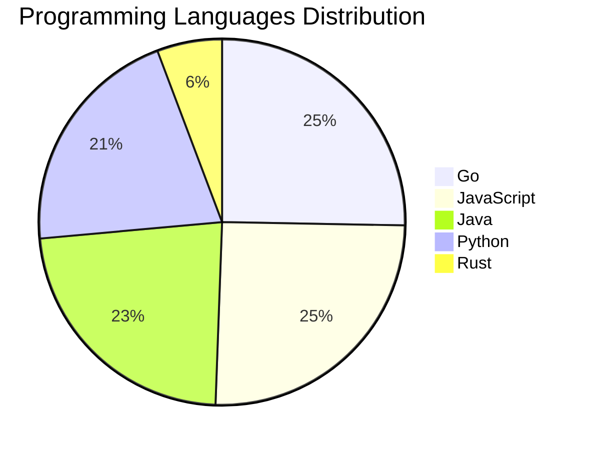

# 🚀 DevTech Auto News - Enhanced Edition


**DevTech Auto News Enhanced** is an advanced automated bot that aggregates trending topics in **AI**, **Web Development**, **Mobile**, **Cloud**, **DevOps**, and more from multiple sources including:

- 📰 [Dev.to](https://dev.to) - Developer community articles
- 🔥 [HackerNews](https://news.ycombinator.com) - Tech news discussions  
- 💻 [GitHub Trending](https://github.com/trending) - Trending repositories
- 🎯 Curated Interview Questions from multiple languages

## ✨ Features

✅ **Multi-Source Aggregation**: Combines articles from Dev.to, HackerNews, and GitHub  
✅ **Smart Categorization**: Automatically categorizes content into 10+ topics  
✅ **Image Support**: Displays cover images for visual appeal  
✅ **Pagination**: Fetches 50+ articles per update with deduplication  
✅ **Language Statistics**: Tracks programming language trends with charts  
✅ **Interview Questions**: Daily coding interview questions in multiple languages  
✅ **GitHub Actions**: Runs every 15 minutes automatically  

---

## 📊 Statistics Dashboard

### 📊 Articles by Category

**AI**: 🟦🟦🟦🟦🟦🟦🟦🟦🟦🟦🟦🟦🟦🟦🟦🟦🟦🟦🟦🟦 55 (52.4%)

**Tools**: 🟦🟦🟦🟦🟦🟦🟦🟦🟦🟦🟦🟦 34 (32.4%)

**JavaScript**: 🟦🟦🟦🟦🟦🟦🟦🟦 22 (21.0%)

**Python**: 🟦🟦🟦🟦🟦🟦🟦 18 (17.1%)

**Cloud**: 🟦🟦🟦🟦🟦 13 (12.4%)

**DevOps**: 🟦🟦🟦 7 (6.7%)

**WebDev**: 🟦 3 (2.9%)

**Security**: 🟦 3 (2.9%)

**Database**: 🟦 2 (1.9%)


### 📡 Sources

- **Dev.to**: 60 articles
- **HackerNews**: 30 articles
- **GitHub**: 15 articles


### 💻 Programming Language Trends

```
Go              ██████████████████████████████ 25.3 (25.3%)
JavaScript      ██████████████████████████████ 25.3 (25.3%)
Java            ███████████████████████████ 23.0 (23.0%)
Python          █████████████████████████ 20.7 (20.7%)
Rust            ███████ 5.7 (5.7%)

```




### 🏷️ Trending Tags

               


---

## 🛠️ How It Works

1. **Multi-Source Fetch**: Pulls from Dev.to (2 pages), HackerNews (3 topics), GitHub (3 languages)
2. **Smart Filter**: Uses keyword matching across 10+ categories  
3. **Deduplication**: Removes duplicate URLs  
4. **Image Extraction**: Captures cover images when available  
5. **Statistics**: Generates language trends and category breakdowns  
6. **Update Files**: Regenerates README and appends to comprehensive log  

---

## 📦 Installation & Usage

```bash
# Clone the repository
git clone https://github.com/Derrick-MUGISHA/github-activity-bot.git
cd github-activity-bot

# Install dependencies  
npm install

# Run manually
npm start

# Test mode
npm run test
```

---


# 🚀 DevTech Auto News - Enhanced Edition

## 📅 Latest Updates (2026-06-30 13:00 CAT)


### 🖼️ Featured Articles

<table>
<tr>
  <td align="center" width="33%">
    <a href="https://dev.to/devteam/need-a-break-play-todays-game-from-the-daily-context-1fli">
      
      <br/>
      <b>Need a break? Play today's game from The Daily Con...</b>
    </a>
    <br/>
    <sub>Dev.to</sub>
  </td>
  <td align="center" width="33%">
    <a href="https://dev.to/dailycontext/welcome-to-ai-engineer-worlds-fair-2026-2o09">
      
      <br/>
      <b>Welcome to AI Engineer World’s Fair 2026</b>
    </a>
    <br/>
    <sub>Dev.to</sub>
  </td>
  <td align="center" width="33%">
    <a href="https://dev.to/sylwia-lask/whats-next-for-ai-219i">
      
      <br/>
      <b>What's Next for AI?</b>
    </a>
    <br/>
    <sub>Dev.to</sub>
  </td>
</tr>
<tr>
  <td align="center" width="33%">
    <a href="https://dev.to/dannwaneri/what-actually-happens-when-you-call-an-llm-api-28l6">
      
      <br/>
      <b>What Actually Happens When You Call an LLM API</b>
    </a>
    <br/>
    <sub>Dev.to</sub>
  </td>
  <td align="center" width="33%">
    <a href="https://dev.to/marcosomma/the-model-does-not-need-memory-the-situation-does-196g">
      
      <br/>
      <b>The Model Does Not Need Memory. The Situation Does...</b>
    </a>
    <br/>
    <sub>Dev.to</sub>
  </td>
  <td align="center" width="33%">
    <a href="https://dev.to/dailycontext/pragmatism-in-an-age-of-infinite-code-and-unavoidable-bottlenecks-1bkd">
      
      <br/>
      <b>Pragmatism in an Age of Infinite Code and Unavoida...</b>
    </a>
    <br/>
    <sub>Dev.to</sub>
  </td>
</tr>
</table>


### 📰 Top Headlines

- [Need a break? Play today's game from The Daily Context.](https://dev.to/devteam/need-a-break-play-todays-game-from-the-daily-context-1fli) _[Dev.to]_
- [Welcome to AI Engineer World’s Fair 2026](https://dev.to/dailycontext/welcome-to-ai-engineer-worlds-fair-2026-2o09) _[Dev.to]_
- [What's Next for AI?](https://dev.to/sylwia-lask/whats-next-for-ai-219i) _[Dev.to]_
- [What Actually Happens When You Call an LLM API](https://dev.to/dannwaneri/what-actually-happens-when-you-call-an-llm-api-28l6) _[Dev.to]_
- [The Model Does Not Need Memory. The Situation Does.](https://dev.to/marcosomma/the-model-does-not-need-memory-the-situation-does-196g) _[Dev.to]_
- [Pragmatism in an Age of Infinite Code and Unavoidable Bottlenecks](https://dev.to/dailycontext/pragmatism-in-an-age-of-infinite-code-and-unavoidable-bottlenecks-1bkd) _[Dev.to]_
- [You’re not really that far behind.](https://dev.to/dailycontext/youre-not-really-that-far-behind-h4d) _[Dev.to]_
- [My commit message said "You've hit your session limit"](https://dev.to/shyamala_u/my-commit-message-said-youve-hit-your-session-limit-2abn) _[Dev.to]_
- [Coding Agents Play Favorites With Your Dependencies](https://dev.to/dailycontext/coding-agents-play-favorites-with-your-dependencies-2dl6) _[Dev.to]_
- [Two-day hackathon kicks off AI Engineer World’s Fair](https://dev.to/dailycontext/two-day-hackathon-kicks-off-ai-engineer-worlds-fair-2l1d) _[Dev.to]_
- [The AI Engineer World’s Fair Spreads Globally](https://dev.to/dailycontext/the-ai-engineer-worlds-fair-spreads-globally-1o4h) _[Dev.to]_
- [Midsommer Madness with WASM and Rust](https://dev.to/gde/midsommer-madness-with-wasm-and-rust-2ko3) _[Dev.to]_
- [For AI coding, the kids are alright](https://dev.to/dailycontext/for-ai-coding-the-kids-are-alright-29ld) _[Dev.to]_
- [What was your win this week!?](https://dev.to/devteam/what-was-your-win-this-week-4na1) _[Dev.to]_
- [Meme Monday](https://dev.to/ben/meme-monday-46a8) _[Dev.to]_
- [What to Expect at the AI Engineer World’s Fair 2026](https://dev.to/dailycontext/what-to-expect-at-the-ai-engineer-worlds-fair-2026-3l8g) _[Dev.to]_
- [12B Gemma 4 Deployment with NVIDIA Blackwell 6000, QAT, MTP, and Antigravity CLI](https://dev.to/gde/12b-gemma-4-deployment-with-nvidia-blackwell-6000-qat-mtp-and-antigravity-cli-3gn6) _[Dev.to]_
- [12B Gemma 4 Deployment with NVIDIA Blackwell 6000, MCP, Cloud Run, and Antigravity CLI](https://dev.to/gde/12b-gemma-4-deployment-with-nvidia-blackwell-6000-mcp-cloud-run-and-antigravity-cli-3ckn) _[Dev.to]_
- [Not Enough SMEs or Customers to Make Your Evals? Make Some!](https://dev.to/ohkpond/not-enough-smes-or-customers-to-make-your-evals-make-some-11nc) _[Dev.to]_
- [The agent-first approach to building products](https://dev.to/adamklein/the-agent-first-approach-to-building-products-51oj) _[Dev.to]_

_Last automated update: Tue, 30 Jun 2026 13:36:40 CAT_


## 💡 Daily Interview Questions

_Sharpen your skills with these curated questions_

### 1. JavaScript: Explain event delegation and why it's useful

**Difficulty**: Medium | **Topics**: events, DOM

<details>
<summary>💡 Hint</summary>

Event bubbling, single listener for multiple elements

</details>

### 2. SystemDesign: How would you design a rate limiter?

**Difficulty**: Medium | **Topics**: system design, algorithms

<details>
<summary>💡 Hint</summary>

Token bucket, sliding window, distributed systems

</details>

### 3. Database: Explain database indexing and when to use it

**Difficulty**: Medium | **Topics**: optimization, performance

<details>
<summary>💡 Hint</summary>

B-tree, trade-offs, query performance

</details>


---

## 📚 Resources

- [Full News Archive](./data/news_log.md) - Complete history of all fetched articles
- [Statistics JSON](./data/stats.json) - Raw statistics data
- [Categorized Data](./data/categorized.json) - Articles organized by category
- [Interview Questions](./data/interview_questions.json) - Complete question bank

---

## 🤝 Contributing

Want to add more sources, categories, or interview questions? Feel free to:

1. Fork this repository
2. Add your improvements
3. Submit a pull request

---

## 📄 License

MIT License - Feel free to use and modify!

---

<p align="center">
  <b>Last automated update: Tue, 30 Jun 2026 11:36:40 GMT</b><br/>
  <sub>Powered by GitHub Actions | Made with ❤️ for developers</sub>
</p>

---

## 🔗 Quick Links

- [View Workflow](https://github.com/Derrick-MUGISHA/github-activity-bot/actions)
- [Report Issue](https://github.com/Derrick-MUGISHA/github-activity-bot/issues)
- [Suggest Feature](https://github.com/Derrick-MUGISHA/github-activity-bot/issues/new)
