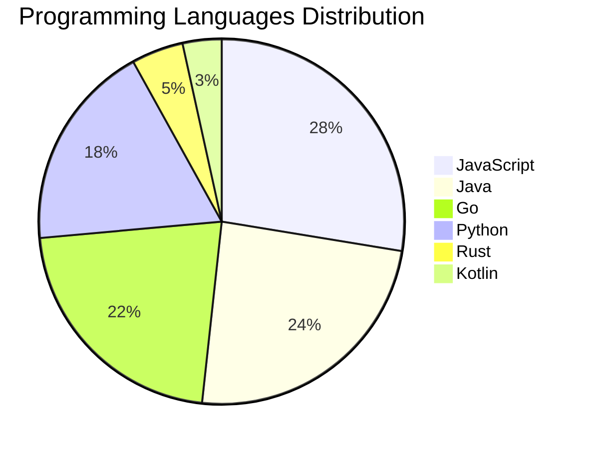

# 🚀 DevTech Auto News - Enhanced Edition


**DevTech Auto News Enhanced** is an advanced automated bot that aggregates trending topics in **AI**, **Web Development**, **Mobile**, **Cloud**, **DevOps**, and more from multiple sources including:

- 📰 [Dev.to](https://dev.to) - Developer community articles
- 🔥 [HackerNews](https://news.ycombinator.com) - Tech news discussions  
- 💻 [GitHub Trending](https://github.com/trending) - Trending repositories
- 🎯 Curated Interview Questions from multiple languages

## ✨ Features

✅ **Multi-Source Aggregation**: Combines articles from Dev.to, HackerNews, and GitHub  
✅ **Smart Categorization**: Automatically categorizes content into 10+ topics  
✅ **Image Support**: Displays cover images for visual appeal  
✅ **Pagination**: Fetches 50+ articles per update with deduplication  
✅ **Language Statistics**: Tracks programming language trends with charts  
✅ **Interview Questions**: Daily coding interview questions in multiple languages  
✅ **GitHub Actions**: Runs every 15 minutes automatically  

---

## 📊 Statistics Dashboard

### 📊 Articles by Category

**AI**: 🟦🟦🟦🟦🟦🟦🟦🟦🟦🟦🟦🟦🟦🟦🟦🟦🟦🟦🟦🟦 45 (42.9%)

**Tools**: 🟦🟦🟦🟦🟦🟦🟦🟦🟦🟦🟦🟦 26 (24.8%)

**JavaScript**: 🟦🟦🟦🟦🟦🟦🟦🟦🟦🟦🟦 24 (22.9%)

**Python**: 🟦🟦🟦🟦🟦🟦🟦 16 (15.2%)

**Cloud**: 🟦🟦🟦🟦 8 (7.6%)

**WebDev**: 🟦🟦🟦 6 (5.7%)

**Mobile**: 🟦🟦 5 (4.8%)

**Database**: 🟦🟦 5 (4.8%)

**DevOps**: 🟦🟦 4 (3.8%)

**Security**: 🟦 3 (2.9%)


### 📡 Sources

- **Dev.to**: 60 articles
- **HackerNews**: 30 articles
- **GitHub**: 15 articles


### 💻 Programming Language Trends

```
JavaScript      ██████████████████████████████ 27.6 (27.6%)
Java            ██████████████████████████ 24.1 (24.1%)
Go              ████████████████████████ 21.8 (21.8%)
Python          ████████████████████ 18.4 (18.4%)
Rust            █████ 4.6 (4.6%)
Kotlin          ████ 3.4 (3.4%)

```




### 🏷️ Trending Tags

               


---

## 🛠️ How It Works

1. **Multi-Source Fetch**: Pulls from Dev.to (2 pages), HackerNews (3 topics), GitHub (3 languages)
2. **Smart Filter**: Uses keyword matching across 10+ categories  
3. **Deduplication**: Removes duplicate URLs  
4. **Image Extraction**: Captures cover images when available  
5. **Statistics**: Generates language trends and category breakdowns  
6. **Update Files**: Regenerates README and appends to comprehensive log  

---

## 📦 Installation & Usage

```bash
# Clone the repository
git clone https://github.com/Derrick-MUGISHA/github-activity-bot.git
cd github-activity-bot

# Install dependencies  
npm install

# Run manually
npm start

# Test mode
npm run test
```

---


# 🚀 DevTech Auto News - Enhanced Edition

## 📅 Latest Updates (2026-05-16 23:00 CAT)


### 🖼️ Featured Articles

<table>
<tr>
  <td align="center" width="33%">
    <a href="https://dev.to/devteam/what-was-your-win-this-week-110l">
      
      <br/>
      <b>What was your win this week?!</b>
    </a>
    <br/>
    <sub>Dev.to</sub>
  </td>
  <td align="center" width="33%">
    <a href="https://dev.to/gde/through-the-blue-frames-ux-from-google-glass-to-gemini-51e0">
      
      <br/>
      <b>Through the Blue Frames: UX From Google Glass to G...</b>
    </a>
    <br/>
    <sub>Dev.to</sub>
  </td>
  <td align="center" width="33%">
    <a href="https://dev.to/tahosin/my-github-graveyard-has-27-dead-projects-here-is-the-brutal-truth-about-why-52d9">
      
      <br/>
      <b>My GitHub Graveyard has 27 dead projects. Here is ...</b>
    </a>
    <br/>
    <sub>Dev.to</sub>
  </td>
</tr>
<tr>
  <td align="center" width="33%">
    <a href="https://dev.to/gde/gemmafin-breaking-the-cycle-of-debt-with-conversational-ai-4l7n">
      
      <br/>
      <b>GemmaFin - Breaking the Cycle of Debt with Convers...</b>
    </a>
    <br/>
    <sub>Dev.to</sub>
  </td>
  <td align="center" width="33%">
    <a href="https://dev.to/googleai/gemini-31-flash-lite-is-now-generally-available-on-gemini-enterprise-agent-platform-2pcg">
      
      <br/>
      <b>Gemini 3.1 Flash-Lite is now generally available o...</b>
    </a>
    <br/>
    <sub>Dev.to</sub>
  </td>
  <td align="center" width="33%">
    <a href="https://dev.to/gde/deploying-a-rust-mcp-server-to-azure-aci-15nb">
      
      <br/>
      <b>Deploying a Rust MCP Server to Azure ACI</b>
    </a>
    <br/>
    <sub>Dev.to</sub>
  </td>
</tr>
</table>


### 📰 Top Headlines

- [What was your win this week?!](https://dev.to/devteam/what-was-your-win-this-week-110l) _[Dev.to]_
- [Through the Blue Frames: UX From Google Glass to Gemini](https://dev.to/gde/through-the-blue-frames-ux-from-google-glass-to-gemini-51e0) _[Dev.to]_
- [My GitHub Graveyard has 27 dead projects. Here is the brutal truth about why.](https://dev.to/tahosin/my-github-graveyard-has-27-dead-projects-here-is-the-brutal-truth-about-why-52d9) _[Dev.to]_
- [GemmaFin - Breaking the Cycle of Debt with Conversational AI](https://dev.to/gde/gemmafin-breaking-the-cycle-of-debt-with-conversational-ai-4l7n) _[Dev.to]_
- [Gemini 3.1 Flash-Lite is now generally available on Gemini Enterprise Agent Platform](https://dev.to/googleai/gemini-31-flash-lite-is-now-generally-available-on-gemini-enterprise-agent-platform-2pcg) _[Dev.to]_
- [Deploying a Rust MCP Server to Azure ACI](https://dev.to/gde/deploying-a-rust-mcp-server-to-azure-aci-15nb) _[Dev.to]_
- [Deploying a Rust MCP Server to Azure Functions](https://dev.to/gde/deploying-a-rust-mcp-server-to-azure-functions-3agg) _[Dev.to]_
- [Building Simple Tabs with Vanilla JavaScript](https://dev.to/zamfir80/building-simple-tabs-with-vanilla-javascript-307n) _[Dev.to]_
- [The Loading Screen](https://dev.to/gde/the-loading-screen-1ka8) _[Dev.to]_
- [Some Notes on OMO Orchestrator Claude Alternatives](https://dev.to/tythos/some-notes-on-omo-orchestrator-claude-alternatives-1a7c) _[Dev.to]_
- [Building a Local-First Hotel Receptionist with Gemma 4, GGUF, and llama.cpp](https://dev.to/chuanman2707/building-a-local-first-hotel-receptionist-with-gemma-4-gguf-and-llamacpp-51a4) _[Dev.to]_
- [Genkit Middleware: Intercept, Extend and Harden your Gen AI Pipelines](https://dev.to/gde/genkit-middleware-intercept-extend-and-harden-your-gen-ai-pipelines-4k03) _[Dev.to]_
- [onclick is great, actually](https://dev.to/darkwiiplayer/onclick-is-great-actually-1l3p) _[Dev.to]_
- [Two DEV Users. Two Countries. One Weird Little Avatar Project.](https://dev.to/itsugo/two-dev-users-two-countries-one-weird-little-avatar-project-3gd3) _[Dev.to]_
- [Unity begone](https://dev.to/sarthakganguly/unity-begone-56kc) _[Dev.to]_
- [Join the Hermes Agent Challenge: $1,000 in Prizes!](https://dev.to/devteam/join-the-hermes-agent-challenge-1000-in-prizes-13cd) _[Dev.to]_
- [Bypassing User Isolation on Android with a Screen Reader](https://dev.to/gdg/bypassing-user-isolation-on-android-with-a-screen-reader-3k72) _[Dev.to]_
- [Giving AI agents knowledge they were never trained on](https://dev.to/jgauffin/giving-ai-agents-knowledge-they-were-never-trained-on-5fd7) _[Dev.to]_
- [Stop hand-writing IconData — introducing `icon_font_extractor`](https://dev.to/devtronic/stop-hand-writing-icondata-introducing-iconfontextractor-4go2) _[Dev.to]_
- [Adding native-feeling haptics to Angular web apps with ng-haptics](https://dev.to/xaconi_94/adding-native-feeling-haptics-to-angular-web-apps-with-ng-haptics-3j3l) _[Dev.to]_

_Last automated update: Sat, 16 May 2026 23:23:58 CAT_


## 💡 Daily Interview Questions

_Sharpen your skills with these curated questions_

### 1. Database: Design a database schema for a social media platform

**Difficulty**: Hard | **Topics**: design, scalability

<details>
<summary>💡 Hint</summary>

Users, posts, relationships, indexes, partitioning

</details>

### 2. Database: Explain database indexing and when to use it

**Difficulty**: Medium | **Topics**: optimization, performance

<details>
<summary>💡 Hint</summary>

B-tree, trade-offs, query performance

</details>

### 3. Java: What are Java Streams and how do they work?

**Difficulty**: Medium | **Topics**: functional programming, collections

<details>
<summary>💡 Hint</summary>

Lazy evaluation, pipeline, terminal operations

</details>


---

## 📚 Resources

- [Full News Archive](./data/news_log.md) - Complete history of all fetched articles
- [Statistics JSON](./data/stats.json) - Raw statistics data
- [Categorized Data](./data/categorized.json) - Articles organized by category
- [Interview Questions](./data/interview_questions.json) - Complete question bank

---

## 🤝 Contributing

Want to add more sources, categories, or interview questions? Feel free to:

1. Fork this repository
2. Add your improvements
3. Submit a pull request

---

## 📄 License

MIT License - Feel free to use and modify!

---

<p align="center">
  <b>Last automated update: Sat, 16 May 2026 21:23:58 GMT</b><br/>
  <sub>Powered by GitHub Actions | Made with ❤️ for developers</sub>
</p>

---

## 🔗 Quick Links

- [View Workflow](https://github.com/Derrick-MUGISHA/github-activity-bot/actions)
- [Report Issue](https://github.com/Derrick-MUGISHA/github-activity-bot/issues)
- [Suggest Feature](https://github.com/Derrick-MUGISHA/github-activity-bot/issues/new)
