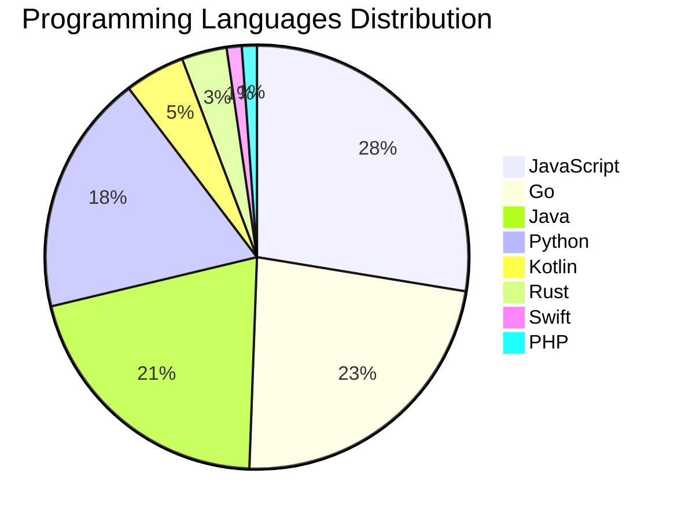

# 🚀 DevTech Auto News - Enhanced Edition


**DevTech Auto News Enhanced** is an advanced automated bot that aggregates trending topics in **AI**, **Web Development**, **Mobile**, **Cloud**, **DevOps**, and more from multiple sources including:

- 📰 [Dev.to](https://dev.to) - Developer community articles
- 🔥 [HackerNews](https://news.ycombinator.com) - Tech news discussions  
- 💻 [GitHub Trending](https://github.com/trending) - Trending repositories
- 🎯 Curated Interview Questions from multiple languages

## ✨ Features

✅ **Multi-Source Aggregation**: Combines articles from Dev.to, HackerNews, and GitHub  
✅ **Smart Categorization**: Automatically categorizes content into 10+ topics  
✅ **Image Support**: Displays cover images for visual appeal  
✅ **Pagination**: Fetches 50+ articles per update with deduplication  
✅ **Language Statistics**: Tracks programming language trends with charts  
✅ **Interview Questions**: Daily coding interview questions in multiple languages  
✅ **GitHub Actions**: Runs every 15 minutes automatically  

---

## 📊 Statistics Dashboard

### 📊 Articles by Category

**AI**: 🟦🟦🟦🟦🟦🟦🟦🟦🟦🟦🟦🟦🟦🟦🟦🟦🟦🟦🟦🟦 49 (46.7%)

**Tools**: 🟦🟦🟦🟦🟦🟦🟦🟦🟦🟦🟦 26 (24.8%)

**JavaScript**: 🟦🟦🟦🟦🟦🟦🟦🟦🟦🟦 24 (22.9%)

**Python**: 🟦🟦🟦🟦🟦🟦🟦 16 (15.2%)

**Cloud**: 🟦🟦🟦🟦🟦🟦 14 (13.3%)

**DevOps**: 🟦🟦 6 (5.7%)

**WebDev**: 🟦🟦 5 (4.8%)

**Mobile**: 🟦🟦 5 (4.8%)

**Database**: 🟦 3 (2.9%)

**Security**:  1 (1.0%)


### 📡 Sources

- **Dev.to**: 60 articles
- **HackerNews**: 30 articles
- **GitHub**: 15 articles


### 💻 Programming Language Trends

```
JavaScript      ██████████████████████████████ 27.6 (27.6%)
Go              █████████████████████████ 23.0 (23.0%)
Java            ██████████████████████ 20.7 (20.7%)
Python          ████████████████████ 18.4 (18.4%)
Kotlin          █████ 4.6 (4.6%)
Rust            ████ 3.4 (3.4%)
Swift           █ 1.1 (1.1%)
PHP             █ 1.1 (1.1%)

```




### 🏷️ Trending Tags

               


---

## 🛠️ How It Works

1. **Multi-Source Fetch**: Pulls from Dev.to (2 pages), HackerNews (3 topics), GitHub (3 languages)
2. **Smart Filter**: Uses keyword matching across 10+ categories  
3. **Deduplication**: Removes duplicate URLs  
4. **Image Extraction**: Captures cover images when available  
5. **Statistics**: Generates language trends and category breakdowns  
6. **Update Files**: Regenerates README and appends to comprehensive log  

---

## 📦 Installation & Usage

```bash
# Clone the repository
git clone https://github.com/Derrick-MUGISHA/github-activity-bot.git
cd github-activity-bot

# Install dependencies  
npm install

# Run manually
npm start

# Test mode
npm run test
```

---


# 🚀 DevTech Auto News - Enhanced Edition

## 📅 Latest Updates (2026-06-01 14:00 CAT)


### 🖼️ Featured Articles

<table>
<tr>
  <td align="center" width="33%">
    <a href="https://dev.to/devteam/what-was-your-win-this-week-i1">
      
      <br/>
      <b>What was your win this week?</b>
    </a>
    <br/>
    <sub>Dev.to</sub>
  </td>
  <td align="center" width="33%">
    <a href="https://dev.to/arqamwd/i-made-my-ai-models-argue-then-let-hermes-be-the-judge-5e6c">
      
      <br/>
      <b>I Made My AI Models Argue, Then Let Hermes Be the ...</b>
    </a>
    <br/>
    <sub>Dev.to</sub>
  </td>
  <td align="center" width="33%">
    <a href="https://dev.to/sylwia-lask/how-are-developers-actually-using-ai-at-work-4g9c">
      
      <br/>
      <b>How Are Developers Actually Using AI At Work?</b>
    </a>
    <br/>
    <sub>Dev.to</sub>
  </td>
</tr>
<tr>
  <td align="center" width="33%">
    <a href="https://dev.to/cferreirasuazo/modernizing-wild-rydes-with-modern-technologies-5g2p">
      
      <br/>
      <b>🦄 Modernizing Wild Rydes with modern technologies</b>
    </a>
    <br/>
    <sub>Dev.to</sub>
  </td>
  <td align="center" width="33%">
    <a href="https://dev.to/kralik12/i-love-mjml-i-just-didnt-want-a-whole-templating-engine-for-two-tiny-things-5a10">
      
      <br/>
      <b>I love MJML — I just didn't want a whole templatin...</b>
    </a>
    <br/>
    <sub>Dev.to</sub>
  </td>
  <td align="center" width="33%">
    <a href="https://dev.to/karllhughes/the-software-developers-guide-to-aeo-1h5h">
      
      <br/>
      <b>The Software Developer's Guide to AEO</b>
    </a>
    <br/>
    <sub>Dev.to</sub>
  </td>
</tr>
</table>


### 📰 Top Headlines

- [What was your win this week?](https://dev.to/devteam/what-was-your-win-this-week-i1) _[Dev.to]_
- [I Made My AI Models Argue, Then Let Hermes Be the Judge](https://dev.to/arqamwd/i-made-my-ai-models-argue-then-let-hermes-be-the-judge-5e6c) _[Dev.to]_
- [How Are Developers Actually Using AI At Work?](https://dev.to/sylwia-lask/how-are-developers-actually-using-ai-at-work-4g9c) _[Dev.to]_
- [🦄 Modernizing Wild Rydes with modern technologies](https://dev.to/cferreirasuazo/modernizing-wild-rydes-with-modern-technologies-5g2p) _[Dev.to]_
- [I love MJML — I just didn't want a whole templating engine for two tiny things](https://dev.to/kralik12/i-love-mjml-i-just-didnt-want-a-whole-templating-engine-for-two-tiny-things-5a10) _[Dev.to]_
- [The Software Developer's Guide to AEO](https://dev.to/karllhughes/the-software-developers-guide-to-aeo-1h5h) _[Dev.to]_
- [Broken Software](https://dev.to/alex27/broken-software-b54) _[Dev.to]_
- [AWS Cloud Shell with Antigravity CLI](https://dev.to/gde/aws-cloud-shell-with-antigravity-cli-e3a) _[Dev.to]_
- [Azure Cloud Shell with Antigravity CLI](https://dev.to/gde/azure-cloud-shell-with-antigravity-cli-mn6) _[Dev.to]_
- [An LLM API call, in 4 GIFs](https://dev.to/jasmin/an-llm-api-call-in-4-gifs-33b1) _[Dev.to]_
- [Every Great Cup Starts with the Right Question — I Built the Community Behind the Answer with Hermes Agent](https://dev.to/yuens1002/every-great-cup-starts-with-the-right-question-i-built-the-community-behind-the-answer-with-o04) _[Dev.to]_
- [Top 7 Featured DEV Posts of the Week](https://dev.to/devteam/top-7-featured-dev-posts-of-the-week-45na) _[Dev.to]_
- [I Spent 10x Longer Debugging AI Code Than Writing It](https://dev.to/harsh2644/i-spent-10x-longer-debugging-ai-code-than-writing-it-15h4) _[Dev.to]_
- [GCP: Upgrading a LINE Bot with Vertex AI ADK Tools for Smart Business Cards and Backup Search](https://dev.to/gde/gcp-upgrading-a-line-bot-with-vertex-ai-adk-tools-for-smart-business-cards-and-backup-search-3dpe) _[Dev.to]_
- [Local Gemma 4 Deployment with MCP and Antigravity CLI](https://dev.to/gde/local-gemma-4-deployment-with-mcp-and-antigravity-cli-hk8) _[Dev.to]_
- [Join the GitHub Finish-Up-A-Thon Challenge: $3,000 Prize Pool!](https://dev.to/devteam/join-the-github-finish-up-a-thon-challenge-3000-prize-pool-f41) _[Dev.to]_
- [TypeScript enums aren’t the real problem — duplicated UI enum plumbing is](https://dev.to/shijistar/typescript-enums-arent-the-real-problem-duplicated-ui-enum-plumbing-is-22h2) _[Dev.to]_
- [AI fatigue is very real and people are fighting back!](https://dev.to/fm/ai-fatigue-is-very-real-and-people-are-fighting-back-4m1l) _[Dev.to]_
- [Why does AI forget what you said (and how to fix it)](https://dev.to/aws/why-does-ai-forget-what-you-said-and-how-to-fix-it-52f6) _[Dev.to]_
- [Making a New Native App for a Jailbroken iPhone 6](https://dev.to/aeroreyna/making-a-new-native-app-for-a-jailbroken-iphone-6-16o5) _[Dev.to]_

_Last automated update: Mon, 01 Jun 2026 14:49:07 CAT_


## 💡 Daily Interview Questions

_Sharpen your skills with these curated questions_

### 1. Java: Explain the Java memory model

**Difficulty**: Hard | **Topics**: memory, JVM

<details>
<summary>💡 Hint</summary>

Heap, stack, garbage collection

</details>

### 2. Database: What is the difference between SQL and NoSQL databases?

**Difficulty**: Easy | **Topics**: databases, design

<details>
<summary>💡 Hint</summary>

Schema, scalability, ACID vs BASE

</details>

### 3. DataStructures: Implement a function to reverse a linked list

**Difficulty**: Medium | **Topics**: linked lists, pointers

<details>
<summary>💡 Hint</summary>

Iterative or recursive, three pointers

</details>


---

## 📚 Resources

- [Full News Archive](./data/news_log.md) - Complete history of all fetched articles
- [Statistics JSON](./data/stats.json) - Raw statistics data
- [Categorized Data](./data/categorized.json) - Articles organized by category
- [Interview Questions](./data/interview_questions.json) - Complete question bank

---

## 🤝 Contributing

Want to add more sources, categories, or interview questions? Feel free to:

1. Fork this repository
2. Add your improvements
3. Submit a pull request

---

## 📄 License

MIT License - Feel free to use and modify!

---

<p align="center">
  <b>Last automated update: Mon, 01 Jun 2026 12:49:07 GMT</b><br/>
  <sub>Powered by GitHub Actions | Made with ❤️ for developers</sub>
</p>

---

## 🔗 Quick Links

- [View Workflow](https://github.com/Derrick-MUGISHA/github-activity-bot/actions)
- [Report Issue](https://github.com/Derrick-MUGISHA/github-activity-bot/issues)
- [Suggest Feature](https://github.com/Derrick-MUGISHA/github-activity-bot/issues/new)
