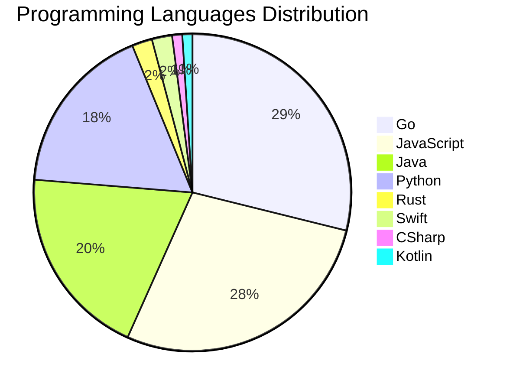

# 🚀 DevTech Auto News - Enhanced Edition


**DevTech Auto News Enhanced** is an advanced automated bot that aggregates trending topics in **AI**, **Web Development**, **Mobile**, **Cloud**, **DevOps**, and more from multiple sources including:

- 📰 [Dev.to](https://dev.to) - Developer community articles
- 🔥 [HackerNews](https://news.ycombinator.com) - Tech news discussions  
- 💻 [GitHub Trending](https://github.com/trending) - Trending repositories
- 🎯 Curated Interview Questions from multiple languages

## ✨ Features

✅ **Multi-Source Aggregation**: Combines articles from Dev.to, HackerNews, and GitHub  
✅ **Smart Categorization**: Automatically categorizes content into 10+ topics  
✅ **Image Support**: Displays cover images for visual appeal  
✅ **Pagination**: Fetches 50+ articles per update with deduplication  
✅ **Language Statistics**: Tracks programming language trends with charts  
✅ **Interview Questions**: Daily coding interview questions in multiple languages  
✅ **GitHub Actions**: Runs every 15 minutes automatically  

---

## 📊 Statistics Dashboard

### 📊 Articles by Category

**AI**: 🟦🟦🟦🟦🟦🟦🟦🟦🟦🟦🟦🟦🟦🟦🟦🟦🟦🟦🟦🟦 46 (43.8%)

**JavaScript**: 🟦🟦🟦🟦🟦🟦🟦🟦🟦🟦🟦🟦 27 (25.7%)

**Tools**: 🟦🟦🟦🟦🟦🟦🟦🟦🟦🟦 23 (21.9%)

**Python**: 🟦🟦🟦🟦🟦🟦🟦 17 (16.2%)

**Cloud**: 🟦🟦🟦🟦🟦 12 (11.4%)

**WebDev**: 🟦🟦 4 (3.8%)

**Mobile**: 🟦🟦 4 (3.8%)

**DevOps**: 🟦 3 (2.9%)

**Security**: 🟦 3 (2.9%)

**Database**: 🟦 2 (1.9%)


### 📡 Sources

- **Dev.to**: 60 articles
- **HackerNews**: 30 articles
- **GitHub**: 15 articles


### 💻 Programming Language Trends

```
Go              ██████████████████████████████ 28.9 (28.9%)
JavaScript      █████████████████████████████ 27.8 (27.8%)
Java            ████████████████████ 19.6 (19.6%)
Python          ██████████████████ 17.5 (17.5%)
Rust            ██ 2.1 (2.1%)
Swift           ██ 2.1 (2.1%)
CSharp          █ 1.0 (1.0%)
Kotlin          █ 1.0 (1.0%)

```




### 🏷️ Trending Tags

               


---

## 🛠️ How It Works

1. **Multi-Source Fetch**: Pulls from Dev.to (2 pages), HackerNews (3 topics), GitHub (3 languages)
2. **Smart Filter**: Uses keyword matching across 10+ categories  
3. **Deduplication**: Removes duplicate URLs  
4. **Image Extraction**: Captures cover images when available  
5. **Statistics**: Generates language trends and category breakdowns  
6. **Update Files**: Regenerates README and appends to comprehensive log  

---

## 📦 Installation & Usage

```bash
# Clone the repository
git clone https://github.com/Derrick-MUGISHA/github-activity-bot.git
cd github-activity-bot

# Install dependencies  
npm install

# Run manually
npm start

# Test mode
npm run test
```

---


# 🚀 DevTech Auto News - Enhanced Edition

## 📅 Latest Updates (2026-06-19 4:00 CAT)


### 🖼️ Featured Articles

<table>
<tr>
  <td align="center" width="33%">
    <a href="https://dev.to/devteam/congrats-to-the-gemma-4-challenge-winners-4fgc">
      
      <br/>
      <b>Congrats to the Gemma 4 Challenge Winners!</b>
    </a>
    <br/>
    <sub>Dev.to</sub>
  </td>
  <td align="center" width="33%">
    <a href="https://dev.to/devteam/congrats-to-the-hermes-agent-challenge-winners-3on0">
      
      <br/>
      <b>Congrats to the Hermes Agent Challenge Winners!</b>
    </a>
    <br/>
    <sub>Dev.to</sub>
  </td>
  <td align="center" width="33%">
    <a href="https://dev.to/googleai/im-not-a-developer-but-i-built-a-calendar-app-to-fix-my-most-annoying-work-task-dj4">
      
      <br/>
      <b>I'm not a developer, but I built a calendar app to...</b>
    </a>
    <br/>
    <sub>Dev.to</sub>
  </td>
</tr>
<tr>
  <td align="center" width="33%">
    <a href="https://dev.to/googleai/building-an-agentic-pr-reviewer-with-antigravity-sdk-3b0i">
      
      <br/>
      <b>Building an agentic PR reviewer with Antigravity S...</b>
    </a>
    <br/>
    <sub>Dev.to</sub>
  </td>
  <td align="center" width="33%">
    <a href="https://dev.to/tsahil/how-to-read-a-webrtc-internals-dump-section-by-section-598a">
      
      <br/>
      <b>How to Read a webrtc-internals Dump, Section by Se...</b>
    </a>
    <br/>
    <sub>Dev.to</sub>
  </td>
  <td align="center" width="33%">
    <a href="https://dev.to/devteam/top-7-featured-dev-posts-of-the-week-1h65">
      
      <br/>
      <b>Top 7 Featured DEV Posts of the Week</b>
    </a>
    <br/>
    <sub>Dev.to</sub>
  </td>
</tr>
</table>


### 📰 Top Headlines

- [Congrats to the Gemma 4 Challenge Winners!](https://dev.to/devteam/congrats-to-the-gemma-4-challenge-winners-4fgc) _[Dev.to]_
- [Congrats to the Hermes Agent Challenge Winners!](https://dev.to/devteam/congrats-to-the-hermes-agent-challenge-winners-3on0) _[Dev.to]_
- [I'm not a developer, but I built a calendar app to fix my most annoying work task](https://dev.to/googleai/im-not-a-developer-but-i-built-a-calendar-app-to-fix-my-most-annoying-work-task-dj4) _[Dev.to]_
- [Building an agentic PR reviewer with Antigravity SDK](https://dev.to/googleai/building-an-agentic-pr-reviewer-with-antigravity-sdk-3b0i) _[Dev.to]_
- [How to Read a webrtc-internals Dump, Section by Section](https://dev.to/tsahil/how-to-read-a-webrtc-internals-dump-section-by-section-598a) _[Dev.to]_
- [Top 7 Featured DEV Posts of the Week](https://dev.to/devteam/top-7-featured-dev-posts-of-the-week-1h65) _[Dev.to]_
- [Welcome Thread - v380](https://dev.to/devteam/welcome-thread-v380-oi4) _[Dev.to]_
- [12B Gemma 4 QAT Deployment with GCE, NVIDIA L4, MCP, and Antigravity CLI](https://dev.to/gde/12b-gemma-4-qat-deployment-with-gce-nvidia-l4-mcp-and-antigravity-cli-49d8) _[Dev.to]_
- [Building a Production-Ready RAG Application with LangChain, pgvector, and Gemini](https://dev.to/adityakmr7/building-a-production-ready-rag-application-with-langchain-pgvector-and-gemini-n25) _[Dev.to]_
- [Agentp: Turn OpenCode Into a Headless AI Engine for Your Editor, Terminal, and Telegram](https://dev.to/bitifet/agentp-turn-opencode-into-a-headless-ai-engine-for-your-editor-terminal-and-telegram-14gj) _[Dev.to]_
- [Ask a DEV Community Mod! 🚀](https://dev.to/francistrdev/ask-a-dev-community-mod-50hk) _[Dev.to]_
- [Real-time IP capacity in Google Cloud subnets](https://dev.to/googlecloud/real-time-ip-capacity-in-google-cloud-subnets-4m9j) _[Dev.to]_
- [Debugging Deployments with Gemma 12B, TPU v6e-1, MCP, and Antigravity CLI](https://dev.to/gde/debugging-deployments-with-gemma-12b-tpu-v6e-1-mcp-and-antigravity-cli-83n) _[Dev.to]_
- [Deploying Gemma 12B to Azure with GPU](https://dev.to/gde/deploying-gemma-12b-to-azure-with-gpu-5bcd) _[Dev.to]_
- [Deploying Gemma 12B to AWS EC2 with NVIDIA L4 and Antigravity CLI](https://dev.to/gde/deploying-gemma-12b-to-aws-ec2-with-nvidia-l4-and-antigravity-cli-463p) _[Dev.to]_
- [Generative UI with AI on React + React Native Universal App](https://dev.to/neetigyachahar/generative-ui-with-ai-on-react-react-native-universal-app-dbj) _[Dev.to]_
- [How We Saved Big and Simplified Our Image Pipeline: Adopting bunny.net on DEV](https://dev.to/devteam/how-we-saved-big-and-simplified-our-image-pipeline-adopting-bunnynet-on-dev-3d53) _[Dev.to]_
- [Why I still teach Singleton even though modules make it redundant](https://dev.to/dsheiko/why-i-still-teach-singleton-even-though-modules-make-it-redundant-1a7m) _[Dev.to]_
- [Congrats to the Google I/O 2026 Writing Challenge Winners!](https://dev.to/devteam/congrats-to-the-google-io-writing-challenge-winners-1364) _[Dev.to]_
- [The AI Addiction Nobody Is Talking About](https://dev.to/znsstudio/the-ai-addiction-nobody-is-talking-about-2of8) _[Dev.to]_

_Last automated update: Fri, 19 Jun 2026 04:04:35 CAT_


## 💡 Daily Interview Questions

_Sharpen your skills with these curated questions_

### 1. Java: Explain the Java memory model

**Difficulty**: Hard | **Topics**: memory, JVM

<details>
<summary>💡 Hint</summary>

Heap, stack, garbage collection

</details>

### 2. Java: Explain the Java memory model

**Difficulty**: Hard | **Topics**: memory, JVM

<details>
<summary>💡 Hint</summary>

Heap, stack, garbage collection

</details>

### 3. DataStructures: Find the median of two sorted arrays

**Difficulty**: Hard | **Topics**: arrays, binary search

<details>
<summary>💡 Hint</summary>

Binary search, partition, time complexity O(log(min(m,n)))

</details>


---

## 📚 Resources

- [Full News Archive](./data/news_log.md) - Complete history of all fetched articles
- [Statistics JSON](./data/stats.json) - Raw statistics data
- [Categorized Data](./data/categorized.json) - Articles organized by category
- [Interview Questions](./data/interview_questions.json) - Complete question bank

---

## 🤝 Contributing

Want to add more sources, categories, or interview questions? Feel free to:

1. Fork this repository
2. Add your improvements
3. Submit a pull request

---

## 📄 License

MIT License - Feel free to use and modify!

---

<p align="center">
  <b>Last automated update: Fri, 19 Jun 2026 02:04:35 GMT</b><br/>
  <sub>Powered by GitHub Actions | Made with ❤️ for developers</sub>
</p>

---

## 🔗 Quick Links

- [View Workflow](https://github.com/Derrick-MUGISHA/github-activity-bot/actions)
- [Report Issue](https://github.com/Derrick-MUGISHA/github-activity-bot/issues)
- [Suggest Feature](https://github.com/Derrick-MUGISHA/github-activity-bot/issues/new)
