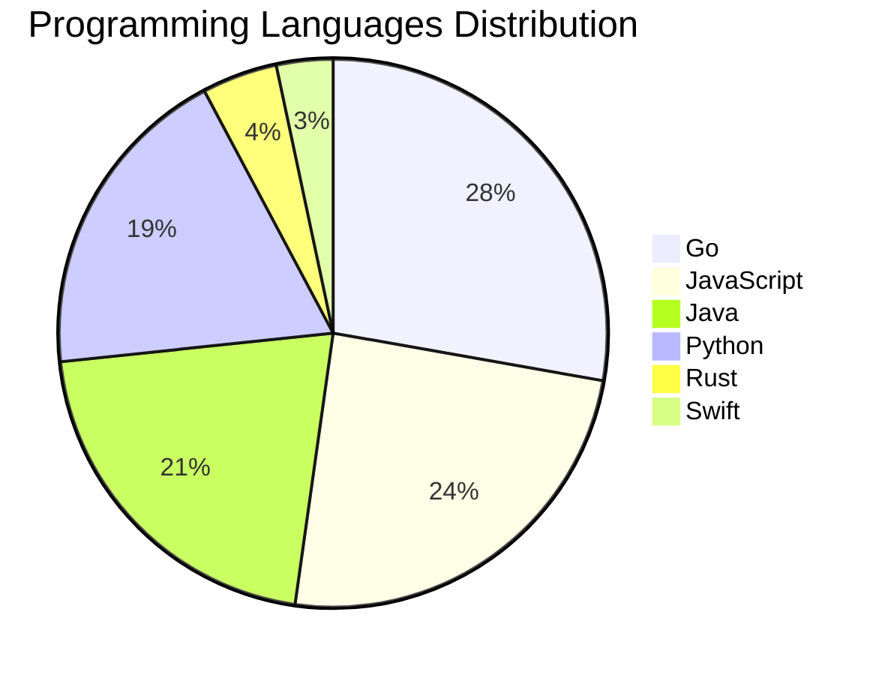

# 🚀 DevTech Auto News - Enhanced Edition


**DevTech Auto News Enhanced** is an advanced automated bot that aggregates trending topics in **AI**, **Web Development**, **Mobile**, **Cloud**, **DevOps**, and more from multiple sources including:

- 📰 [Dev.to](https://dev.to) - Developer community articles
- 🔥 [HackerNews](https://news.ycombinator.com) - Tech news discussions  
- 💻 [GitHub Trending](https://github.com/trending) - Trending repositories
- 🎯 Curated Interview Questions from multiple languages

## ✨ Features

✅ **Multi-Source Aggregation**: Combines articles from Dev.to, HackerNews, and GitHub  
✅ **Smart Categorization**: Automatically categorizes content into 10+ topics  
✅ **Image Support**: Displays cover images for visual appeal  
✅ **Pagination**: Fetches 50+ articles per update with deduplication  
✅ **Language Statistics**: Tracks programming language trends with charts  
✅ **Interview Questions**: Daily coding interview questions in multiple languages  
✅ **GitHub Actions**: Runs every 15 minutes automatically  

---

## 📊 Statistics Dashboard

### 📊 Articles by Category

**AI**: 🟦🟦🟦🟦🟦🟦🟦🟦🟦🟦🟦🟦🟦🟦🟦🟦🟦🟦🟦🟦 45 (42.9%)

**Tools**: 🟦🟦🟦🟦🟦🟦🟦🟦🟦🟦🟦🟦 28 (26.7%)

**JavaScript**: 🟦🟦🟦🟦🟦🟦🟦🟦🟦🟦 22 (21.0%)

**Python**: 🟦🟦🟦🟦🟦🟦🟦🟦 17 (16.2%)

**Cloud**: 🟦🟦🟦🟦🟦🟦🟦 15 (14.3%)

**Security**: 🟦🟦 5 (4.8%)

**DevOps**: 🟦🟦 4 (3.8%)

**Mobile**: 🟦 3 (2.9%)

**WebDev**: 🟦 2 (1.9%)

**Database**: 🟦 2 (1.9%)


### 📡 Sources

- **Dev.to**: 60 articles
- **HackerNews**: 30 articles
- **GitHub**: 15 articles


### 💻 Programming Language Trends

```
Go              ██████████████████████████████ 27.8 (27.8%)
JavaScript      ██████████████████████████ 24.4 (24.4%)
Java            ███████████████████████ 21.1 (21.1%)
Python          ████████████████████ 18.9 (18.9%)
Rust            █████ 4.4 (4.4%)
Swift           ████ 3.3 (3.3%)

```




### 🏷️ Trending Tags

               


---

## 🛠️ How It Works

1. **Multi-Source Fetch**: Pulls from Dev.to (2 pages), HackerNews (3 topics), GitHub (3 languages)
2. **Smart Filter**: Uses keyword matching across 10+ categories  
3. **Deduplication**: Removes duplicate URLs  
4. **Image Extraction**: Captures cover images when available  
5. **Statistics**: Generates language trends and category breakdowns  
6. **Update Files**: Regenerates README and appends to comprehensive log  

---

## 📦 Installation & Usage

```bash
# Clone the repository
git clone https://github.com/Derrick-MUGISHA/github-activity-bot.git
cd github-activity-bot

# Install dependencies  
npm install

# Run manually
npm start

# Test mode
npm run test
```

---


# 🚀 DevTech Auto News - Enhanced Edition

## 📅 Latest Updates (2026-06-25 15:00 CAT)


### 🖼️ Featured Articles

<table>
<tr>
  <td align="center" width="33%">
    <a href="https://dev.to/bclonan/cognitive-pong-an-open-source-arena-where-ai-agents-compete-learn-and-train-mdp">
      
      <br/>
      <b>Cognitive Pong: An Open Source Arena Where AI Agen...</b>
    </a>
    <br/>
    <sub>Dev.to</sub>
  </td>
  <td align="center" width="33%">
    <a href="https://dev.to/googleai/did-you-want-more-claude-on-cloud-lets-talk-about-securing-agents-at-scale-29jh">
      
      <br/>
      <b>Did you want more Claude on Cloud? ☁️ Let's talk a...</b>
    </a>
    <br/>
    <sub>Dev.to</sub>
  </td>
  <td align="center" width="33%">
    <a href="https://dev.to/gdg/how-my-ai-agent-hacked-its-own-permissions-and-what-it-taught-me-34bm">
      
      <br/>
      <b>How My AI Agent Hacked Its Own Permissions (And Wh...</b>
    </a>
    <br/>
    <sub>Dev.to</sub>
  </td>
</tr>
<tr>
  <td align="center" width="33%">
    <a href="https://dev.to/devsofmidnight/what-it-takes-to-build-docs-worth-reading-2290">
      
      <br/>
      <b>What it takes to build docs worth reading</b>
    </a>
    <br/>
    <sub>Dev.to</sub>
  </td>
  <td align="center" width="33%">
    <a href="https://dev.to/gde/12b-gemma-4-deployment-with-nvidia-blackwell-6000-qat-mtp-and-antigravity-cli-3gn6">
      
      <br/>
      <b>12B Gemma 4 Deployment with NVIDIA Blackwell 6000,...</b>
    </a>
    <br/>
    <sub>Dev.to</sub>
  </td>
  <td align="center" width="33%">
    <a href="https://dev.to/gde/12b-gemma-4-deployment-with-nvidia-blackwell-6000-mcp-cloud-run-and-antigravity-cli-3ckn">
      
      <br/>
      <b>12B Gemma 4 Deployment with NVIDIA Blackwell 6000,...</b>
    </a>
    <br/>
    <sub>Dev.to</sub>
  </td>
</tr>
</table>


### 📰 Top Headlines

- [Cognitive Pong: An Open Source Arena Where AI Agents Compete, Learn, and Train](https://dev.to/bclonan/cognitive-pong-an-open-source-arena-where-ai-agents-compete-learn-and-train-mdp) _[Dev.to]_
- [Did you want more Claude on Cloud? ☁️ Let's talk about Securing Agents at Scale](https://dev.to/googleai/did-you-want-more-claude-on-cloud-lets-talk-about-securing-agents-at-scale-29jh) _[Dev.to]_
- [How My AI Agent Hacked Its Own Permissions (And What It Taught Me)](https://dev.to/gdg/how-my-ai-agent-hacked-its-own-permissions-and-what-it-taught-me-34bm) _[Dev.to]_
- [What it takes to build docs worth reading](https://dev.to/devsofmidnight/what-it-takes-to-build-docs-worth-reading-2290) _[Dev.to]_
- [12B Gemma 4 Deployment with NVIDIA Blackwell 6000, QAT, MTP, and Antigravity CLI](https://dev.to/gde/12b-gemma-4-deployment-with-nvidia-blackwell-6000-qat-mtp-and-antigravity-cli-3gn6) _[Dev.to]_
- [12B Gemma 4 Deployment with NVIDIA Blackwell 6000, MCP, Cloud Run, and Antigravity CLI](https://dev.to/gde/12b-gemma-4-deployment-with-nvidia-blackwell-6000-mcp-cloud-run-and-antigravity-cli-3ckn) _[Dev.to]_
- [Building a Custom Status Line for Claude Code](https://dev.to/ndrone/building-a-custom-status-line-for-claude-code-5822) _[Dev.to]_
- [Welcome Thread - v381](https://dev.to/devteam/welcome-thread-v381-3ko4) _[Dev.to]_
- [Function Names in JS Can't Contain Spaces, Right?](https://dev.to/jonrandy/function-names-in-js-cant-contain-spaces-right-mp7) _[Dev.to]_
- [cuenv: one typed file for your whole project](https://dev.to/peterj/cuenv-one-typed-file-for-your-whole-project-76a) _[Dev.to]_
- [Announcing the Public Preview of Integrated Embeddings in Azure Cosmos DB: Build AI Apps With Embeddings That Stay in Sync](https://dev.to/abhirockzz/announcing-the-public-preview-of-integrated-embeddings-in-azure-cosmos-db-build-ai-apps-with-234k) _[Dev.to]_
- [Extending a Rust MCP/A2A Currency Agent with A2UI](https://dev.to/gde/extending-a-rust-mcpa2a-currency-agent-with-a2ui-22jc) _[Dev.to]_
- [Top 7 Featured DEV Posts of the Week](https://dev.to/devteam/top-7-featured-dev-posts-of-the-week-55d8) _[Dev.to]_
- [Building a multi-agent document-search copilot — Part 1: muddy results, and one strategy per query](https://dev.to/rdiegoss/building-a-multi-agent-document-search-copilot-part-1-muddy-results-and-one-strategy-per-query-54og) _[Dev.to]_
- [Multi-Agent Observability: See Everything Your AI Agents Do](https://dev.to/bredmond1019/multi-agent-observability-see-everything-your-ai-agents-do-16e2) _[Dev.to]_
- [gookit/gcli v3.5.0 released - easy-to-use, feature-rich Go command line application and tool library](https://dev.to/inhere/gookitgcli-v350-released-easy-to-use-feature-rich-go-command-line-application-and-tool-library-4jkn) _[Dev.to]_
- [I Am Fired Up Again](https://dev.to/jenueldev/i-am-fired-up-again-377i) _[Dev.to]_
- [Debian Packages](https://dev.to/karuppiah7890/debian-packages-51gj) _[Dev.to]_
- [Serverless Gemma 12B with NVIDIA A100 on Azure Container Apps](https://dev.to/gde/serverless-gemma-12b-with-nvidia-a100-on-azure-container-apps-1ff4) _[Dev.to]_
- [Building an AI Homelab](https://dev.to/lordmathis/building-an-ai-homelab-330o) _[Dev.to]_

_Last automated update: Thu, 25 Jun 2026 15:25:43 CAT_


## 💡 Daily Interview Questions

_Sharpen your skills with these curated questions_

### 1. JavaScript: Explain event delegation and why it's useful

**Difficulty**: Medium | **Topics**: events, DOM

<details>
<summary>💡 Hint</summary>

Event bubbling, single listener for multiple elements

</details>

### 2. Java: What is the difference between abstract class and interface?

**Difficulty**: Easy | **Topics**: OOP, design

<details>
<summary>💡 Hint</summary>

Multiple inheritance, method implementation, use cases

</details>

### 3. DataStructures: Implement a function to reverse a linked list

**Difficulty**: Medium | **Topics**: linked lists, pointers

<details>
<summary>💡 Hint</summary>

Iterative or recursive, three pointers

</details>


---

## 📚 Resources

- [Full News Archive](./data/news_log.md) - Complete history of all fetched articles
- [Statistics JSON](./data/stats.json) - Raw statistics data
- [Categorized Data](./data/categorized.json) - Articles organized by category
- [Interview Questions](./data/interview_questions.json) - Complete question bank

---

## 🤝 Contributing

Want to add more sources, categories, or interview questions? Feel free to:

1. Fork this repository
2. Add your improvements
3. Submit a pull request

---

## 📄 License

MIT License - Feel free to use and modify!

---

<p align="center">
  <b>Last automated update: Thu, 25 Jun 2026 13:25:43 GMT</b><br/>
  <sub>Powered by GitHub Actions | Made with ❤️ for developers</sub>
</p>

---

## 🔗 Quick Links

- [View Workflow](https://github.com/Derrick-MUGISHA/github-activity-bot/actions)
- [Report Issue](https://github.com/Derrick-MUGISHA/github-activity-bot/issues)
- [Suggest Feature](https://github.com/Derrick-MUGISHA/github-activity-bot/issues/new)
