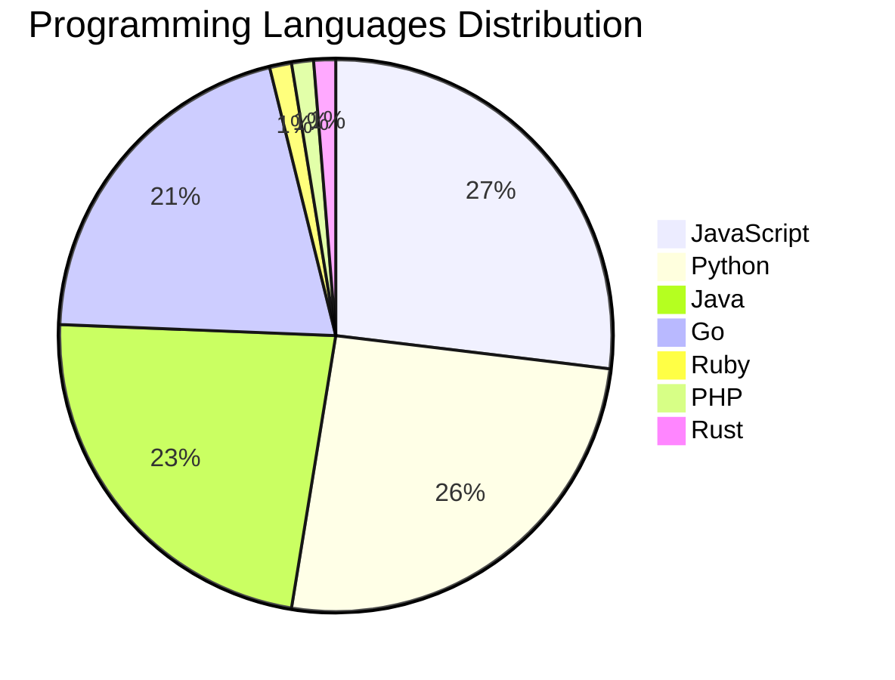

# 🚀 DevTech Auto News - Enhanced Edition


**DevTech Auto News Enhanced** is an advanced automated bot that aggregates trending topics in **AI**, **Web Development**, **Mobile**, **Cloud**, **DevOps**, and more from multiple sources including:

- 📰 [Dev.to](https://dev.to) - Developer community articles
- 🔥 [HackerNews](https://news.ycombinator.com) - Tech news discussions  
- 💻 [GitHub Trending](https://github.com/trending) - Trending repositories
- 🎯 Curated Interview Questions from multiple languages

## ✨ Features

✅ **Multi-Source Aggregation**: Combines articles from Dev.to, HackerNews, and GitHub  
✅ **Smart Categorization**: Automatically categorizes content into 10+ topics  
✅ **Image Support**: Displays cover images for visual appeal  
✅ **Pagination**: Fetches 50+ articles per update with deduplication  
✅ **Language Statistics**: Tracks programming language trends with charts  
✅ **Interview Questions**: Daily coding interview questions in multiple languages  
✅ **GitHub Actions**: Runs every 15 minutes automatically  

---

## 📊 Statistics Dashboard

### 📊 Articles by Category

**AI**: 🟦🟦🟦🟦🟦🟦🟦🟦🟦🟦🟦🟦🟦🟦🟦🟦🟦🟦🟦🟦 55 (52.9%)

**Tools**: 🟦🟦🟦🟦🟦🟦🟦🟦🟦 25 (24.0%)

**JavaScript**: 🟦🟦🟦🟦🟦🟦🟦🟦 21 (20.2%)

**Python**: 🟦🟦🟦🟦🟦🟦🟦 20 (19.2%)

**Cloud**: 🟦🟦 5 (4.8%)

**Security**: 🟦🟦 5 (4.8%)

**WebDev**: 🟦 4 (3.8%)

**DevOps**: 🟦 2 (1.9%)

**Database**: 🟦 2 (1.9%)


### 📡 Sources

- **Dev.to**: 59 articles
- **HackerNews**: 30 articles
- **GitHub**: 15 articles


### 💻 Programming Language Trends

```
JavaScript      ██████████████████████████████ 26.9 (26.9%)
Python          █████████████████████████████ 25.6 (25.6%)
Java            ██████████████████████████ 23.1 (23.1%)
Go              ███████████████████████ 20.5 (20.5%)
Ruby            █ 1.3 (1.3%)
PHP             █ 1.3 (1.3%)
Rust            █ 1.3 (1.3%)

```




### 🏷️ Trending Tags

               


---

## 🛠️ How It Works

1. **Multi-Source Fetch**: Pulls from Dev.to (2 pages), HackerNews (3 topics), GitHub (3 languages)
2. **Smart Filter**: Uses keyword matching across 10+ categories  
3. **Deduplication**: Removes duplicate URLs  
4. **Image Extraction**: Captures cover images when available  
5. **Statistics**: Generates language trends and category breakdowns  
6. **Update Files**: Regenerates README and appends to comprehensive log  

---

## 📦 Installation & Usage

```bash
# Clone the repository
git clone https://github.com/Derrick-MUGISHA/github-activity-bot.git
cd github-activity-bot

# Install dependencies  
npm install

# Run manually
npm start

# Test mode
npm run test
```

---


# 🚀 DevTech Auto News - Enhanced Edition

## 📅 Latest Updates (2026-04-05 19:00 CAT)


### 🖼️ Featured Articles

<table>
<tr>
  <td align="center" width="33%">
    <a href="https://dev.to/gde/deploying-adk-agents-on-azure-aci-2jk6">
      
      <br/>
      <b>Deploying ADK Agents on Azure ACI</b>
    </a>
    <br/>
    <sub>Dev.to</sub>
  </td>
  <td align="center" width="33%">
    <a href="https://dev.to/devteam/join-our-april-fools-challenge-for-a-chance-at-tea-rrific-prizes-1ofa">
      
      <br/>
      <b>Join our April Fools Challenge for a chance at TEA...</b>
    </a>
    <br/>
    <sub>Dev.to</sub>
  </td>
  <td align="center" width="33%">
    <a href="https://dev.to/oliverke/observability-from-day-one-what-we-got-wrong-in-v1-and-how-we-fixed-it-in-v2-36lc">
      
      <br/>
      <b>Observability from Day One: What We Got Wrong in v...</b>
    </a>
    <br/>
    <sub>Dev.to</sub>
  </td>
</tr>
<tr>
  <td align="center" width="33%">
    <a href="https://dev.to/ben/big-performance-upgrade-in-devforem-tag-queries-shipped-yesterday-breath-of-fresh-air-2pp0">
      
      <br/>
      <b>Big performance upgrade in DEV/Forem tag queries s...</b>
    </a>
    <br/>
    <sub>Dev.to</sub>
  </td>
  <td align="center" width="33%">
    <a href="https://dev.to/gde/deploying-adk-agents-on-azure-aca-azure-container-apps-3kb7">
      
      <br/>
      <b>Deploying ADK Agents on Azure ACA (Azure Container...</b>
    </a>
    <br/>
    <sub>Dev.to</sub>
  </td>
  <td align="center" width="33%">
    <a href="https://dev.to/matluz/i-built-an-ai-that-gms-full-ttrpg-campaigns-774">
      
      <br/>
      <b>LoreKit - AI That GMs Full TTRPG Campaigns</b>
    </a>
    <br/>
    <sub>Dev.to</sub>
  </td>
</tr>
</table>


### 📰 Top Headlines

- [Deploying ADK Agents on Azure ACI](https://dev.to/gde/deploying-adk-agents-on-azure-aci-2jk6) _[Dev.to]_
- [Join our April Fools Challenge for a chance at TEA-RRIFIC prizes!!!](https://dev.to/devteam/join-our-april-fools-challenge-for-a-chance-at-tea-rrific-prizes-1ofa) _[Dev.to]_
- [Observability from Day One: What We Got Wrong in v1 and How We Fixed It in v2](https://dev.to/oliverke/observability-from-day-one-what-we-got-wrong-in-v1-and-how-we-fixed-it-in-v2-36lc) _[Dev.to]_
- [Big performance upgrade in DEV/Forem tag queries shipped yesterday. Breath of fresh air 🙂](https://dev.to/ben/big-performance-upgrade-in-devforem-tag-queries-shipped-yesterday-breath-of-fresh-air-2pp0) _[Dev.to]_
- [Deploying ADK Agents on Azure ACA (Azure Container Apps)](https://dev.to/gde/deploying-adk-agents-on-azure-aca-azure-container-apps-3kb7) _[Dev.to]_
- [LoreKit - AI That GMs Full TTRPG Campaigns](https://dev.to/matluz/i-built-an-ai-that-gms-full-ttrpg-campaigns-774) _[Dev.to]_
- [I Analyzed AI Coding Mistakes and Built an ESLint Plugin to Catch Them](https://dev.to/pertrai1/i-analyzed-500-ai-coding-mistakes-and-built-an-eslint-plugin-to-catch-them-jme) _[Dev.to]_
- [You don't need to deal with code to understand Playwright](https://dev.to/abhivaikar/you-dont-need-to-deal-with-code-to-understand-playwright-39nk) _[Dev.to]_
- [Beyond Pixels: How Modern Emails Embed the Same Identifier Everywhere](https://dev.to/wadco/beyond-pixels-how-modern-emails-embed-the-same-identifier-everywhere-4228) _[Dev.to]_
- [Recursive Knowledge Crystallization: Enabling Persistent Evolution and Zero-Shot Transfer in AI Agents](https://dev.to/gde/recursive-knowledge-crystallization-enabling-persistent-evolution-and-zero-shot-transfer-in-ai-4fh7) _[Dev.to]_
- [New Site, Who Dis?](https://dev.to/robearlam/new-site-who-dis-592h) _[Dev.to]_
- [Using AI Agents to Debug Distributed Systems in Under a Minute](https://dev.to/tomasmaiorino/using-ai-agents-to-debug-distributed-systems-in-under-a-minute-4j20) _[Dev.to]_
- [How to start self-hosting with Coolify 4 on a VPS](https://dev.to/serpapi/how-to-start-self-hosting-with-coolify-4-on-a-vps-44ob) _[Dev.to]_
- [Why Rails Still Feels Like a Startup’s Best Friend in the AI Era](https://dev.to/mezbahalam/why-rails-still-feels-like-a-startups-best-friend-in-the-ai-era-45hn) _[Dev.to]_
- [Authorizer v2 Is Here: Self-Hosted Auth, Rebuilt From the Ground Up](https://dev.to/lakhansamani/authorizer-v2-is-here-self-hosted-auth-rebuilt-from-the-ground-up-184a) _[Dev.to]_
- [Building for Production: A Guide to Deploying a 3-Tier App on Azure](https://dev.to/cafedeluv/building-for-production-a-guide-to-deploying-a-3-tier-app-on-azure-chb) _[Dev.to]_
- [AI became my assistant to learning](https://dev.to/satie_sann/ai-became-my-assistant-to-learning-4o53) _[Dev.to]_
- [Working with JWTs in Laravel (Without the Magic)](https://dev.to/mtownsend5512/working-with-jwts-in-laravel-without-the-magic-36oh) _[Dev.to]_
- [Depresso-Tron 418: I Built a Bureaucratic Coffee Machine That Cannot Make Coffee](https://dev.to/greysquirr3l/depresso-tron-418-i-built-a-bureaucratic-coffee-machine-that-cannot-make-coffee-33pl) _[Dev.to]_
- [A Year of Change and Persistence](https://dev.to/jess/a-year-of-change-and-persistence-19cf) _[Dev.to]_

_Last automated update: Sun, 05 Apr 2026 19:48:51 CAT_


## 💡 Daily Interview Questions

_Sharpen your skills with these curated questions_

### 1. SystemDesign: Design Twitter's timeline feature

**Difficulty**: Hard | **Topics**: system design, scalability

<details>
<summary>💡 Hint</summary>

Fan-out, caching, ranking, real-time updates

</details>

### 2. DataStructures: Implement a function to reverse a linked list

**Difficulty**: Medium | **Topics**: linked lists, pointers

<details>
<summary>💡 Hint</summary>

Iterative or recursive, three pointers

</details>

### 3. Python: Explain GIL and its implications for multithreading

**Difficulty**: Hard | **Topics**: concurrency, performance

<details>
<summary>💡 Hint</summary>

Global Interpreter Lock, multiprocessing alternatives

</details>


---

## 📚 Resources

- [Full News Archive](./data/news_log.md) - Complete history of all fetched articles
- [Statistics JSON](./data/stats.json) - Raw statistics data
- [Categorized Data](./data/categorized.json) - Articles organized by category
- [Interview Questions](./data/interview_questions.json) - Complete question bank

---

## 🤝 Contributing

Want to add more sources, categories, or interview questions? Feel free to:

1. Fork this repository
2. Add your improvements
3. Submit a pull request

---

## 📄 License

MIT License - Feel free to use and modify!

---

<p align="center">
  <b>Last automated update: Sun, 05 Apr 2026 17:48:51 GMT</b><br/>
  <sub>Powered by GitHub Actions | Made with ❤️ for developers</sub>
</p>

---

## 🔗 Quick Links

- [View Workflow](https://github.com/Derrick-MUGISHA/github-activity-bot/actions)
- [Report Issue](https://github.com/Derrick-MUGISHA/github-activity-bot/issues)
- [Suggest Feature](https://github.com/Derrick-MUGISHA/github-activity-bot/issues/new)
