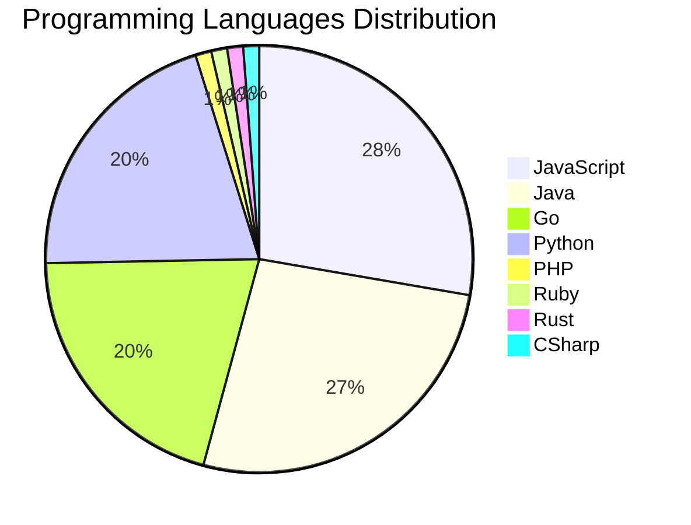

# 🚀 DevTech Auto News - Enhanced Edition


**DevTech Auto News Enhanced** is an advanced automated bot that aggregates trending topics in **AI**, **Web Development**, **Mobile**, **Cloud**, **DevOps**, and more from multiple sources including:

- 📰 [Dev.to](https://dev.to) - Developer community articles
- 🔥 [HackerNews](https://news.ycombinator.com) - Tech news discussions  
- 💻 [GitHub Trending](https://github.com/trending) - Trending repositories
- 🎯 Curated Interview Questions from multiple languages

## ✨ Features

✅ **Multi-Source Aggregation**: Combines articles from Dev.to, HackerNews, and GitHub  
✅ **Smart Categorization**: Automatically categorizes content into 10+ topics  
✅ **Image Support**: Displays cover images for visual appeal  
✅ **Pagination**: Fetches 50+ articles per update with deduplication  
✅ **Language Statistics**: Tracks programming language trends with charts  
✅ **Interview Questions**: Daily coding interview questions in multiple languages  
✅ **GitHub Actions**: Runs every 15 minutes automatically  

---

## 📊 Statistics Dashboard

### 📊 Articles by Category

**AI**: 🟦🟦🟦🟦🟦🟦🟦🟦🟦🟦🟦🟦🟦🟦🟦🟦🟦🟦🟦🟦 47 (46.5%)

**JavaScript**: 🟦🟦🟦🟦🟦🟦🟦🟦🟦🟦 23 (22.8%)

**Tools**: 🟦🟦🟦🟦🟦🟦🟦🟦🟦🟦 23 (22.8%)

**Python**: 🟦🟦🟦🟦🟦🟦🟦 17 (16.8%)

**WebDev**: 🟦🟦🟦 6 (5.9%)

**Database**: 🟦🟦 4 (4.0%)

**Security**: 🟦🟦 4 (4.0%)

**Cloud**: 🟦 3 (3.0%)

**DevOps**:  1 (1.0%)


### 📡 Sources

- **Dev.to**: 56 articles
- **HackerNews**: 30 articles
- **GitHub**: 15 articles


### 💻 Programming Language Trends

```
JavaScript      ██████████████████████████████ 27.7 (27.7%)
Java            █████████████████████████████ 26.5 (26.5%)
Go              ██████████████████████ 20.5 (20.5%)
Python          ██████████████████████ 20.5 (20.5%)
PHP             █ 1.2 (1.2%)
Ruby            █ 1.2 (1.2%)
Rust            █ 1.2 (1.2%)
CSharp          █ 1.2 (1.2%)

```




### 🏷️ Trending Tags

               


---

## 🛠️ How It Works

1. **Multi-Source Fetch**: Pulls from Dev.to (2 pages), HackerNews (3 topics), GitHub (3 languages)
2. **Smart Filter**: Uses keyword matching across 10+ categories  
3. **Deduplication**: Removes duplicate URLs  
4. **Image Extraction**: Captures cover images when available  
5. **Statistics**: Generates language trends and category breakdowns  
6. **Update Files**: Regenerates README and appends to comprehensive log  

---

## 📦 Installation & Usage

```bash
# Clone the repository
git clone https://github.com/Derrick-MUGISHA/github-activity-bot.git
cd github-activity-bot

# Install dependencies  
npm install

# Run manually
npm start

# Test mode
npm run test
```

---


# 🚀 DevTech Auto News - Enhanced Edition

## 📅 Latest Updates (2026-03-17 3:00 CAT)


### 🖼️ Featured Articles

<table>
<tr>
  <td align="center" width="33%">
    <a href="https://dev.to/the_nortern_dev/i-think-a-lot-of-developers-are-quietly-grieving-the-old-internet-3d8">
      
      <br/>
      <b>I Think a Lot of Developers Are Quietly Grieving t...</b>
    </a>
    <br/>
    <sub>Dev.to</sub>
  </td>
  <td align="center" width="33%">
    <a href="https://dev.to/ben/meme-monday-cc9">
      
      <br/>
      <b>Meme Monday</b>
    </a>
    <br/>
    <sub>Dev.to</sub>
  </td>
  <td align="center" width="33%">
    <a href="https://dev.to/provydon/how-i-built-niobe-an-ai-waitress-with-gemini-live-and-google-cloud-2o28">
      
      <br/>
      <b>How I Built Niobe: An AI Waitress with Gemini Live...</b>
    </a>
    <br/>
    <sub>Dev.to</sub>
  </td>
</tr>
<tr>
  <td align="center" width="33%">
    <a href="https://dev.to/nghiahsgs/i-built-an-open-source-focus-group-simulator-that-spawns-1000-ai-customers-to-roast-your-startup-1c5o">
      
      <br/>
      <b>I built an open-source "focus group simulator" tha...</b>
    </a>
    <br/>
    <sub>Dev.to</sub>
  </td>
  <td align="center" width="33%">
    <a href="https://dev.to/ferderer/one-regex-to-match-them-all-228h">
      
      <br/>
      <b>One regex to match them all</b>
    </a>
    <br/>
    <sub>Dev.to</sub>
  </td>
  <td align="center" width="33%">
    <a href="https://dev.to/davidisnotnull/the-firebreak-1oej">
      
      <br/>
      <b>The Firebreak</b>
    </a>
    <br/>
    <sub>Dev.to</sub>
  </td>
</tr>
</table>


### 📰 Top Headlines

- [I Think a Lot of Developers Are Quietly Grieving the Old Internet](https://dev.to/the_nortern_dev/i-think-a-lot-of-developers-are-quietly-grieving-the-old-internet-3d8) _[Dev.to]_
- [Meme Monday](https://dev.to/ben/meme-monday-cc9) _[Dev.to]_
- [How I Built Niobe: An AI Waitress with Gemini Live and Google Cloud](https://dev.to/provydon/how-i-built-niobe-an-ai-waitress-with-gemini-live-and-google-cloud-2o28) _[Dev.to]_
- [I built an open-source "focus group simulator" that spawns 1,000 AI customers to roast your startup idea](https://dev.to/nghiahsgs/i-built-an-open-source-focus-group-simulator-that-spawns-1000-ai-customers-to-roast-your-startup-1c5o) _[Dev.to]_
- [One regex to match them all](https://dev.to/ferderer/one-regex-to-match-them-all-228h) _[Dev.to]_
- [The Firebreak](https://dev.to/davidisnotnull/the-firebreak-1oej) _[Dev.to]_
- [What was your win this week?!](https://dev.to/devteam/what-was-your-win-this-week-ilf) _[Dev.to]_
- [I Built a Browser UI for Claude Code — Here's Why](https://dev.to/hamed_farag/i-built-a-browser-ui-for-claude-code-heres-why-4959) _[Dev.to]_
- [Rethinking Architecture in the AI Era — Part 1: Repository Management](https://dev.to/iktakahiro/rethinking-architecture-in-the-ai-era-part-1-repository-management-2ia4) _[Dev.to]_
- [Backstage logbook: Migrating the Catalog Plugin to the New Frontend System](https://dev.to/sarabadu/backstage-logbook-migrating-the-catalog-plugin-to-the-new-frontend-system-f6) _[Dev.to]_
- [The Local AI Powerhouse](https://dev.to/amjadmh73/the-local-ai-powerhouse-28j) _[Dev.to]_
- [Why I, as Someone Who Likes MySQL, Now Want to Recommend PostgreSQL](https://dev.to/catatsuy/why-i-as-someone-who-likes-mysql-now-want-to-recommend-postgresql-2a8i) _[Dev.to]_
- [Elvis (?:) vs Null Coalescing (??) in PHP: A Practical Guide for WordPress Developers](https://dev.to/abbeymaniak/elvis-vs-null-coalescing-in-php-a-practical-guide-for-wordpress-developers-3ih4) _[Dev.to]_
- [Fortran meets AI](https://dev.to/viksaaskool/fortran-meets-ai-3oac) _[Dev.to]_
- [90% of Code Will Be AI-Generated — So What the Hell Do We Actually Do?](https://dev.to/harsh2644/90-of-code-will-be-ai-generated-so-what-the-hell-do-we-actually-do-2kg3) _[Dev.to]_
- [Ship Less, Measure More](https://dev.to/snowman647/ship-less-measure-more-58m4) _[Dev.to]_
- [Gemini CLI and Jules: my March 2026 stack](https://dev.to/rowan_m/gemini-cli-and-jules-my-march-2026-stack-4146) _[Dev.to]_
- [The Diplomatic Core: Shared Logic in a Multi-Framework World](https://dev.to/link2twenty/the-diplomatic-core-shared-logic-in-a-multi-framework-world-36m8) _[Dev.to]_
- [I Deleted Pinecone, Redis, and 400 Lines of Python. My RAG Pipeline Still Works.](https://dev.to/zeybek/i-deleted-pinecone-redis-and-400-lines-of-python-my-rag-pipeline-still-works-5dh3) _[Dev.to]_
- [mcp-pvp — Privacy Vault Protocol for MCP](https://dev.to/mitiku1/mcp-pvp-privacy-vault-protocol-for-mcp-2b80) _[Dev.to]_

_Last automated update: Tue, 17 Mar 2026 03:51:24 CAT_


## 💡 Daily Interview Questions

_Sharpen your skills with these curated questions_

### 1. Java: Explain the Java memory model

**Difficulty**: Hard | **Topics**: memory, JVM

<details>
<summary>💡 Hint</summary>

Heap, stack, garbage collection

</details>

### 2. React: Implement a custom hook for fetching data

**Difficulty**: Medium | **Topics**: hooks, async

<details>
<summary>💡 Hint</summary>

useState, useEffect, loading states, error handling

</details>

### 3. NodeJS: Implement rate limiting for an API

**Difficulty**: Hard | **Topics**: security, middleware

<details>
<summary>💡 Hint</summary>

Token bucket, sliding window, Redis

</details>


---

## 📚 Resources

- [Full News Archive](./data/news_log.md) - Complete history of all fetched articles
- [Statistics JSON](./data/stats.json) - Raw statistics data
- [Categorized Data](./data/categorized.json) - Articles organized by category
- [Interview Questions](./data/interview_questions.json) - Complete question bank

---

## 🤝 Contributing

Want to add more sources, categories, or interview questions? Feel free to:

1. Fork this repository
2. Add your improvements
3. Submit a pull request

---

## 📄 License

MIT License - Feel free to use and modify!

---

<p align="center">
  <b>Last automated update: Tue, 17 Mar 2026 01:51:24 GMT</b><br/>
  <sub>Powered by GitHub Actions | Made with ❤️ for developers</sub>
</p>

---

## 🔗 Quick Links

- [View Workflow](https://github.com/Derrick-MUGISHA/github-activity-bot/actions)
- [Report Issue](https://github.com/Derrick-MUGISHA/github-activity-bot/issues)
- [Suggest Feature](https://github.com/Derrick-MUGISHA/github-activity-bot/issues/new)
