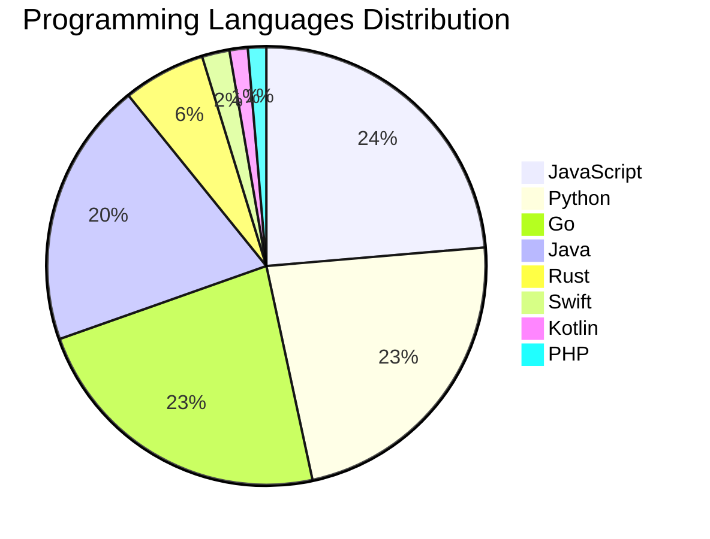

<div align="center">

# 📰 DevTech Auto News

**Your always-fresh digest of developer & AI tech news — curated automatically, around the clock.**


Aggregating [Dev.to](https://dev.to) · [Hacker News](https://news.ycombinator.com) · [GitHub Trending](https://github.com/trending) · [Lobste.rs](https://lobste.rs) · [Stack Overflow](https://stackoverflow.com) · [TechCrunch](https://techcrunch.com) · [freeCodeCamp](https://www.freecodecamp.org/news) — refreshed by GitHub Actions around the clock.

**[📰 Headlines](#-latest-headlines) · [💡 Interview Prep](#-interview-question-of-the-hour) · [📊 Statistics](#-statistics) · [⚙️ How It Works](#%EF%B8%8F-how-it-works)**

</div>

---

## 📰 Latest Headlines

> 🕐 Edition of **2026-07-11 14:00 CAT** — refreshed automatically, all day, every day.

### ✨ Featured Stories

<table>
<tr>
  <td align="center" width="33%">
    <a href="https://dev.to/klaudiagrz/should-i-quit-it-or-just-live-through-the-burnout-1gng">
      
      <br/>
      <b>Should I quit IT or just live through the burnout?</b>
    </a>
    <br/>
    <sub>Dev.to</sub>
  </td>
  <td align="center" width="33%">
    <a href="https://dev.to/devteam/top-7-featured-dev-posts-of-the-week-144b">
      
      <br/>
      <b>Top 7 Featured DEV Posts of the Week</b>
    </a>
    <br/>
    <sub>Dev.to</sub>
  </td>
  <td align="center" width="33%">
    <a href="https://dev.to/devteam/congrats-to-the-june-solstice-game-jam-winners-46c0">
      
      <br/>
      <b>Congrats to the June Solstice Game Jam Winners!</b>
    </a>
    <br/>
    <sub>Dev.to</sub>
  </td>
</tr>
<tr>
  <td align="center" width="33%">
    <a href="https://dev.to/gde/debugging-deployments-with-gemma-4b-tpu-v6e-1-mcp-and-antigravity-cli-3p6b">
      
      <br/>
      <b>Debugging Deployments with Gemma 4B, TPU v6e-1, MC...</b>
    </a>
    <br/>
    <sub>Dev.to</sub>
  </td>
  <td align="center" width="33%">
    <a href="https://dev.to/gde/guarding-the-till-while-autonomous-data-agents-do-the-digging-3nmi">
      
      <br/>
      <b>Guarding the till while autonomous data agents do ...</b>
    </a>
    <br/>
    <sub>Dev.to</sub>
  </td>
  <td align="center" width="33%">
    <a href="https://dev.to/gde/debugging-deployments-with-gemma-2b-tpu-v6e-1-mcp-and-antigravity-cli-3hh3">
      
      <br/>
      <b>Debugging Deployments with Gemma 2B, TPU v6e-1, MC...</b>
    </a>
    <br/>
    <sub>Dev.to</sub>
  </td>
</tr>
</table>


### 🗞️ Top Stories

| # | Headline | Source |
|---|----------|--------|
| 1 | [Should I quit IT or just live through the burnout?](https://dev.to/klaudiagrz/should-i-quit-it-or-just-live-through-the-burnout-1gng) | Dev.to |
| 2 | [Top 7 Featured DEV Posts of the Week](https://dev.to/devteam/top-7-featured-dev-posts-of-the-week-144b) | Dev.to |
| 3 | [Congrats to the June Solstice Game Jam Winners!](https://dev.to/devteam/congrats-to-the-june-solstice-game-jam-winners-46c0) | Dev.to |
| 4 | [Debugging Deployments with Gemma 4B, TPU v6e-1, MCP, and Antigravity CLI](https://dev.to/gde/debugging-deployments-with-gemma-4b-tpu-v6e-1-mcp-and-antigravity-cli-3p6b) | Dev.to |
| 5 | [Guarding the till while autonomous data agents do the digging](https://dev.to/gde/guarding-the-till-while-autonomous-data-agents-do-the-digging-3nmi) | Dev.to |
| 6 | [Debugging Deployments with Gemma 2B, TPU v6e-1, MCP, and Antigravity CLI](https://dev.to/gde/debugging-deployments-with-gemma-2b-tpu-v6e-1-mcp-and-antigravity-cli-3hh3) | Dev.to |
| 7 | [Return on Attention: Why AI Code Reviews Are Wearing Us Out](https://dev.to/cseeman/return-on-attention-why-ai-code-reviews-are-wearing-us-out-2hh0) | Dev.to |
| 8 | [Context bankruptcy: The case for strategic forgetting for AI Agents](https://dev.to/googleai/context-bankruptcy-the-case-for-strategic-forgetting-for-ai-agents-3c5) | Dev.to |
| 9 | [What was your win this week?!](https://dev.to/devteam/what-was-your-win-this-week-50ea) | Dev.to |
| 10 | [Parallel Compliance Engine: Drive-to-Sheets Multi-Agent Orchestration](https://dev.to/gde/parallel-compliance-engine-drive-to-sheets-multi-agent-orchestration-4o) | Dev.to |
| 11 | [✨Cool Effects, TTS, and Fun Animations (AI Avatar v15: VS Code and Chrome Extension)](https://dev.to/webdeveloperhyper/cool-effects-tts-and-fun-animations-ai-avatar-v15-vs-code-and-chrome-extension-3oec) | Dev.to |
| 12 | [Debugging Deployments with Gemma 4B, TPU v6e-4, MCP, and Antigravity CLI](https://dev.to/gde/debugging-deployments-with-gemma-4b-tpu-v6e-4-mcp-and-antigravity-cli-1l82) | Dev.to |
| 13 | [Stop Your LLMs from Forgetting: How a 2016 String Algorithm Solves AI's Biggest Memory Loss Problem](https://dev.to/gde/stop-your-llms-from-forgetting-how-a-2016-string-algorithm-solves-ais-biggest-memory-loss-problem-240f) | Dev.to |
| 14 | [MCP Configuration for Looker with Antigravity CLI](https://dev.to/gde/mcp-configuration-for-looker-with-antigravity-cli-504d) | Dev.to |
| 15 | [Has the audience for technical articles dropped?](https://dev.to/dumebii/has-the-audience-for-technical-articles-dropped-5ceh) | Dev.to |
| 16 | [Is It Ethical to Post and Ask About Circuits on Dev.to?](https://dev.to/codebunny20/is-it-ethical-to-post-and-ask-about-circuits-on-devto-34fg) | Dev.to |
| 17 | [The One-Click Exporter: AI Studio Antigravity, Probed to Its Limits](https://dev.to/gde/the-one-click-exporter-ai-studio-antigravity-probed-to-its-limits-171e) | Dev.to |
| 18 | [Building an Autonomous SRE Agent with Google ADK and the Antigravity SDK](https://dev.to/gde/building-an-autonomous-sre-agent-with-google-adk-and-the-antigravity-sdk-1fgl) | Dev.to |
| 19 | [Your Career Matters. So Does the Person Building It.](https://dev.to/hemapriya_kanagala/your-career-matters-so-does-the-person-building-it-2jle) | Dev.to |
| 20 | [Join our DEV Weekend Challenge: Passion Edition — $1,000 in Prizes Across FIVE Winners! Submissions Due July 13 at 6:59 AM UTC.](https://dev.to/devteam/join-our-dev-weekend-challenge-passion-edition-1000-in-prizes-across-five-winners-submissions-10j5) | Dev.to |

<sub>Last fetched: Sat, 11 Jul 2026 14:13:36 CAT</sub>


---

## 💡 Interview Question of the Hour

> Sharpen your skills — new questions selected on every update. Try answering before opening the hint!

**1. `NodeJS` — How do you handle errors in async/await?**

&nbsp;&nbsp;&nbsp;&nbsp;🎯 Medium · 🏷 error handling, async

<details>
<summary>&nbsp;&nbsp;&nbsp;&nbsp;💡 Show hint</summary>

> try/catch, .catch(), error middleware

</details>

**2. `NodeJS` — Implement rate limiting for an API**

&nbsp;&nbsp;&nbsp;&nbsp;🎯 Hard · 🏷 security, middleware

<details>
<summary>&nbsp;&nbsp;&nbsp;&nbsp;💡 Show hint</summary>

> Token bucket, sliding window, Redis

</details>

**3. `DataStructures` — Implement a function to reverse a linked list**

&nbsp;&nbsp;&nbsp;&nbsp;🎯 Medium · 🏷 linked lists, pointers

<details>
<summary>&nbsp;&nbsp;&nbsp;&nbsp;💡 Show hint</summary>

> Iterative or recursive, three pointers

</details>


---

## 📊 Statistics

#### 🗂 Articles by Category

| Category | Articles | Share | |
|----------|---------:|------:|---|
| **AI** | 79 | 43.2% | `████████████████████` |
| **Tools** | 48 | 26.2% | `████████████░░░░░░░░` |
| **JavaScript** | 35 | 19.1% | `█████████░░░░░░░░░░░` |
| **Python** | 34 | 18.6% | `█████████░░░░░░░░░░░` |
| **Cloud** | 21 | 11.5% | `█████░░░░░░░░░░░░░░░` |
| **Security** | 18 | 9.8% | `█████░░░░░░░░░░░░░░░` |
| **DevOps** | 15 | 8.2% | `████░░░░░░░░░░░░░░░░` |
| **WebDev** | 7 | 3.8% | `██░░░░░░░░░░░░░░░░░░` |
| **Mobile** | 7 | 3.8% | `██░░░░░░░░░░░░░░░░░░` |
| **Database** | 6 | 3.3% | `██░░░░░░░░░░░░░░░░░░` |

<sub>Articles can match more than one category, so shares may sum to over 100%.</sub>


#### 📡 Articles by Source

| Source | Articles |
|--------|---------:|
| Dev.to | 59 |
| HackerNews | 49 |
| GitHub | 25 |
| Lobste.rs | 10 |
| StackOverflow | 20 |
| TechCrunch | 10 |
| freeCodeCamp | 10 |


#### 💻 Programming Language Trends

```
JavaScript      ██████████████████████████████ 23.5%
Python          █████████████████████████████ 22.8%
Go              █████████████████████████████ 22.8%
Java            █████████████████████████ 19.5%
Rust            ████████ 6.0%
Swift           ███ 2.0%
Kotlin          ██ 1.3%
PHP             ██ 1.3%
Ruby            █ 0.7%

```




#### 🏷 Trending Topics

            


---

## ⚙️ How It Works

This repository is a fully automated news pipeline. On every run, GitHub Actions:

1. **Fetches** the latest articles from seven sources: Dev.to, Hacker News, GitHub Trending, Lobste.rs, Stack Overflow, TechCrunch, and freeCodeCamp
2. **Deduplicates and categorizes** them across 10+ topics using keyword matching
3. **Extracts cover images** and computes language & category statistics
4. **Rebuilds this README** and appends everything to the [full archive](./data/news_log.md)
5. **Commits and pushes** the result — no human intervention needed

<details>
<summary><b>🚀 Run it yourself</b></summary>

```bash
git clone https://github.com/Derrick-MUGISHA/github-activity-bot.git
cd github-activity-bot
npm install
npm start
```

Fork the repo, enable GitHub Actions, and you have your own self-updating news feed.

</details>

<details>
<summary><b>📚 Data & resources</b></summary>

- [Full news archive](./data/news_log.md) — complete history of every fetched article
- [Statistics](./data/stats.json) — raw stats data (JSON)
- [Categorized articles](./data/categorized.json) — articles grouped by topic
- [Interview question bank](./data/interview_questions.json) — the full question set

</details>

---

## 🤝 Contributing

Ideas for new sources, categories, or interview questions are welcome — [open an issue](https://github.com/Derrick-MUGISHA/github-activity-bot/issues/new) or submit a pull request.

## 📄 License

Released under the [MIT License](https://opensource.org/licenses/MIT) — free to use, fork, and modify.

---

<div align="center">
  <sub>🤖 Last automated update: <b>Sat, 11 Jul 2026 12:13:36 GMT</b></sub><br/>
  <sub>Powered by GitHub Actions · Built with ❤️ by <a href="https://github.com/Derrick-MUGISHA">Derrick MUGISHA</a></sub>
</div>
