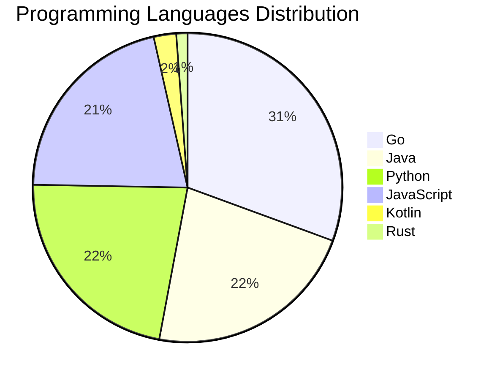

# 🚀 DevTech Auto News - Enhanced Edition


**DevTech Auto News Enhanced** is an advanced automated bot that aggregates trending topics in **AI**, **Web Development**, **Mobile**, **Cloud**, **DevOps**, and more from multiple sources including:

- 📰 [Dev.to](https://dev.to) - Developer community articles
- 🔥 [HackerNews](https://news.ycombinator.com) - Tech news discussions  
- 💻 [GitHub Trending](https://github.com/trending) - Trending repositories
- 🎯 Curated Interview Questions from multiple languages

## ✨ Features

✅ **Multi-Source Aggregation**: Combines articles from Dev.to, HackerNews, and GitHub  
✅ **Smart Categorization**: Automatically categorizes content into 10+ topics  
✅ **Image Support**: Displays cover images for visual appeal  
✅ **Pagination**: Fetches 50+ articles per update with deduplication  
✅ **Language Statistics**: Tracks programming language trends with charts  
✅ **Interview Questions**: Daily coding interview questions in multiple languages  
✅ **GitHub Actions**: Runs every 15 minutes automatically  

---

## 📊 Statistics Dashboard

### 📊 Articles by Category

**AI**: 🟦🟦🟦🟦🟦🟦🟦🟦🟦🟦🟦🟦🟦🟦🟦🟦🟦🟦🟦🟦 49 (46.7%)

**Tools**: 🟦🟦🟦🟦🟦🟦🟦🟦🟦🟦 24 (22.9%)

**Python**: 🟦🟦🟦🟦🟦🟦🟦🟦 19 (18.1%)

**JavaScript**: 🟦🟦🟦🟦🟦🟦🟦 18 (17.1%)

**Cloud**: 🟦🟦🟦🟦🟦🟦🟦 18 (17.1%)

**Security**: 🟦🟦🟦 7 (6.7%)

**WebDev**: 🟦 3 (2.9%)

**Mobile**: 🟦 3 (2.9%)

**DevOps**: 🟦 2 (1.9%)

**Database**: 🟦 2 (1.9%)


### 📡 Sources

- **Dev.to**: 60 articles
- **HackerNews**: 30 articles
- **GitHub**: 15 articles


### 💻 Programming Language Trends

```
Go              ██████████████████████████████ 30.6 (30.6%)
Java            ██████████████████████ 22.4 (22.4%)
Python          ██████████████████████ 22.4 (22.4%)
JavaScript      █████████████████████ 21.2 (21.2%)
Kotlin          ██ 2.4 (2.4%)
Rust            █ 1.2 (1.2%)

```




### 🏷️ Trending Tags

               


---

## 🛠️ How It Works

1. **Multi-Source Fetch**: Pulls from Dev.to (2 pages), HackerNews (3 topics), GitHub (3 languages)
2. **Smart Filter**: Uses keyword matching across 10+ categories  
3. **Deduplication**: Removes duplicate URLs  
4. **Image Extraction**: Captures cover images when available  
5. **Statistics**: Generates language trends and category breakdowns  
6. **Update Files**: Regenerates README and appends to comprehensive log  

---

## 📦 Installation & Usage

```bash
# Clone the repository
git clone https://github.com/Derrick-MUGISHA/github-activity-bot.git
cd github-activity-bot

# Install dependencies  
npm install

# Run manually
npm start

# Test mode
npm run test
```

---


# 🚀 DevTech Auto News - Enhanced Edition

## 📅 Latest Updates (2026-04-29 1:00 CAT)


### 🖼️ Featured Articles

<table>
<tr>
  <td align="center" width="33%">
    <a href="https://dev.to/kernelpryanic/are-we-using-ai-at-the-wrong-scale-2klo">
      
      <br/>
      <b>Are We Using AI at the Wrong Scale?</b>
    </a>
    <br/>
    <sub>Dev.to</sub>
  </td>
  <td align="center" width="33%">
    <a href="https://dev.to/googleai/how-i-used-gemini-cli-to-orchestrate-a-complex-rag-migration-43ga">
      
      <br/>
      <b>How I used Gemini CLI to orchestrate a complex RAG...</b>
    </a>
    <br/>
    <sub>Dev.to</sub>
  </td>
  <td align="center" width="33%">
    <a href="https://dev.to/ben/meme-monday-98e">
      
      <br/>
      <b>Meme Monday</b>
    </a>
    <br/>
    <sub>Dev.to</sub>
  </td>
</tr>
<tr>
  <td align="center" width="33%">
    <a href="https://dev.to/devteam/top-7-featured-dev-posts-of-the-week-2njl">
      
      <br/>
      <b>Top 7 Featured DEV Posts of the Week</b>
    </a>
    <br/>
    <sub>Dev.to</sub>
  </td>
  <td align="center" width="33%">
    <a href="https://dev.to/gde/my-incredible-google-cloud-next-26-experience-as-a-gde-17mo">
      
      <br/>
      <b>My Incredible Google Cloud Next 26 Experience as a...</b>
    </a>
    <br/>
    <sub>Dev.to</sub>
  </td>
  <td align="center" width="33%">
    <a href="https://dev.to/googleai/fine-tuning-gemma-4-with-cloud-run-jobs-serverless-gpus-nvidia-rtx-6000-pro-for-pet-breed-45ib">
      
      <br/>
      <b>Fine-Tuning Gemma 4 with Cloud Run Jobs: Serverles...</b>
    </a>
    <br/>
    <sub>Dev.to</sub>
  </td>
</tr>
</table>


### 📰 Top Headlines

- [Are We Using AI at the Wrong Scale?](https://dev.to/kernelpryanic/are-we-using-ai-at-the-wrong-scale-2klo) _[Dev.to]_
- [How I used Gemini CLI to orchestrate a complex RAG migration](https://dev.to/googleai/how-i-used-gemini-cli-to-orchestrate-a-complex-rag-migration-43ga) _[Dev.to]_
- [Meme Monday](https://dev.to/ben/meme-monday-98e) _[Dev.to]_
- [Top 7 Featured DEV Posts of the Week](https://dev.to/devteam/top-7-featured-dev-posts-of-the-week-2njl) _[Dev.to]_
- [My Incredible Google Cloud Next 26 Experience as a GDE](https://dev.to/gde/my-incredible-google-cloud-next-26-experience-as-a-gde-17mo) _[Dev.to]_
- [Fine-Tuning Gemma 4 with Cloud Run Jobs: Serverless GPUs (NVIDIA RTX 6000 Pro) for pet breed classification 🐈🐕](https://dev.to/googleai/fine-tuning-gemma-4-with-cloud-run-jobs-serverless-gpus-nvidia-rtx-6000-pro-for-pet-breed-45ib) _[Dev.to]_
- [Automation is a trade-off](https://dev.to/suesmith/automation-is-a-trade-off-2fh8) _[Dev.to]_
- [Why Web3 Exists and Why Solana Matters](https://dev.to/100daysofsolana/why-web3-exists-and-why-solana-matters-296h) _[Dev.to]_
- [Sleep, Sort, Repeat: Testing Kotlin Coroutines with Virtual Time](https://dev.to/tibtof/sleep-sort-repeat-testing-kotlin-coroutines-with-virtual-time-25pl) _[Dev.to]_
- [Self-hosted Gemma 4 on TPU with vLLM, MCP, ADK, and Gemini CLI](https://dev.to/gde/self-hosted-gemma-4-on-tpu-with-mcp-adk-and-gemini-cli-2j9d) _[Dev.to]_
- [Creating a CLI Tool with AI Agents: My Journey with kdn](https://dev.to/feloy/creating-a-cli-tool-with-ai-agents-my-journey-with-kdn-46d8) _[Dev.to]_
- [How to Remove Console.log from React Native Production Builds](https://dev.to/neeraj1005/how-to-remove-consolelog-from-react-native-production-builds-2f7d) _[Dev.to]_
- [Service-to-Service Calls vs Event-Driven Flows: When to Use Which](https://dev.to/toybz/service-to-service-calls-vs-event-driven-flows-when-to-use-which-1da8) _[Dev.to]_
- [Keeping You in the Driver's Seat and AI as the Copilot](https://dev.to/liatmoss/keeping-you-in-the-drivers-seat-and-ai-as-the-copilot-1oc8) _[Dev.to]_
- [ML acceleration guide: TPUs vs GPUs](https://dev.to/gde/ml-acceleration-guide-tpus-vs-gpus-16oh) _[Dev.to]_
- [Leadership Micro Katas](https://dev.to/yrizos/leadership-micro-katas-363f) _[Dev.to]_
- [The Age of Disposable Software](https://dev.to/sirviejo87/the-age-of-disposable-software-4jjj) _[Dev.to]_
- [How I'm running an autonomous Claude Code loop on a real shipped product](https://dev.to/_khanshaheb/how-im-running-an-autonomous-claude-code-loop-on-a-real-shipped-product-48lf) _[Dev.to]_
- [I wrote my third XML parser. Here's why this one was different.](https://dev.to/asm0dey/i-wrote-my-third-xml-parser-heres-why-this-one-was-different-445i) _[Dev.to]_
- [Platform-Neutral AI Tools Are the Safer Long-Term Bet](https://dev.to/mrlarson2007_62/platform-neutral-ai-tools-are-the-safer-long-term-bet-42i1) _[Dev.to]_

_Last automated update: Wed, 29 Apr 2026 01:36:35 CAT_


## 💡 Daily Interview Questions

_Sharpen your skills with these curated questions_

### 1. SystemDesign: Design a URL shortening service like bit.ly

**Difficulty**: Medium | **Topics**: system design, scalability

<details>
<summary>💡 Hint</summary>

Hash function, database design, caching, analytics

</details>

### 2. SystemDesign: Design a distributed cache system

**Difficulty**: Hard | **Topics**: distributed systems, caching

<details>
<summary>💡 Hint</summary>

Consistency, partitioning, replication, eviction policies

</details>

### 3. React: How would you optimize a React app's performance?

**Difficulty**: Hard | **Topics**: optimization, performance

<details>
<summary>💡 Hint</summary>

React.memo, useMemo, useCallback, code splitting, lazy loading

</details>


---

## 📚 Resources

- [Full News Archive](./data/news_log.md) - Complete history of all fetched articles
- [Statistics JSON](./data/stats.json) - Raw statistics data
- [Categorized Data](./data/categorized.json) - Articles organized by category
- [Interview Questions](./data/interview_questions.json) - Complete question bank

---

## 🤝 Contributing

Want to add more sources, categories, or interview questions? Feel free to:

1. Fork this repository
2. Add your improvements
3. Submit a pull request

---

## 📄 License

MIT License - Feel free to use and modify!

---

<p align="center">
  <b>Last automated update: Tue, 28 Apr 2026 23:36:35 GMT</b><br/>
  <sub>Powered by GitHub Actions | Made with ❤️ for developers</sub>
</p>

---

## 🔗 Quick Links

- [View Workflow](https://github.com/Derrick-MUGISHA/github-activity-bot/actions)
- [Report Issue](https://github.com/Derrick-MUGISHA/github-activity-bot/issues)
- [Suggest Feature](https://github.com/Derrick-MUGISHA/github-activity-bot/issues/new)
