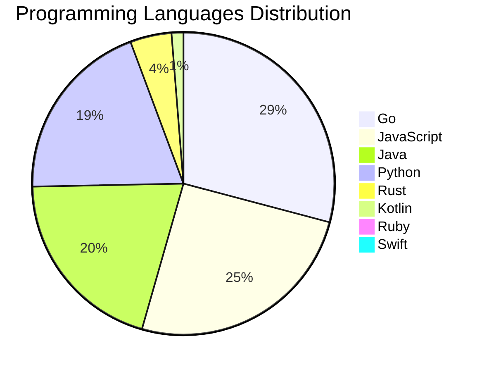

<div align="center">

# 📰 DevTech Auto News

**Your always-fresh digest of developer & AI tech news — curated automatically, around the clock.**


Aggregating [Dev.to](https://dev.to) · [Hacker News](https://news.ycombinator.com) · [GitHub Trending](https://github.com/trending) · [Lobste.rs](https://lobste.rs) · [Stack Overflow](https://stackoverflow.com) · [TechCrunch](https://techcrunch.com) · [freeCodeCamp](https://www.freecodecamp.org/news) — refreshed by GitHub Actions around the clock.

**[📰 Headlines](#-latest-headlines) · [💡 Interview Prep](#-interview-question-of-the-hour) · [📊 Statistics](#-statistics) · [⚙️ How It Works](#%EF%B8%8F-how-it-works)**

</div>

---

## 📰 Latest Headlines

> 🕐 Edition of **2026-07-31 3:00 CAT** — refreshed automatically, all day, every day.

### ✨ Featured Stories

<table>
<tr>
  <td align="center" width="33%">
    <a href="https://dev.to/devteam/congrats-to-the-dev-weekend-challenge-passion-edition-winners-30ne">
      
      <br/>
      <b>Congrats to the DEV Weekend Challenge: Passion Edi...</b>
    </a>
    <br/>
    <sub>Dev.to</sub>
  </td>
  <td align="center" width="33%">
    <a href="https://dev.to/devteam/join-our-latest-frontend-challenge-comfort-food-edition-28a0">
      
      <br/>
      <b>Join our latest Frontend Challenge: Comfort Food E...</b>
    </a>
    <br/>
    <sub>Dev.to</sub>
  </td>
  <td align="center" width="33%">
    <a href="https://dev.to/googleai/skills-vs-mcp-how-ai-tools-have-evolved-3pmk">
      
      <br/>
      <b>Skills vs MCP: How AI tools have evolved</b>
    </a>
    <br/>
    <sub>Dev.to</sub>
  </td>
</tr>
<tr>
  <td align="center" width="33%">
    <a href="https://dev.to/thomasbnt/passkeys-explained-simply-52jk">
      
      <br/>
      <b>Passkeys Explained Simply</b>
    </a>
    <br/>
    <sub>Dev.to</sub>
  </td>
  <td align="center" width="33%">
    <a href="https://dev.to/robertobutti/does-it-still-make-sense-to-learn-how-to-code-3g7g">
      
      <br/>
      <b>Does it still make sense to learn how to code?</b>
    </a>
    <br/>
    <sub>Dev.to</sub>
  </td>
  <td align="center" width="33%">
    <a href="https://dev.to/gde/one-tpu-chip-eight-agents-serving-small-agent-workloads-with-raw-jax-2cc4">
      
      <br/>
      <b>One TPU Chip, Eight Agents: Serving Small Agent Wo...</b>
    </a>
    <br/>
    <sub>Dev.to</sub>
  </td>
</tr>
</table>


### 🗞️ Top Stories

| # | Headline | Source |
|---|----------|--------|
| 1 | [Congrats to the DEV Weekend Challenge: Passion Edition Winners!](https://dev.to/devteam/congrats-to-the-dev-weekend-challenge-passion-edition-winners-30ne) | Dev.to |
| 2 | [Join our latest Frontend Challenge: Comfort Food Edition 🍲](https://dev.to/devteam/join-our-latest-frontend-challenge-comfort-food-edition-28a0) | Dev.to |
| 3 | [Skills vs MCP: How AI tools have evolved](https://dev.to/googleai/skills-vs-mcp-how-ai-tools-have-evolved-3pmk) | Dev.to |
| 4 | [Passkeys Explained Simply](https://dev.to/thomasbnt/passkeys-explained-simply-52jk) | Dev.to |
| 5 | [Does it still make sense to learn how to code?](https://dev.to/robertobutti/does-it-still-make-sense-to-learn-how-to-code-3g7g) | Dev.to |
| 6 | [One TPU Chip, Eight Agents: Serving Small Agent Workloads with Raw JAX](https://dev.to/gde/one-tpu-chip-eight-agents-serving-small-agent-workloads-with-raw-jax-2cc4) | Dev.to |
| 7 | [Gubernator Weekly Update: CoreDNS Aqueducts, SRE Stack, Network Topology & Cluster Auto-Updates!i](https://dev.to/gde/gubernator-weekly-update-coredns-aqueducts-sre-stack-network-topology-cluster-auto-updates-e1c) | Dev.to |
| 8 | [Amazon Bedrock Agents Orchestrating Google ADK over A2A](https://dev.to/gde/amazon-bedrock-agents-orchestrating-google-adk-over-a2a-5c2b) | Dev.to |
| 9 | [Your Face on a World Cup Sticker: Our Nano Banana Story](https://dev.to/gde/your-face-on-a-world-cup-sticker-our-nano-banana-story-43p6) | Dev.to |
| 10 | [DevRelCon, Adult Summer Camp, and My First Time Speaking](https://dev.to/daniellewashington/devrelcon-adult-summer-camp-and-my-first-time-speaking-4p2d) | Dev.to |
| 11 | [[Dev Log][Node.js] Feedly Classic is gone, so I built my own FeedFlow (Part 1)](https://dev.to/gde/dev-lognodejs-feedly-classic-is-gone-so-i-built-my-own-feedflow-part-1-55h4) | Dev.to |
| 12 | [Data, Context & RAG Lineage Governance for Enterprise AI Agents](https://dev.to/gde/data-context-rag-lineage-governance-for-enterprise-ai-agents-4bdj) | Dev.to |
| 13 | [Seamless Flutter Hooks Integration with BlocSignal via signals_hooks](https://dev.to/gde/seamless-flutter-hooks-integration-with-blocsignal-via-signalshooks-55e) | Dev.to |
| 14 | [Switching Tracks in BlocSignal: The Universal State Switchyard for BLoC, Riverpod, and Provider](https://dev.to/gde/switching-tracks-in-blocsignal-the-universal-state-switchyard-for-bloc-riverpod-and-provider-929) | Dev.to |
| 15 | [What is current your "daily driver" coding model? (July 2026)](https://dev.to/peter/what-is-current-your-daily-driver-coding-model-july-2026-24cl) | Dev.to |
| 16 | [The Governed Execution Gateway: Securing MCP Servers and Tool Egress Proxies](https://dev.to/gde/the-governed-execution-gateway-securing-mcp-servers-and-tool-egress-proxies-1ee3) | Dev.to |
| 17 | [Fish Audio's $52M Seed: Open Weights Got Them Here](https://dev.to/lukeocodes/fish-audios-52m-seed-open-weights-got-them-here-25e5) | Dev.to |
| 18 | [Finally — Hard Caps to Limit Your Google Cloud Spend](https://dev.to/gde/finally-hard-caps-to-limit-your-google-cloud-spend-1363) | Dev.to |
| 19 | [Beyond System Prompts: Enforcing Policy & Action Boundaries in Enterprise AI Agents](https://dev.to/gde/beyond-system-prompts-enforcing-policy-action-boundaries-in-enterprise-ai-agents-29ac) | Dev.to |
| 20 | [Build and Deploy Java AI Agents with Google ADK](https://dev.to/gde/build-and-deploy-java-ai-agents-with-google-adk-28oi) | Dev.to |

<sub>Last fetched: Fri, 31 Jul 2026 03:18:15 CAT</sub>


---

## 💡 Interview Question of the Hour

> Sharpen your skills — new questions selected on every update. Try answering before opening the hint!

**1. `JavaScript` — What are closures and provide a practical example?**

&nbsp;&nbsp;&nbsp;&nbsp;🎯 Medium · 🏷 functions, scope

<details>
<summary>&nbsp;&nbsp;&nbsp;&nbsp;💡 Show hint</summary>

> Function + lexical environment, data privacy, callbacks

</details>

**2. `SystemDesign` — Design Twitter's timeline feature**

&nbsp;&nbsp;&nbsp;&nbsp;🎯 Hard · 🏷 system design, scalability

<details>
<summary>&nbsp;&nbsp;&nbsp;&nbsp;💡 Show hint</summary>

> Fan-out, caching, ranking, real-time updates

</details>

**3. `JavaScript` — Explain event delegation and why it's useful**

&nbsp;&nbsp;&nbsp;&nbsp;🎯 Medium · 🏷 events, DOM

<details>
<summary>&nbsp;&nbsp;&nbsp;&nbsp;💡 Show hint</summary>

> Event bubbling, single listener for multiple elements

</details>


---

## 📊 Statistics

#### 🗂 Articles by Category

| Category | Articles | Share | |
|----------|---------:|------:|---|
| **AI** | 83 | 45.4% | `████████████████████` |
| **Tools** | 41 | 22.4% | `██████████░░░░░░░░░░` |
| **JavaScript** | 40 | 21.9% | `██████████░░░░░░░░░░` |
| **Python** | 31 | 16.9% | `███████░░░░░░░░░░░░░` |
| **Security** | 25 | 13.7% | `██████░░░░░░░░░░░░░░` |
| **Cloud** | 19 | 10.4% | `█████░░░░░░░░░░░░░░░` |
| **DevOps** | 14 | 7.7% | `███░░░░░░░░░░░░░░░░░` |
| **WebDev** | 8 | 4.4% | `██░░░░░░░░░░░░░░░░░░` |
| **Mobile** | 7 | 3.8% | `██░░░░░░░░░░░░░░░░░░` |
| **Database** | 2 | 1.1% | `░░░░░░░░░░░░░░░░░░░░` |

<sub>Articles can match more than one category, so shares may sum to over 100%.</sub>


#### 📡 Articles by Source

| Source | Articles |
|--------|---------:|
| Dev.to | 59 |
| HackerNews | 49 |
| GitHub | 25 |
| Lobste.rs | 10 |
| StackOverflow | 20 |
| TechCrunch | 10 |
| freeCodeCamp | 10 |


#### 💻 Programming Language Trends

```
Go              ██████████████████████████████ 28.7%
JavaScript      ██████████████████████████ 25.0%
Java            █████████████████████ 20.0%
Python          ████████████████████ 19.4%
Rust            █████ 4.4%
Kotlin          █ 1.3%
Ruby            █ 0.6%
Swift           █ 0.6%

```




#### 🏷 Trending Topics

            


---

## ⚙️ How It Works

This repository is a fully automated news pipeline. On every run, GitHub Actions:

1. **Fetches** the latest articles from seven sources: Dev.to, Hacker News, GitHub Trending, Lobste.rs, Stack Overflow, TechCrunch, and freeCodeCamp
2. **Deduplicates and categorizes** them across 10+ topics using keyword matching
3. **Extracts cover images** and computes language & category statistics
4. **Rebuilds this README** and appends everything to the [full archive](./data/news_log.md)
5. **Commits and pushes** the result — no human intervention needed

<details>
<summary><b>🚀 Run it yourself</b></summary>

```bash
git clone https://github.com/Derrick-MUGISHA/github-activity-bot.git
cd github-activity-bot
npm install
npm start
```

Fork the repo, enable GitHub Actions, and you have your own self-updating news feed.

</details>

<details>
<summary><b>📚 Data & resources</b></summary>

- [Full news archive](./data/news_log.md) — complete history of every fetched article
- [Statistics](./data/stats.json) — raw stats data (JSON)
- [Categorized articles](./data/categorized.json) — articles grouped by topic
- [Interview question bank](./data/interview_questions.json) — the full question set

</details>

---

## 🤝 Contributing

Ideas for new sources, categories, or interview questions are welcome — [open an issue](https://github.com/Derrick-MUGISHA/github-activity-bot/issues/new) or submit a pull request.

## 📄 License

Released under the [MIT License](https://opensource.org/licenses/MIT) — free to use, fork, and modify.

---

<div align="center">
  <sub>🤖 Last automated update: <b>Fri, 31 Jul 2026 01:18:15 GMT</b></sub><br/>
  <sub>Powered by GitHub Actions · Built with ❤️ by <a href="https://github.com/Derrick-MUGISHA">Derrick MUGISHA</a></sub>
</div>
