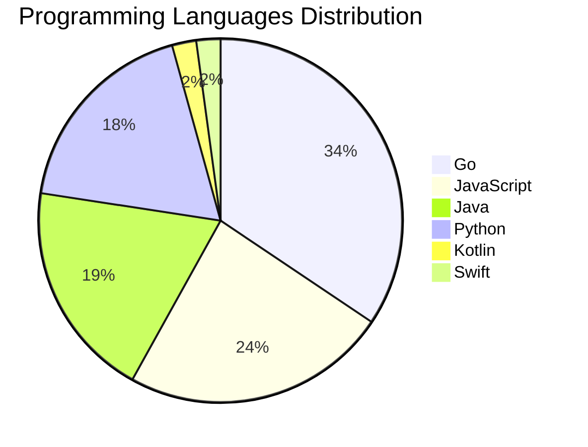

# 🚀 DevTech Auto News - Enhanced Edition


**DevTech Auto News Enhanced** is an advanced automated bot that aggregates trending topics in **AI**, **Web Development**, **Mobile**, **Cloud**, **DevOps**, and more from multiple sources including:

- 📰 [Dev.to](https://dev.to) - Developer community articles
- 🔥 [HackerNews](https://news.ycombinator.com) - Tech news discussions  
- 💻 [GitHub Trending](https://github.com/trending) - Trending repositories
- 🎯 Curated Interview Questions from multiple languages

## ✨ Features

✅ **Multi-Source Aggregation**: Combines articles from Dev.to, HackerNews, and GitHub  
✅ **Smart Categorization**: Automatically categorizes content into 10+ topics  
✅ **Image Support**: Displays cover images for visual appeal  
✅ **Pagination**: Fetches 50+ articles per update with deduplication  
✅ **Language Statistics**: Tracks programming language trends with charts  
✅ **Interview Questions**: Daily coding interview questions in multiple languages  
✅ **GitHub Actions**: Runs every 15 minutes automatically  

---

## 📊 Statistics Dashboard

### 📊 Articles by Category

**AI**: 🟦🟦🟦🟦🟦🟦🟦🟦🟦🟦🟦🟦🟦🟦🟦🟦🟦🟦🟦🟦 55 (52.4%)

**Tools**: 🟦🟦🟦🟦🟦🟦🟦🟦🟦🟦 28 (26.7%)

**JavaScript**: 🟦🟦🟦🟦🟦🟦🟦🟦 22 (21.0%)

**Python**: 🟦🟦🟦🟦🟦🟦 17 (16.2%)

**Cloud**: 🟦🟦🟦🟦🟦🟦 17 (16.2%)

**Mobile**: 🟦🟦 5 (4.8%)

**DevOps**: 🟦 4 (3.8%)

**WebDev**: 🟦 4 (3.8%)

**Security**: 🟦 2 (1.9%)

**Database**:  1 (1.0%)


### 📡 Sources

- **Dev.to**: 60 articles
- **HackerNews**: 30 articles
- **GitHub**: 15 articles


### 💻 Programming Language Trends

```
Go              ██████████████████████████████ 34.4 (34.4%)
JavaScript      █████████████████████ 23.7 (23.7%)
Java            █████████████████ 19.4 (19.4%)
Python          ████████████████ 18.3 (18.3%)
Kotlin          ██ 2.2 (2.2%)
Swift           ██ 2.2 (2.2%)

```




### 🏷️ Trending Tags

               


---

## 🛠️ How It Works

1. **Multi-Source Fetch**: Pulls from Dev.to (2 pages), HackerNews (3 topics), GitHub (3 languages)
2. **Smart Filter**: Uses keyword matching across 10+ categories  
3. **Deduplication**: Removes duplicate URLs  
4. **Image Extraction**: Captures cover images when available  
5. **Statistics**: Generates language trends and category breakdowns  
6. **Update Files**: Regenerates README and appends to comprehensive log  

---

## 📦 Installation & Usage

```bash
# Clone the repository
git clone https://github.com/Derrick-MUGISHA/github-activity-bot.git
cd github-activity-bot

# Install dependencies  
npm install

# Run manually
npm start

# Test mode
npm run test
```

---


# 🚀 DevTech Auto News - Enhanced Edition

## 📅 Latest Updates (2026-06-11 11:00 CAT)


### 🖼️ Featured Articles

<table>
<tr>
  <td align="center" width="33%">
    <a href="https://dev.to/ingosteinke/css-only-a-nerdy-hobby-17hf">
      
      <br/>
      <b>CSS – only a Nerdy Hobby?</b>
    </a>
    <br/>
    <sub>Dev.to</sub>
  </td>
  <td align="center" width="33%">
    <a href="https://dev.to/ujja/how-i-built-a-treasure-run-game-where-australia-saves-the-sun-kck">
      
      <br/>
      <b>How I Built a Treasure-Run Game Where Australia Sa...</b>
    </a>
    <br/>
    <sub>Dev.to</sub>
  </td>
  <td align="center" width="33%">
    <a href="https://dev.to/gde/deployment-planning-with-gemma-26b-nvidia-l4-mcp-cloud-run-and-antigravity-cli-kn0">
      
      <br/>
      <b>Deployment Planning with Gemma 26B, NVIDIA L4, MCP...</b>
    </a>
    <br/>
    <sub>Dev.to</sub>
  </td>
</tr>
<tr>
  <td align="center" width="33%">
    <a href="https://dev.to/sebs/its-time-we-all-eat-some-cucumber-16ic">
      
      <br/>
      <b>It's Time We All Eat some more Cucumber!</b>
    </a>
    <br/>
    <sub>Dev.to</sub>
  </td>
  <td align="center" width="33%">
    <a href="https://dev.to/googleai/g4-fractional-vms-are-now-available-on-google-cloud-knp">
      
      <br/>
      <b>G4 Fractional VMs are now available on Google Clou...</b>
    </a>
    <br/>
    <sub>Dev.to</sub>
  </td>
  <td align="center" width="33%">
    <a href="https://dev.to/googleai/from-dashboards-to-autonomous-action-why-you-need-to-attend-google-cloud-labs-3ada">
      
      <br/>
      <b>From Dashboards to Autonomous Action: Why You Need...</b>
    </a>
    <br/>
    <sub>Dev.to</sub>
  </td>
</tr>
</table>


### 📰 Top Headlines

- [CSS – only a Nerdy Hobby?](https://dev.to/ingosteinke/css-only-a-nerdy-hobby-17hf) _[Dev.to]_
- [How I Built a Treasure-Run Game Where Australia Saves the Sun](https://dev.to/ujja/how-i-built-a-treasure-run-game-where-australia-saves-the-sun-kck) _[Dev.to]_
- [Deployment Planning with Gemma 26B, NVIDIA L4, MCP, Cloud Run, and Antigravity CLI](https://dev.to/gde/deployment-planning-with-gemma-26b-nvidia-l4-mcp-cloud-run-and-antigravity-cli-kn0) _[Dev.to]_
- [It's Time We All Eat some more Cucumber!](https://dev.to/sebs/its-time-we-all-eat-some-cucumber-16ic) _[Dev.to]_
- [G4 Fractional VMs are now available on Google Cloud!](https://dev.to/googleai/g4-fractional-vms-are-now-available-on-google-cloud-knp) _[Dev.to]_
- [From Dashboards to Autonomous Action: Why You Need to Attend Google Cloud Labs](https://dev.to/googleai/from-dashboards-to-autonomous-action-why-you-need-to-attend-google-cloud-labs-3ada) _[Dev.to]_
- [How we built AIventure, an AI-Powered Retro Dungeon](https://dev.to/googleai/how-we-built-aiventure-an-ai-powered-retro-dungeon-2f54) _[Dev.to]_
- [Welcome Thread - v379](https://dev.to/devteam/welcome-thread-v379-9fb) _[Dev.to]_
- [I tried to make an AI agent answer more. It answered less.](https://dev.to/ankushchadha/i-tried-to-make-an-ai-agent-answer-more-it-answered-less-3d7a) _[Dev.to]_
- [Configuring Firebase AI Logic for Android to Use Gemini Models](https://dev.to/gdg/configuring-firebase-ai-logic-for-android-to-use-gemini-models-4eb7) _[Dev.to]_
- [12B Gemma 4 QAT Deployment with NVIDIA L4, Cloud Run, MCP, and Antigravity CLI](https://dev.to/gde/12b-gemma-4-qat-deployment-with-nvidia-l4-cloud-run-mcp-and-antigravity-cli-21l2) _[Dev.to]_
- [You’re a Real TypeScript Developer Only If...](https://dev.to/hadil/youre-a-real-typescript-developer-only-if-1d9o) _[Dev.to]_
- [Debugging Deployments with Gemma 12B, NVIDIA L4, MCP, Cloud Run, and Antigravity CLI](https://dev.to/gde/debugging-deployments-with-gemma-12b-nvidia-l4-mcp-cloud-run-and-antigravity-cli-32eg) _[Dev.to]_
- [Flutter Midsommer Madnesss](https://dev.to/gde/flutter-midsommer-madnesss-kkb) _[Dev.to]_
- [Claude Fable 5 is Now Generally Available on Google Cloud! 🚀](https://dev.to/googleai/claude-fable-5-is-now-generally-available-on-google-cloud-3gog) _[Dev.to]_
- [Antigravity Managed Agents Tutorial: Ship Production AI Agents](https://dev.to/googleai/antigravity-managed-agents-tutorial-ship-production-ai-agents-21c0) _[Dev.to]_
- [Top 7 Featured DEV Posts of the Week](https://dev.to/devteam/top-7-featured-dev-posts-of-the-week-14hj) _[Dev.to]_
- [Seamless scaling with VPA In-place Pod Resize on GKE](https://dev.to/googlecloud/seamless-scaling-with-vpa-in-place-pod-resize-on-gke-117p) _[Dev.to]_
- [The agent that fixes bugs by running the code](https://dev.to/shreyshah/the-agent-that-fixes-bugs-by-running-the-code-4lbg) _[Dev.to]_
- [Building a Content Pipeline: A Guide to the Workspace Studio + Gems Integration](https://dev.to/gde/building-a-content-pipeline-a-guide-to-the-workspace-studio-gems-integration-e3n) _[Dev.to]_

_Last automated update: Thu, 11 Jun 2026 11:20:23 CAT_


## 💡 Daily Interview Questions

_Sharpen your skills with these curated questions_

### 1. DataStructures: Implement LRU Cache

**Difficulty**: Hard | **Topics**: design, hash map, linked list

<details>
<summary>💡 Hint</summary>

Doubly linked list + hash map, O(1) operations

</details>

### 2. Java: What are Java Streams and how do they work?

**Difficulty**: Medium | **Topics**: functional programming, collections

<details>
<summary>💡 Hint</summary>

Lazy evaluation, pipeline, terminal operations

</details>

### 3. NodeJS: What is the difference between process.nextTick() and setImmediate()?

**Difficulty**: Medium | **Topics**: event loop, async

<details>
<summary>💡 Hint</summary>

Execution timing, event loop phases

</details>


---

## 📚 Resources

- [Full News Archive](./data/news_log.md) - Complete history of all fetched articles
- [Statistics JSON](./data/stats.json) - Raw statistics data
- [Categorized Data](./data/categorized.json) - Articles organized by category
- [Interview Questions](./data/interview_questions.json) - Complete question bank

---

## 🤝 Contributing

Want to add more sources, categories, or interview questions? Feel free to:

1. Fork this repository
2. Add your improvements
3. Submit a pull request

---

## 📄 License

MIT License - Feel free to use and modify!

---

<p align="center">
  <b>Last automated update: Thu, 11 Jun 2026 09:20:23 GMT</b><br/>
  <sub>Powered by GitHub Actions | Made with ❤️ for developers</sub>
</p>

---

## 🔗 Quick Links

- [View Workflow](https://github.com/Derrick-MUGISHA/github-activity-bot/actions)
- [Report Issue](https://github.com/Derrick-MUGISHA/github-activity-bot/issues)
- [Suggest Feature](https://github.com/Derrick-MUGISHA/github-activity-bot/issues/new)
