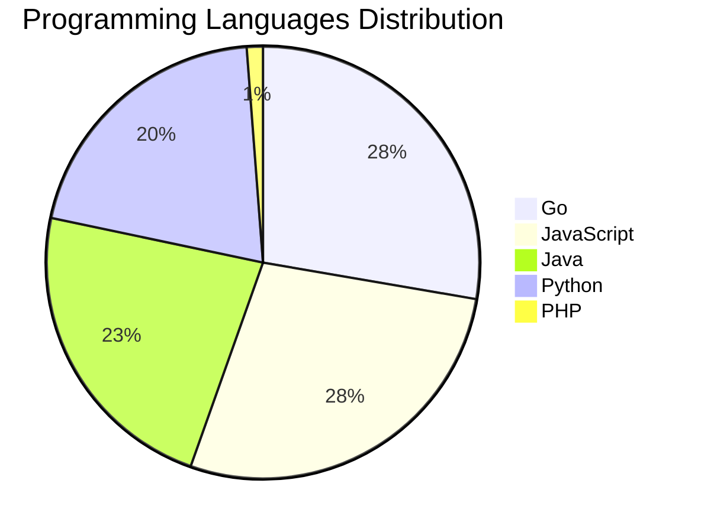

# 🚀 DevTech Auto News - Enhanced Edition


**DevTech Auto News Enhanced** is an advanced automated bot that aggregates trending topics in **AI**, **Web Development**, **Mobile**, **Cloud**, **DevOps**, and more from multiple sources including:

- 📰 [Dev.to](https://dev.to) - Developer community articles
- 🔥 [HackerNews](https://news.ycombinator.com) - Tech news discussions  
- 💻 [GitHub Trending](https://github.com/trending) - Trending repositories
- 🎯 Curated Interview Questions from multiple languages

## ✨ Features

✅ **Multi-Source Aggregation**: Combines articles from Dev.to, HackerNews, and GitHub  
✅ **Smart Categorization**: Automatically categorizes content into 10+ topics  
✅ **Image Support**: Displays cover images for visual appeal  
✅ **Pagination**: Fetches 50+ articles per update with deduplication  
✅ **Language Statistics**: Tracks programming language trends with charts  
✅ **Interview Questions**: Daily coding interview questions in multiple languages  
✅ **GitHub Actions**: Runs every 15 minutes automatically  

---

## 📊 Statistics Dashboard

### 📊 Articles by Category

**AI**: 🟦🟦🟦🟦🟦🟦🟦🟦🟦🟦🟦🟦🟦🟦🟦🟦🟦🟦🟦🟦 50 (47.6%)

**JavaScript**: 🟦🟦🟦🟦🟦🟦🟦🟦🟦 23 (21.9%)

**Tools**: 🟦🟦🟦🟦🟦🟦🟦🟦 21 (20.0%)

**Python**: 🟦🟦🟦🟦🟦🟦🟦 17 (16.2%)

**Cloud**: 🟦🟦🟦🟦🟦 13 (12.4%)

**Security**: 🟦🟦🟦 8 (7.6%)

**WebDev**: 🟦🟦 6 (5.7%)

**DevOps**: 🟦🟦 5 (4.8%)

**Database**: 🟦🟦 4 (3.8%)


### 📡 Sources

- **Dev.to**: 60 articles
- **HackerNews**: 30 articles
- **GitHub**: 15 articles


### 💻 Programming Language Trends

```
Go              ██████████████████████████████ 27.7 (27.7%)
JavaScript      ██████████████████████████████ 27.7 (27.7%)
Java            █████████████████████████ 22.9 (22.9%)
Python          ██████████████████████ 20.5 (20.5%)
PHP             █ 1.2 (1.2%)

```




### 🏷️ Trending Tags

               


---

## 🛠️ How It Works

1. **Multi-Source Fetch**: Pulls from Dev.to (2 pages), HackerNews (3 topics), GitHub (3 languages)
2. **Smart Filter**: Uses keyword matching across 10+ categories  
3. **Deduplication**: Removes duplicate URLs  
4. **Image Extraction**: Captures cover images when available  
5. **Statistics**: Generates language trends and category breakdowns  
6. **Update Files**: Regenerates README and appends to comprehensive log  

---

## 📦 Installation & Usage

```bash
# Clone the repository
git clone https://github.com/Derrick-MUGISHA/github-activity-bot.git
cd github-activity-bot

# Install dependencies  
npm install

# Run manually
npm start

# Test mode
npm run test
```

---


# 🚀 DevTech Auto News - Enhanced Edition

## 📅 Latest Updates (2026-04-23 14:00 CAT)


### 🖼️ Featured Articles

<table>
<tr>
  <td align="center" width="33%">
    <a href="https://dev.to/devteam/tune-in-and-join-the-google-cloud-next-26-writing-challenge-1000-in-prizes-21bd">
      
      <br/>
      <b>Tune In and Join the Google Cloud NEXT '26 Writing...</b>
    </a>
    <br/>
    <sub>Dev.to</sub>
  </td>
  <td align="center" width="33%">
    <a href="https://dev.to/shiftyp/stop-worrying-and-love-ai-9ij">
      
      <br/>
      <b>Stop Worrying and Love AI</b>
    </a>
    <br/>
    <sub>Dev.to</sub>
  </td>
  <td align="center" width="33%">
    <a href="https://dev.to/gde/cross-cloud-multi-agent-comic-builder-with-adk-amazon-lambda-and-gemini-cli-3178">
      
      <br/>
      <b>Cross Cloud Multi Agent Comic Builder with ADK, Am...</b>
    </a>
    <br/>
    <sub>Dev.to</sub>
  </td>
</tr>
<tr>
  <td align="center" width="33%">
    <a href="https://dev.to/coderabbitai/how-to-use-ai-to-identify-and-fix-security-vulnerabilities-in-your-codebase-4na2">
      
      <br/>
      <b>How to use AI to identify and fix security vulnera...</b>
    </a>
    <br/>
    <sub>Dev.to</sub>
  </td>
  <td align="center" width="33%">
    <a href="https://dev.to/googleai/tpu-mythbusting-vendor-lock-in-pbo">
      
      <br/>
      <b>TPU Mythbusting: vendor lock-in</b>
    </a>
    <br/>
    <sub>Dev.to</sub>
  </td>
  <td align="center" width="33%">
    <a href="https://dev.to/matisiekpl/i-built-a-self-hosted-postgresql-control-plane-that-runs-on-single-docker-container-30gm">
      
      <br/>
      <b>I built a self-hosted PostgreSQL Control Plane tha...</b>
    </a>
    <br/>
    <sub>Dev.to</sub>
  </td>
</tr>
</table>


### 📰 Top Headlines

- [Tune In and Join the Google Cloud NEXT '26 Writing Challenge: $1,000 in Prizes!](https://dev.to/devteam/tune-in-and-join-the-google-cloud-next-26-writing-challenge-1000-in-prizes-21bd) _[Dev.to]_
- [Stop Worrying and Love AI](https://dev.to/shiftyp/stop-worrying-and-love-ai-9ij) _[Dev.to]_
- [Cross Cloud Multi Agent Comic Builder with ADK, Amazon Lambda, and Gemini CLI](https://dev.to/gde/cross-cloud-multi-agent-comic-builder-with-adk-amazon-lambda-and-gemini-cli-3178) _[Dev.to]_
- [How to use AI to identify and fix security vulnerabilities in your codebase](https://dev.to/coderabbitai/how-to-use-ai-to-identify-and-fix-security-vulnerabilities-in-your-codebase-4na2) _[Dev.to]_
- [TPU Mythbusting: vendor lock-in](https://dev.to/googleai/tpu-mythbusting-vendor-lock-in-pbo) _[Dev.to]_
- [I built a self-hosted PostgreSQL Control Plane that runs on single Docker container](https://dev.to/matisiekpl/i-built-a-self-hosted-postgresql-control-plane-that-runs-on-single-docker-container-30gm) _[Dev.to]_
- [Boring code is an organizational tell](https://dev.to/simme/boring-code-is-an-organizational-tell-4gca) _[Dev.to]_
- [What Happens Between @SqsListener and Your Method in Spring Cloud AWS SQS](https://dev.to/tomazfernandes/what-happens-between-sqslistener-and-your-method-in-spring-cloud-aws-sqs-36e7) _[Dev.to]_
- [I built a WordPress plugin that generates llms.txt from your sitemap](https://dev.to/lboneluv/i-built-a-wordpress-plugin-that-generates-llmstxt-from-your-sitemap-idp) _[Dev.to]_
- [How I Built an AI Agent That Investigates Cloud Bill Spikes (Architecture Inside)](https://dev.to/nash_matrixgard/how-i-built-an-ai-agent-that-investigates-cloud-bill-spikes-architecture-inside-113p) _[Dev.to]_
- [I Built a BaaS Where AI Agents Can Onboard Themselves](https://dev.to/steveemmerich/i-built-a-baas-where-ai-agents-can-onboard-themselves-11nn) _[Dev.to]_
- [Large Language Models and the Chinese Room](https://dev.to/craignicol/large-language-models-and-the-chinese-room-239d) _[Dev.to]_
- [Less Than Six Hours From Idea to Dev Release: Building a new Drupal Canvas SDC Module With AI, Deliberately](https://dev.to/jcandan/i-built-a-new-drupal-canvas-sdc-module-with-ai-in-under-6-hours-and-the-review-process-still-59b8) _[Dev.to]_
- [I Built OxyTrack: Turning Small Daily Habits Into Real Environmental Impact 🌱](https://dev.to/ajitekom/i-built-oxytrack-turning-small-daily-habits-into-real-environmental-impact-1nj9) _[Dev.to]_
- [Installing pygame for IDLE on Mac](https://dev.to/paxfeline/installing-pygame-for-idle-on-mac-28kb) _[Dev.to]_
- [Vercel Hack: Why You Need to Rotate Your "Non-Sensitive" Environment Variables Today](https://dev.to/jon_at_backboardio/vercel-hack-why-you-need-to-rotate-your-non-sensitive-environment-variables-today-25mh) _[Dev.to]_
- [Build your own blog post view counter on AWS Free Tier](https://dev.to/aws/build-your-own-blog-post-view-counter-on-aws-free-tier-306f) _[Dev.to]_
- [What To Do If Your Project Was Affected By The Vercel Breach](https://dev.to/dumebii/vercel-got-breached-heres-exactly-what-to-do-if-you-use-it-2026-guide-2k76) _[Dev.to]_
- [Display and test openapi.yaml file](https://dev.to/gabrielweidmann/display-and-test-openapiyaml-file-53h9) _[Dev.to]_
- [Top 7 Featured DEV Posts of the Week](https://dev.to/devteam/top-7-featured-dev-posts-of-the-week-555a) _[Dev.to]_

_Last automated update: Thu, 23 Apr 2026 14:08:17 CAT_


## 💡 Daily Interview Questions

_Sharpen your skills with these curated questions_

### 1. JavaScript: What is the difference between `let`, `const`, and `var`?

**Difficulty**: Easy | **Topics**: variables, scope

<details>
<summary>💡 Hint</summary>

Scope, hoisting, and reassignment capabilities

</details>

### 2. React: What are hooks and why were they introduced?

**Difficulty**: Medium | **Topics**: hooks, functional components

<details>
<summary>💡 Hint</summary>

State in functional components, reusable logic, cleaner code

</details>

### 3. NodeJS: Implement rate limiting for an API

**Difficulty**: Hard | **Topics**: security, middleware

<details>
<summary>💡 Hint</summary>

Token bucket, sliding window, Redis

</details>


---

## 📚 Resources

- [Full News Archive](./data/news_log.md) - Complete history of all fetched articles
- [Statistics JSON](./data/stats.json) - Raw statistics data
- [Categorized Data](./data/categorized.json) - Articles organized by category
- [Interview Questions](./data/interview_questions.json) - Complete question bank

---

## 🤝 Contributing

Want to add more sources, categories, or interview questions? Feel free to:

1. Fork this repository
2. Add your improvements
3. Submit a pull request

---

## 📄 License

MIT License - Feel free to use and modify!

---

<p align="center">
  <b>Last automated update: Thu, 23 Apr 2026 12:08:17 GMT</b><br/>
  <sub>Powered by GitHub Actions | Made with ❤️ for developers</sub>
</p>

---

## 🔗 Quick Links

- [View Workflow](https://github.com/Derrick-MUGISHA/github-activity-bot/actions)
- [Report Issue](https://github.com/Derrick-MUGISHA/github-activity-bot/issues)
- [Suggest Feature](https://github.com/Derrick-MUGISHA/github-activity-bot/issues/new)
