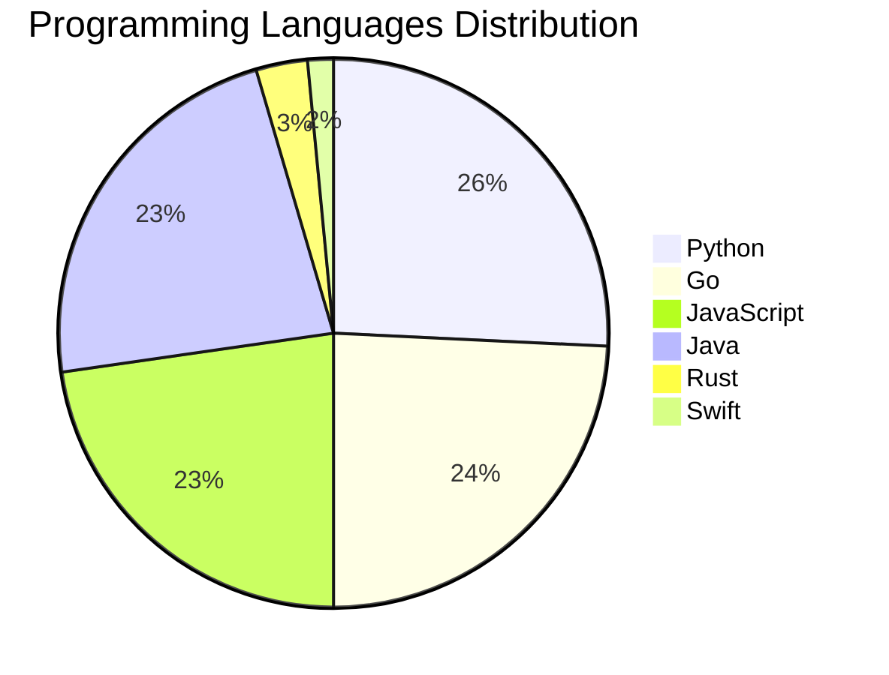

<div align="center">

# 📰 DevTech Auto News

**Your always-fresh digest of developer & AI tech news — curated automatically, around the clock.**


Aggregating [Dev.to](https://dev.to) · [Hacker News](https://news.ycombinator.com) · [GitHub Trending](https://github.com/trending) — refreshed by GitHub Actions every few minutes.

**[📰 Headlines](#-latest-headlines) · [💡 Interview Prep](#-interview-question-of-the-hour) · [📊 Statistics](#-statistics) · [⚙️ How It Works](#%EF%B8%8F-how-it-works)**

</div>

---

## 📰 Latest Headlines

> 🕐 Edition of **2026-07-04 23:00 CAT** — refreshed automatically, all day, every day.

### ✨ Featured Stories

<table>
<tr>
  <td align="center" width="33%">
    <a href="https://dev.to/devteam/congrats-to-the-github-finish-up-a-thon-challenge-winners-1k0h">
      
      <br/>
      <b>Congrats to the GitHub Finish-Up-A-Thon Challenge ...</b>
    </a>
    <br/>
    <sub>Dev.to</sub>
  </td>
  <td align="center" width="33%">
    <a href="https://dev.to/dailycontext/you-dont-always-need-the-frontier-1k8o">
      
      <br/>
      <b>You Don’t Always Need The Frontier</b>
    </a>
    <br/>
    <sub>Dev.to</sub>
  </td>
  <td align="center" width="33%">
    <a href="https://dev.to/dailycontext/choosing-the-right-tooling-layer-for-your-agent-1eg2">
      
      <br/>
      <b>Choosing the Right Tooling Layer for Your Agent</b>
    </a>
    <br/>
    <sub>Dev.to</sub>
  </td>
</tr>
<tr>
  <td align="center" width="33%">
    <a href="https://dev.to/dailycontext/a-third-brain-for-your-second-brain-38b4">
      
      <br/>
      <b>A Third Brain for your Second Brain</b>
    </a>
    <br/>
    <sub>Dev.to</sub>
  </td>
  <td align="center" width="33%">
    <a href="https://dev.to/dailycontext/warp-ceo-zach-lloyd-on-why-software-factories-are-the-next-phase-of-coding-17k6">
      
      <br/>
      <b>Warp CEO Zach Lloyd on why software factories are ...</b>
    </a>
    <br/>
    <sub>Dev.to</sub>
  </td>
  <td align="center" width="33%">
    <a href="https://dev.to/dailycontext/forward-deployed-engineers-and-the-future-of-software-engineering-jll">
      
      <br/>
      <b>Forward Deployed Engineers and the future of softw...</b>
    </a>
    <br/>
    <sub>Dev.to</sub>
  </td>
</tr>
</table>


### 🗞️ Top Stories

| # | Headline | Source |
|---|----------|--------|
| 1 | [Congrats to the GitHub Finish-Up-A-Thon Challenge Winners!](https://dev.to/devteam/congrats-to-the-github-finish-up-a-thon-challenge-winners-1k0h) | Dev.to |
| 2 | [You Don’t Always Need The Frontier](https://dev.to/dailycontext/you-dont-always-need-the-frontier-1k8o) | Dev.to |
| 3 | [Choosing the Right Tooling Layer for Your Agent](https://dev.to/dailycontext/choosing-the-right-tooling-layer-for-your-agent-1eg2) | Dev.to |
| 4 | [A Third Brain for your Second Brain](https://dev.to/dailycontext/a-third-brain-for-your-second-brain-38b4) | Dev.to |
| 5 | [Warp CEO Zach Lloyd on why software factories are the next phase of coding](https://dev.to/dailycontext/warp-ceo-zach-lloyd-on-why-software-factories-are-the-next-phase-of-coding-17k6) | Dev.to |
| 6 | [Forward Deployed Engineers and the future of software engineering](https://dev.to/dailycontext/forward-deployed-engineers-and-the-future-of-software-engineering-jll) | Dev.to |
| 7 | [AIEWF Daily Dispatch: Loops, Software Factories & Forward Deployed Engineers](https://dev.to/dailycontext/aiewf-daily-dispatch-loops-software-factories-forward-deployed-engineers-365h) | Dev.to |
| 8 | [Midsommer Madness with WASM, Rust, and Azure Container Apps](https://dev.to/gde/midsommer-madness-with-wasm-rust-and-azure-container-apps-113b) | Dev.to |
| 9 | [Without Structure](https://dev.to/dailycontext/without-structure-22d1) | Dev.to |
| 10 | [These Founders Skipped Graduation To Be Here](https://dev.to/dailycontext/these-founders-skipped-graduation-to-be-here-1o3d) | Dev.to |
| 11 | [Hackathon Winners Scoop $35,000 In Cash And Credits](https://dev.to/dailycontext/hackathon-winners-scoop-35000-in-cash-and-credits-2ddl) | Dev.to |
| 12 | [Is looping ready to roll? Experts split on the future of coding](https://dev.to/dailycontext/is-looping-ready-to-roll-experts-split-on-the-future-of-coding-2g7p) | Dev.to |
| 13 | [Developers Urged To Reach Out And Touch Someone](https://dev.to/dailycontext/developers-urged-to-reach-out-and-touch-someone-4943) | Dev.to |
| 14 | [Play today’s game from Issue #2 of The Daily Context!](https://dev.to/devteam/play-todays-game-from-issue-2-of-the-daily-context-epf) | Dev.to |
| 15 | [Some Robots Just Can’t Handle The Expo](https://dev.to/dailycontext/some-robots-just-cant-handle-the-expo-4ffm) | Dev.to |
| 16 | [How Docusign is Bringing Contract Table Extraction to Production with NVIDIA Nemotron Parse](https://dev.to/dailycontext/how-docusign-is-bringing-contract-table-extraction-to-production-with-nvidia-nemotron-parse-3bnh) | Dev.to |
| 17 | [The Fragile Balance of AI Development: Individual Flow vs. Collective Context](https://dev.to/dailycontext/the-fragile-balance-of-ai-development-individual-flow-vs-collective-context-2f49) | Dev.to |
| 18 | [Google VP of Technology says he’s given up on coding](https://dev.to/dailycontext/google-vp-of-technology-says-hes-given-up-on-coding-4j6c) | Dev.to |
| 19 | [Fable Is Set Free - There’s A Brand New Claude In Town](https://dev.to/dailycontext/fable-is-set-free-theres-a-brand-new-claude-in-town-ch9) | Dev.to |
| 20 | [How to Count Gemini Tokens Locally](https://dev.to/googlecloud/how-to-count-gemini-tokens-locally-3cal) | Dev.to |

<sub>Last fetched: Sat, 04 Jul 2026 23:06:02 CAT</sub>


---

## 💡 Interview Question of the Hour

> Sharpen your skills — new questions selected on every update. Try answering before opening the hint!

**1. `Java` — What are Java Streams and how do they work?**

&nbsp;&nbsp;&nbsp;&nbsp;🎯 Medium · 🏷 functional programming, collections

<details>
<summary>&nbsp;&nbsp;&nbsp;&nbsp;💡 Show hint</summary>

> Lazy evaluation, pipeline, terminal operations

</details>

**2. `SystemDesign` — Design a distributed cache system**

&nbsp;&nbsp;&nbsp;&nbsp;🎯 Hard · 🏷 distributed systems, caching

<details>
<summary>&nbsp;&nbsp;&nbsp;&nbsp;💡 Show hint</summary>

> Consistency, partitioning, replication, eviction policies

</details>

**3. `Database` — Explain database indexing and when to use it**

&nbsp;&nbsp;&nbsp;&nbsp;🎯 Medium · 🏷 optimization, performance

<details>
<summary>&nbsp;&nbsp;&nbsp;&nbsp;💡 Show hint</summary>

> B-tree, trade-offs, query performance

</details>


---

## 📊 Statistics

#### 🗂 Articles by Category

| Category | Articles | Share | |
|----------|---------:|------:|---|
| **AI** | 60 | 61.2% | `████████████████████` |
| **Tools** | 24 | 24.5% | `████████░░░░░░░░░░░░` |
| **Python** | 17 | 17.3% | `██████░░░░░░░░░░░░░░` |
| **JavaScript** | 15 | 15.3% | `█████░░░░░░░░░░░░░░░` |
| **Cloud** | 8 | 8.2% | `███░░░░░░░░░░░░░░░░░` |
| **DevOps** | 5 | 5.1% | `██░░░░░░░░░░░░░░░░░░` |
| **Database** | 2 | 2.0% | `█░░░░░░░░░░░░░░░░░░░` |
| **Security** | 2 | 2.0% | `█░░░░░░░░░░░░░░░░░░░` |
| **WebDev** | 1 | 1.0% | `░░░░░░░░░░░░░░░░░░░░` |
| **Mobile** | 1 | 1.0% | `░░░░░░░░░░░░░░░░░░░░` |

<sub>Articles can match more than one category, so shares may sum to over 100%.</sub>


#### 📡 Articles by Source

| Source | Articles |
|--------|---------:|
| Dev.to | 53 |
| HackerNews | 30 |
| GitHub | 15 |


#### 💻 Programming Language Trends

```
Python          ██████████████████████████████ 25.8%
Go              ████████████████████████████ 24.2%
JavaScript      ██████████████████████████ 22.7%
Java            ██████████████████████████ 22.7%
Rust            ███ 3.0%
Swift           ██ 1.5%

```




#### 🏷 Trending Topics

            


---

## ⚙️ How It Works

This repository is a fully automated news pipeline. On every run, GitHub Actions:

1. **Fetches** the latest articles from Dev.to, Hacker News, and GitHub Trending
2. **Deduplicates and categorizes** them across 10+ topics using keyword matching
3. **Extracts cover images** and computes language & category statistics
4. **Rebuilds this README** and appends everything to the [full archive](./data/news_log.md)
5. **Commits and pushes** the result — no human intervention needed

<details>
<summary><b>🚀 Run it yourself</b></summary>

```bash
git clone https://github.com/Derrick-MUGISHA/github-activity-bot.git
cd github-activity-bot
npm install
npm start
```

Fork the repo, enable GitHub Actions, and you have your own self-updating news feed.

</details>

<details>
<summary><b>📚 Data & resources</b></summary>

- [Full news archive](./data/news_log.md) — complete history of every fetched article
- [Statistics](./data/stats.json) — raw stats data (JSON)
- [Categorized articles](./data/categorized.json) — articles grouped by topic
- [Interview question bank](./data/interview_questions.json) — the full question set

</details>

---

## 🤝 Contributing

Ideas for new sources, categories, or interview questions are welcome — [open an issue](https://github.com/Derrick-MUGISHA/github-activity-bot/issues/new) or submit a pull request.

## 📄 License

Released under the [MIT License](https://opensource.org/licenses/MIT) — free to use, fork, and modify.

---

<div align="center">
  <sub>🤖 Last automated update: <b>Sat, 04 Jul 2026 21:06:03 GMT</b></sub><br/>
  <sub>Powered by GitHub Actions · Built with ❤️ by <a href="https://github.com/Derrick-MUGISHA">Derrick MUGISHA</a></sub>
</div>
